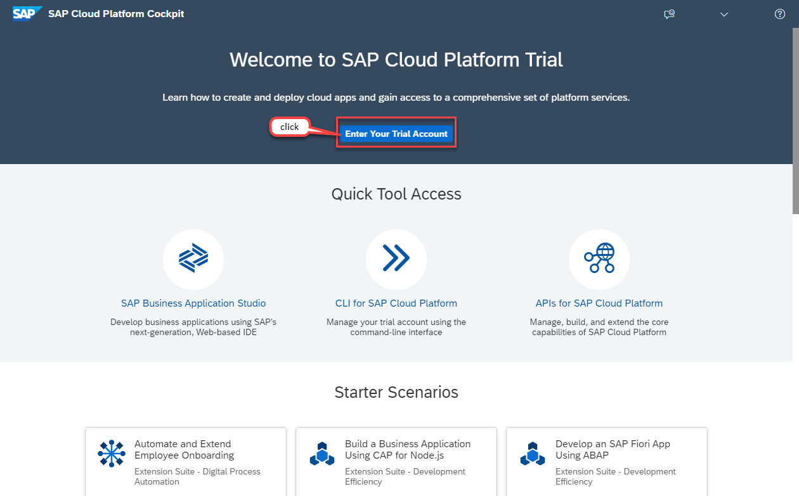
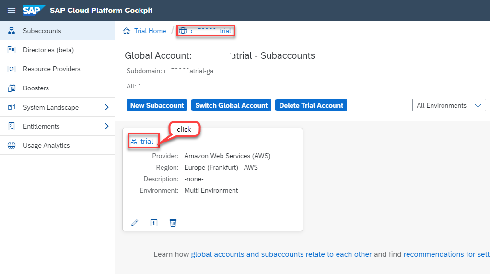
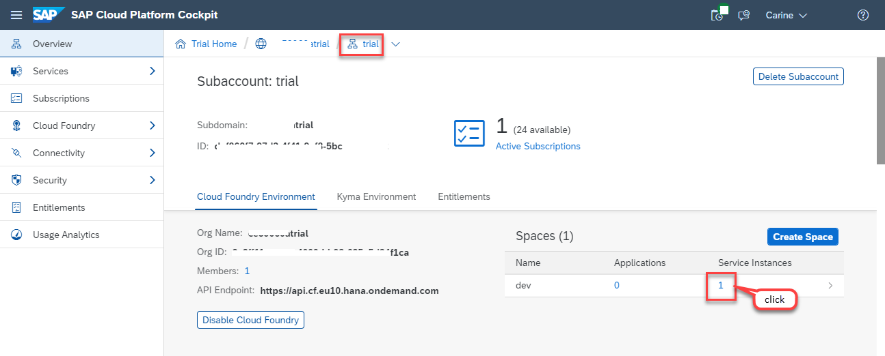
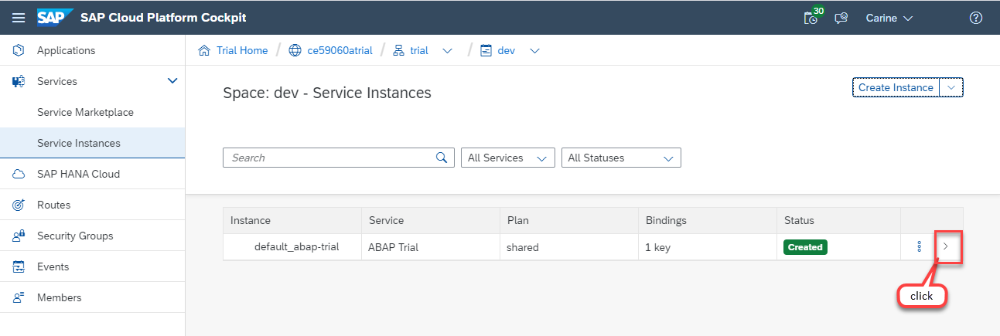
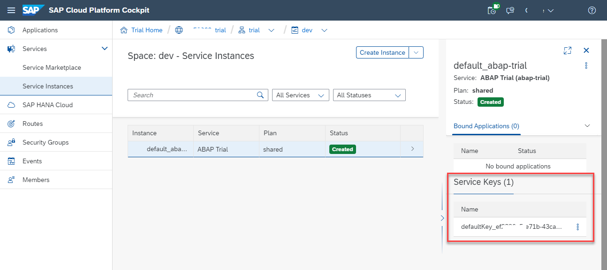

# HANDS-ON EXERCISE FOR WEEK 1 UNIT 5: PREPARING YOUR ABAP DEVELOPMENT ENVIRONMENT

## Introduction
The development environment used for this course consists of the SAP Cloud Platform ABAP Environment and ABAP Development Tools for Eclipse.
You can watch [unit 5 of week 1: Preparing Your ABAP Development Environment](https://open.sap.com/courses/cp13/items/6RRUwtY9ABBVBoywenimzq) on the openSAP.com platform.

In this hands-on exercise, you will set up your ABAP development environment for the development of applications with the ABAP RESTful Application Programming Model (RAP) on the SAP Cloud Platform ABAP Environment.

Follow the instructions below.
    

## Step 1. Install the ABAP Development Tools (ADT)
To install ADT, check out the prerequisites and follow the procedure provided on the _ABAP Development Tools_ site:
https://tools.hana.ondemand.com/#abap 
    

## Step 2. Onboard to the SAP Cloud Platform ABAP Environment Trial
To onboard to the trial ABAP environment, check out the prerequisites and follow the instructions described in the tutorial:  
https://developers.sap.com/tutorials/abap-environment-trial-onboarding.html    

The tutorial also describes how to create an ABAP cloud project in ADT to connect to your SAP Cloud Platform ABAP Environment Trial account.  

> **Please note**   
> A faster onboarding process (using _Boosters_) is described in the tutorial. The _Boosters_-based process is different and faster than the one shown in the course video.

## Step 3. [Optional] Download the Service Key in the SAP Cloud Platform Trial Cockpit
In case you have already onboarded to the SAP Cloud Platform ABAP environment trial (_Step 2_) and would like to access your _Service Key_ in the SAP Cloud Platform trial cockpit, please follow the instructions provided below.   

>**Please note**   
>The _service key_ is needed for the creation of an _ABAP Cloud Project_ in the ABAP Development Tools (ADT).  

1.	In your web browser, open the [SAP Cloud Platform trial cockpit](https://cockpit.hanatrial.ondemand.com).  

2.	Navigate to your trial global account by clicking on **Enter Your Trial Account**.  
    
     
    

3. Navigate to your **trial** subaccount.  
    
    
    
4. In the **Spaces** area, go to the **dev** space  and navigate to the **Service Instances** as shown on the screenshot.  
    
    
    
5. Now, go to the instance **default_abap-trial** and click on the arrow (>) on the right-hand side as shown on the screenshot.  
    
    
    
6.  The side panel will open, with further Instance details.  
    Go to the **Service Keys** area and download your service key.  
    
    

## Summary
You have completed the exercise!
In this unit, you have learned 
- About setting up your development environment
- How to install ABAP Development Tools (ADT) in Eclipse
- How to get access to the SAP Cloud Platform ABAP envrionment trial 
- How to connect to the trial ABAP system
- How to find and download the Service Key in the SAP Cloud Platform trial cockpit

## Next Exercise
[Week 1 Unit 6: Creating Your First ABAP Cloud Console App](https://github.tools.sap/D040081/abap-platform-rap-opensap/blob/master/week1/unit6.md)
