# HANDS-ON EXERCISE FOR WEEK 1 UNIT 6: CREATING YOUR FIRST ABAP CLOUD CONSOLE APP

## Previous Exercise
[Week 1 Unit 5: Preparing Your ABAP Development Environment](unit5.md)

## Introduction
In this hands-on exercise, you will create a very simple _Hello World_ ABAP console app on the SAP Cloud Platform ABAP Environment. You can watch [unit 6 of week 1: Creating your first ABAP Cloud Console App](https://open.sap.com/courses/cp13/items/2pGdRamTOSbbTVzsxPum69) on the openSAP.com platform.

> **Hints and Tips**    
> Speed up the typing by making use of the _Code Completion_ feature (shortcut Ctrl+Space) and the prepared code snippets provided. 
> You can easily open an object with the shortcut *Ctrl+Shift+A*, format your source code using the Pretty Printer feature *Ctrl+1* and toggle the fullscreen of the editor using the shortcut *Ctrl+M*.
>
> A great overview on ADT shortcuts can be foung here: [Useful ADT Shortcuts](https://blogs.sap.com/2013/11/21/useful-keyboard-shortcuts-for-abap-in-eclipse/)
>
> Please note that the placeholder **`####`** used in object names in the exercise description must be replaced with the suffix of your choice during the exercises. The suffix can contain a maximum of 4 characters (numbers and letters).
> The screenshots in this document have been taken with the suffix `1234` and system `D20`. Your system id will be `TRL`.
>
> Please note that the ADT dialogs and views may change in the future due to software updates - i.e. new and/or optimized features.

Follow the instructions below.

## Step 1. Create a new ABAP package
First, create a new ABAP package to group the various development objects that you're going to create during the whole course.

1. In the Project Explorer, right-click on your _ABAP cloud project_ and choose **_New > ABAP Package_** from the context menu.  
  
    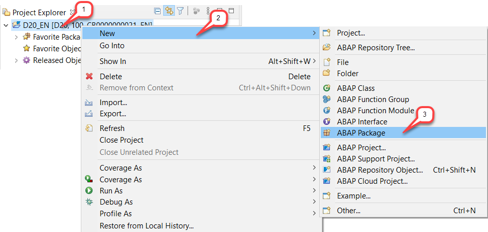

2. Maintain **`ZRAP_####`** as **name** (where `####` is your chosen suffix) and a meaningful **description** (e.g. _`RAP Exercises`_).  
    The _Project_ and the _Package_ have already been assigned. The _Superpackage_ should be set to **`ZLOCAL`** as well. 
    
    Choose **Next** to continue.  
    
    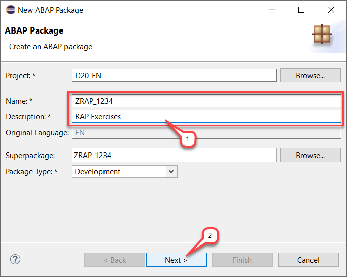
    
3. Assign a transport request.  
    For that, either select an existing transport request – if available – or choose **Create a new request**, enter a meaningful **description** and then choose **Finish**.  
    
    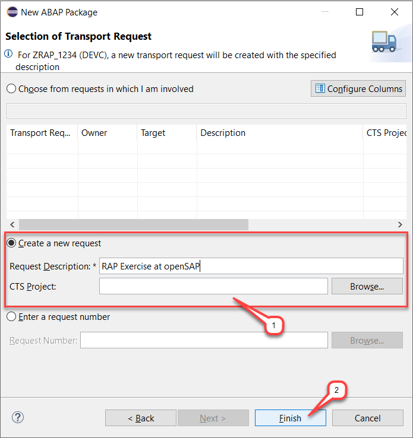  
      
    The new package is now created.  
  
    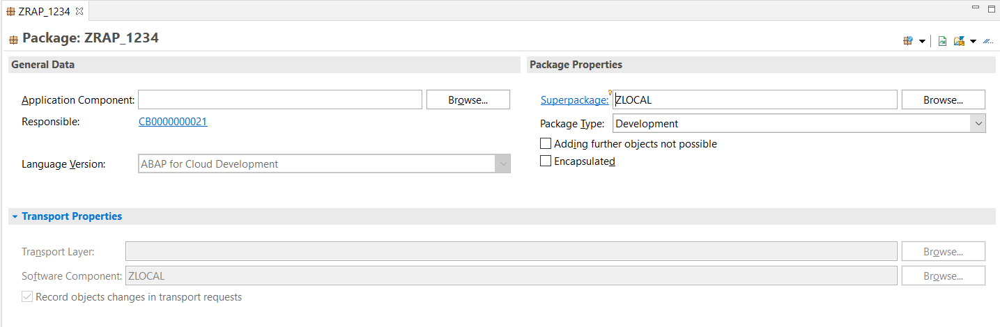
    
4. Add your ABAP package to the **Favorites Packages** to make it easier to access.  
    For that, either **(1)** right-click on the relevant package and choose the context menu entry **_Add to Favorite Packages_** or **(2)** right-click on the **Favorites Packages** folder in the Project Explorer, choose the context menu entry **Add Package...**, filter the entries for the relevant package in the appearing dialog and press **OK** to add it. 
    
    _Option 1 & 2_: 
    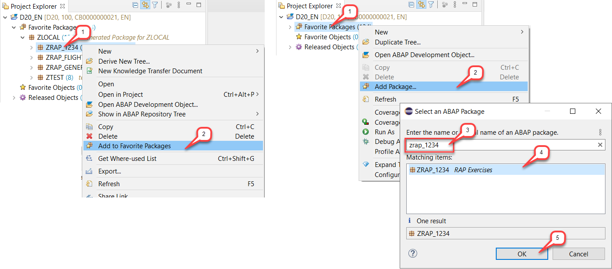

## Step 2. Create and implement the _Hello World_ Console App
You can now go ahead and create and implement your _Hello World_ console app.   
  
1. Right-click on your package and choose **_New > ABAP Class_** from the context menu.  
  
    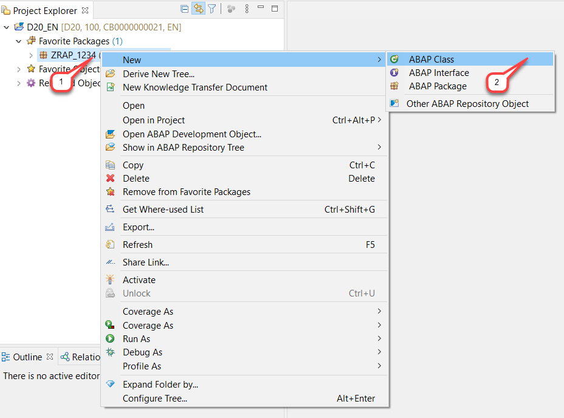

2. Maintain **`ZCL_HELLO_WORLD_####`** as **name** (where `####` is your chosen suffix) and a meaningful **description** (e.g. _`Hello world`_) for the ABAP class. 
    Add the ABAP interface **`IF_OO_ADT_CLASSRUN`** which needs to be implemented in order to write outputs to the ABAP Console and choose **Next**.  
      
    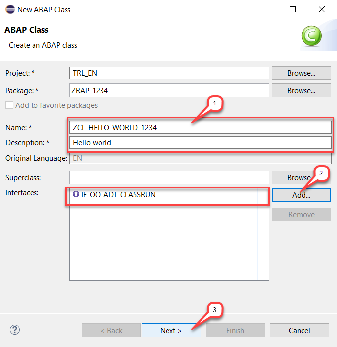
    
3. Assign the previously created transport request and choose **Finish**.  
      
    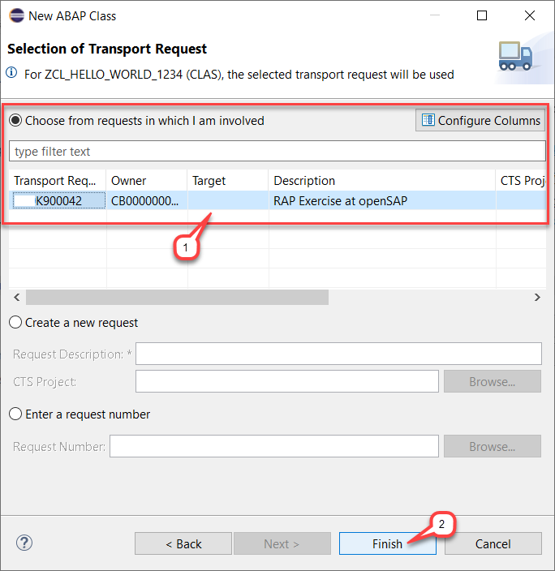  
      
    The ABAP class is now created and opened in the source-based class editor, ready for you to implement.  
You can hover the appearing warning in the editor or have a look at it in the _**Problems**_ view.  
The reason for this warning is the currently missing implementation of the method **`main`**.  
    
    
    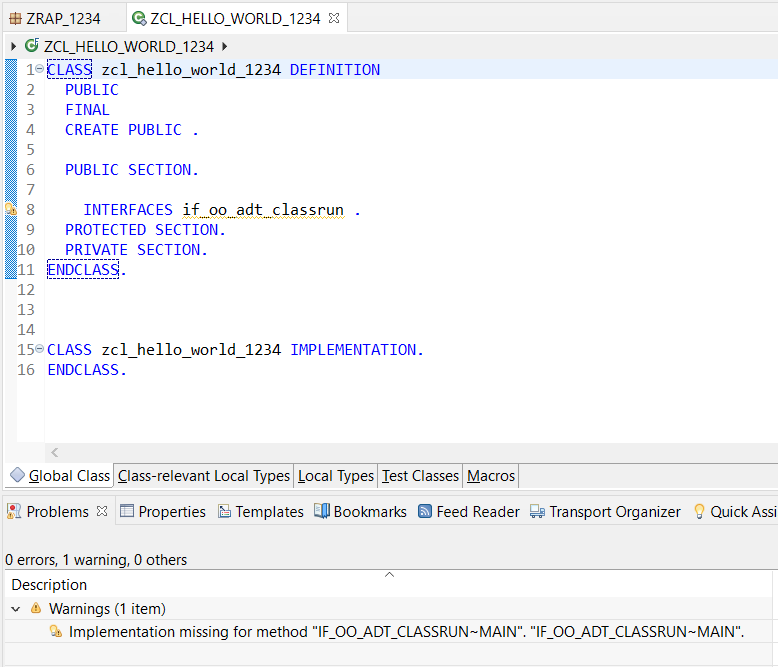  
    
    
4. Set the cursor on the problematic statement, press **CTRL+1** to open the _Quick Assist_ view to check for proposals to solve this issue and choose the entry **`Add implementation for main`**_.  
          
    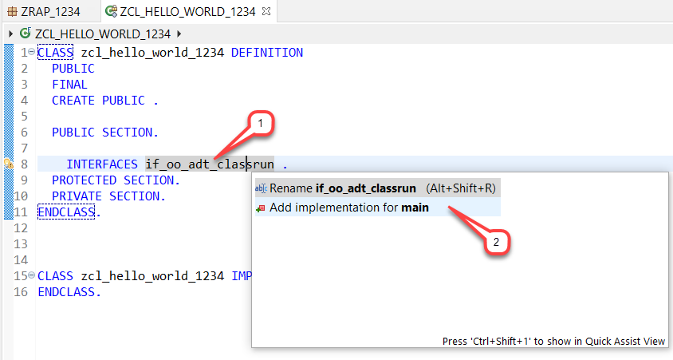
    
     
    >     
    > You can make use of the _ABAP Formatter_ (aka _Pretty Printer_) by pressing **Shift+F1** on your keyboard to format the source code.  
    > The settings of the _ABAP Formatter_ can be adjusted under the ADT menu **_Windows > Preferences_**.   
    > In the appearing dialog, search for _“formatter”_, click on **_Source Code Editors_** and then on **_ABAP Formatter_**.  
    > Choose the relevant ABAP project in the appearing dialog and press **OK** to continue.  
    > Adjust the settings as you wish in the _ABAP Formatter_ dialog and then press **Apply** or **Apply and Close** to confirm the changes. These settings are project-specific and can be changed as you wish.
    >
    > You can also adjust the settings for the _Code Completion_ (**Ctrl+Space**) for the ABAP and the CDS source code. For example, you can define whether a completion is simply inserted or overwrites the previous value.  
    > For that, filter the entries for _“code completion”_ in the  _Preferences_ dialog, then ajust the settings as you wish under 
_**Source Code Editors > Code Completion_** and under _**Source Code Editors > CDS > Code Completion**_.    
    > Do not forget to always press **Apply** or **Apply and Close** to save the changes.  
    >    
      
5. You will use a string template to output the literal _Hello world!_.  
    Add the following codeline to the method implementation:    
        
    <pre>out->write( |Hello world!| ).</pre>
        
6. Save  and activate  the changes.  
    Now, press **F9** or right-click on the class and select **_Run As > ABAP Application (Console)_** from the context menu to execute the class.     
       
    
     
    Check out the result in the _ABAP Console_ view.  
      
    
    
7. Let's enhance the current output with the user alias by using embedded expression.   
    
    > On the SAP Cloud Platform ABAP environment, various system variables are no longer available due to the cloud environment or due to non-supported frameworks. Therefore, APIs (e.g. helper class **`CL_ABAP_CONTEXT_INFO`**) are provided to access released system variables like username, language and time.   
      
    Enhance the current string template as follows: 
        
    <pre>out->write( |Hello world! ({ cl_abap_context_info=>get_user_alias(  ) })| ).</pre>
    
8. Save  and activate  the changes.  
    Check out the enhanced output in the _**Console**_ view.  
      
    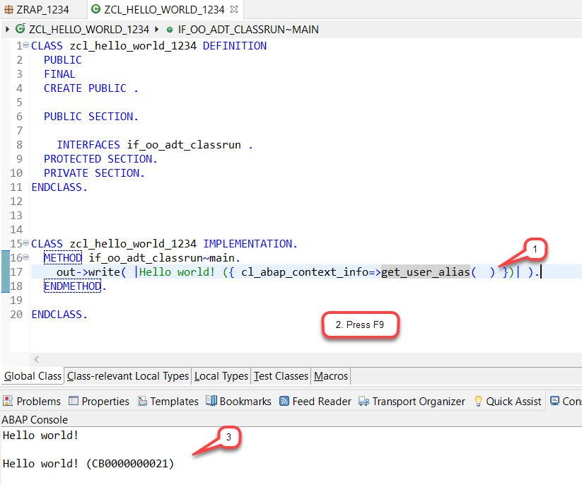
      
    > You can easily clear the _**Console**_ view via its context menu entry _**Clear**_.
    
## Summary
You have completed the exercise!  
In this unit, you have learned 
- How to use ABAP Development Tools (ADT) for Eclipse
- How to create ABAP packages and classes
- How to create a simple _Hello World!_ console app

## Solution
Find the source code for the created class in the **[/week1/sources](/week1/sources)** folder:
- [W1U6_CLAS_ZCL_HELLO_WORLD_####](/week1/sources/W1U6_CLAS_ZCL_HELLO_WORLD.txt)
      
Do not forget to replace all the occurrences of `####` with your chosen suffix in the copied source code.
## Next excercise
[Week 2: Developing a Read-Only List Report App](/week2/README.md)
