# HANDS-ON EXERCISE FOR WEEK 2 UNIT 4: CREATING CDS DATA MODEL PROJECTION

## Previous exercise
[Week 2 Unit 3: Creating the Core Data Services (CDS) Data Model](unit3.md)

## Introduction
In the present hands-on exercise, you will define the CDS data model projection for your travel app on top of the CDS data model defined in the previous exercise. 
With projection views, you can expose only those elements that are relevant for the specific service. You can de-normalize the underlying data model and  also define fine-tuning such as virtual elements, value helps, search and UI semantics.
    
You can watch [week 2 unit 4: Creating the CDS Data Model Projection](https://open.sap.com/courses/cp13/items/49GF6acceUwItzEuJoffCP) on the openSAP platform.

> **Hints and Tips**    
> Speed up the typing by making use of the Code Completion feature (shortcut *Ctrl+Space*) and the prepared code snippets provided. 
> You can easily open an object with the shortcut *Ctrl+Shift+A*, format your source code using the Pretty Printer feature *Ctrl+1* and toggle the fullscreen of the editor using the shortcut *Ctrl+M*.   
>
> A great overview of ADT shortcuts can be found here: [Useful ADT Shortcuts](https://blogs.sap.com/2013/11/21/useful-keyboard-shortcuts-for-abap-in-eclipse/)
>
> Please note that the placeholder **`####`** used in object names in the exercise description must be replaced with the suffix of your choice during the exercises. The suffix can contain a maximum of 4 characters (numbers and letters).
> The screenshots in this document have been taken with the suffix `1234` and system `D20`. Your system id will be `TRL`.

> Please note that the ADT dialogs and views may change in the future due to software updates.

Follow the instructions below.

## Step 1. Create the Travel Projection View

First, create the Travel BO projection view (aka consumption view) **`ZC_RAP_Travel_####`** (where `####` is your chosen suffix)  for the Travel entity.

1. Right-click on your travel BO view (aka interface view) **`ZI_RAP_Travel_####`** and choose **New Data Definition** from the context menu.
 
    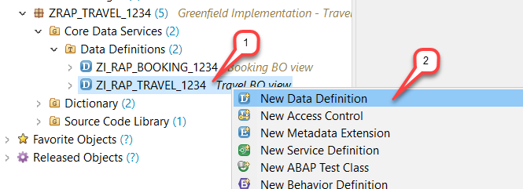

2.  Maintain **`ZC_RAP_Travel_####`** as name and a meaningful description (e.g. _**Travel BO projection view**_) in the creation wizard and choose **Next >** to continue.   
The project, the package and the referenced object have been automatically assigned in the creation wizard. 

    >**Please note**    
    >In this course, we will follow the naming convention of the Virtual Data Model (VDM) of the SAP S/4HANA where the name of interface or BO views begins with _`<namespace>I`_ (e.g _`ZI_`_) and the name of consumption or projection views begins with the namespace followed by _`<namespace>C`_ (e.g. _`ZC_`_).    
    

    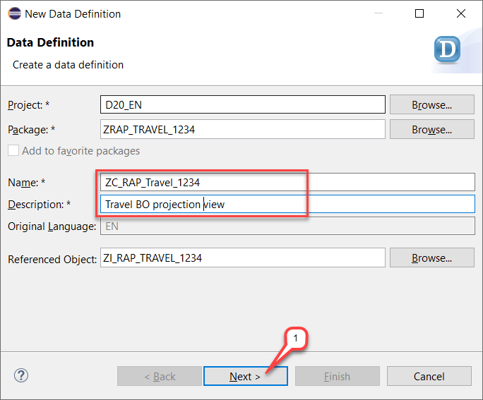

3. Assign a transport request and choose **Next >**.  

    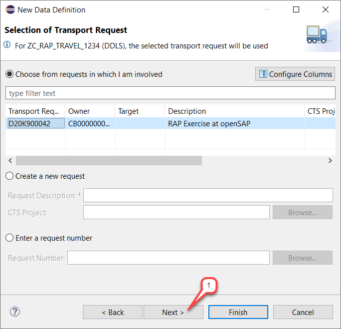

4. Choose the **`Define Projection View`** template from the list and then choose **Finish**.

    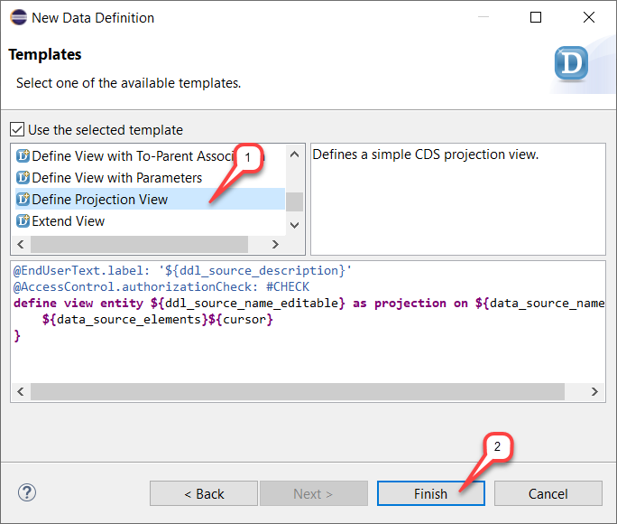

    The new data definition appears in the editor. 

    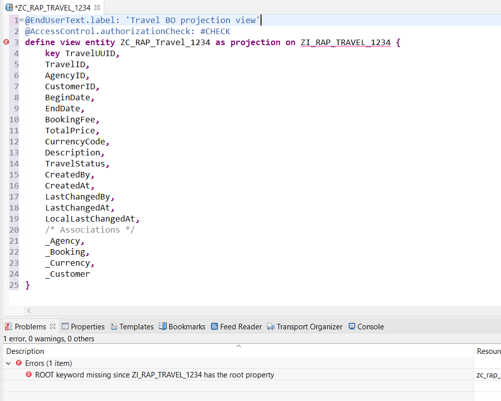
    
    
    **Short Explanation:**    
    The travel BO view is specified as projection view and all view elements have been automatically inserted in the projection list between the curly brackets.

5. Replace the travel data definition in the editor with the code snippet provided below and replace all occurrences of **`####`** with your chosen suffix. You can make use of the _Replace All_ feature (**Ctrl+F**) in ADT for the purpose.

    Save  the changes, but **DO NOT** yet activate the travel BO projection view.

    You can make use of the Source Code Formatter (**Shift+1**) to format the source code.
    <pre>
    @EndUserText.label: 'Travel BO projection view'
    @AccessControl.authorizationCheck: #CHECK
    @Search.searchable: true
    @Metadata.allowExtensions: true

    define root view entity ZC_RAP_Travel_####
      as projection on ZI_RAP_Travel_#### as Travel
    {
      key TravelUUID,
          @Search.defaultSearchElement: true
          TravelID,
          @Consumption.valueHelpDefinition: [{ entity: { name: '/DMO/I_Agency', element: 'AgencyID'} }]
          @ObjectModel.text.element: ['AgencyName']
          @Search.defaultSearchElement: true
          AgencyID,
          _Agency.Name       as AgencyName,
          @Consumption.valueHelpDefinition: [{ entity: { name: '/DMO/I_Customer', element: 'CustomerID'} }]
          @ObjectModel.text.element: ['CustomerName']
          @Search.defaultSearchElement: true
          CustomerID,
          _Customer.LastName as CustomerName,
          BeginDate,
          EndDate,
          @Semantics.amount.currencyCode: 'CurrencyCode'
          BookingFee,
          @Semantics.amount.currencyCode: 'CurrencyCode'
          TotalPrice,
          @Consumption.valueHelpDefinition: [{ entity: { name: 'I_Currency', element: 'Currency'} }]
          CurrencyCode,
          Description,
          TravelStatus,
          LastChangedAt,
          LocalLastChangedAt,

          /* Associations */
          _Agency,
          _Booking : redirected to composition child ZC_RAP_Booking_####,
          _Currency,
          _Customer   
    }
    </pre>

    The data definition should look as follows. 

    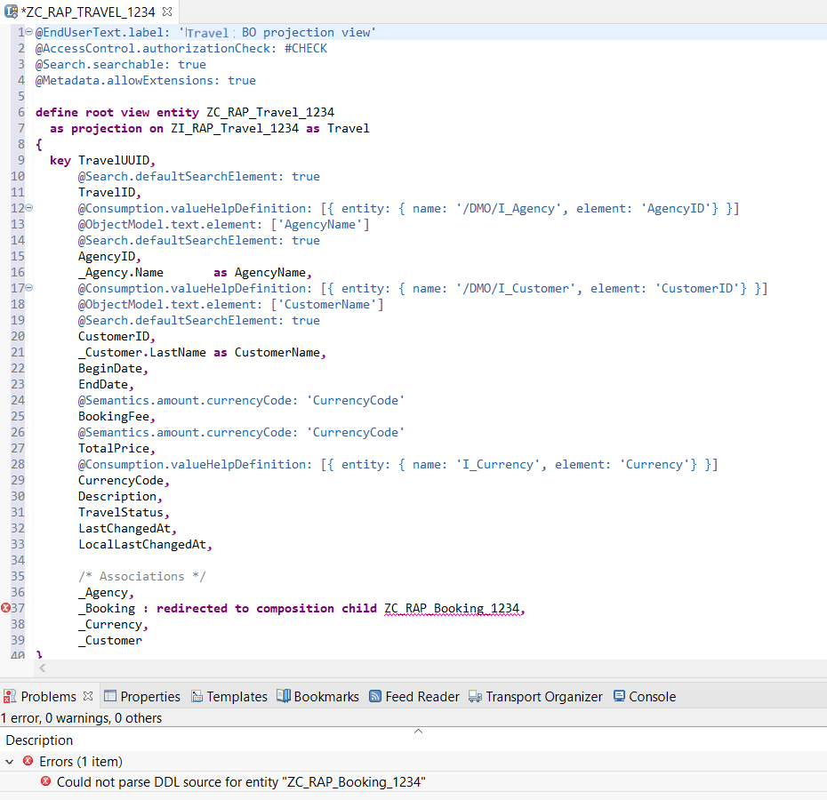
    
    **Short explanation: What has changed?**
    - The alias **`Travel`** is specified for the projected view
    - The keyword **`root`** is specified in the **`DEFINE`** statement to specify the projected Travel BO as root node.
    - The view annotations **`@Metadata.allowedExtension`** is specified before the **`DEFINE`** statement to allow the projection view to be enhanced with separate metadata extensions 
    - The view annotations **`@Search.Searchable`** is specified before the **`DEFINE`** statement to allow the projection view to enable the full-text (aka freestyle) search.
    - The freestyle search is enabled for the view elements **`TravelID`**, **`AgencyID`** and **`CustomerID`** using the annotation **`@Search.DefaultSearchElement`**.
    - The view elements **`AgencyName`** from the association **`_Agency`** and **`CustomerName`** from the association **`_Customer`** have been added to the projection list.
    They are specified as  textual description for the view elements **`AgencyID`** and **`CustomerID`** respectively using the **`@ObjectModel.text.element`** annotation.
    - Value helps are specified for the view elements **`AgencyID`**, **`CustomerID`**, and **`CurrencyCode`** using the annotation **`@Consumption.valueHelpDefinition`**. 
    The name of the target CDS entity that acts as a value help provider and the name of its element that is linked to the local element have to be specified. 
    - The view element **`CurrencyCode`** is specified as the reference field for the currency fields **`BookingFee`** and **`TotalPrice`** using the **`@Semantics.amount.currencyCode`**  annotations. 
    - The view elements **`CreatedBy`**, **`CreatedAt`** and **`LastChangedBy`** have been removed from the projection list because they only have an are administrative function and will be of no use in our scenario. The view elements **`LastChangedAt`** and **`LocalLastChangedAt`** remain in the projection list because they will be used for the transactional enablement of Your Travel List Report App in week 3 – especially for the implementation of the optimistic lock.
    - associations have been exposed in the projection list
    - association to the booking BO child node (**`_Booking`**) has been redirected to the appropriate Booking BO projection view using the **`redirected to composition child`**  statement.    
         
    An error is currently displayed for this statement, because the specified Booking BO projection view **`ZC_RAP_Booking_####`** does not yet exist. 
    
## Step 2. Create the Booking Projection View
Now, you will create the missing Booking BO projection view (aka consumption view) **`ZC_RAP_BOOKING_####`** for the Booking entity - where **`####`** is your chosen suffix.

1. Right-click on your Booking BO view (aka interface view) **`ZI_RAP_BOOKING_####`** and choose **New Data Definition** from the context menu.
 
    

2.  Maintain **`ZC_RAP_BOOKING_####`** as name and a meaningful description (e.g. _**Booking BO projection view**_) in the creation wizard and choose **Next >** to continue.  
    The project, the package and the referenced object have been automatically assigned in the creation wizard.  
 
    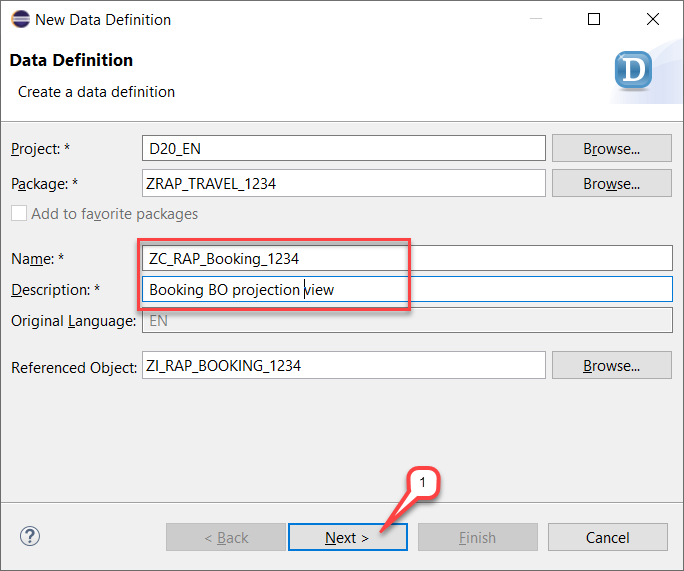

3. Assign a transport request and choose **Next >**. 
 
    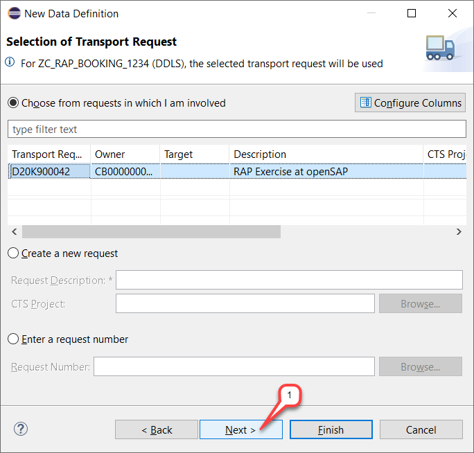

4. Choose the **`Define Projection View`** template from the list and then choose **Finish**.

    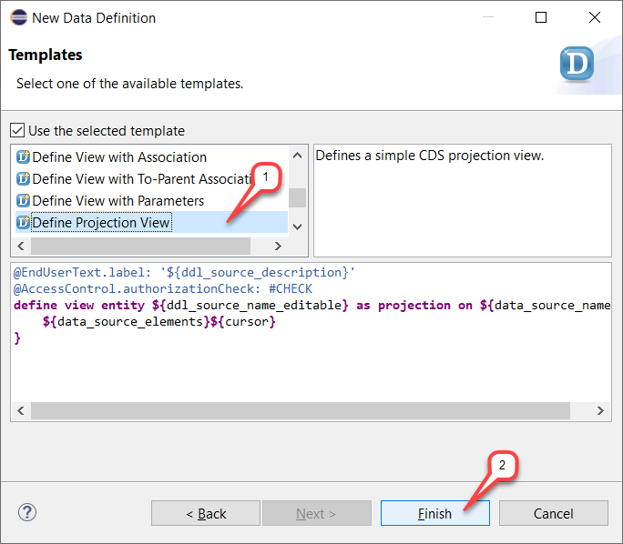

    The new data definition appears in the editor.
 
    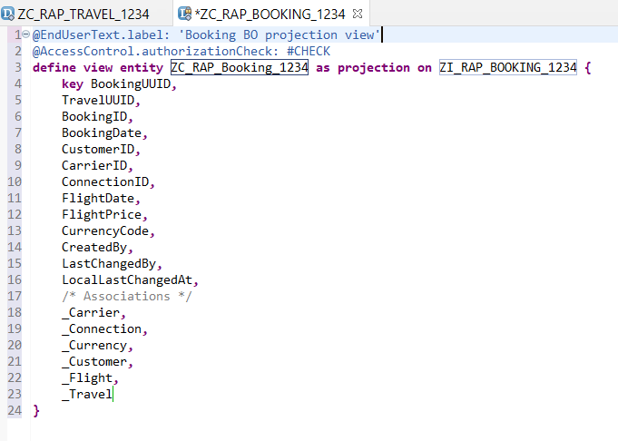

    **Short Explanation:**
    The booking BO view is specified as projection view and all view elements have been automatically inserted in the projection list between the curly brackets.

5. Replace the booking data definition in the editor with the code snippet provided below and replace all occurrences of **`####`** with your chosen suffix. You can make use of the _Replace All_ feature (**Ctrl+F**) in ADT for the purpose.

    Save  the changes, but **DO NOT** yet activate the booking BO projection view.

    You can make use of the Source Code Formatter (**Shift+1**) to format the source code.
    
    <pre>
    @EndUserText.label: 'Booking BO projection view'
    @AccessControl.authorizationCheck: #CHECK
    @Search.searchable: true
    @Metadata.allowExtensions: true

    define view entity ZC_RAP_Booking_####
      as projection on ZI_RAP_Booking_#### as Booking
    {
      key BookingUUID,
          TravelUUID,
          @Search.defaultSearchElement: true
          BookingID,
          BookingDate,
          @Consumption.valueHelpDefinition: [{ entity : {name: '/DMO/I_Customer', element: 'CustomerID'  } }]
          @ObjectModel.text.element: ['CustomerName']
          @Search.defaultSearchElement: true
          CustomerID,
          _Customer.LastName as CustomerName,
          @Consumption.valueHelpDefinition: [{entity: {name: '/DMO/I_Carrier', element: 'AirlineID' }}]
          @ObjectModel.text.element: ['CarrierName']
          CarrierID,
          _Carrier.Name      as CarrierName,
          @Consumption.valueHelpDefinition: [ {entity: {name: '/DMO/I_Flight', element: 'ConnectionID'},
                                               additionalBinding: [ { localElement: 'CarrierID',    element: 'AirlineID' },
                                                                    { localElement: 'FlightDate',   element: 'FlightDate',   usage: #RESULT},
                                                                    { localElement: 'FlightPrice',  element: 'Price',        usage: #RESULT },
                                                                    { localElement: 'CurrencyCode', element: 'CurrencyCode', usage: #RESULT } ] } ]
          ConnectionID,
          FlightDate,
          @Semantics.amount.currencyCode: 'CurrencyCode'
          FlightPrice,
          @Consumption.valueHelpDefinition: [{entity: {name: 'I_Currency', element: 'Currency' }}]
          CurrencyCode,
          LocalLastChangedAt,

          /* associations */
          _Travel : redirected to parent ZC_RAP_Travel_####,
          _Customer,
          _Carrier,
          _Connection,
          _Flight
    }
    </pre>

    The data definition now looks as follows. 
    
     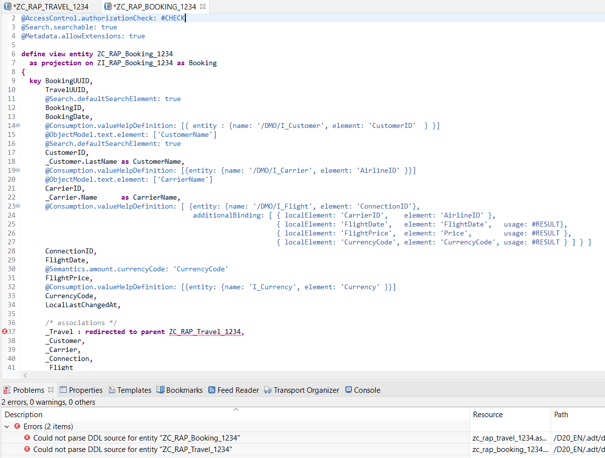

    **Short explanation: What has changed?**  
    -	The alias Booking is specified for the projected view
    -	The view annotations **`@Metadata.allowedExtension`** is specified before the **`DEFINE`** statement to allow the projection view to be enhanced with separate metadata extensions 
    -	The view annotations **`@Search.Searchable`** is specified before the **`DEFINE`** statement to allow the projection view to enable the full-text (aka freestyle) search.
    -	The view columns **`BookingID`** and **`CustomerID`** are enabled for freestyle search.  
    The view elements **`CustomerName`** and **`CarrierName`** from the associations **`_Customer_`** and **`_Carrier`** respectively have been added to the projection list.  
    They are specified as  textual description for the view elements **`CustomerID`** and **`CarrierID`** respectively using the annotation **`@ObjectModel.text.element`**.  
    -	Value helps are specified for the view elements **`CustomerID`**, **`CarrierID`**, **`ConnectionID`** and **`CurrencyCode`** using the annotation **`@Consumption.ValueHelpDefinntion`**.  
    In the value help definition of the element **`ConnectionID`**, an additional binding condition is defined for returning values from the selected value help record for the local view elements **`CarrierID`**, **`FlightDate`**, **`FlightPrice`** and **`Currency`**.
    -	The view element **`CurrencyCode`** is specified as reference field for the currency field **`FlightPrice`**. 
    -	The view elements **`CreatedBy`** and **`LastChangedBy`** have been removed from the projection list because they only have an administrative function and will be of no use in our scenario. The view element **`LocalLastChangedAt`** remains in the projection list because it will be used for the transactional enablement of Your Travel List Report App in week 3 – especially for the implementation of the optimistic lock.  
    -	All associations have been exposed in the projection list.
    -	The association to the travel BO parent node has been redirected to the appropriate Travel BO projection view using the  **`redirected to parent`**  statement. 

## Step 3. Activate the CDS Data Model Projection & Run the Data Preview 
To avoid error during the activation, both new CDS interface views – i.e. Travel view and Booking view – must be activated together for the first time.  

1.	Choose **`Activate All`**  or use the shortcut **Ctrl+Shift+F3**.    
    Select both CDS views **`ZC_RAP_TRAVEL_####`** and **`ZC_RAP_BOOKING_####`** on the appearing dialog, and choose **Activate**.
 
    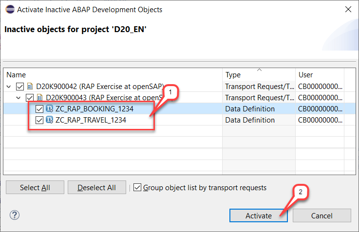

    Your projected CDS data model consisting of the Travel BO projection view and the Booking BO projection view are now activated, but warnings are displayed in the _Problems_ view. The reason behind this is that the authority check is allowed for these CDS views (using the view annotation **`@AccessControl.authorizationCheck: #CHECK`**), but no CDS access control is yet defined for them.    
             
    You will work on this in unit 7 of week 2 where you will implement a basic CDS access control.
         
 
    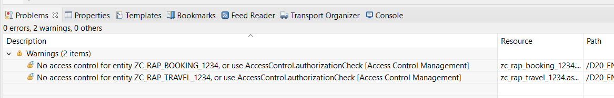

2.	To run the Data Preview, choose one of the CDS views - i.e. **`ZC_RAP_TRAVEL_####`** or **`ZC_RAP_BOOKING_####`** - in the Project Explorer or open it in the editor, and press **F8**.   
       
    The data preview will open in the editor area.    
 
    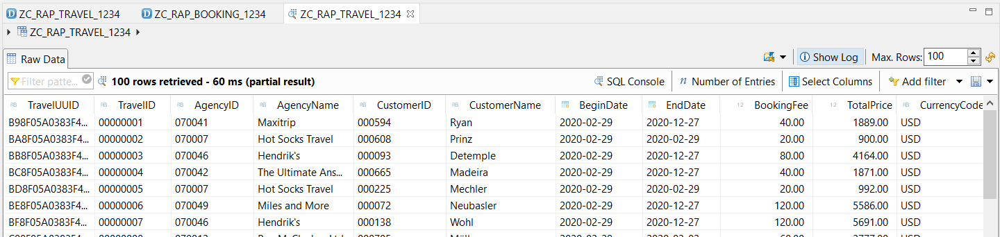
 
    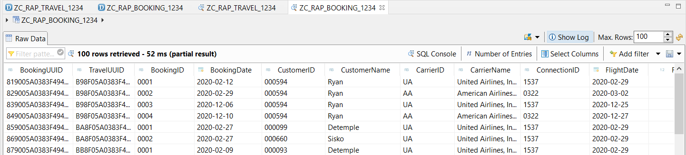

## Summary
You have completed the exercise!  
In this unit, you have learned how to define a CDS data model projection for business objects. 

## Solution
Find the source code of the created CDS data definitions (consumption views) in the **[/week2/sources](/week2/sources)** folder:
- [W2U4_DDLS_ZC_RAP_TRAVEL_####](/week2/sources/W2U4_DDLS_ZC_RAP_TRAVEL.txt) 
- [W2U4_DDLS_ZC_RAP_BOOKING_####](/week2/sources/W2U4_DDLS_ZC_RAP_BOOKING.txt)
  
## Next exercise
[Week 2 Unit 5: Enriching the Projected Data Model with UI Metadata](unit5.md)

