# HANDS-ON EXERCISE FOR WEEK 2 UNIT 5: ENRICHING THE PROJECTED DATA MODEL WITH UI METADATA

## Previous exercise
[Week 2 Unit 4: Defining the CDS Data Model Projection](unit4.md)

## Introduction
In the present hands-on exercise, you will enrich your CDS data model projection with UI metadata for the latter generation of an SAP Fiori elements-based Travel list report app. The focus of this course is on the RESTful back-end implementation of apps. Therefore, we will use only a few UI annotations to enrich the projected CDS data model for the later generation of our SAP Fiori elements Travel app.  
    
In the previous exercise, you have specified the view annotation **`@Metadata.allowExtensions:true`** in the BO projection views to allow their modification-free enhancement using separate CDS metadata extensions.  
    
You can watch [week 2 unit 5: Enriching the Projected Data Model with UI Metadata](https://open.sap.com/courses/cp13/items/4Xob2TI2k2XfSgWRrsh85P) on the openSAP platform.
     
> **Hints and Tips**    
> Speed up the typing by making use of the Code Completion feature (shortcut *Ctrl+Space*) and the prepared code snippets provided. 
> You can easily open an object with the shortcut *Ctrl+Shift+A*, format your source code using the Pretty Printer feature *Shift+F1* and toggle the fullscreen of the editor using the shortcut *Ctrl+M*.   
>
> A great overview of ADT shortcuts can be found here: [Useful ADT Shortcuts](https://blogs.sap.com/2013/11/21/useful-keyboard-shortcuts-for-abap-in-eclipse/)
>
> Please note that the placeholder **`####`** used in object names in the exercise description must be replaced with the suffix of your choice during the exercises. The suffix can contain a maximum of 4 characters (numbers and letters).  
> The screenshots in this document have been taken with the suffix `1234` and system `D20`. Your system id will be `TRL`.

> Please note that the ADT dialogs and views may change in the future due to software updates.
    
Follow the instructions below.

## Step 1. Annotate the Travel Projection View
First, create the CDS metadata extensions **`ZC_RAP_Travel_####`** (where `####` is your chosen suffix)  to enrich the Travel BO projection view with UI semantics.

1.	Right-click on your Travel BO projection view **`ZC_RAP_Travel_####`** in the Project Explorer and select **New Metadata Extension** from the context menu.
 

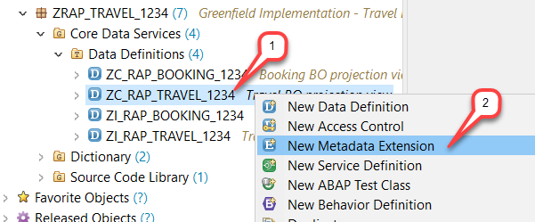

2.	Maintain **`ZC_RAP_Travel_####`** as name and a meaningful description (e.g. _**UI Annotations for `ZC_RAP_Travel_####`**_) and choose _**Next >**_ to continue.    
Project, Package and Extended Entity are automatically assigned in the creation wizard.  
 
    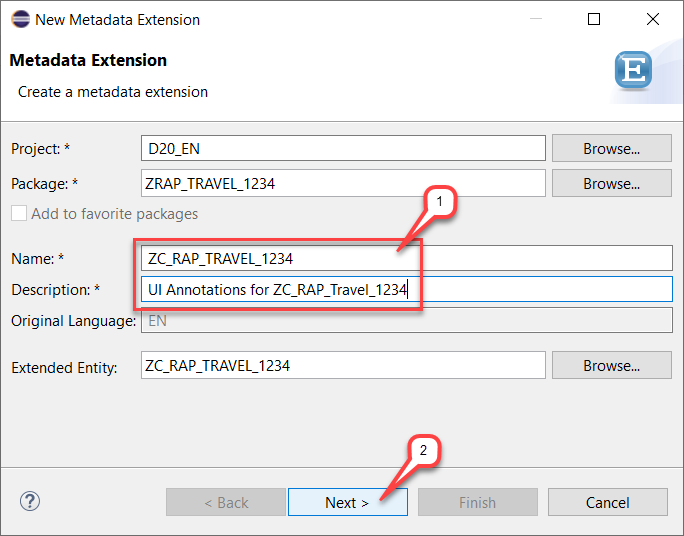

3.	Assign a transport request and choose **Next >**.  
 
    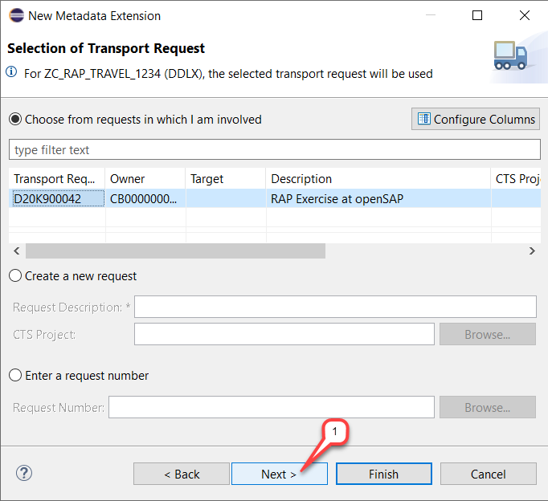

4.	Metadata extension templates are provided for your convenience.   
    Choose the **annotate view** template and choose **Finish**.
 
    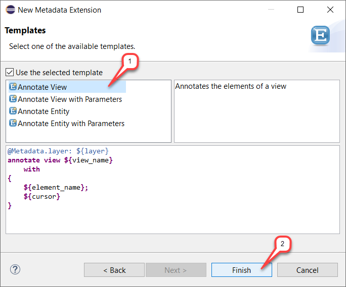
    
    The new metadata extension appears in the editor.   
 
    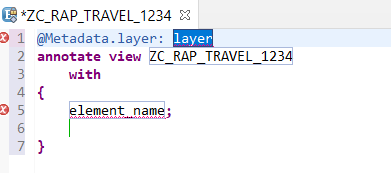

    **Short Explanation:**    
The **`@Metadata.layer`** annotation is specified at the top. The name of the BO projection view is specified after the **`ANNOTATE VIEW`** statement and a dummy entry is defined between the curly brackets.   

5.	Specify the metadata layer at the top of the extension as follows   
**` @Metadata.layer: #CORE`** .  
    Remove the dummy entry **`element_name;`** and insert all view elements between the curly brackets. You can make use of the code Completion (**Ctrl+Space**) for that.  
 
    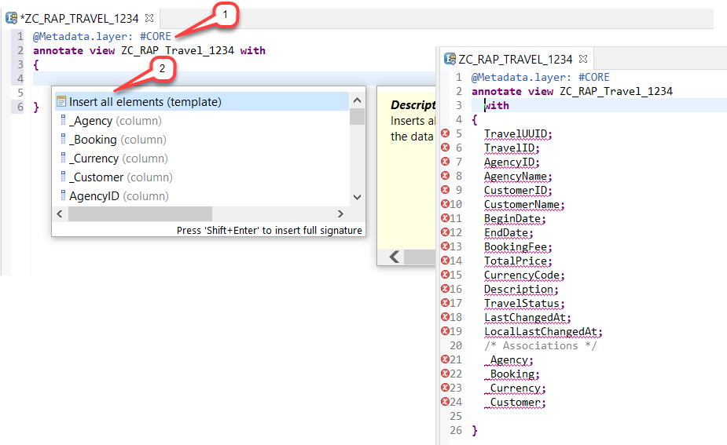

6.	Some of the consumption specific element annotations specified in the BO projection views make the need for UI annotations redundant. This is the case for the elements **`AgencyName`** and **`CustomerName`** which are the textual descriptions for **`AgencyID`** and **`CustomerID`** respectively, and for the element **`CurrencyCode`** which is the reference field for **`BookingFee`** and **`TotalPrice`**.   
    These three elements will be automatically displayed together with their related elements on the UI.   

    Therefore, remove the elements **`AgencyName`**, **`CustomerName`**, and **`CurrencyCode`**, and also all associations, i.e.  **`_Currency`**, **`_Booking`** and **`_Agency`** and **`_Customer`**, from the element list.     
          
 
    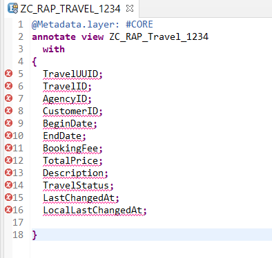

7.	Now, you can specify the UI annotations for the remaining elements.   
    For that, replace the code in the editor with the code snippet provided below and replace all occurrences of  `####` with your chosen suffix.   
        
    You can make use of the _Replace All_ feature (**Ctrl+F**) in ADT for the purpose and also of the _Source Code Formatter_ (**SHIFT+F1**) to format the source code.  

    <pre>
    @Metadata.layer: #CORE
    @UI: {
      headerInfo: { typeName: 'Travel',
                    typeNamePlural: 'Travels',
                    title: { type: #STANDARD, label: 'Travel', value: 'TravelID' } },
      presentationVariant: [{ sortOrder: [{ by: 'TravelID', direction:  #DESC }] }] }

    annotate view ZC_RAP_Travel_#### with
    {
      @UI.facet: [ { id:              'Travel',
                     purpose:         #STANDARD,
                     type:            #IDENTIFICATION_REFERENCE,
                     label:           'Travel',
                     position:        10 },
                   { id:              'Booking',
                     purpose:         #STANDARD,
                     type:            #LINEITEM_REFERENCE,
                     label:           'Booking',
                     position:        20,
                     targetElement:   '_Booking'} ]  

      @UI:{ identification: [{ position: 1, label: 'Travel UUID' }] }
      TravelUUID;

      @UI: {  lineItem:       [ { position: 10 } ],
              identification: [ { position: 10 } ],
              selectionField: [ { position: 10 } ] }  
      TravelID;

      @UI: {  lineItem:       [ { position: 20 } ],
              identification: [ { position: 20 } ],
              selectionField: [ { position: 20 } ] }  
      AgencyID;

      @UI: {  lineItem:       [ { position: 30 } ],
              identification: [ { position: 30 } ],
              selectionField: [ { position: 30 } ] }  
      CustomerID;

      @UI: {  lineItem:       [ { position: 40 } ],
              identification: [ { position: 40 } ] }  
      BeginDate;

      @UI: {  lineItem:       [ { position: 50 } ],
              identification: [ { position: 50 } ] }   
      EndDate;

      @UI: {  lineItem:       [ { position: 60 } ],
              identification: [ { position: 60 } ] }   
      BookingFee;

      @UI: {  lineItem:       [ { position: 70 } ],
              identification: [ { position: 70 } ] }   
      TotalPrice;

      @UI: {  lineItem:       [ { position: 80 } ],
              identification: [ { position: 80 } ] }   
      Description;

      @UI: {  lineItem:       [ { position: 90 } ],
              identification: [ { position: 90 } ] }   
      TravelStatus;

      @UI.hidden: true
      LastChangedAt;

      @UI.hidden: true
      LocalLastChangedAt;
    }
    </pre>
 
     
     The results looks as follows:    
     
    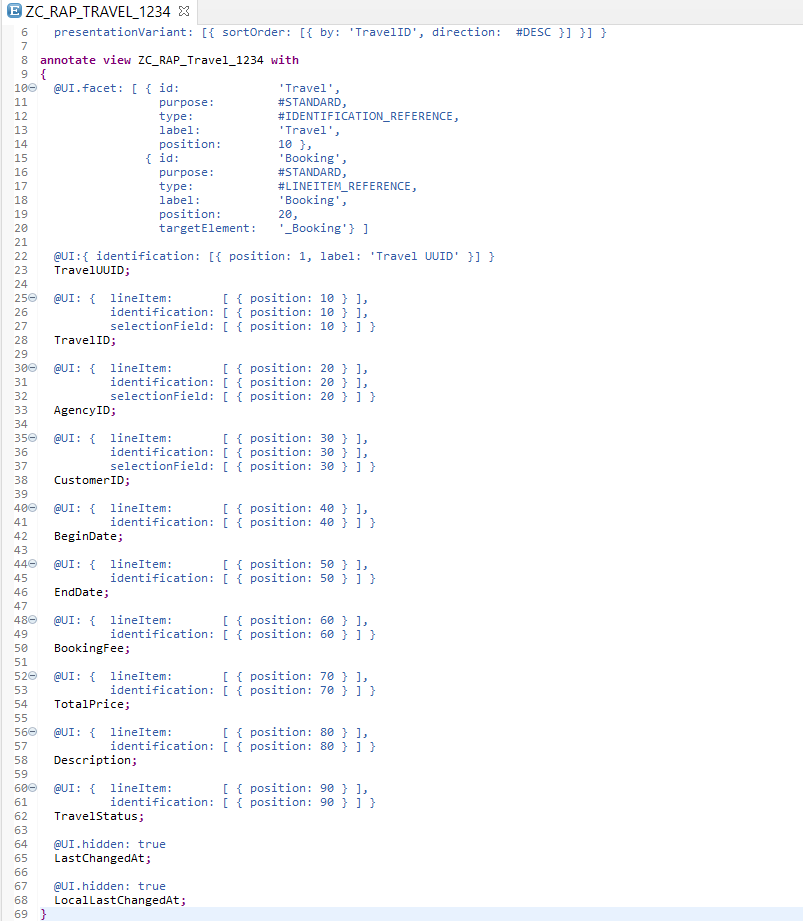

    **Short Explanation:  What has changed?**   
    -	**`#CORE`** is specified as the metadata layer since you are the application provider.   
    When multiple metadata extensions are defined for a given CDS entity, the layer determines the priority of the metadata. **`#CORE`** has the lowest, and **`#CUSTOMER`** the highest priority.
    -	Header information – such as type name and Title – and the presentation variant for our list report app using **`@UI`** view annotations are defined at the top before the **`ANNOTATE VIEW`** statement. The queried travel data will be sorted in the descending order by the element **`TravelID`** in the list.
    -	The navigation to the object page and its layout is defined using **`@UI.facet`** annotations in the curly brackets. The travel object page has two facets: the identification reference of the travel entity and the line item reference of the Booking entity – with the **`_Booking`** composition specified as target element.
    -	Various **`@UI`** annotations are used to specify the layout of each elements on the travel list and the object page.
        
    
 >   
 >**About the UI Annotations**    
 > As already mentioned, the focus of this course is on the RESTful back-end implementation of apps. Therefore, we will use only a few UI annotations to enrich the projected CDS data model for the later generation of our SAP Fiori elements Travel app.  
 > More information about [Defining CDS Annotations for Metadata-Driven UIs](https://help.sap.com/viewer/923180ddb98240829d935862025004d6/Cloud/en-US/9b4aa865c1e84634b6e105173fc3a5e7.html) and the [UI Annotations supported in ABAP CDS](https://help.sap.com/viewer/923180ddb98240829d935862025004d6/Cloud/en-US/5587d47763184cc48f164648b53c1e4f.html) can be found in the  SAP Help Portal.     
 >    
 >For example,     
 >- The UI annotation **`@UI.lineItem`**  is used to specify the layout information of each elements shown as column in the list.  
 >- The UI annotation **`@UI.identification`** is used to specify the layout information of each element shown in the identification section of the object page.  
 >- The UI annotation **`@UI.selectionField`** is used to enable an element for selection in the filter bar. If a value-help is defined for the given element, then it is automatically exposed to the UI.  
 > - For the positioning order, any decimal number can be used as value for the property **`position`**.  
 > - With the UI annotation **`@UI.hidden:true`**, we prevent elements from being displayed on the UI or in the personalization settings dialog.    
        

8.	Save  and activate  the changes.  

## Step 2. Annotate the Booking Projection View
Now, you will create the CDS metadata extensions **`ZC_RAP_Booking_####`** (where `####` is your chosen suffix)  to enrich the Booking BO projection view with UI semantics.  

1.	Right-click on your Booking BO projection view **`ZC_RAP_Booking_####`** in the Project Explorer and choose **New Metadata Extension** from the context menu.  
 
    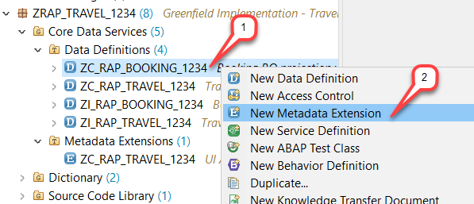

2.	Maintain **`ZC_RAP_Booking_####`** as name and a meaningful description (e.g. _UI Annotations for ZC_RAP_Booking_####_)  and choose **Next >** to continue.  
    Project, Package and Extended Entity are automatically assigned in the creation wizard.  
 
    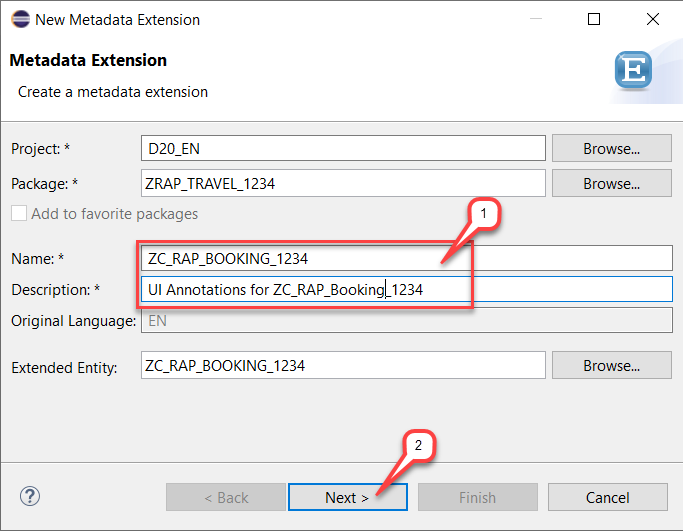
    
3.	Assign a transport request and choose **Next >**. 
 
    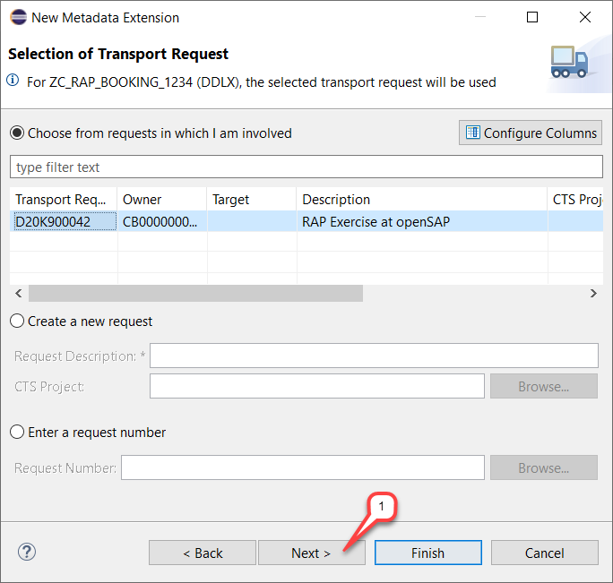

4.	Select the annotate view template and choose **Finish**.
 
    

    The new metadata extension appears in the editor. 
 
    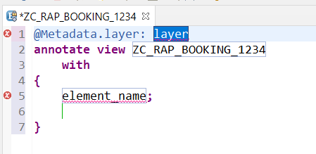

5.	Specify **`#CORE`** as metadata layer at the top of the extension.    
Remove the dummy entry **`element_name;`** and insert all view elements between the curly brackets. You can make use of the code Completion (**Ctrl+Space**) for that.    

 
    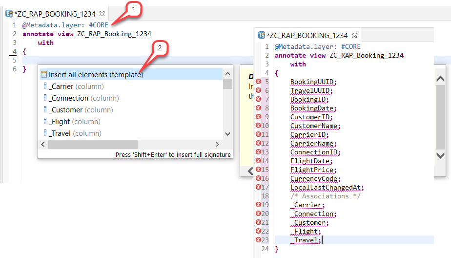

6.	In the Booking BO projection view, the elements **`CustomerName`** and **`CarrierName`** are specified as the textual description for the elements **`CustomerID`** and **`CarrierID`** respectively, and the element **`CurrencyCode`** is specified as the reference field for the element **`FlightPrice`**. These elements will be automatically displayed on the UI without required explicit UI annotations.  

    Therefore, remove the elements **`CustomerName`**, **`CarrierName`**, and **`CurrencyCode`**, and also all associations, i.e.  **`_Carrier`**,  **`_Connection`**,  **`_Customer`**,  **`_Flight`** and **`_Travel`** from the element list.  

 
    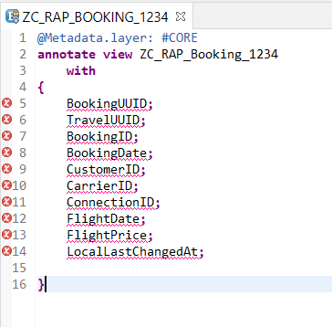

7.	Now, you can specify the UI annotations for the remaining elements.  
    For that, replace the code in the editor with the code snippet provided below and replace all occurrences of  `####` with your chosen suffix. 
    
    You can make use of the _Replace All_ feature (**Ctrl+F**) in ADT for the purpose and also of the _Source Code Formatter_ (**SHIFT+F1**) to format the source code.  

    <pre>
    @Metadata.layer: #CORE
    @UI: {
      headerInfo: { typeName: 'Booking',
                    typeNamePlural: 'Bookings',
                    title: { type: #STANDARD, value: 'BookingID' } } }

    annotate view ZC_RAP_Booking_####
        with 
    {
      @UI.facet: [ { id:            'Booking',
                     purpose:       #STANDARD,
                     type:          #IDENTIFICATION_REFERENCE,
                     label:         'Booking',
                     position:      10 }  ]

      @UI: { identification: [ { position: 10, label: 'Booking UUID'  } ] }
      BookingUUID;

      @UI.hidden: true
      TravelUUID;

      @UI: { lineItem:       [ { position: 20 } ],
             identification: [ { position: 20 } ] }
      BookingID;

      @UI: { lineItem:       [ { position: 30 } ],
             identification: [ { position: 30 } ] }
      BookingDate;

      @UI: { lineItem:       [ { position: 40 } ],
             identification: [ { position: 40 } ] }
      CustomerID;

      @UI: { lineItem:       [ { position: 50 } ],
             identification: [ { position: 50 } ] }
      CarrierID;

      @UI: { lineItem:       [ { position: 60 } ],
             identification: [ { position: 60 } ] }
      ConnectionID;

      @UI: { lineItem:       [ { position: 70 } ],
             identification: [ { position: 70 } ] }
      FlightDate;

      @UI: { lineItem:       [ { position: 80 } ],
             identification: [ { position: 80 } ] }
      FlightPrice;

      @UI.hidden: true
      LocalLastChangedAt;
    }
    </pre>
 
    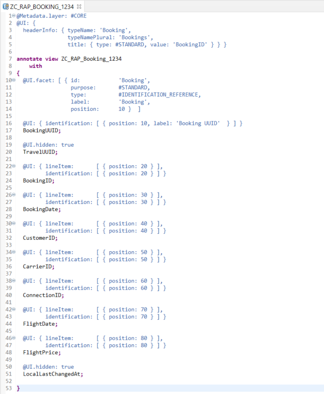

**Short Explanation: What has changed?**  
-	**`#CORE`** is specified as the metadata layer since you are the application provider.  
-	The header information (type name and Title) for the booking list is defined at the top before the **`ANNOTATE VIEW`** statement.
-	The navigation to the booking object page and its layout is defined using **`@UI.facet`** annotations in the curly brackets.
-	Various **`@UI`** annotations are used to specify the layout of each elements on the travel list and the object page.

8.	Save  and activate  the changes.  

## Summary
You have completed the exercise!  
In this unit, you have learned how to create and use CDS metadata extensions to enrich a CDS data model with UI-specific annotations.

## Solution
Find the source code for the created CDS metadata extensions in the **[/week2/sources](/week2/sources)** folder:
- [W2U5_DDLX_ZC_RAP_TRAVEL_####](/week2/sources/W2U5_DDLX_ZC_RAP_TRAVEL.txt) 
- [W2U5_DDLX_ZC_RAP_BOOKING_####](/week2/sources/W2U5_DDLX_ZC_RAP_BOOKING.txt)
   
Do not forget to replace all the occurrences of `####` with your chosen suffix in the copied source code.

## Next exercise
[Week 2 Unit 6: Creating and Previewing the OData UI Service](unit6.md)
