# HANDS-ON EXERCISE FOR WEEK 2 UNIT 6: DEVELOPING AND PREVIEWING THE BUSINESS SERVICE

## Previous exercise
[Week 2 Unit 5: Enriching the Projected Data Model with UI Metadata](unit5.md)

## Introduction
In the present  exercise, you will expose your projected CDS data model as OData service using business services – i.e. service definition and service binding.  
    
You can watch [week 6 unit 6: Creating and Previewing the OData UI Service](https://open.sap.com/courses/cp13/items/1Q2sDNNIMgTA0IEDL6RUT3) on the openSAP platform.

> **Hints and Tips**    
> Speed up the typing by making use of the Code Completion feature (shortcut *Ctrl+Space*) and the prepared code snippets provided. 
> You can easily open an object with the shortcut *Ctrl+Shift+A*, format your source code using the Pretty Printer feature *Shift+F1* and toggle the fullscreen of the editor using the shortcut *Ctrl+M*.   
>
> A great overview of ADT shortcuts can be found here: [Useful ADT Shortcuts](https://blogs.sap.com/2013/11/21/useful-keyboard-shortcuts-for-abap-in-eclipse/)
>
> Please note that the placeholder **`####`** used in object names in the exercise description must be replaced with the suffix of your choice during the exercises. The suffix can contain a maximum of 4 characters (numbers and letters).
> The screenshots in this document have been taken with the suffix `1234` and system `D20`. Your system id will be `TRL`.

> Please note that the ADT dialogs and views may change in the future due to software updates.

Follow the instructions below.

## Step 1. Create the Service Definition
First, create the service definition **`ZUI_RAP_Travel_####`** (where `####` is your chosen suffix) to specify the service scope, i.e. the relevant entity sets to be exposed in the service.

1.	In the Project Explorer, right-click on the Travel BO projection view **`ZC_RAP_TRAVEL_####`** and select **New Service Definition** from the context menu.

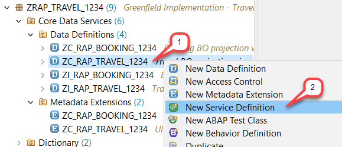

2.	Maintain **`ZUI_RAP_Travel_####`** as name and a meaningful description (e.g. _**`Serv Definition for Travel App`**_) in the creation wizard and choose **Next >** to continue.     
    Package and Project have been assigned automatically.  

 
    

3.	Assign a transport request and choose **Next >**. 
 
    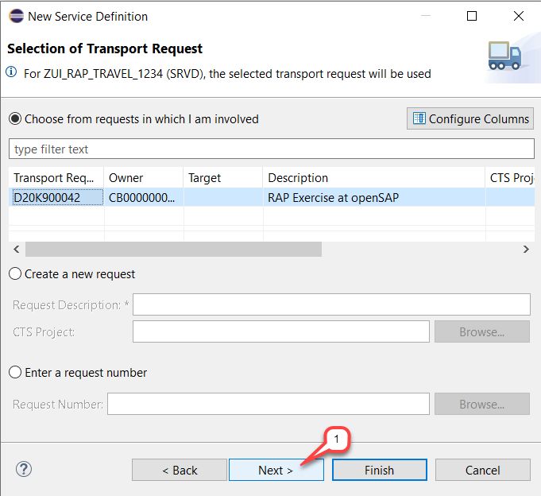

4.	Select the template **`Define Service`**  and choose **Finish**. 

    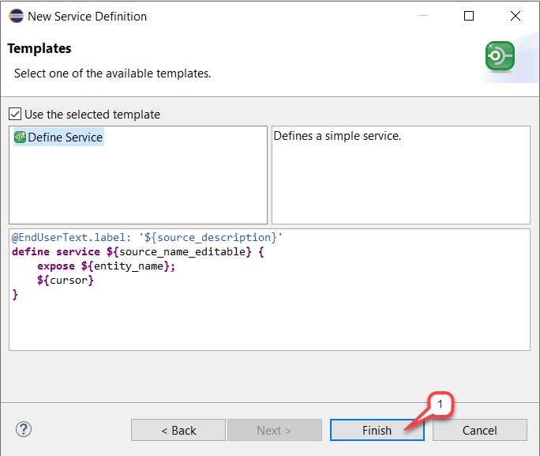

    The new service definition now appears in the editor.   
    A dummy entity is exposed between the curly brackets using the keyword **`expose`**.
 
    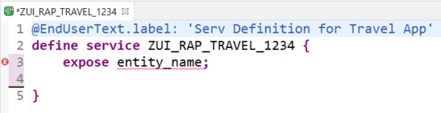

5.	Now, define the service scope by specifying the CDS view names of the relevant BO entities and associations – e.g. Travel and Booking entities and value help providers for the Agency, Customer, Flight, Carrier entities and the Currency code – and specify a local alias for each of them using the keyword **`as`**. Aliases are optional but ease the service consumption.   
  
    For that, replace the code in the editor with the code snippet provided below. 
    Do not forget to replace all the occurrences of `####` with your chosen suffix. You can make use of the Replace All feature (**Ctrl+F**) in ADT for the purpose.

    <pre>
    @EndUserText.label: 'Serv Definition for Travel App'
    define service ZUI_RAP_TRAVEL_#### {
      expose ZC_RAP_Travel_#### as Travel;
      expose ZC_RAP_Booking_#### as Booking;
      expose /DMO/I_Agency as Agency;
      expose /DMO/I_Customer as Customer;
      expose /DMO/I_Flight as Flight;
      expose /DMO/I_Carrier as Carrier;
      expose /DMO/I_Connection as Connection;
      expose /DMO/I_Airport as Airport;
      expose I_Currency as Currency;
      expose I_Country as country;
    }
    </pre>
    
    The service definition will now look as follows:  

    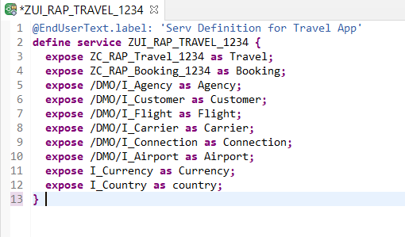

6.	Save  and activate  the service definition.

    
## Step 2. Create the Service Binding
Now, create the service binding **`ZUI_RAP_TRAVEL_O2_####`** (where `####` is your chosen suffix)  to bind your service definition to the OData protocol.  

1.	Right-click on the just created service definition **`ZUI_RAP_TRAVEL_####`** in the project Explorer and choose **New Service Binding** from the context menu.   
        
    The project, the package and the service definition are automatically assigned in the creation wizard.

    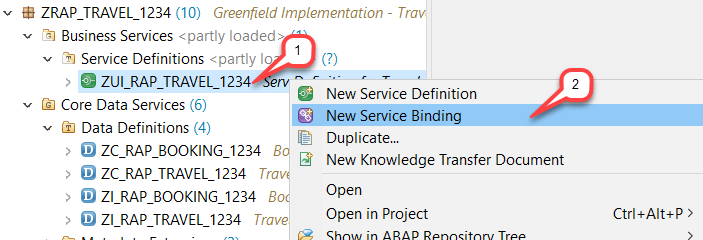

2.	Maintain **`ZUI_RAP_TRAVEL_O2_####`**  as name and a meaningful description (e.g. _`OData V2 UI service for SAP Fiori Travel App`_).     Select **`OData V2 - UI`** as Binding Type and choose **Next >** to continue.  
     
    >Note: At the creation time of this document, only OData V2 was supported. However, OData V4 is planned in the near future.
    >For more information, check out the [ABAP platform road map](https://roadmaps.sap.com/board?range=CURRENT-LAST&PRODUCT=6EAE8B28C5D91EDA9FF40F3CC2DBE0E6&PRODUCT=73555000100800001164).  
    
    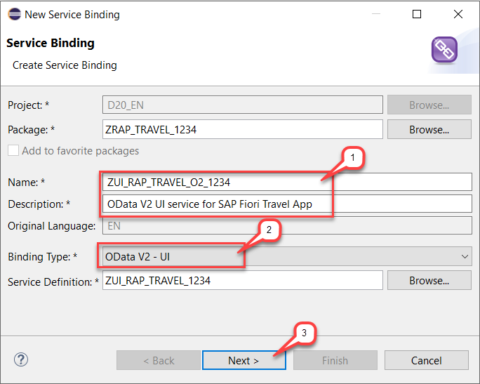
    
3.	Assign a transport request and choose **Finish**.  
     
    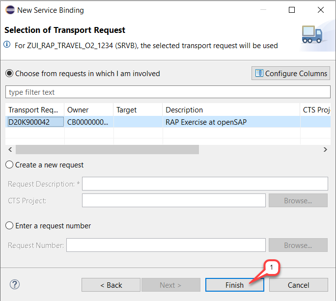

    The new service binding now appears in the appropriate editor.  
     
    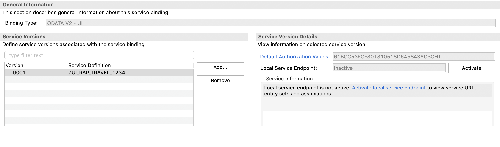

4. Save  and activate  the service binding.	

5. Click on **`Publish`** - or **`Activate`** depending on your ADT version - in the **Service Version Details** area to activate the Local Service Endpoint. This may take few seconds.
 
    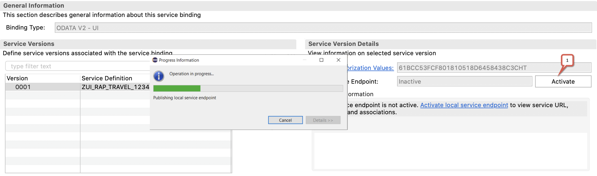

    
    The local service endpoint is now activated and ready for consumption through an OData client. The relative service URL and the exposed entity sets, and associations are now shown in the **Service Version Details** area on the right-hand side of the _Service Binding_ editor.   
        
    In the Project Explorer, you can see the artefacts that have been generated during the activation. Refresh (F5) your package if needed.  
    
    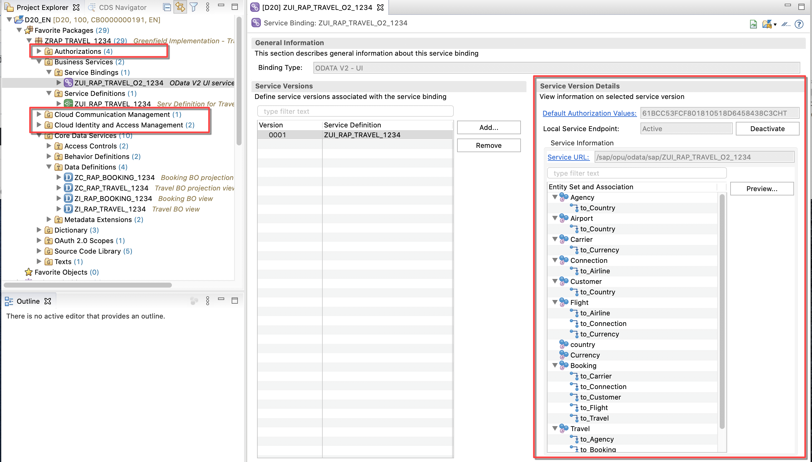
    
6.	Click on the Service URL link to have a quick look at the service metadata document in the browser.  
    Maintain your ABAP user credentials if required and choose **Log On**.  
    
    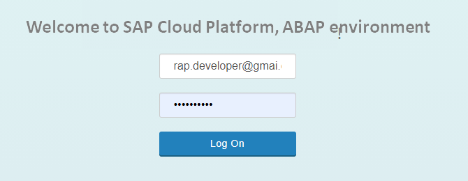

    The service document will open in the browser.  
         
    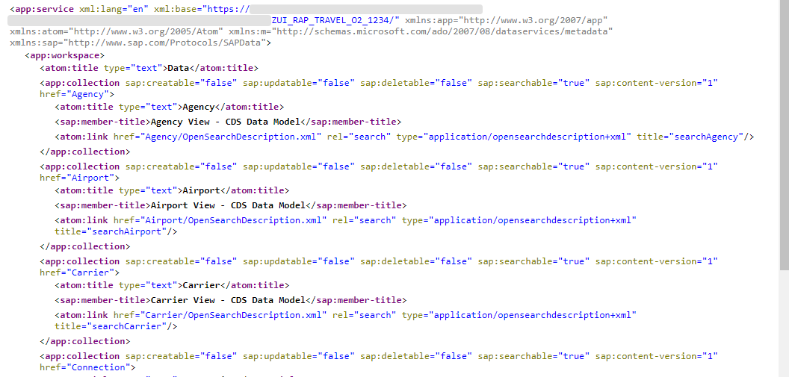
    
## Step 3. Preview the Travel App and Play Around

1. Go back to your service binding in the _Service Binding_ editor, choose the **`Travel`** node in _**Entity Set and Association**_ area and either right-click on it and choose _**Open Fiori elements App preview**_ from the context menu or simply double-click on it – or choose the **Preview** button.  
     
    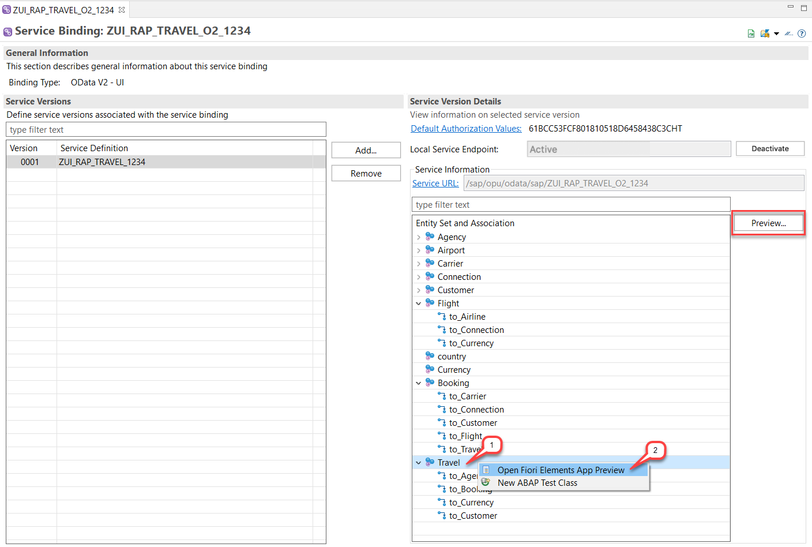

    Your SAP Fiori elements-based Travel List Report app will open in the browser. Provide your ABAP user credentials if required.  
    Press the **Go** button on the app to load the back-end data.   
       
     

2. You can now explore your Travel App.  
    For example,  
    - Perform a full text search (e.g. for **`Pan`**)
    - Filter bar: Filter the entries by an **`AgencyID`** using the defined value help.  
      Do not forget to clear the filter at the end. 
    - Navigate to the details object page of a travel record in the travel table list.
    - Check out the travel details object page with its two facets _Travel_ and _Booking_, and navigate to the booking details object page and explore it.

## Summary
You have completed the exercise!  
In this unit, you have learned 
-	How to create an OData service using service definitions and service binding 
-	How to preview your app in ABAP Development Tools

## Solution
Find the source code for the created service definition in the **[sources](/week2/sources)** folder:
-	[W2U6_SRVD_ZUI_RAP_TRAVEL_####](/week2/sources/W2U6_SRVD_ZUI_RAP_TRAVEL.txt)
    
Do not forget to replace all the occurrences of ‘####’ with your chosen suffix in the copied source code.
  
## Next exercise
[Week 2 Unit 7: Implementing Basic Authorizations](unit7.md)

