# HANDS-ON EXERCISE FOR WEEK 2 UNIT 7: IMPLEMENTING BASIC AUTHORIZATIONS

## Previous exercise
[Week 2 Unit 6: Creating and Previewing the OData UI Service](unit6.md)

## Introduction
In the present hands-on exercise, you will define the access control for the travel entity.
The access rules will consist of a literal condition for the view element **`CurrencyCode`** and a PFCG condition for the view element **`TravelStatus`**.
For the definition of the PFCG condition, you will create an authorization object – including authorization field and data element – from scratch.
    
You can watch [week 2 unit 7: Implementing Basic Authorizations](https://open.sap.com/courses/cp13/items/5IWJZmq5x3YxFYP6ZwOtrz) on the openSAP platform.

     
> **Hints and Tips**    
> Speed up the typing by making use of the Code Completion feature (shortcut *Ctrl+Space*) and the prepared code snippets provided. 
> You can easily open an object with the shortcut *Ctrl+Shift+A*, format your source code using the Pretty Printer feature *Shift+F1* and toggle the fullscreen of the editor using the shortcut *Ctrl+M*.   
>
> A great overview of ADT shortcuts can be found here: [Useful ADT Shortcuts](https://blogs.sap.com/2013/11/21/useful-keyboard-shortcuts-for-abap-in-eclipse/)
>
> Please note that the placeholder **`####`** used in object names in the exercise description must be replaced with the suffix of your choice during the exercises. The suffix can contain a maximum of 4 characters (numbers and letters).
> The screenshots in this document have been taken with the suffix `1234` and system `D20`. Your system id will be `TRL`.

> Please note that the ADT dialogs and views may change in the future due to software updates.
    
## Step 1. Create the Data Element
Create the data element **`ZOSTAT####`** (where `####` is your chosen suffix) for the travel status.
1.	Right-click on the **Dictionary** folder in the Project Explorer and choose **`New > Data Element`** from the context menu 
 
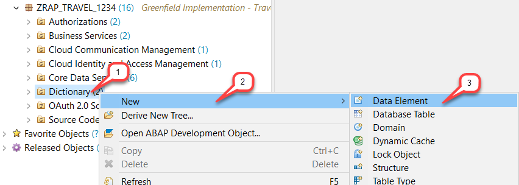

2.	Maintain **`ZOSTAT####`** as name and a meaningful description (e.g. _**`Travel Status`**_) in the creation wizard and choose **Next >** to continue.  
    Package and Project have been assigned automatically.        

    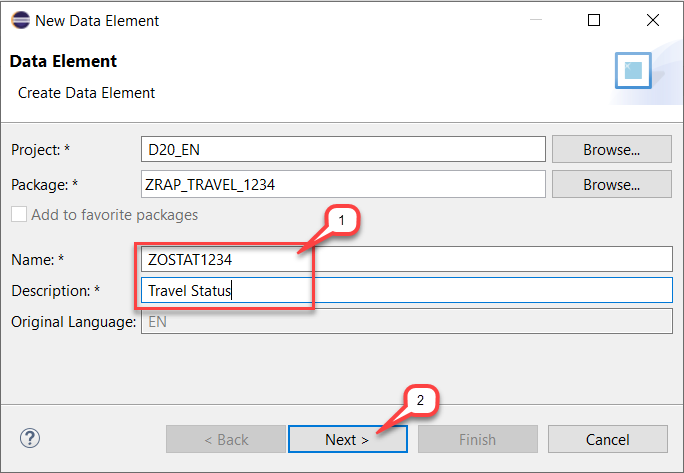
   
3.	Assign a transport request and choose **Finish**.  
 
    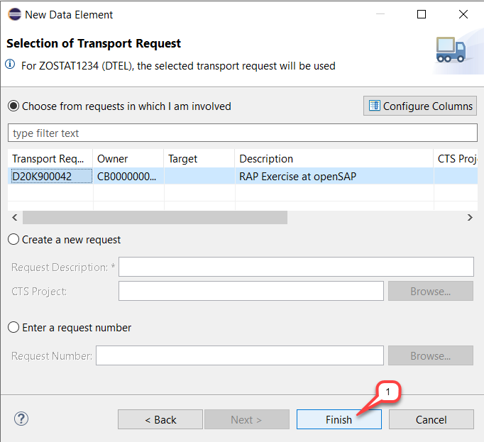

    The new data element will now appear in the appropriate editor.
    Make sure that **`Domain`** is selected in the _Category_ field.
 
    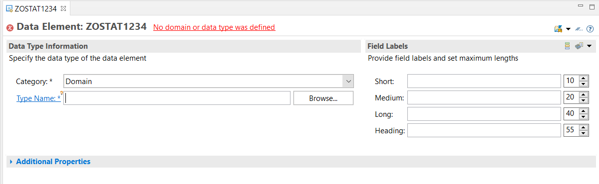

4.	Maintain **`/DMO/OVERALL_STATUS`** as _Type name_.   
    Maintain the Fields Labels: **`Status`** for the short label and **`Travel Status`** for the medium, long and heading labels.  
    The maintenance of dditional properties is not needed for the current scenario.  
        
    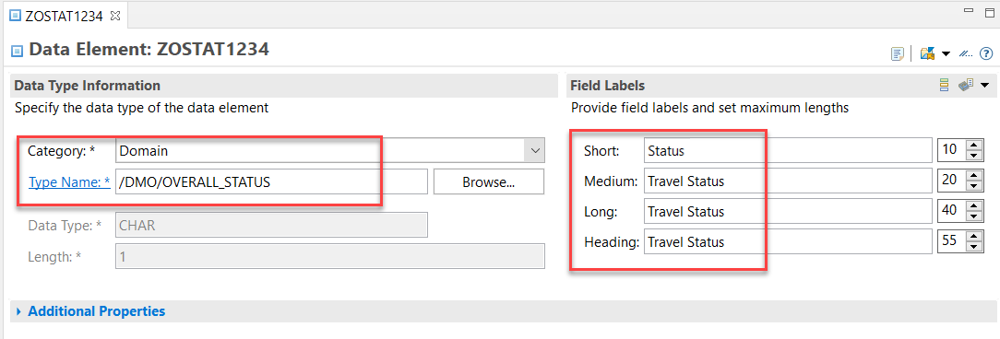
         

5.	Save  and activate  the new data element.  
    
## Step 2. Create the Authorization Field 
Now create the authorization field **`ZOSTAT####`** (where `####` is your chosen suffix) for the travel status.  
1.	Right-click on your package in the Project Explorer and select **`New > Other ABAP Repository Objects`** from the context menu.
 
    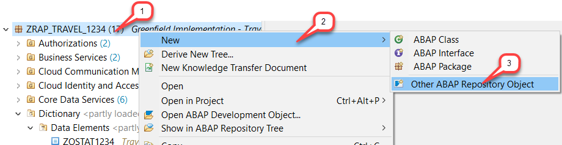

2.	Filter the entries in the appearing dialog by entering `Authorization`, choose **`Authorization Field`** from the list and choose **Next >** to continue.

    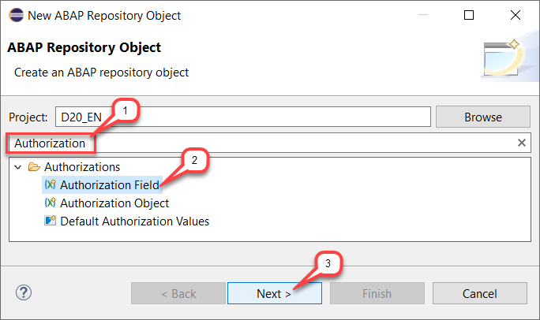

3.	Maintain **`ZOSTAT####`** as **name** in the creation wizard and choose **Next >**.  
    Package and Project have been assigned automatically.  

    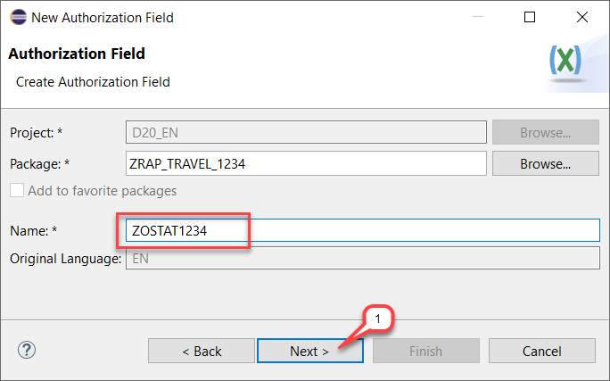
    
4.	Assign a transport request and choose **Finish**.  
 
    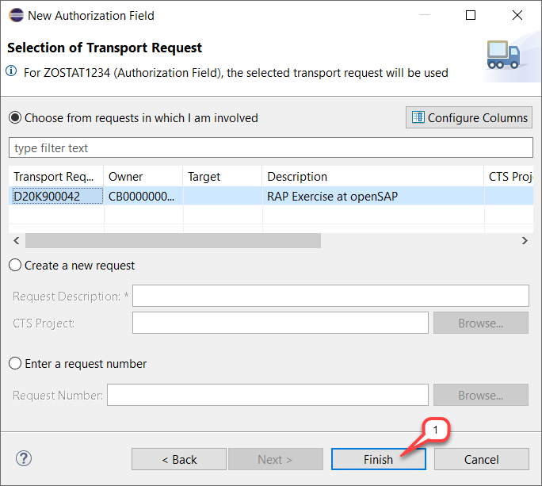

    The new authorization field appears in the appropriate editor. 

    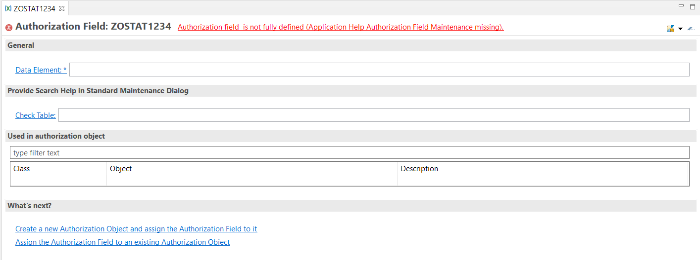

5.	Maintain the name of the previously created data element **`ZOSTAT####`** in the Data Element field and save  the new authorization field. It will be automatically activated.  
    You’re through with the creation of the authorization field.  
      
    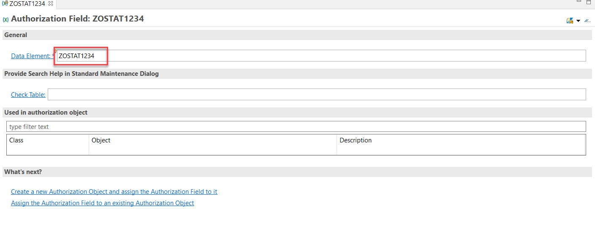
    
    Keep the Authorization object open and go to the next step to create the authorization object.  

## Step 3. Create the Authorization Object 
You will now create the authorization object **`ZOSTAT####`** (where `####` is your chosen suffix) for the field travel status.  
    
1.	Open the authorization field **`ZOSTAT####`** and click on the link **`Create a new Authorization object and Assign the authorization field to it`** in the _**What Next?**_ section.  
     
>To start the creation wizard, you can also right-click on the authorization field **`ZOSTAT####`** and choose **`New Authorization Object`** from the context menu.  
    
   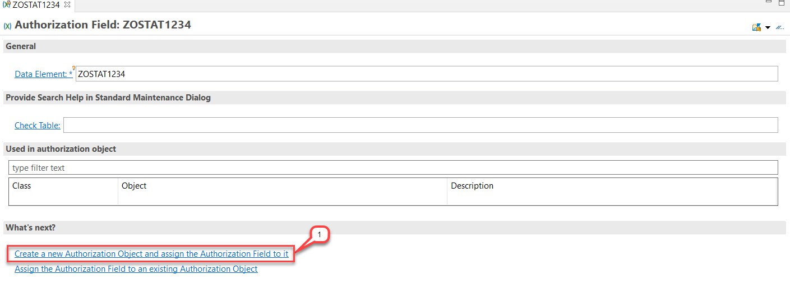

2.	Maintain **`ZOSTAT####`** as name and a meaningful description (e.g. _**Authorization object for Travel Status**_) in the creation wizard and choose **Next >** to continue.  
    
    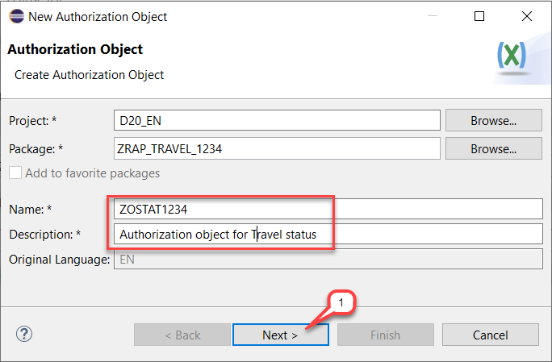
    
    
3.	Assign a transport request and choose **Finish**.   
    
    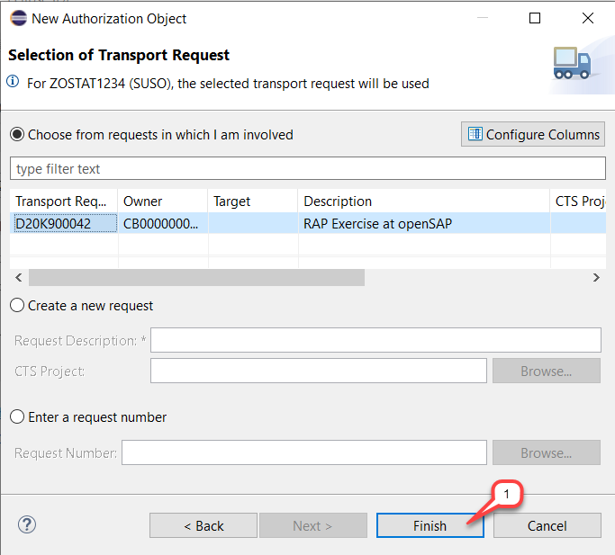
    
    The new authorization object appears in the appropriate editor.  
    The previously created authorization field **`ZOSTAT####`** and the default activity field **`ACTVT`** are both listed in the _**Authorization Fields**_ area.  
    
    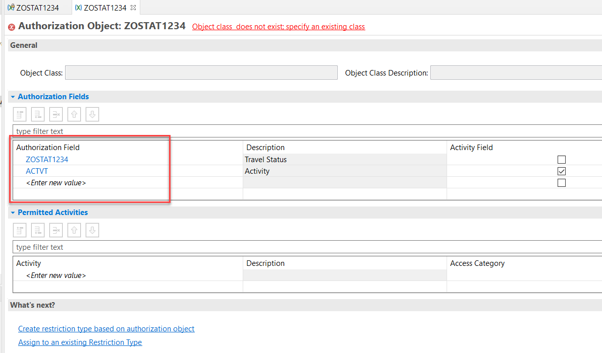
    
4.	Maintain the permitted activities in the _**Permitted Activities**_ area in the editor.  
    Double click **Enter new Value** and enter the four permitted activities below as shown on the screenshot. 
    - **`01`** (Add or Create)
    - **`02`** (Change)
    - **`03`** (Display) 
    - **`06`** (Delete)   
    
5.  Save  the changes to activate the authorization object.   
    The Object Class will be maintained automatically.   
    
    You’re now through with the creation of the authorization object.  
    
    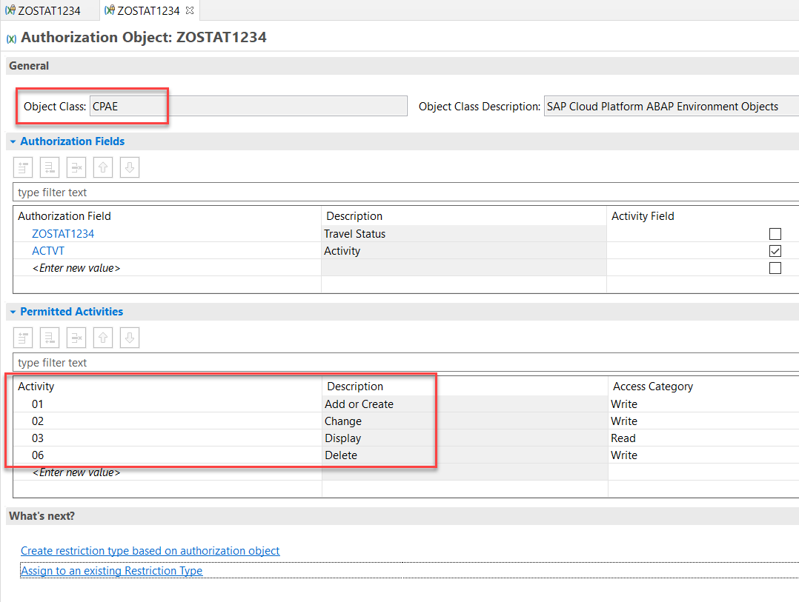
    
## Step 4. Create CDS Access Control for Travel BO View and Check the Result
You will now define the CDS access control (aka CDS role) **`ZI_RAP_Travel_####`** (where `####` is your chosen suffix) for the Travel BO view. The access rules will consist of a literal condition for the view element **`CurrencyCode`** and a PFCG condition for the view element **`TravelStatus`**.    
    
1.	Right-click on your Travel BO View **`ZI_RAP_Travel_####`** in the Project Explorer and choose **New Access Control** from the context menu.  

    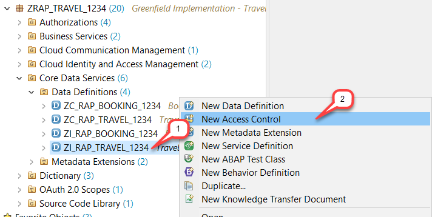

2.	Maintain **`ZI_RAP_Travel_####`** as name and a meaningful description (e.g. _**`Access control for ZI_RAP_Travel_####`**_) and choose **Next** to continue.  
    
    The Project, the package and the Protected Entity are automatically assigned in the creation wizard.  
    
    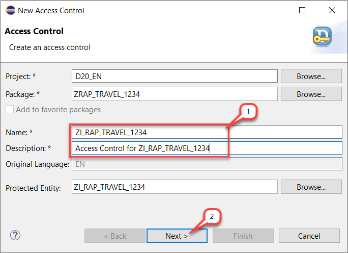  
    
3.	Assign a transport request and choose **Next** to continue.  
    
    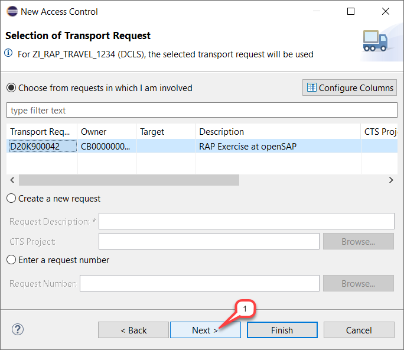
    
4.	Select the template **`Define Role with Simple Conditions`** from the list and choose **Finish**.   
Various Access Control templates are provided for your convenience.  
   
    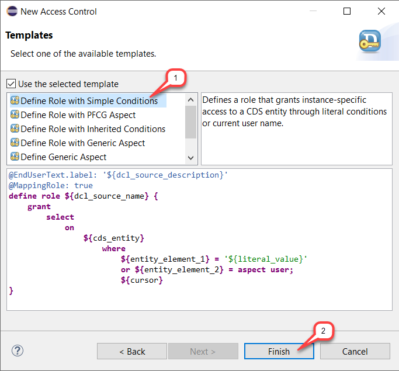
    
    The created CDS Access Control appears in the appropriate editor.   
    You can make use of the Source Code Formatter (**Shift+F1**) to format the code.  

    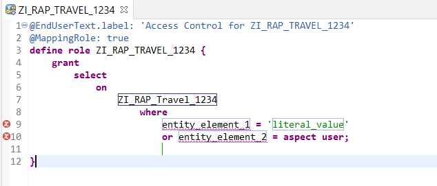

    **Short explanation:**    
    The annotation **`@MappingRole:true`** is defined at the top to assign the CDS role to every user regardless of the client.    
    The name of the CDS role is specified after the **`DEFINE ROLE`** statement, the name of  protected CDS entity is specified after the **`GRANT SELECT ON`** statement and a dummy access rule is defined in the **`WHERE`** clause consisting of a dummy literal condition and a user condition.   
    
5.	Replace the dummy conditions in the **`WHERE`** clause with a literal condition on the element **`CurrencyCode`** only allowing the records with the currency code Euro to be retrieved.  
    Use the code snippet provided below as shown on the screenshot for the purpose.   
    
    <pre>
     CurrencyCode = 'EUR';
    </pre>
    
    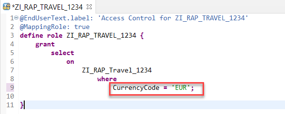 
    
6.	Save  and activate   the access control.  
       
7.	To check the result, start the Data Preview for the Travel BO view.  
    For that, choose the CDS view **`ZI_RAP_TRAVEL_####`** in the Project Explorer and press **`F8`** or choose **`Open with > Data Preview`** from the context menu (right-click) to display the data.  

    Now only records with the currency key `EUR` (_EURO_) have been retrieved from the database.   

    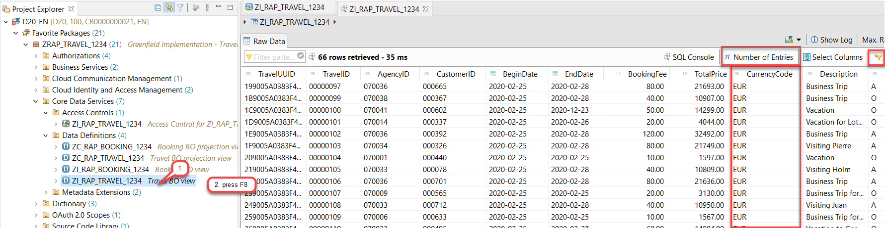

    You can compare this result with the data preview of the underlying database table **`ZRAP_ATRAV_####`** that also comprises other currencies (e.g. _USD_, _JPY_).   
    
   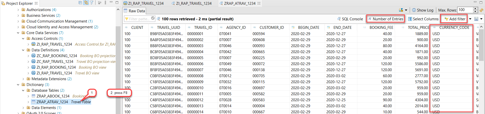
    
8.	Now go back to the CDS access control **`ZI_RAP_TRAVEL_####`** and enhance the access rule with a PFCG condition on the **`TravelStatus`** element. Only the authorized data according to the authorization object **`ZOSTAT####`** should be retrieved and displayed for each user.  
    
    For that, replace the condition in the WHERE clause with the code snippet provided below as shown on the screenshot.  
    Do not forget to replace all the occurrences of **`####`** with your chosen suffix.  
    
    <pre>
      ( TravelStatus )                       
                          = aspect pfcg_auth ( ZOSTAT####, ZOSTAT####,  actvt = '03') 
                            and
                            CurrencyCode = 'EUR'; 
    </pre>
     
    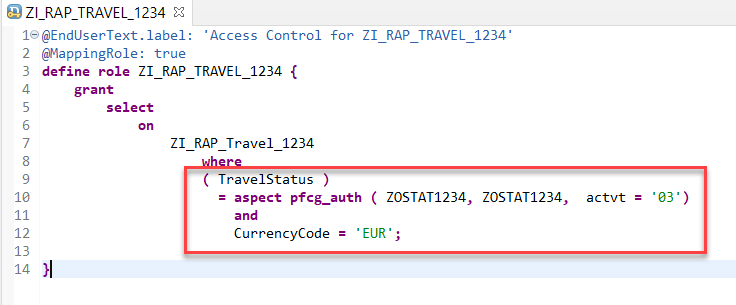
    
9.	Save  and activate  the changes.
    
10.	Now check again the result by starting the _Data Preview_ for the Travel BO view **`ZI_RAP_TRAVEL_####`**.  
    
    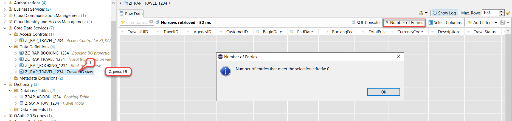
    
    No data is retrieved this time around!   
    The reason being that your user does not yet have the required authorization granted.   
    We will not handle the creation of Authorization Models in this course.   
    
11.	Start again the Travel App preview in the service binding or simply refresh it (**`F5`**) in the browser, and press go to retrieve the data.  
    
    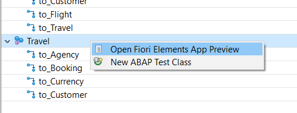
    
    
    
    The data is still retrieved.  
    The reason behind this is that you have not yet defined access rules for the Travel BO projection view **`ZC_RAP_TRAVEL_####`** that is used for in the service definition.   
    You can also run the Data preview for the CDS view **`ZC_RAP_TRAVEL_####`** and see that the data is still retrieved.  
    
    >A CDS access control (aka CDS role) must be explicitly defined for each CDS entity.  There is no implicit inheritance of access rules.  
    
## Step 5. Create CDS Access Control for Travel BO Projection View and Check the Result
You will now define the CDS access control **`ZC_RAP_Travel_####`** (where `####` is your chosen suffix) for the Travel BO projection view by inheriting the access rules defined in the underlying Travel BO view.  
    
1.	Right-click on your Travel BO projection view **`ZC_RAP_Travel_####`** in the Project Explorer and choose **`New Access Control`** from the context menu.

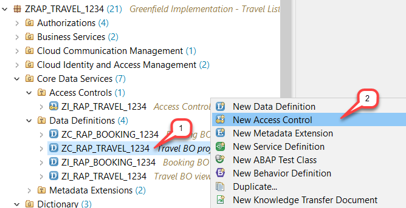

2.	Maintain **`ZC_RAP_Travel_####`** as name and a meaningful description (e.g. **`Access control for ZC_RAP_Travel_####`**) and Choose **Next** to continue.  
    
The Project, the Package and the Protected Entity fields are automatically assigned in the creation wizard.  
    
   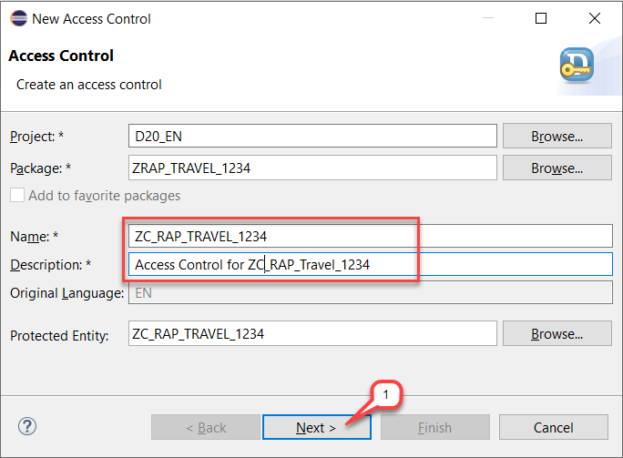
    
3.	Assign a transport request and choose **Next** to continue.  
    
    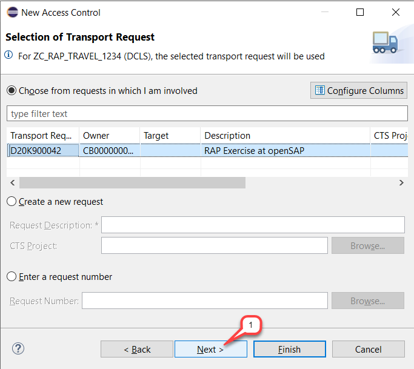
    
4.	Select the template **`Define Role with inherited Conditions`** from the list and choose **Finish**.    
    
    
    
    The created CDS access control appears in the appropriate editor.  
    
    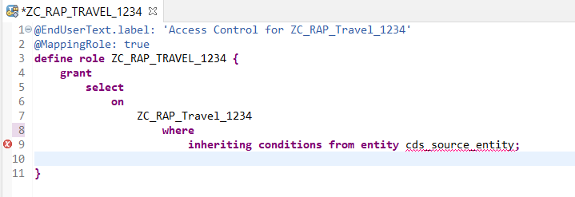
    
    **Short explanation:**
    The annotation **`@MappingRole:true`** is defined at the top to assign the CDS role to every user regardless of the client. 
    The name of the CDS role is specified after the **`DEFINE ROLE`** statement, the name of  protected CDS entity is specified after the **`GRANT SELECT ON`** statement and the **`inheriting conditions from entity`** statement with a dummy CDS entity name is defined in the **`WHERE`** clause. 

5.	Replace the dummy CDS entity name `cds_source_name` in the **`inheriting conditions from entity`** statement with the name of the Travel BO view **`ZI_RAP_TRAVEL_####`** where `####` is your chosen suffix.   
    
    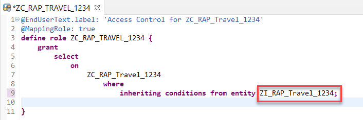
    
6.	Save  and activate  the changes.   

7.	Now you can again check the _Data Preview_ of the Travel BO projection view **`ZC_RAP_TRAVEL_####`** in ADT and in the Travel App preview in the browser.  
    
    No data should be retrieved this time around.  
    You’re through with the creation of the access control for the Travel BO projection view.  
    
    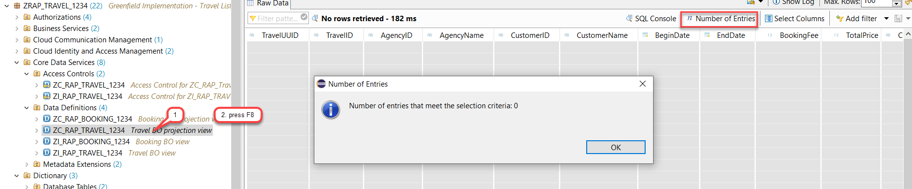
    
    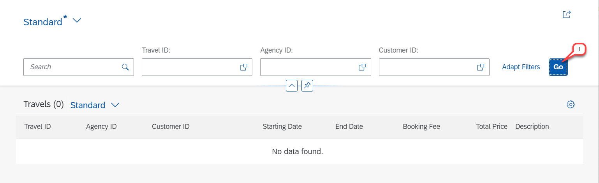
    
    
## Step 6. Work-around: Adjust the CDS Access Rules
As already mentioned, we will not handle the creation of Authorization Models in this course to grant user the required authorizations. Therefore, to recover the full access to your data without requiring such steps, you will just adjust the present access conditions.  

1.	Go to the CDS access control for the Travel BO view **`ZI_RAP_Travel_####`** (where `####` is your chosen suffix), comment out the current access conditions defined in the **`WHERE`** clause, and add the Boolean **`true;`** instead as shown in the screenshot below.  
    
    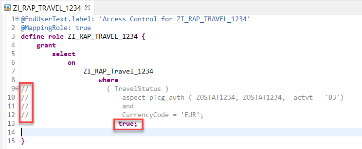
    
2.	Save  and activate  the changes.  
    
3.	You can now run the Data Preview for the Travel BO view **`ZI_RAP_Travel_####`** in ADT and test the Travel App in the browser.  
    
    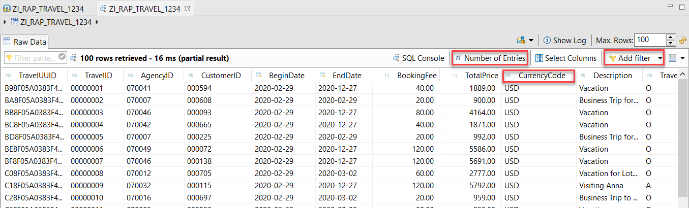
    
4.	Now, you can again check the Data Preview of the Travel BO projection view **`ZC_RAP_TRAVEL_####`** in ADT and in the Travel App preview in the browser.  
    
    There is no need to make a change in the access control on the BO projection layer, because the changes in the underlying BO view layer will be inherited.  
    
    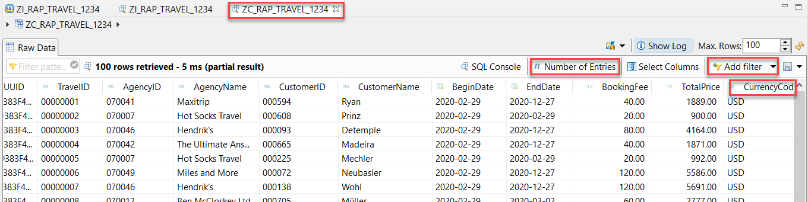
    
    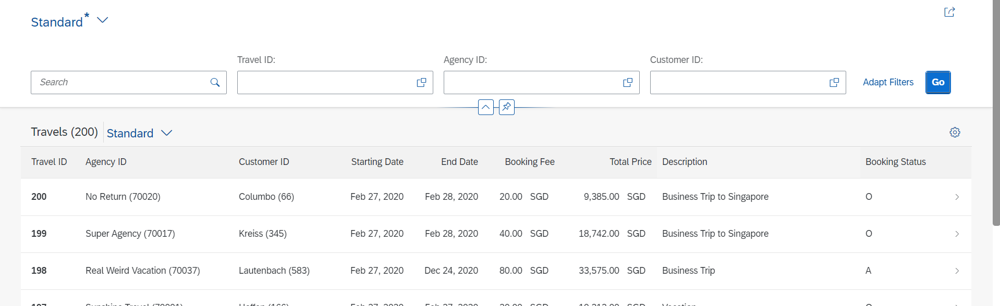
    
## Summary
You have completed the exercise!   
In this unit, you have learned how to create CDS roles to control the access to data at the CDS data model level and implement the inheritance access conditions at the CDS data model projection level.  
    

## Solution
Find the source code for the created CDS access controls in the **[/week2/sources](/week2/sources)** folder:
-	[W2U7_DCLS_ZI_RAP_TRAVEL_####](/week2/sources/W2U7_DCLS_ZI_RAP_TRAVEL.txt) 
-	[W2U7_DCLS_ZC_RAP_TRAVEL_####](/week2/sources/W2U7_DCLS_ZC_RAP_TRAVEL.txt)
-	[W2U7_DCLS_ZI_RAP_TRAVEL_####_Adjusted](/week2/sources/W2U7_DCLS_ZI_RAP_TRAVEL_Adjusted.txt)  
      
Do not forget to replace all the occurrences of `####` with your chosen suffix in the copied source code.  
   
## Next exercise
[WEEK 3: Enabling The Transactional Behavior of an App](/week3/README.md)

