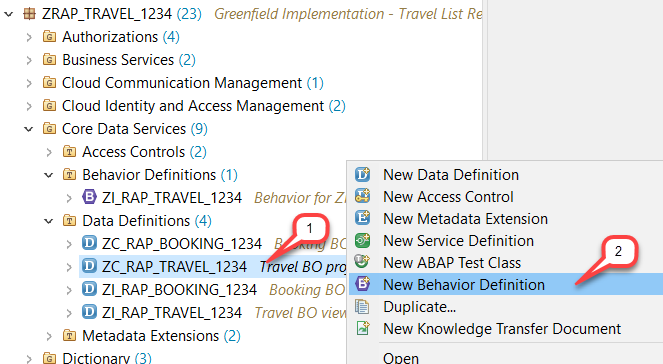
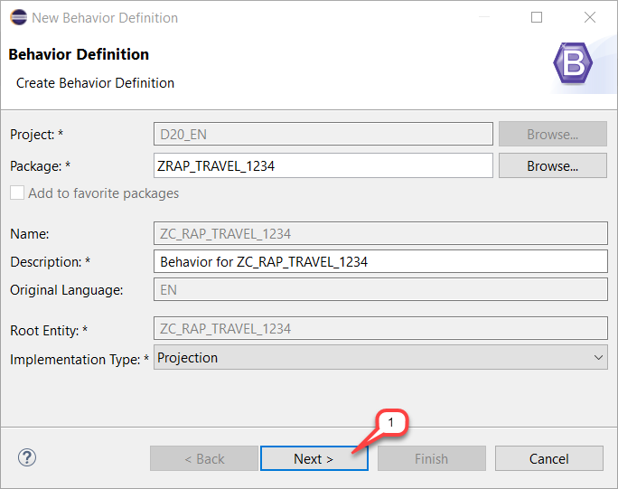
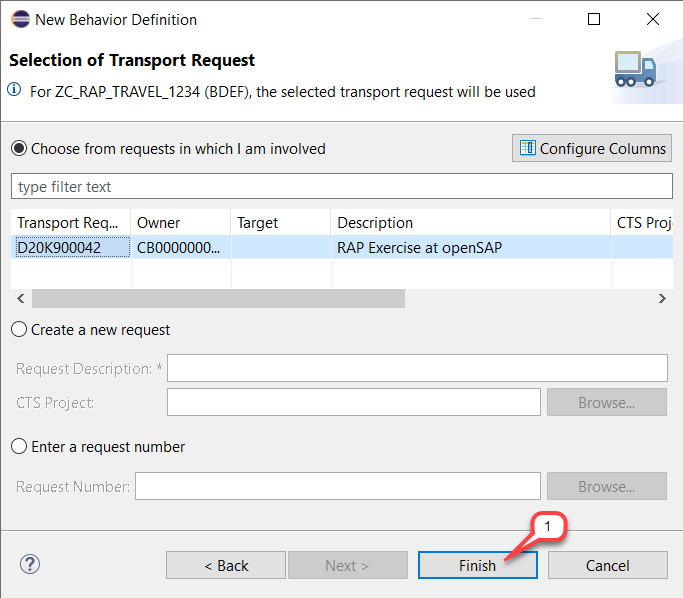
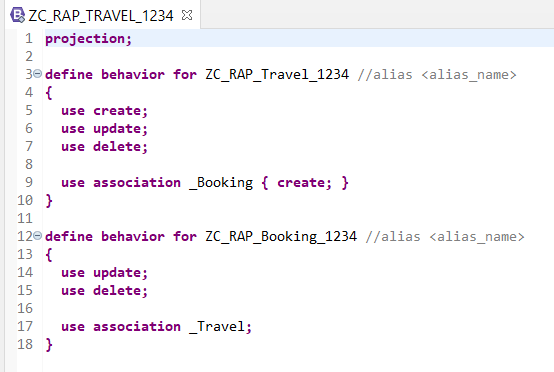
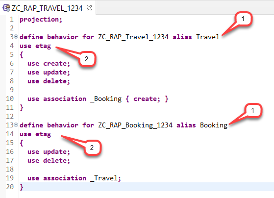

# HANDS-ON EXERCISE FOR WEEK 3 UNIT 3: CREATING THE BUSINESS OBJECT BEHAVIOR PROJECTION

## Previous exercise:
[Week 3 Unit 2: Defining the Basic Business Object Behavior](/week3/unit2.md)

## Introduction
In the present hands-on exercise, you will project the transactional capabilities that we want to enable in our app by creating the business object behavior projection and test your enhanced Travel app.    
    
You can watch [week 3 unit 3: Creating the Business Object Behavior Projection]( https://open.sap.com/courses/cp13/items/4hWlPsbmcZsAntT9dUMoAN ) on the openSAP platform.
    
> **Hints and Tips**    
> Speed up the typing by making use of the Code Completion feature (shortcut *Ctrl+Space*) and the prepared code snippets provided. 
> You can easily open an object with the shortcut *Ctrl+Shift+A*, format your source code using the Pretty Printer feature *Shift+F1* and toggle the fullscreen of the editor using the shortcut *Ctrl+M*.   
>
> A great overview of ADT shortcuts can be found here: [Useful ADT Shortcuts](https://blogs.sap.com/2013/11/21/useful-keyboard-shortcuts-for-abap-in-eclipse/)
>
> Please note that the placeholder **`####`** used in object names in the exercise description must be replaced with the suffix of your choice during the exercises. The suffix can contain a maximum of 4 characters (numbers and letters).
> The screenshots in this document have been taken with the suffix `1234` and system `D20`. Your system id will be `TRL`.

> Please note that the ADT dialogs and views may change in the future due to software updates.

Follow the instructions below.

## Step 1. Create the BO Behavior Projection
Now you will create the behavior projection **`ZC_RAP_TRAVEL_####`** (where `####` is your chosen suffix) for the projected composition model.
1.	Right-click on the root CDS view  **`ZC_RAP_TRAVEL_####`** in the Project Explorer and choose **New Behavior Definition**.  
 
       
    
    
2.	The _New Behavior Definition_ wizard is shown.
The _Name_ of the behavior definition has to be the identical name as the root CDS view. That’s the reason why the name can’t be changed.  
Adjust the proposed _Description_ if you like, ensure that the _Implementation Type_ is set to **Projection** and choose **Next >** to continue.  
_Project_, _Package_ and _Root Entity_ have been assigned automatically.  
    
       
        
3.	Assign a transport request and choose **Finish**.  
 
       
    
    A skeleton for the new behavior projection for all entities – i.e. the _travel_ entity **`ZC_RAP_Travel_####`** and the _booking_ entity **`ZC_RAP_Booking_####`**  in the present scenario – is generated based on the chosen implementation and displayed in the appropriate editor.   
    
    
    
    
    **Short explanation:**  
    -	**`projection`** is specified at the top since the proper implementation type is specified in the underlying behavior definition.  
    -	All operations and associations defined in the underlying behavior definition at the creation time are automatically exposed in the projection using the keyword **`use`**.  
    
## Step 2. Adjust the BO Behavior Projection
Now, you will adjust the behavior projection.  

1.	First, define an alias for the travel and the booking entity in the **`define behavior for`** statement. Use the commented statement **`alias <alias_name>`** for that.  
    For the _travel_ entity:  
    <pre>alias Travel</pre>
    
    For the _booking_ entity:  
    <pre>alias Booking</pre>
    
2.	Enable the optimistic lock – i.e. the ETag handling – for both entities.  
    For that, add the statement below after **`define behavior for`** statement line.  
    <pre>use etag</pre>

3.	**Recap of the adjustments**     
Your behavior projection will look as follows.  
    
    

    Below is the corresponding code snippet, where `####` to be replaced with your chosen suffix.  
    
    <pre>
    projection;
    
    define behavior for ZC_RAP_Travel_#### alias Travel
    use etag
    {
       use create;
       use update;
       use delete;

       use association _Booking { create; }
     }
    
    define behavior for ZC_RAP_Booking_#### alias Booking
    use etag
    {
      use update;
      use delete;
    
      use association _Travel;
    }
    </pre>

5.	Save  and activate  the behavior projection.  
     
## Step 3. Preview the Travel App & Play around 
1.	Start the Travel app in your service binding **`ZUI_RAP_TRAVEL_O2_####`** (where **`####`** is your chosen suffix) or refresh (`F5`) it in the browser. Provide your ABAP user credentials if requested.   
    In the trial environment it might take a while until your changes are reflected.           
        
    As a result, you can see that now, the create, update and delete operations are enabled.  
    Press **Go** on the UI to load the back-end data.   
      
    
    
    Object Page:   
    

2.	Feel free to play around with your application – e.g. create, delete or update/edit _travel_ and _booking_ entities.    
    The **Edit** button is always available on the relevant _Object Page_.
    
## Summary
You have completed the exercise!   
In this unit, you have learned how to create the behavior projection for our managed Travel business object, projecting the behavior for the travel and booking entities.   
    
    
## Solution
You can find the source code of the created CDS behavior projection in the **[sources](/week3/sources)** folder:  
-	[W3U3_BDEF_ZC_RAP_TRAVEL_####](/week3/sources/W3U3_BDEF_ZC_RAP_TRAVEL.txt)    
    
Do not forget to replace all the occurrences of `####` with your chosen suffix in the copied source code.
 
## Next exercise
[Week 3 Unit 4: Understanding Entity Manipulation Language (EML)](unit4.md)
