# HANDS-ON EXERCISE FOR WEEK 3 UNIT 5: ENHANCING THE BUSINESS OBJECT BEHAVIOR WITH APP-SPECIFIC LOGIC 

## Previous exercise:
[Week 3 Unit 4: Understanding Entity Manipulation Language (EML)](/week3/unit4.md)

## Introduction
In the present hands-on exercise, you will enhance the standard transactional behavior of your managed business object by defining determinations, validations and actions. You will also add static and dynamic feature control.      
    
You can watch [week 3 unit 5: Enhancing the Business Object Behavior with App-Specific Logic]( https://open.sap.com/courses/cp13/items/VYhR05X0QyfN5a9adXDAT) on the openSAP platform.
    
> **Hints and Tips**    
> Speed up the typing by making use of the Code Completion feature (shortcut *Ctrl+Space*) and the prepared code snippets provided. 
> You can easily open an object with the shortcut *Ctrl+Shift+A*, format your source code using the Pretty Printer feature *Shift+F1* and toggle the fullscreen of the editor using the shortcut *Ctrl+M*.   
>
> A great overview of ADT shortcuts can be found here: [Useful ADT Shortcuts](https://blogs.sap.com/2013/11/21/useful-keyboard-shortcuts-for-abap-in-eclipse/)
>
> Please note that the placeholder **`####`** used in object names in the exercise description must be replaced with the suffix of your choice during the exercises. The suffix can contain a maximum of 4 characters (numbers and letters).
> The screenshots in this document have been taken with the suffix `1234` and system `D20`. Your system id will be `TRL`.

> Please note that the ADT dialogs and views may change in the future due to software updates.

Follow the instructions below.

## Step 1. Enhance the behavior definition of the _Travel_ entity
Begin with enhancing the behavior definition of the _Travel_ entity.  
1.	Open the base behavior definition **`ZI_RAP_Travel_####`** - where **`####`** is your chosen suffix – of your business object by either double-clicking on it in the _Project Explorer_ or using the shortcut **Ctrl+Shift+A** (_Open ABAP Development Object_).  
        
    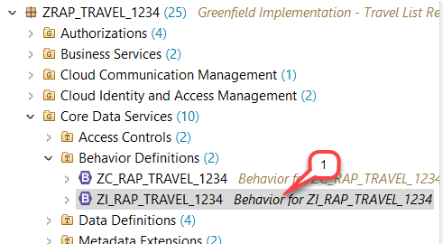
        
2.	Provide the behavior implementation for each entity in a separate ABAP class.  
    For that, specify a behavior implementation class (aka _behavior pool_) using the statement **`implementation in class…`** for each entity.  
         
    Move the generated, commented out statement **`implementation in class…`** specified after the **`managed`** keyword from the header section to the _travel_ entity after the **`define behavior for…`** statement as shown on the screenshot below. Remove the semi-colon at the end of the statement.  
          
    You can use the code snippet provided below for that.   
    Do not forget to replace the placeholder **`####`** with your chosen suffix.  
        
    <pre>
     implementation in class zbp_i_rap_travel_#### unique
    </pre> 

    The source code should look as follows:  
        
    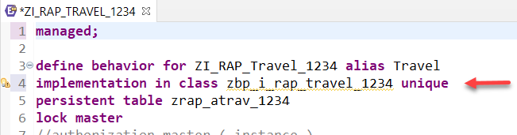
         
3.	Add static field-control by setting the fields **`TravelID`**, **`TotalPrice`** and **`TravelStatus`** to **`readonly`**.    
    Do the same for the administrative fields  **`LastChangedAt`**, **`LastChangedBy`**, **`CreatedAt`**, **`CreatedBy`** and **`LocalLastChangedAt`**.  
        
    For that, copy and insert the code snippet provided below in the _Travel_ behavior definition as shown on the screenshot.
        
    <pre>
      field ( readonly  ) TravelID, TotalPrice, TravelStatus;
      field ( readonly  ) LastChangedAt, LastChangedBy, CreatedAt, CreatedBy, LocalLastChangedAt;
    </pre>
        
    The source code should look as follows:  
        
    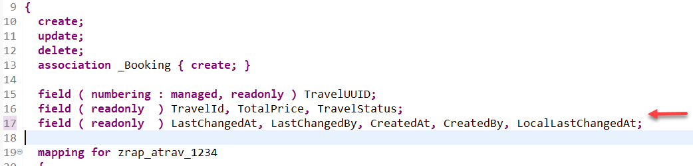
        
4.	Set the fields **`AgencyID`** and **`CustomerID`** to mandatory.  
    A little red star symbol will then be shown in the SAP Fiori elements UI. 
        
    >**Please note:** 
    > The implementation of a corresponding validation is still required.         
    
    For that, copy and insert the code snippet provided below in the _Travel_ behavior definition as shown on the screenshot.          
        
    <pre>
      field ( mandatory ) AgencyID, CustomerID;
    </pre>                        
        
    The source code should look as follows:  
            
    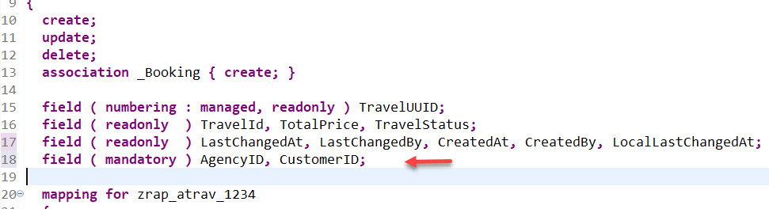  
        
5.	Add the following 3 actions:  
    - Define the two actions **`acceptTravel`** and **`rejectTravel`**  with dynamic feature control for approving and rejecting travels. Both return **` $self`** with cardinality **`1`** as the result. **`$self`** means that the instance of the same type is returned on which the operation is performed.  
    
    - Define the internal action **`recalcTotalPrice`** for the re-calculation of the total price.  
            
    For that, copy and insert the code snippet provided below in the _Travel_ behavior definition as shown on the screenshot.
        
    <pre>
      action ( features : instance ) acceptTravel result [1] $self;
      action ( features : instance ) rejectTravel result [1] $self;
      internal action recalcTotalPrice;
    </pre>
        
    The source code should look as follows:  
         
    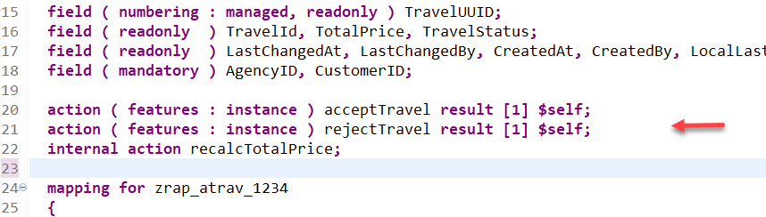
        
6.	Add the following 3 determinations:  
    - The **`setInitialStatus`** determination is used to default the status to _`N`_ whenever a new instance is created. It uses the create trigger on **`Modify`**.  

    - The **`calculateTotalPrice`** determination is used to update the total price whenever the **`BookingFee`** or **`CurrencyCode`** is changed.   
    
    - The **`calculateTravelID`** is used to determine the **`TravelID`** when a new instance is created. It is executed on save.  
    Please note that the calculation of the **`TravelID`** is only used for demonstration purposes. The primary key of the Travel business object is still the **`TravelUUID`**.  
        
    For that, copy and insert the code snippet provided below in the _Travel_ behavior definition as shown on the screenshot.  
        
    <pre>
    determination setInitialStatus    on modify { create; }
    determination calculateTotalPrice on modify { field BookingFee, CurrencyCode; }
    determination calculateTravelID   on save   { create; }
    </pre>
        
    The source code should look as follows:  
        
    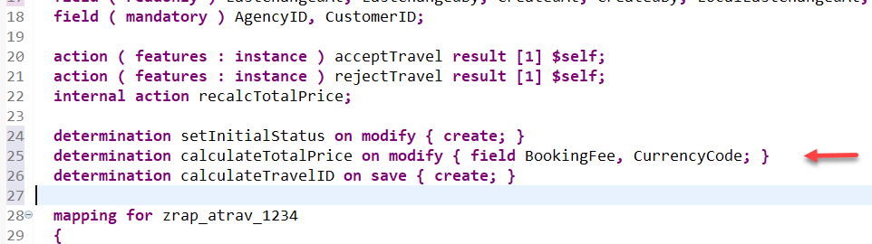
            
7.	Define 3 validations to validate the input of the fields **`AgencyID`**, **`CustomerID`**, **`BeginDate`** and **`EndDate`**. They shall be all triggered on save.  
    For that, copy and insert the code snippet provided below in the _Travel_ behavior definition as shown on the screenshot.

    <pre>
      validation validateAgency   on save { field AgencyID; create; }
      validation validateCustomer on save { field CustomerID; create; }
      validation validateDates    on save { field BeginDate, EndDate; create; }
    </pre>

    You can make use of the shortcut **Ctrl+F1** to format the source code.

    The source code should look as follows:

    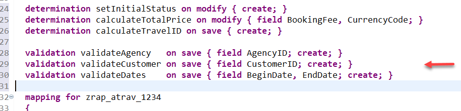
    
8.	Save  the behavior definition.   
    We will address the appearing warnings in the next unit (i.e. _week 3 unit 6_) when we provide the behavior implementation.

## Step 2. Enhance the behavior definition of the _Booking_ entity
Now go ahead and enhance the behavior definition of the _Booking_ entity.
1.	Specify the behavior implementation class (aka behavior pool) of the _Booking_ entity.

    For that, copy and insert the code snippet provided below in the _Booking_ behavior definition as shown on the screenshot.  
    Do not forget to replace the placeholder **`####`** with your chosen suffix.

    <pre>
    implementation in class zbp_i_rap_booking_#### unique
    </pre>

    The source code should look as follows:

    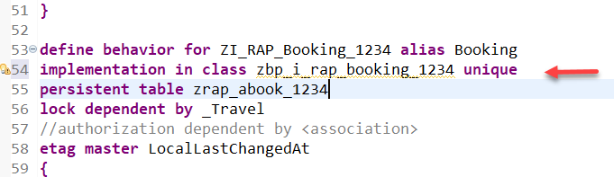
    
2.	For the _Booking_ entity, also add static field-control to the field **`BookingID`** by setting it to **`readonly`**.    

    Do the same for the administrative fields **`CreatedBy`**, **`LastchangedBy`** and **`LocalLastChangedBy`**.

    For that, copy the code snippet provided below and replace the existing statement **` field ( readonly ) TravelUUID;`** with it in the _Booking_ behavior definition as shown on the screenshot. 

    <pre>
      field ( readonly ) TravelUUID, BookingID;
      field ( readonly ) CreatedBy, LastChangedBy, LocalLastChangedAt;
    </pre>

    The source code should look as follows:

    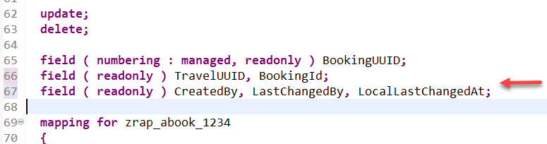
    
3.	Add the following 2 determinations: 
    - The **`calculateBookingID`** determination for determining the **`BookingID`**.  
    
    -	For updating the **`TotalPrice`** we add the **`calculateTotalPrice`** that is triggered whenever the **`FlightPrice`** or **`CurrencyCode`** is changed.

    For that, copy and insert the code snippet provided below in the _Booking_ behavior definition as shown on the screenshot.

    <pre>
      determination calculateBookingID  on modify { create; }
      determination calculateTotalPrice on modify { field FlightPrice, CurrencyCode; }
    </pre>

    You can make use of the shortcut **Ctrl+F1** to format the source code.

    The source code should look as follows:  

    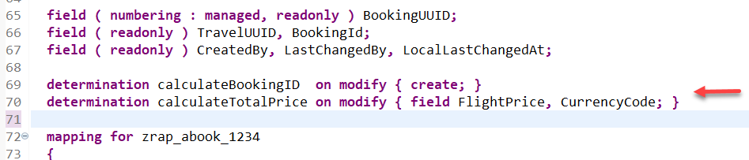
    
4. Save  and activate  the behavior definition.

## Step 3. Enhance the projected behavior definition
>Determinations and validations are automatically triggered by the RAP application infrastructure at runtime. Therefore, there is no need to project them. But this is not the case for actions. Therefore, they always need to be explicitly exposed in the business object behavior projection if they are required in the given scenario.  
In order to later access the new defined actions **`acceptTravel`** and **`rejectTravel`**  in your _Travel_ app, you will now expose them in the business object behavior projection. 

1. Open the _behavior definition_ of your business object **`ZC_RAP_Travel_####`**, where **`####`** is your chosen suffix by either double-clicking on it in the _Project Explorer_ or using the shortcut **Ctrl+Shift+A** (_Open ABAP Development Object_).
    
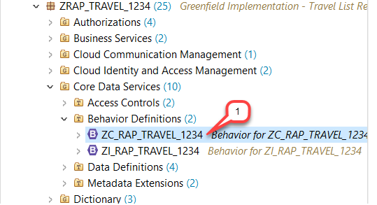
    
2. Project the two new actions **`acceptTravel`** and **`rejectTravel`** by adding the **`use`** statements provided below in the _travel_ behavior projection as shown on the screenshot below.    

    For that, copy and insert the code snippet provided below in the _Travel_ behavior definition as shown on the screenshot.

    <pre>
      use action acceptTravel;
      use action rejectTravel;
    </pre>

    You can make use of the shortcut **Ctrl+F1** to format the source code. 
    The source code should look as follows:

    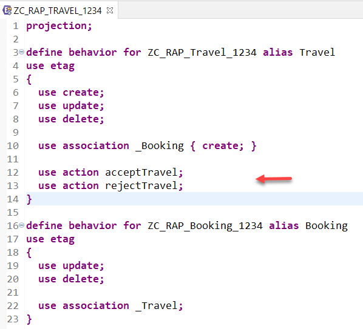
    
3. Save  and activate  the behavior definition.
    
You have now enhanced the behavior of your composition model by declaring new, business object specific logic and behavior, but no implementation is provided at this stage. You will implement the logic in the hands-on exercise of the next unit – i.e. week 3 unit 6.

## Step 4. Enhance the CDS metadata extension of the _Travel_ entity
You will now add appropriate UI annotations in the CDS metadata extension for the _Travel_ entity to add the newly defined actions **`acceptTravel`** and **`rejectTravel`**  to the SAP Fiori elements-based UI of your _Travel_ app. 
    
1.	Open the CDS Metadata Extension **`ZC_RAP_TRAVEL_####`** of the _travel_ entity, where **`####`** is your chosen suffix.   

    You can either double-click on it in the _Project Explorer_ or use the shortcut **Ctrl+Shift+A** (_Open ABAP Development Object_).
    
    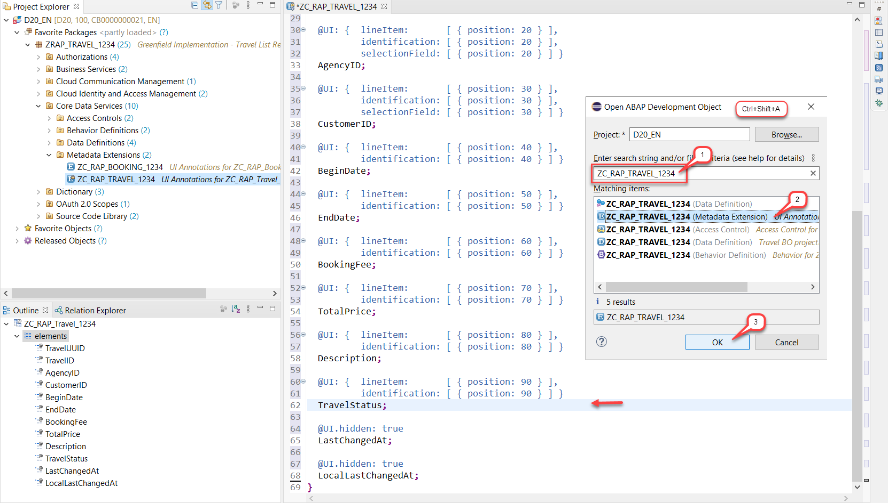
    
2.	Scroll down to the element **`TravelStatus`** and replace the existing **`@UI`** annotation block with the code snippet provided below as shown on the screenshot.

    The **`lineitem`** and **`identification`** annotations have been enhanced with information about the action from _type_ **`#FOR_ACTION`**, the name of the back-end action is specified in the attribute _dataAction_ and a _label_ is also provided.
    
    <pre>
      @UI: {  lineItem:       [ { position: 90 },
                                { type: #FOR_ACTION, dataAction: 'acceptTravel', label: 'Accept Travel' },
                                { type: #FOR_ACTION, dataAction: 'rejectTravel', label: 'Reject Travel' }
                              ],
              identification: [ { position: 90 },
                                { type: #FOR_ACTION, dataAction: 'acceptTravel', label: 'Accept Travel' },
                                { type: #FOR_ACTION, dataAction: 'rejectTravel', label: 'Reject Travel' }
                              ] } 
    </pre>
    The source code should look as follows:
    
    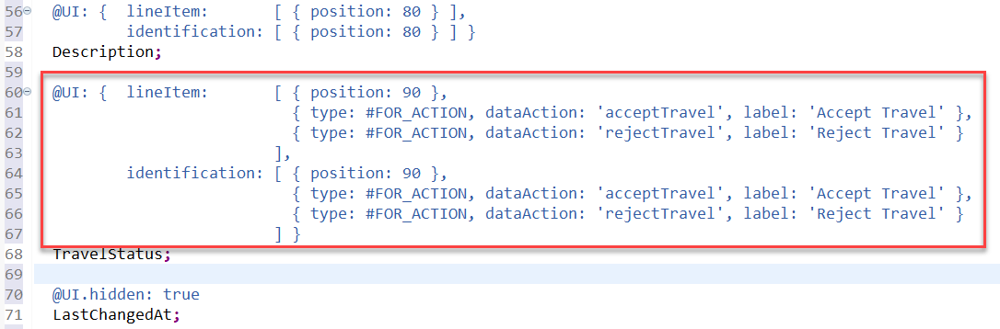
    
3.	Save  and activate  the metadata extension. 

## Summary
You have completed the exercise!   
In this unit, you have learned 
-	How to enhance the standard transactional behavior (CUD) of a business object using determinations, validations and actions.
-	How to define static and dynamic feature control. 
-	How to add the enhanced behavior to the projected behavior definition 
-	Finally, how to enhance CDS metadata extensions to add buttons on the UI for defined actions.
    
## Solution
Find the source code of the CDS behavior definitions (base and projection), and the enhanced CDS metadata extension for the _Travel_ entity in the **[sources](/week3/sources)** folder:    
- [W3U5_BDEF_ZI_RAP_TRAVEL_####](/week3/sources/W3U5_BDEF_ZI_RAP_TRAVEL.txt)    
- [W3U5_BDEF_ZC_RAP_TRAVEL_####](/week3/sources/W3U5_BDEF_ZC_RAP_TRAVEL.txt)    
- [W3U5_DDLX_ZC_RAP_TRAVEL_####](/week3/sources/W3U5_DDLX_ZC_RAP_TRAVEL.txt) 
    
Do not forget to replace all the occurrences of `####` in the copied source code with your chosen suffix.

## Next exercise
[Week 3 Unit 6: Implementing the Business Object Behavior](unit6.md)

