# HANDS-ON EXERCISE FOR WEEK 3 UNIT 6: IMPLEMENTING THE BUSINESS OBJECT BEHAVIOR

## Previous exercise:
[Week 3 Unit 5: Enhancing the Business Object Behavior with App-Specific Logic](/week3/unit5.md)

## Introduction
In the present hands-on exercise, you will now implement the business logic for the enhanced business object behavior defined in the previous unit (i.e. week 3 unit 5) in behavior implementation classes (aka _behavior pools_).
  
You can watch [week 3 unit 6: Implementing the Business Object Behavior]( https://open.sap.com/courses/cp13/items/4jbTHOleqKLWJPa3TES8Pg) on the openSAP platform.
    
> **Hints and Tips**    
> Speed up the typing by making use of the Code Completion feature (shortcut *Ctrl+Space*) and the prepared code snippets provided. 
> You can easily open an object with the shortcut *Ctrl+Shift+A*, format your source code using the Pretty Printer feature *Shift+F1* and toggle the fullscreen of the editor using the shortcut *Ctrl+M*.   
>
> A great overview of ADT shortcuts can be found here: [Useful ADT Shortcuts](https://blogs.sap.com/2013/11/21/useful-keyboard-shortcuts-for-abap-in-eclipse/)
>
> Please note that the placeholder **`####`** used in object names in the exercise description must be replaced with the suffix of your choice during the exercises. The suffix can contain a maximum of 4 characters (numbers and letters).
> The screenshots in this document have been taken with the suffix `1234` and system `D20`. Your system id will be `TRL`.

> Please note that the ADT dialogs and views may change in the future due to software updates.

Follow the instructions below.

## Step 1. Create the message class 
In the behavior implementations, you will make use of your own _T100_ messages, raised by an own exception class. 
Therefore, you will first create the message class **`ZRAP_MSG_####`** to define your own `T100` messages and the exception class **`ZCM_RAP_####`**, where **`####`** is your chosen suffix.

1.	Right-click on your package and choose _**New > Other ABAP Repository Object**_.
    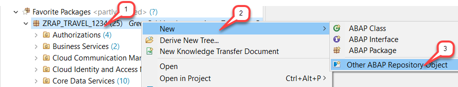

2.	In the creation wizard, filter the entries with **`message`** and choose **`Message Class`**.   
    Then choose **Next >**.
    
    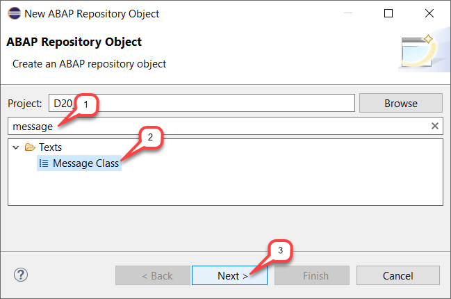
        
3.	Maintain **`ZRAP_MSG_####`** as **name**, where **`####`** is your chosen suffix, and a meaningful **description** (e.g. **`RAP messages`**) and choose **Next >**.
     
    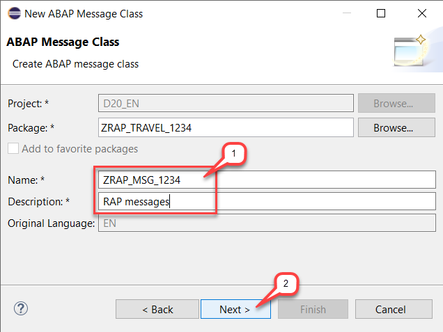
    
4.	Assign a transport request and click **Finish**.
    
    
    
    The new message class opens in the appropriate editor.
     
    
    
5.	Create five messages with the numbers _001_ to _005_ and the short texts provided below.
    
    <table>
    <tr> <td>001</td> <td>Begin date &1 must not be after end date &2 for travel &3</td> </tr>
    <tr> <td>002</td> <td>Begin date &1 must be on or after system date</td> </tr>
    <tr> <td>003</td> <td>Customer &1 unknown</td> </tr>
    <tr> <td>004</td> <td>Agency &1 unknown</td> </tr>
    <tr> <td>005</td> <td>You are not authorized to perform this activity</td> </tr>
    </tr>
    </table> 

    Your message class should look as follows:
    
    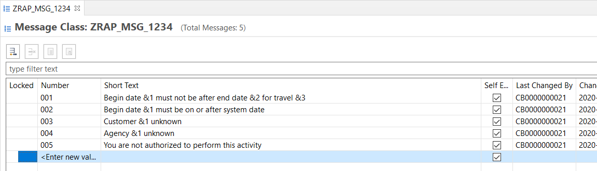
    
6.	Save  the new message class to activate it.
    
## Step 2. Create the exception class.
Now, you will create the exception class **`ZCM_RAP_####`**, where **`####`** is your chosen suffix.
    
1.	Right-click on your package **`ZRAP_TRAVEL_####`** and choose _**New > ABAP Class**_.
    
    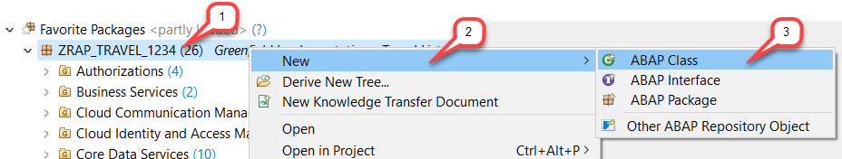
    
2.	Maintain **`ZCM_RAP_####`** as **name** and a meaningful **description** (e.g. **`RAP Messages`**).
    
    Maintain **`CX_STATIC_CHECK`** as **Superclass** and then add **`IF_ABAP_BEHV_MESSAGE`** under **Interfaces**.
    
    Choose **Next >**.
    
    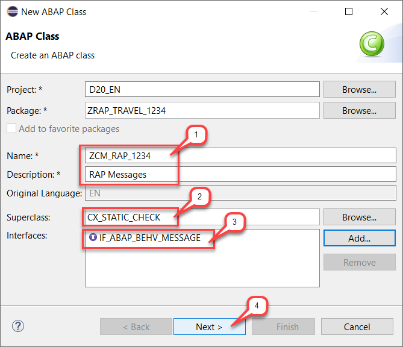
    
3.	Assign a transport request and choose **Finish**.
    
    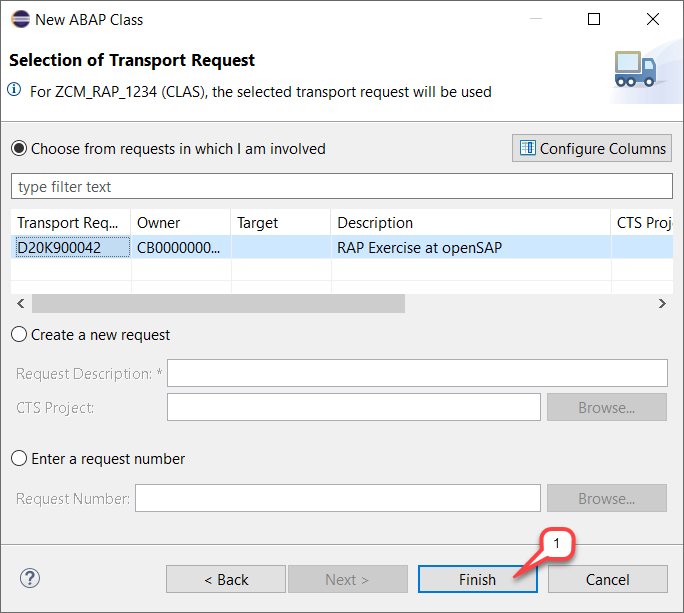
    
    The ABAP class skeleton is generated and displayed in the appropriate editor.
     
    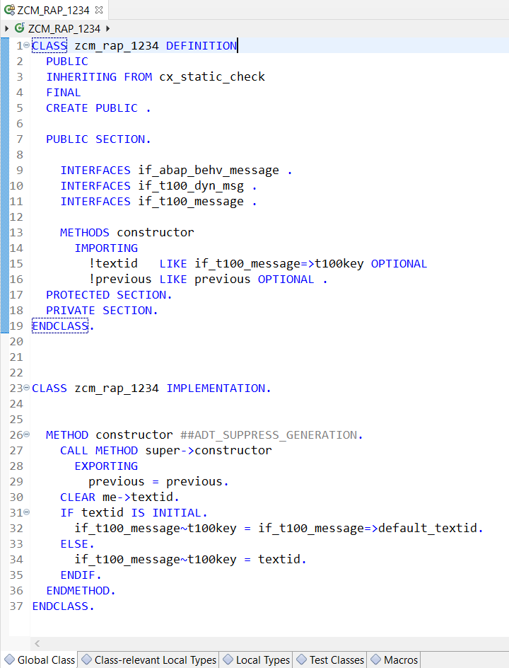
    
4.	Define the constants for all 5 messages defined in the previously created message class in the **`PUBLIC SECTION`**.  
    
    For this, use the code snippet provided below for the purpose.
    Do not forget to replace the occurrences of the placeholder **`####`** with your chosen suffix.
    
    <pre>
        CONSTANTS:
          BEGIN OF date_interval,
            msgid TYPE symsgid VALUE 'ZRAP_MSG_####',
            msgno TYPE symsgno VALUE '001',
            attr1 TYPE scx_attrname VALUE 'BEGINDATE',
            attr2 TYPE scx_attrname VALUE 'ENDDATE',
            attr3 TYPE scx_attrname VALUE 'TRAVELID',
            attr4 TYPE scx_attrname VALUE '',
          END OF date_interval .
        CONSTANTS:
          BEGIN OF begin_date_before_system_date,
            msgid TYPE symsgid VALUE 'ZRAP_MSG_####',
            msgno TYPE symsgno VALUE '002',
            attr1 TYPE scx_attrname VALUE 'BEGINDATE',
            attr2 TYPE scx_attrname VALUE '',
            attr3 TYPE scx_attrname VALUE '',
            attr4 TYPE scx_attrname VALUE '',
          END OF begin_date_before_system_date .
        CONSTANTS:
          BEGIN OF customer_unknown,
            msgid TYPE symsgid VALUE 'ZRAP_MSG_####',
            msgno TYPE symsgno VALUE '003',
            attr1 TYPE scx_attrname VALUE 'CUSTOMERID',
            attr2 TYPE scx_attrname VALUE '',
            attr3 TYPE scx_attrname VALUE '',
            attr4 TYPE scx_attrname VALUE '',
          END OF customer_unknown .
        CONSTANTS:
          BEGIN OF agency_unknown,
            msgid TYPE symsgid VALUE 'ZRAP_MSG_####',
            msgno TYPE symsgno VALUE '004',
            attr1 TYPE scx_attrname VALUE 'AGENCYID',
            attr2 TYPE scx_attrname VALUE '',
            attr3 TYPE scx_attrname VALUE '',
            attr4 TYPE scx_attrname VALUE '',
          END OF agency_unknown .
        CONSTANTS:
          BEGIN OF unauthorized,
            msgid TYPE symsgid VALUE 'ZRAP_MSG_####',
            msgno TYPE symsgno VALUE '005',
            attr1 TYPE scx_attrname VALUE '',
            attr2 TYPE scx_attrname VALUE '',
            attr3 TYPE scx_attrname VALUE '',
            attr4 TYPE scx_attrname VALUE '',
          END OF unauthorized .
    </pre>
    
    Your source code should look as follows:
     
    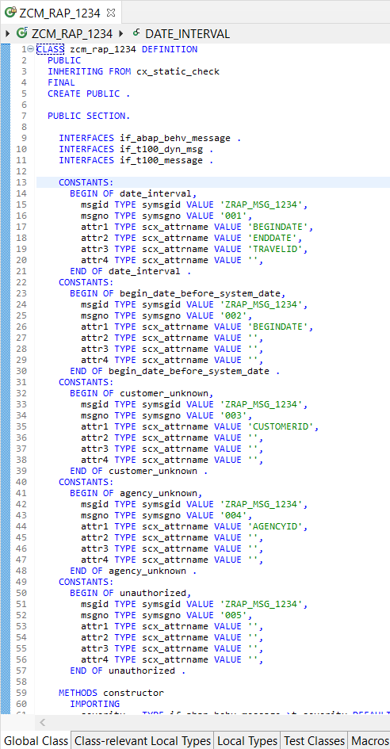

5.	Replace the method **`constructor`** in the class definition with the code snippet provided below.
    <pre>
        METHODS constructor
          IMPORTING
            severity   TYPE if_abap_behv_message=>t_severity DEFAULT if_abap_behv_message=>severity-error
            textid     LIKE if_t100_message=>t100key OPTIONAL
            previous   TYPE REF TO cx_root OPTIONAL
            begindate  TYPE /dmo/begin_date OPTIONAL
            enddate    TYPE /dmo/end_date OPTIONAL
            travelid   TYPE /dmo/travel_id OPTIONAL
            customerid TYPE /dmo/customer_id OPTIONAL
            agencyid   TYPE /dmo/agency_id  OPTIONAL.
    </pre>
    
    Your source code should look as follows:
     
    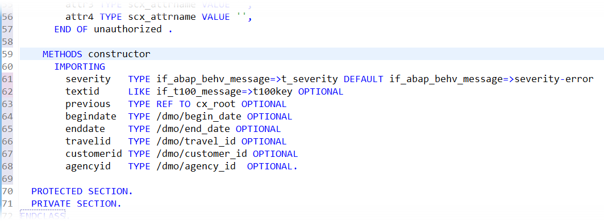
    
6.	Define the required variables **`begindate`**, **`enddate`**,**`travelid`**, **`customerid`** and **`agencyid`** using the code snippet provided below.
    
    <pre>
        DATA begindate TYPE /dmo/begin_date READ-ONLY.
        DATA enddate TYPE /dmo/end_date READ-ONLY.
        DATA travelid TYPE string READ-ONLY.
        DATA customerid TYPE string READ-ONLY.
        DATA agencyid TYPE string READ-ONLY.
    </pre>
    
    Your source code should look as follows:
     
    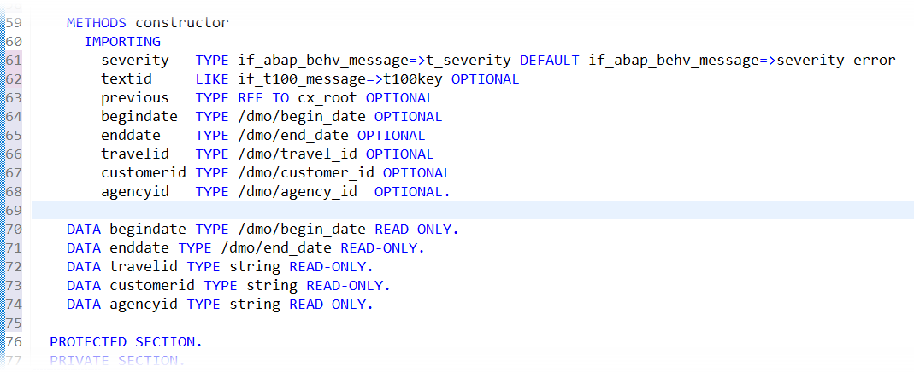
    
7.	Enhance the implementation of the method **`constructor`** by mapping the importing parameters to the properties.
    
    Insert the code snippet provided below at the end of the current method implementation.
        
    <pre>
        me->if_abap_behv_message~m_severity = severity.
        me->begindate = begindate.
        me->enddate = enddate.
        me->travelid = |{ travelid ALPHA = OUT }|.
        me->customerid = |{ customerid ALPHA = OUT }|.
        me->agencyid = |{ agencyid ALPHA = OUT }|.
    </pre>
    
    > Note: The alpha conversion is used for all parameters of type NUMC.
    
    Your source code should look as follows:
     
    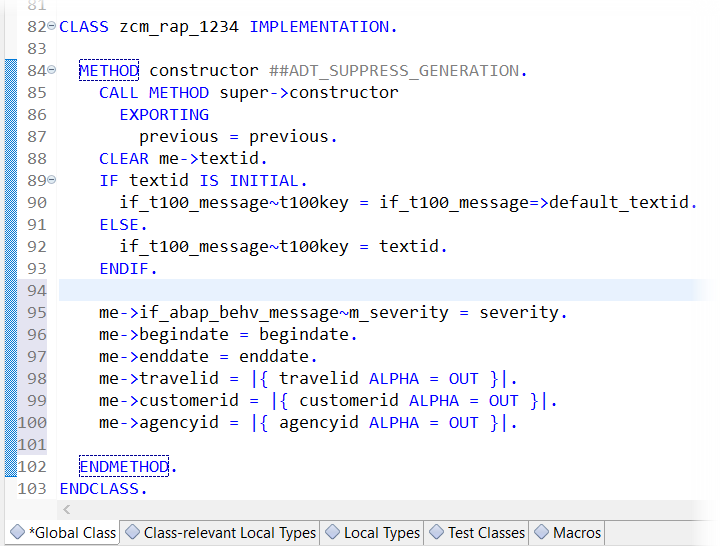
    
8.	Save  and activate  the ABAP class.
    
## Step 3. Implement the behavior pool for the _Travel_ entity
You will now create and develop the behavior implementation (aka _behavior pool_) of the _travel_ entity **` ZI_RAP_Travel_####`**, where **`####`** is your chosen suffix.
    
1.	Open the base _behavior definition_ **`ZI_RAP_Travel_####`** of your business object in the _Project Explorer_.
    
    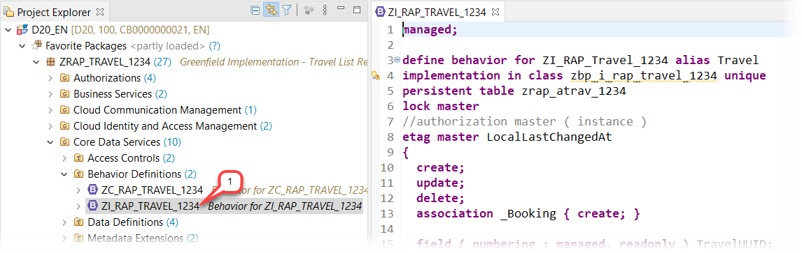
    
2.	Set the cursor on the behavior implementation class name **`zbp_i_rap_travel_####`**,   
start the Quick Fix dialog using the shortcut **Ctrl+1**, and choose **`create…`** to generate the behavior implementation for the Travel entity. 
    
    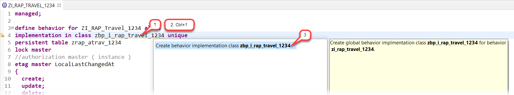
    
3.	In the appearing wizard, keep the defaulted fields and choose **Next >**.
_Project_, _Package_ and _Behavior Definition_ have been automatically assigned.
    
    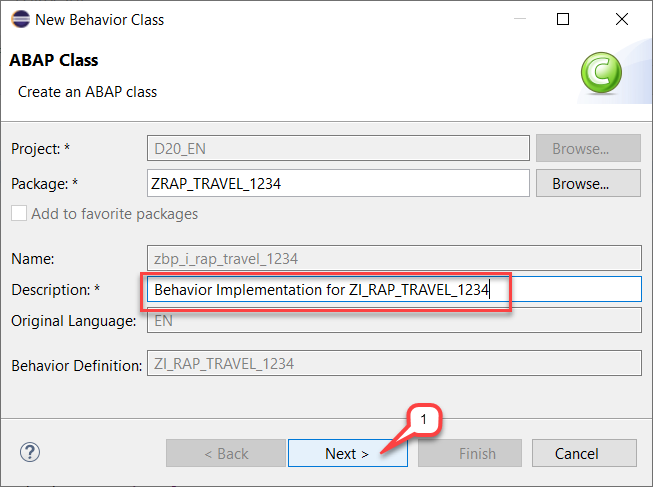
    
4.	Assign a transport request and choose **Finish**.
     
    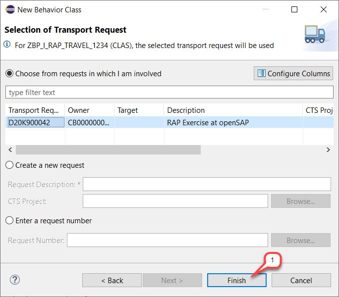
    
    The skeleton of the behavior implementation is generated and displayed in the editor.
    
     _**Global Class**_ and _**Local Types**_ tabs:  
    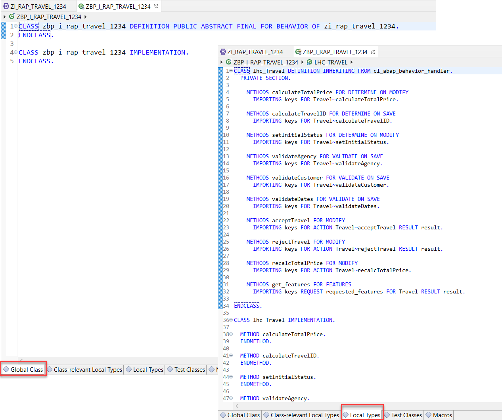
    
    On the _**Global Class**_ tab, you can see the addition **`FOR BEHAVIOR OF`** which indicates that this class provides the behavior implementation of the specified business object - travel entity in the present case.  
    The proper implementation takes place on the _**Local Types**_ tab where the wizard has generated the local handler class **`lhc_hanler`** inheriting from cl_abap_behavior_handler.
    
5.	On the _**Local Types**_ tab, add the constants for the travel status in the **`PRIVATE SECTION`**:
    
    <pre>
        CONSTANTS:
          BEGIN OF travel_status,
            open     TYPE c LENGTH 1  VALUE 'O', " Open
            accepted TYPE c LENGTH 1  VALUE 'A', " Accepted
            canceled TYPE c LENGTH 1  VALUE 'X', " Cancelled
          END OF travel_status.
    </pre>
    
    Your source code should look as follows:
     
    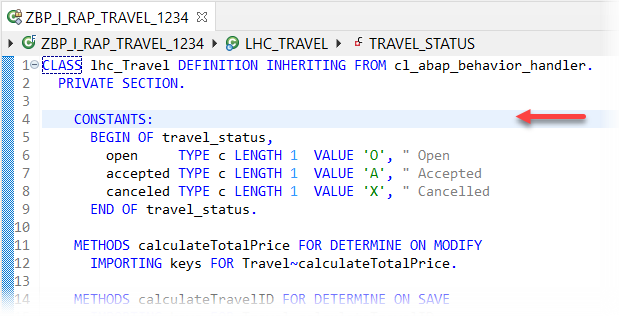
    
6.	Now, implement is the method **`acceptTravel`** which sets the overall status of _travel_ instances to _accepted_.
    
    For this insert the code snippet provided below into the method **` acceptTravel`**.  
    Do not forget to replace the placeholder **`####`** with your chosen suffix.
    
    First, set the _travel status_ of the _travel_ instances for all provided travel keys using an EML _modify_ statement.
    
    <pre>
        " Set the new overall status
        MODIFY ENTITIES OF zi_rap_travel_#### IN LOCAL MODE
          ENTITY Travel
             UPDATE
               FIELDS ( TravelStatus )
               WITH VALUE #( FOR key IN keys
                               ( %tky         = key-%tky
                                 TravelStatus = travel_status-accepted ) )
          FAILED failed
          REPORTED reported.
    </pre>
        
    >**Please note:**  
    >The addition **`IN LOCAL MODE`** allows us to manipulate fields – e.g. to even change read-only fields – while skipping feature and authorization control.
        
    After modifying the _travel status_, the action needs to provide the result as defined in the behavior definition. In our present case, the result is **`$self`** which means, you must return the travel instance with all values for the given keys.
    
    <pre>
        " Fill the response table
        READ ENTITIES OF zi_rap_travel_#### IN LOCAL MODE
          ENTITY Travel
            ALL FIELDS WITH CORRESPONDING #( keys )
          RESULT DATA(travels).

        result = VALUE #( FOR travel IN travels
                            ( %tky   = travel-%tky
                              %param = travel ) ).
    </pre>
    
    >**Excursus about the usage of `%tky`:**  
    >**`%tky`** stands for _transactional key_. 
    >- In non-draft use cases – like the present one –, **`%tky`** contains the same value as **`%key`** which is the key of the related entity.  
    >- In draft-enabled use cases, **`%tky`** will automatically contain the _is_draft_ indicator.    
    >You will handle the draft enablement in the next unit (i.e. week 3 unit 7).  
    >  
    >Therefore, using **`%tky`** in non-draft use case reduces the need for reworking your implementation when you enable the draft handling in your behavior definition as the code can cope with active as well as with draft instances.
        
    Your source code should look as follows:  
    
    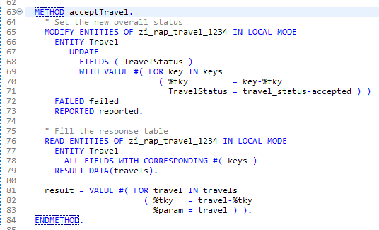
    
7.	The implementation of the action **`rejectTravel`** action is very similar to the **`acceptTravel`** action. It sets the travel status to _rejected_.
    
    For this, insert the code snippet provided below into the method **`rejectTravel`**.  
    Do not forget to replace the placeholder **`####`** with your chosen suffix.  
    You can make use of the _Source Code Formatter_ (**Ctrl+F1**) to format you code.  
    
    <pre>
        " Set the new overall status
        MODIFY ENTITIES OF zi_rap_travel_#### IN LOCAL MODE
          ENTITY Travel
             UPDATE
               FIELDS ( TravelStatus )
               WITH VALUE #( FOR key IN keys
                               ( %tky         = key-%tky
                                 TravelStatus = travel_status-canceled ) )
          FAILED failed
          REPORTED reported.

        " Fill the response table
        READ ENTITIES OF zi_rap_travel_#### IN LOCAL MODE
          ENTITY Travel
            ALL FIELDS WITH CORRESPONDING #( keys )
          RESULT DATA(travels).

        result = VALUE #( FOR travel IN travels
                            ( %tky   = travel-%tky
                              %param = travel ) ).
    </pre>
    
    Your source code should look as follows:
    
    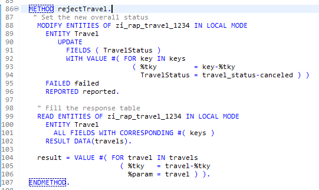
    
8.	You are now going to implement the validation **`validateAgency`** which checks the provided **`AgencyID`** on _save_ – when it is either modified in an existing instance or a new instance is created.  
    
    For this, insert the provided code snippet below into the method **`validateAgency`**.
    Do not forget to replace the placeholder **`####`** with your chosen suffix.
    
    Validation implementations typically start with reading the required data using EML.
    
    In the present case you have to read the **`AgencyID`** for the provided keys.
    
    <pre>
        " Read relevant travel instance data
        READ ENTITIES OF zi_rap_travel_#### IN LOCAL MODE
          ENTITY Travel
            FIELDS ( AgencyID ) WITH CORRESPONDING #( keys )
          RESULT DATA(travels).
    </pre>
    
    Then derive an internal table with all distinct **`AgencyID`** and perform a _database select_ to validate the existence.  
    
    <pre>
        DATA agencies TYPE SORTED TABLE OF /dmo/agency WITH UNIQUE KEY agency_id.

        " Optimization of DB select: extract distinct non-initial agency IDs
        agencies = CORRESPONDING #( travels DISCARDING DUPLICATES MAPPING agency_id = AgencyID EXCEPT * ).
        DELETE agencies WHERE agency_id IS INITIAL.

        IF agencies IS NOT INITIAL.
          " Check if agency ID exist
          SELECT FROM /dmo/agency FIELDS agency_id
            FOR ALL ENTRIES IN @agencies
            WHERE agency_id = @agencies-agency_id
            INTO TABLE @DATA(agencies_db).
        ENDIF.
    </pre>
             
    And finally loop over the travel table, check whether an **`AgencyID`** has been provided and if it exists, and raise state messages if an invalid **`AgencyID`** was provided.  
    
    If the **`AgencyID`** is either empty or does not exist in the check-table, a message is raised using our exception class.
    When you make use of the so-called state messages, you first need to clear existing messages for the _state area_ of this instance and then raise new ones – if required.   
    
    >**Please note:**  
    > State messages are important in the context of _draft_ where the messages are stored together with the state of the instance. In a non-draft use-case, state messages are translated into transient messages by the framework.  
    
    <pre>
        " Raise msg for non existing and initial agencyID
        LOOP AT travels INTO DATA(travel).
          " Clear state messages that might exist
          APPEND VALUE #(  %tky               = travel-%tky
                           %state_area        = 'VALIDATE_AGENCY' )
            TO reported-travel.

          IF travel-AgencyID IS INITIAL OR NOT line_exists( agencies_db[ agency_id = travel-AgencyID ] ).
            APPEND VALUE #( %tky = travel-%tky ) TO failed-travel.

            APPEND VALUE #( %tky        = travel-%tky
                            %state_area = 'VALIDATE_AGENCY'
                            %msg        = NEW zcm_rap_####(
                                              severity = if_abap_behv_message=>severity-error
                                              textid   = zcm_rap_####=>agency_unknown
                                              agencyid = travel-AgencyID )
                            %element-AgencyID = if_abap_behv=>mk-on )
              TO reported-travel.
          ENDIF.
        ENDLOOP.
    </pre>
    
    At the end, your source code should look as follows:  
    
    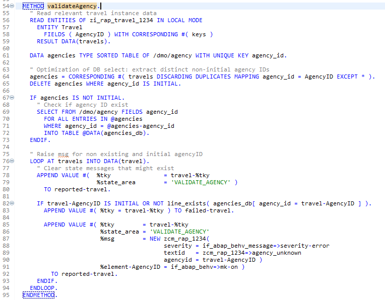
    
9.	You are now going to implement the validation **`validateCustomer`** which checks the provided **`CustomerID`** on _save_ – when it is either modified in an existing instance or a new instance is created.   

    The implementation of the corresponding method **`validateCustomer`** follows a very similar approach as for the **`validateAgency`** method.
    
    You will read the **`CustomerID`**, check its existence on the database table and raise state messages if an invalid value was provided.  
      
    For this, insert the code snippet provided below into the method **`validateCustomer`**.  
    Do not forget to replace the placeholder **`####`** with your chosen suffix.  
      
    <pre>
       " Read relevant travel instance data
        READ ENTITIES OF zi_rap_travel_#### IN LOCAL MODE
          ENTITY Travel
            FIELDS ( CustomerID ) WITH CORRESPONDING #( keys )
          RESULT DATA(travels).

        DATA customers TYPE SORTED TABLE OF /dmo/customer WITH UNIQUE KEY customer_id.

        " Optimization of DB select: extract distinct non-initial customer IDs
        customers = CORRESPONDING #( travels DISCARDING DUPLICATES MAPPING customer_id = CustomerID EXCEPT * ).
        DELETE customers WHERE customer_id IS INITIAL.
        IF customers IS NOT INITIAL.
          " Check if customer ID exist
          SELECT FROM /dmo/customer FIELDS customer_id
            FOR ALL ENTRIES IN @customers
            WHERE customer_id = @customers-customer_id
            INTO TABLE @DATA(customers_db).
        ENDIF.

        " Raise msg for non existing and initial customerID
        LOOP AT travels INTO DATA(travel).
          " Clear state messages that might exist
          APPEND VALUE #(  %tky        = travel-%tky
                           %state_area = 'VALIDATE_CUSTOMER' )
            TO reported-travel.

          IF travel-CustomerID IS INITIAL OR NOT line_exists( customers_db[ customer_id = travel-CustomerID ] ).
            APPEND VALUE #(  %tky = travel-%tky ) TO failed-travel.

            APPEND VALUE #(  %tky        = travel-%tky
                             %state_area = 'VALIDATE_CUSTOMER'
                             %msg        = NEW zcm_rap_####(
                                               severity   = if_abap_behv_message=>severity-error
                                               textid     = zcm_rap_####=>customer_unknown
                                               customerid = travel-CustomerID )
                             %element-CustomerID = if_abap_behv=>mk-on )
              TO reported-travel.
          ENDIF.
        ENDLOOP.
    </pre>
    
    Your source code should look as follows:  
    
    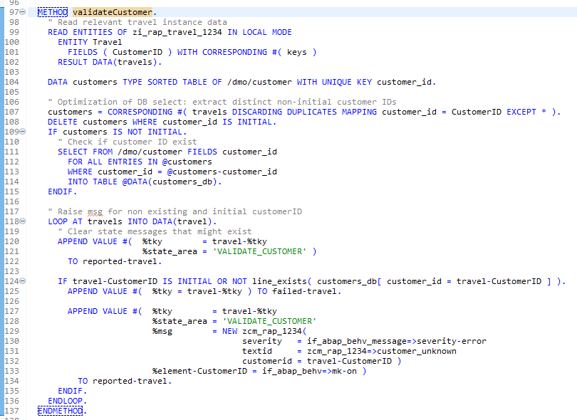
    
10.	You are now going to implement the third and last validation **`validateDates`** which validates the **`BeginDate`** and the **`EndDate`** of the travel.        
    
    The implementation of the corresponding method **`validateDates`** follows a very similar approach as for the other two methods  **`validateAgency`** and  **`validateCustomer`**.  
    
    For this, insert the code snippet provided below into the method **`validateDates`**.  
    Do not forget to replace the placeholder **`####`** with your chosen suffix.  
    
    <pre>
       " Read relevant travel instance data
        READ ENTITIES OF zi_rap_travel_#### IN LOCAL MODE
          ENTITY Travel
            FIELDS ( TravelID BeginDate EndDate ) WITH CORRESPONDING #( keys )
          RESULT DATA(travels).

        LOOP AT travels INTO DATA(travel).
          " Clear state messages that might exist
          APPEND VALUE #(  %tky        = travel-%tky
                           %state_area = 'VALIDATE_DATES' )
            TO reported-travel.

          IF travel-EndDate < travel-BeginDate.
            APPEND VALUE #( %tky = travel-%tky ) TO failed-travel.
            APPEND VALUE #( %tky               = travel-%tky
                            %state_area        = 'VALIDATE_DATES'
                            %msg               = NEW zcm_rap_####(
                                                     severity  = if_abap_behv_message=>severity-error
                                                     textid    = zcm_rap_####=>date_interval
                                                     begindate = travel-BeginDate
                                                     enddate   = travel-EndDate
                                                     travelid  = travel-TravelID )
                            %element-BeginDate = if_abap_behv=>mk-on
                            %element-EndDate   = if_abap_behv=>mk-on ) TO reported-travel.

          ELSEIF travel-BeginDate < cl_abap_context_info=>get_system_date( ).
            APPEND VALUE #( %tky               = travel-%tky ) TO failed-travel.
            APPEND VALUE #( %tky               = travel-%tky
                            %state_area        = 'VALIDATE_DATES'
                            %msg               = NEW zcm_rap_####(
                                                     severity  = if_abap_behv_message=>severity-error
                                                     textid    = zcm_rap_####=>begin_date_before_system_date
                                                     begindate = travel-BeginDate )
                            %element-BeginDate = if_abap_behv=>mk-on ) TO reported-travel.
          ENDIF.
        ENDLOOP.
    </pre>
    
    Your source code should look as follows:  
    
    
    
11.	Now, let’s go with implementing the determinations. First, you are going to implement the determination **`setInitialStatus`** which sets the _travel status_ to open when a new _travel_ instance is created.   
    
    The implementation will read the travel status for all provided keys and sets the status to open for those that don’t have a status yet.
    
    >**Please note:**  
    > Determinations need to be idempotent – which means the result may not differ even if they are executed multiple times for the same key.
      
    For this, insert the code snippet provided below into the method **`setInitialStatus`**.  
    Do not forget to replace the placeholder **`####`** with your chosen suffix.  
    
    <pre>
        " Read relevant travel instance data
        READ ENTITIES OF zi_rap_travel_#### IN LOCAL MODE
          ENTITY Travel
            FIELDS ( TravelStatus ) WITH CORRESPONDING #( keys )
          RESULT DATA(travels).

        " Remove all travel instance data with defined status
        DELETE travels WHERE TravelStatus IS NOT INITIAL.
        CHECK travels IS NOT INITIAL.

        " Set default travel status
        MODIFY ENTITIES OF zi_rap_travel_#### IN LOCAL MODE
        ENTITY Travel
          UPDATE
            FIELDS ( TravelStatus )
            WITH VALUE #( FOR travel IN travels
                          ( %tky         = travel-%tky
                            TravelStatus = travel_status-open ) )
        REPORTED DATA(update_reported).

        reported = CORRESPONDING #( DEEP update_reported ).
    </pre>
    
    Your source code should look as follows:
    
    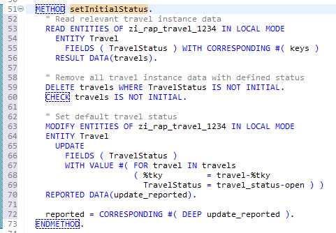
    
12.	Now you are going to implement the determination **`calculateTravelID`** which is used as an example to demonstrate a determination on _save_ and to provide a readable _travel identifier_. But please note, the key of the travel business object is still the **`TravelUUID`**.  
      
    Instead of using a number range, the present implementation simply fetches the highest existing _travel ID_ from the database table and increases the value by _1_.    
    Please note that this approach does not ensure gap free or unique IDs.  
        
    For this, insert the code snippet provided below into the method **`calculateTravelID`**.  
    Do not forget to replace the placeholder **`####`** with your chosen suffix.  
    
    <pre>
        " Please note that this is just an example for calculating a field during _onSave_.
        " This approach does NOT ensure for gap free or unique travel IDs! It just helps to provide a readable ID.
        " The key of this business object is a UUID, calculated by the framework.

        " check if TravelID is already filled
        READ ENTITIES OF zi_rap_travel_#### IN LOCAL MODE
          ENTITY Travel
            FIELDS ( TravelID ) WITH CORRESPONDING #( keys )
          RESULT DATA(travels).

        " remove lines where TravelID is already filled.
        DELETE travels WHERE TravelID IS NOT INITIAL.

        " anything left ?
        CHECK travels IS NOT INITIAL.

        " Select max travel ID
        SELECT SINGLE
            FROM  zrap_atrav_####
            FIELDS MAX( travel_id ) AS travelID
            INTO @DATA(max_travelid).

        " Set the travel ID
        MODIFY ENTITIES OF zi_rap_travel_#### IN LOCAL MODE
        ENTITY Travel
          UPDATE
            FROM VALUE #( FOR travel IN travels INDEX INTO i (
              %tky              = travel-%tky
              TravelID          = max_travelid + i
              %control-TravelID = if_abap_behv=>mk-on ) )
        REPORTED DATA(update_reported).

        reported = CORRESPONDING #( DEEP update_reported ).
    </pre>
    
    Your source code should look as follows:  
     
    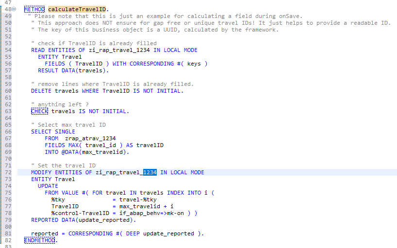
    
13.	Now, you are going to implement the determination **`calculateTotalPrice`**  which is an on-Modify determination for the fields **`BookingFee`** and **`CurrencyCode`** – i.e. it is triggered anytime these fields are changed.  
    
    The implementation will call the internal action **`recalcTotalPrice`** for all provided travel keys.  
    
    For this, insert the code snippet provided below into the method **`calculateTotalPrice`**.  
    Do not forget to replace the placeholder **`####`** with your chosen suffix.  
    
    <pre>
      MODIFY ENTITIES OF zi_rap_travel_#### IN LOCAL MODE
          ENTITY travel
            EXECUTE recalcTotalPrice
            FROM CORRESPONDING #( keys )
          REPORTED DATA(execute_reported).

        reported = CORRESPONDING #( DEEP execute_reported ).
    </pre>
    
    The internal action **`recalcTotalPrice`** calculates the _total price_ by looping over all bookings, collecting all _flight prices_ (**`FlightPrice`**) and adding the _booking fee_ (**`BookingFee`**). In case of different currency codes, it also performs a currency conversion.   
        
    Reading the _booking_ instances for a _travel_ instance takes place via a _read-by-association_.    
        
    The implementation uses the ABAP statement **`collect`** to build an internal table with all occurring currency codes while summing up values for already existing ones. This is done for all _booking_ instances belonging to a _travel_ instance. This internal table is then added to the **`TotalPrice`**, using an AMDP (ABAP Managed Database Procedure) to convert amounts with different currency codes. Finally, the calculated **`TotalPrice`** is updated using EML.  
    
    For this, insert the code snippet provided below into the method **`recalcTotalPrice`**.  
    Do not forget to replace the placeholder **`####`** with your chosen suffix.  
    
    <pre>
        TYPES: BEGIN OF ty_amount_per_currencycode,
                 amount        TYPE /dmo/total_price,
                 currency_code TYPE /dmo/currency_code,
               END OF ty_amount_per_currencycode.

       DATA: amount_per_currencycode TYPE STANDARD TABLE OF ty_amount_per_currencycode.

       " Read all relevant travel instances.
       READ ENTITIES OF zi_rap_travel_#### IN LOCAL MODE
             ENTITY Travel
                FIELDS ( BookingFee CurrencyCode )
                WITH CORRESPONDING #( keys )
             RESULT DATA(travels).

       DELETE travels WHERE CurrencyCode IS INITIAL.

       LOOP AT travels ASSIGNING FIELD-SYMBOL(&lttravel&gt).
          " Set the start for the calculation by adding the booking fee.
          amount_per_currencycode = VALUE #( ( amount        = &lttravel&gt-BookingFee
                                               currency_code = &lttravel&gt-CurrencyCode ) ).
        " Read all associated bookings and add them to the total price.
        READ ENTITIES OF ZI_RAP_Travel_#### IN LOCAL MODE
           ENTITY Travel BY \_Booking
              FIELDS ( FlightPrice CurrencyCode )
            WITH VALUE #( ( %tky = &lttravel&gt-%tky ) )
            RESULT DATA(bookings).
        LOOP AT bookings INTO DATA(booking) WHERE CurrencyCode IS NOT INITIAL.
            COLLECT VALUE ty_amount_per_currencycode( amount        = booking-FlightPrice
                                                      currency_code = booking-CurrencyCode ) INTO amount_per_currencycode.
        ENDLOOP.

       CLEAR &lttravel&gt-TotalPrice.
         LOOP AT amount_per_currencycode INTO DATA(single_amount_per_currencycode).
            " If needed do a Currency Conversion
            IF single_amount_per_currencycode-currency_code = &lttravel&gt-CurrencyCode.
              &lttravel&gt-TotalPrice += single_amount_per_currencycode-amount.
            ELSE.
              /dmo/cl_flight_amdp=>convert_currency(
                 EXPORTING
                   iv_amount                   =  single_amount_per_currencycode-amount
                   iv_currency_code_source     =  single_amount_per_currencycode-currency_code
                   iv_currency_code_target     =  &lttravel&gt-CurrencyCode
                   iv_exchange_rate_date       =  cl_abap_context_info=>get_system_date( )
                 IMPORTING
                   ev_amount                   = DATA(total_booking_price_per_curr)
                ).
              &lttravel&gt-TotalPrice += total_booking_price_per_curr.
            ENDIF.
          ENDLOOP.
        ENDLOOP.

       " write back the modified total_price of travels
        MODIFY ENTITIES OF ZI_RAP_Travel_#### IN LOCAL MODE
          ENTITY travel
            UPDATE FIELDS ( TotalPrice )
            WITH CORRESPONDING #( travels ).
    </pre>    
    
    Your source code should look as follows:  
     
    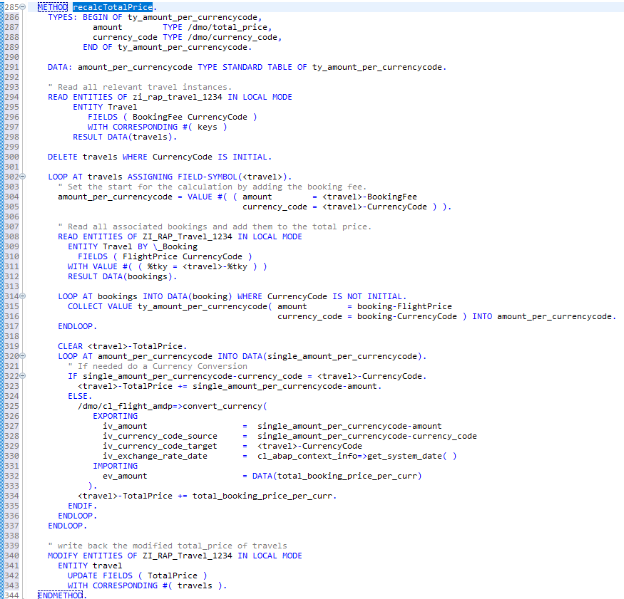
    
14.	Now you are going to implement the method **`get_features`** which is used for the instance specific dynamic feature control. It expects in the result table an entry for each requested key, specifying if the related feature is enabled or disabled based on the state of the instance.  

    In the present case the **`acceptTravel`** and **`rejectTravel`** actions are toggled based on the current status.  

    For this, insert the code snippet provided below into the method **`get_features`**.  
    Do not forget to replace the placeholder **`####`** with your chosen suffix.  
    
    <pre>
        " Read the travel status of the existing travels
        READ ENTITIES OF zi_rap_travel_#### IN LOCAL MODE
          ENTITY Travel
            FIELDS ( TravelStatus ) WITH CORRESPONDING #( keys )
          RESULT DATA(travels)
          FAILED failed.

        result =
          VALUE #(
            FOR travel IN travels
              LET is_accepted =   COND #( WHEN travel-TravelStatus = travel_status-accepted
                                          THEN if_abap_behv=>fc-o-disabled
                                          ELSE if_abap_behv=>fc-o-enabled  )
                  is_rejected =   COND #( WHEN travel-TravelStatus = travel_status-canceled
                                          THEN if_abap_behv=>fc-o-disabled
                                          ELSE if_abap_behv=>fc-o-enabled )
              IN
                ( %tky                 = travel-%tky
                  %action-acceptTravel = is_accepted
                  %action-rejectTravel = is_rejected
                 ) ).
    </pre>
    
    Your source code should look as follows  
    
    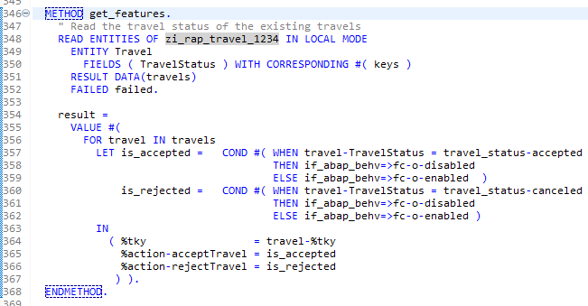
    
15.	Save  and activate  the behavior implementation.
    
## Step 4. Implement the behavior pool for the _Booking_ entity
You will now create and develop the behavior implementation (aka _behavior pool_) of the _booking_ entity **`ZCL_I_RAP_Booking_####`**, where **`####`** is your chosen suffix.  
    
1.	Go back to the base _behavior definition_ **`ZI_RAP_Travel_####`** of your business object in the _Project Explorer_.    
    Set the cursor on the behavior implementation class name **`zcl_i_rap_booking_####`**,   
    start the _Quick Fix_ dialog using the shortcut **Ctrl+1**, and choose **`create…`** to generate the behavior implementation for the Travel entity.  
    
    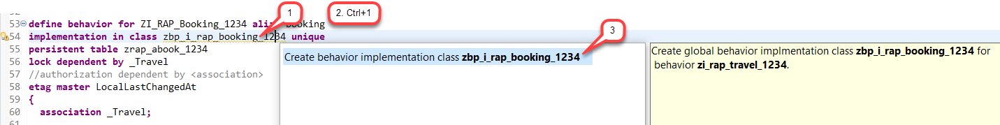
    
2.	In the appearing wizard, keep the defaulted fields and choose **Next >**.  
     
    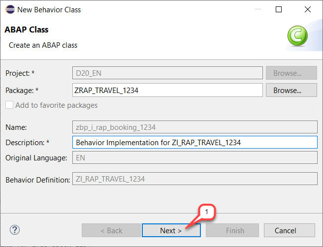
    
3.	Assign a transport request and choose **Finish**.  
    
    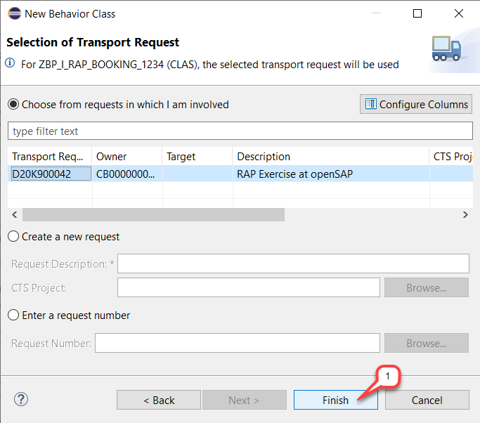
    
    The skeleton of the behavior implementation is generated and displayed in the editor.  
    
    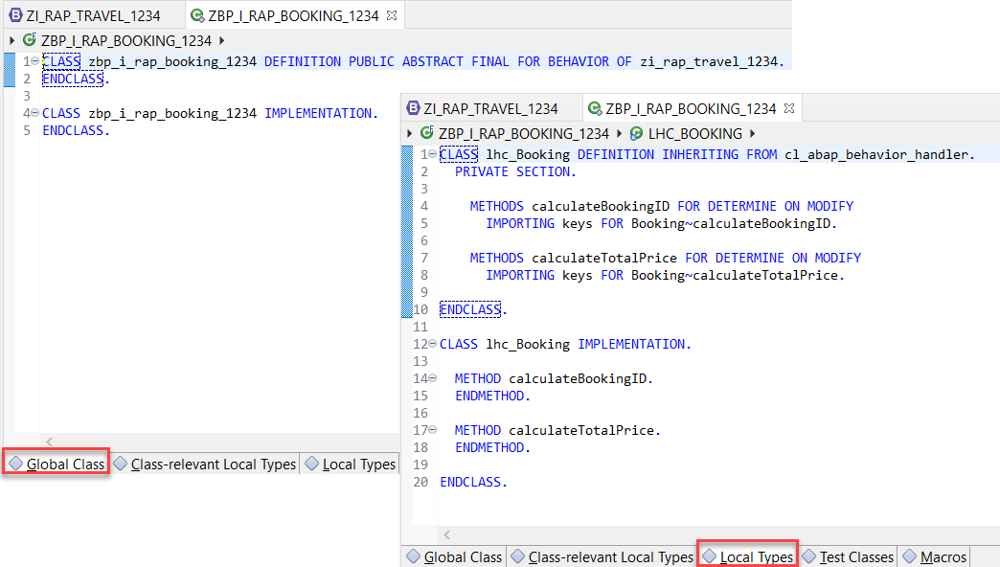
    
4.	First implement the determination **`calculateBookingID`** which is performed on _Modify_ when a new instance is created.
    For this, insert the code snippet provided below into the method **`calculateBookingID`**.  
    Do not forget to replace the placeholder **`####`** with your chosen suffix.  
        
    <pre>
        DATA max_bookingid TYPE /dmo/booking_id.
        DATA update TYPE TABLE FOR UPDATE ZI_RAP_Travel_####\\Booking.

        " Read all travels for the requested bookings.
        " If multiple bookings of the same travel are requested, the travel is returned only once.
        READ ENTITIES OF ZI_RAP_Travel_#### IN LOCAL MODE
        ENTITY Booking BY \_Travel
          FIELDS ( TravelUUID )
          WITH CORRESPONDING #( keys )
          RESULT DATA(travels).

        " Process all affected Travels. Read respective bookings, determine the max-id and update the bookings without ID.
        LOOP AT travels INTO DATA(travel).
          READ ENTITIES OF ZI_RAP_Travel_#### IN LOCAL MODE
            ENTITY Travel BY \_Booking
              FIELDS ( BookingID )
            WITH VALUE #( ( %tky = travel-%tky ) )
            RESULT DATA(bookings).

          " Find max used BookingID in all bookings of this travel
          max_bookingid ='0000'.
          LOOP AT bookings INTO DATA(booking).
            IF booking-BookingID > max_bookingid.
              max_bookingid = booking-BookingID.
            ENDIF.
          ENDLOOP.

          " Provide a booking ID for all bookings that have none.
          LOOP AT bookings INTO booking WHERE BookingID IS INITIAL.
            max_bookingid += 10.
            APPEND VALUE #( %tky      = booking-%tky
                            BookingID = max_bookingid
                          ) TO update.
          ENDLOOP.
        ENDLOOP.

        " Update the Booking ID of all relevant bookings
        MODIFY ENTITIES OF ZI_RAP_Travel_#### IN LOCAL MODE
        ENTITY Booking
          UPDATE FIELDS ( BookingID ) WITH update
        REPORTED DATA(update_reported).

        reported = CORRESPONDING #( DEEP update_reported ).
    </pre>
        
    It first uses a _read-by-association_ to read the related _travel_ header. For each _travel_ instance all bookings are read in order to find the highest **`BookingID`** and to calculate the **`BookingID`**  for the entries that do not yet contain one.  
        
    Your source code should look as follows:  
    
    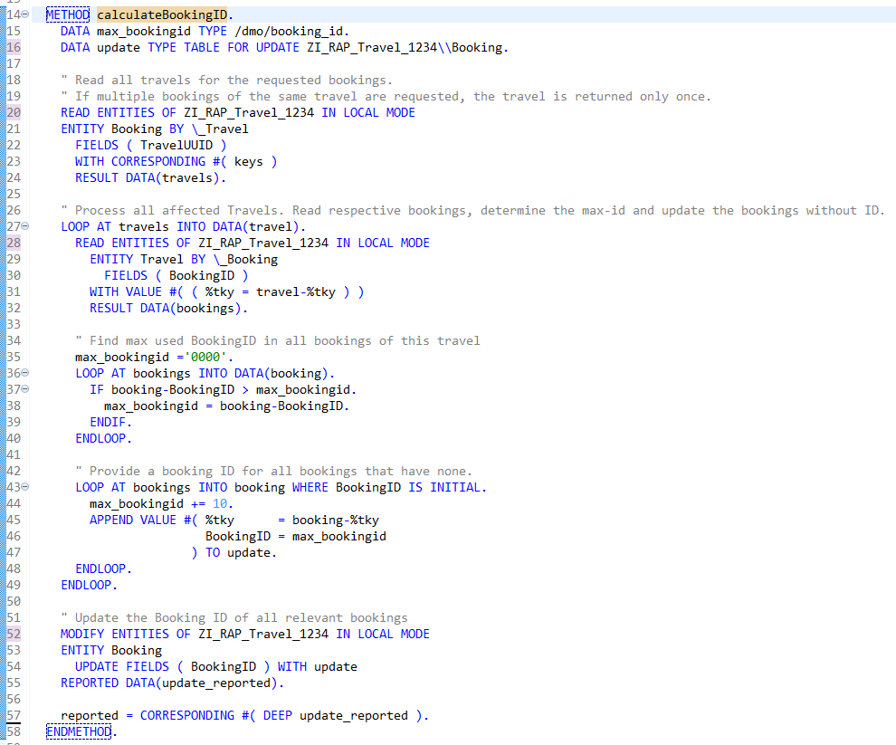
    
5.	The **`calculateTotalPrice`** determination calls the internal action **`recalcTotalPrice`** which we defined and implemented on root level.  
    
    For this, insert the code snippet provided below into the method **`calculateTotalPrice`**.  
    Do not forget to replace the placeholder **`####`** with your chosen suffix.  
    
    <pre>
        " Read all travels for the requested bookings.
        " If multiple bookings of the same travel are requested, the travel is returned only once.
        READ ENTITIES OF ZI_RAP_Travel_#### IN LOCAL MODE
        ENTITY Booking BY \_Travel
          FIELDS ( TravelUUID )
          WITH CORRESPONDING #( keys )
          RESULT DATA(travels)
          FAILED DATA(read_failed).

        " Trigger calculation of the total price
        MODIFY ENTITIES OF ZI_RAP_Travel_#### IN LOCAL MODE
        ENTITY Travel
          EXECUTE recalcTotalPrice
          FROM CORRESPONDING #( travels )
        REPORTED DATA(execute_reported).

        reported = CORRESPONDING #( DEEP execute_reported ).
    </pre>
       
      Your source code should look as follows:  
    
    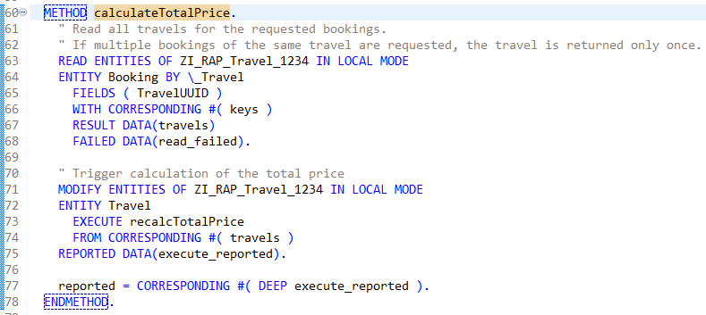
    
6.	Save  and activate  the behavior implementation.
        
## Step 5. Define the Authorization master
Now you are now going to add authorization control to your business object.  
For that, you will first have to enhance the base _Behavior Definition_ accordingly.  
    
1.	In the _Project Explorer_, Open the base _behavior definition_ **`ZI_RAP_Travel_####`** where **`####`** is your chosen suffix.  
     
    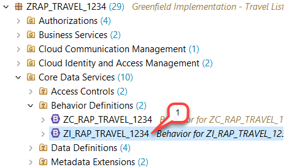
    
2.	Uncomment the **`authorization master ( instance )`** statement line to declare the _travel_ root node as authorization master.   
    Instance-specific authorization requests are directed to the implementation of the authorization master.   
    <pre>authorization master ( instance ) </pre>
    
    Your source code should look as follows:
    
    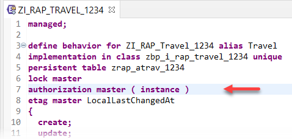
    
3.	Now, scroll down to the _booking_ entity and uncomment the authorization dependent line and specify the association **`_Travel`**.    
    <pre>authorization dependent by _Travel</pre>

    This declares the _booking_ entity as authorization dependent. Modifying requests on the _booking_ entity are directed to the authorization master following the provided association.  
    
    Your source code should look as follows:  
    
    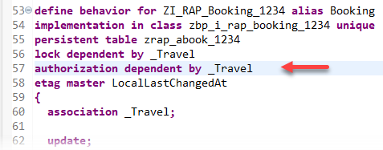
    
4.	Save  and activate  the behavior definition.
    
## Step 6. Implement the Authorization master
You are now going to implement the authorization master in the behavior implementation of the _travel_ entity **`ZI_RAP_Travel_####`**, where **`####`** is your chosen suffix.   
     
1.	First, remain in your base BO behavior definition **`ZI_RAP_Travel_####`**.   
    Set the cursor on the **`master`** keyword of the authorization master declaration statement and use the _Quick Fix_ (**Ctrl+1**) to add the new method declaration to the behavior implementation.  
    
    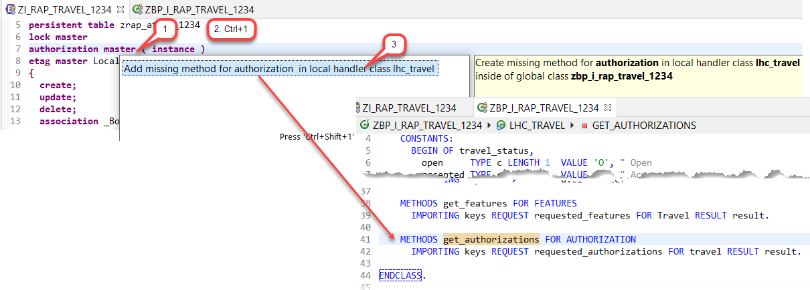
    
    >**Please note:**  
    >This pattern works for other declarations as well. If you for instance add a new action, you can use the _Quick Fix_ feature (**Ctrl+1**) to let the ABAP Development Tools generate the corresponding method declaration as well as an empty method implementation.
    
2.  Since you can’t influence the actual authorizations in the trial ABAP environment, you need to simulate if a certain authorization – for instance the update authorization – is present or not.   
    This is done via some helper methods that we first need to declare.  
    
    For this, insert the code snippet provided below at the end of the local handler class definition **`lhc_Travel`** of the behavior implementation of the _travel_ entity.   
    
    <pre>   
   
       METHODS is_update_granted IMPORTING has_before_image      TYPE abap_bool
                                            overall_status        TYPE /dmo/overall_status
                                  RETURNING VALUE(update_granted) TYPE abap_bool.

       METHODS is_delete_granted IMPORTING has_before_image      TYPE abap_bool
                                            overall_status        TYPE /dmo/overall_status
                                  RETURNING VALUE(delete_granted) TYPE abap_bool.

       METHODS is_create_granted RETURNING VALUE(create_granted) TYPE abap_bool.
    </pre>
    
    Your source code should look as follows:
     
    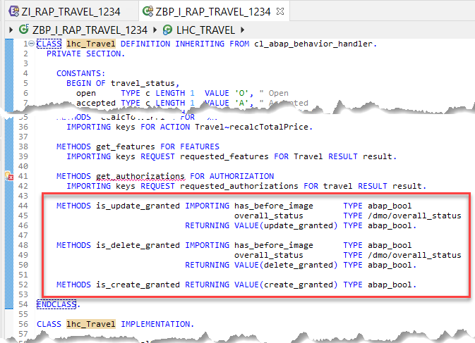
        
3.	Make use of the ADT Quick Fix (**Ctrl+1**) to generate the implementations for all four methods.  
    
    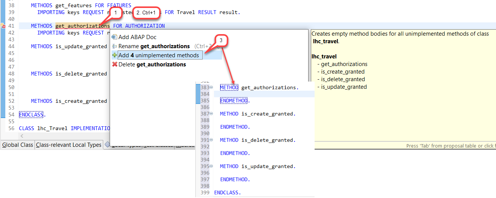
    
    You will now go ahead and implement the different methods. The helper classes will perform authority checks using the authority object **` ZOSTAT####`** that was defined in the previous week. **`####`** is your chosen suffix.  
    
4.	First, implement the helper method **`is_create_granted`** which checks if the _create_ operation is allowed. This operation corresponds to the activity **`01`**.   
      
    For testing purposes, we set the result to `true` in all cases. This can of course be adjusted for testing different situations.

    For this, insert the code snippet provided below into the method **`is_create_granted`**.   
    Do not forget to replace the placeholder **`####`** with your chosen suffix.   
    
    <pre>
        AUTHORITY-CHECK OBJECT 'ZOSTAT####'
          ID 'ZOSTAT####' DUMMY
          ID 'ACTVT' FIELD '01'.
        create_granted = COND #( WHEN sy-subrc = 0 THEN abap_true ELSE abap_false ).
        " Simulate full access - for testing purposes only! Needs to be removed for a productive implementation.
        create_granted = abap_true.
    </pre>
    
    Your source code should look as follows:  
    
    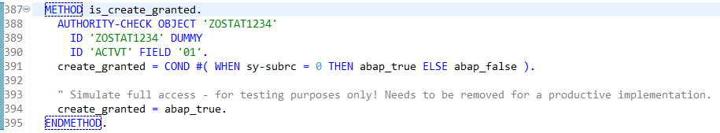
    
5. Now, implement the helper method **`is_update_granted`** which checks if the _update_ operation is allowed. This operation corresponds to the activity **`02`**.   
    
    For this, insert the code snippet provided below into the method **`is_update_granted`**.   
    Do not forget to replace the placeholder **`####`** with your chosen suffix.   
    
    <pre>
        IF has_before_image = abap_true.
          AUTHORITY-CHECK OBJECT 'ZOSTAT####'
            ID 'ZOSTAT####' FIELD overall_status
            ID 'ACTVT' FIELD '02'.
        ELSE.
          AUTHORITY-CHECK OBJECT 'ZOSTAT####'
            ID 'ZOSTAT####' DUMMY
            ID 'ACTVT' FIELD '02'.
        ENDIF.
        update_granted = COND #( WHEN sy-subrc = 0 THEN abap_true ELSE abap_false ).

        " Simulate full access - for testing purposes only! Needs to be removed for a productive implementation.
        update_granted = abap_true.
    </pre>
    
    In case a record is already present, the **`travel_status`** of the before image is used in the check.  
    
    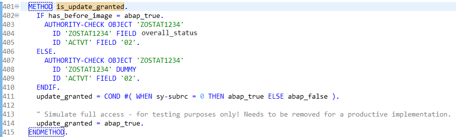
    
6.	Now, implement the helper method **`is_delete_granted`** which checks if the _delete_ operation is allowed. This operation corresponds to the activity **`06`**.    
    
    For this, insert the code snippet provided below into the method **`is_delete_granted`**.  
    Do not forget to replace the placeholder **`####`** with your chosen suffix.  
    
    <pre>
        IF has_before_image = abap_true.
          AUTHORITY-CHECK OBJECT 'ZOSTAT####'
            ID 'ZOSTAT####' FIELD overall_status
            ID 'ACTVT' FIELD '06'.
        ELSE.
          AUTHORITY-CHECK OBJECT 'ZOSTAT####'
            ID 'ZOSTAT####' DUMMY
            ID 'ACTVT' FIELD '06'.
        ENDIF.
        delete_granted = COND #( WHEN sy-subrc = 0 THEN abap_true ELSE abap_false ).

        " Simulate full access - for testing purposes only! Needs to be removed for a productive implementation.
        delete_granted = abap_true.
    </pre>
    
    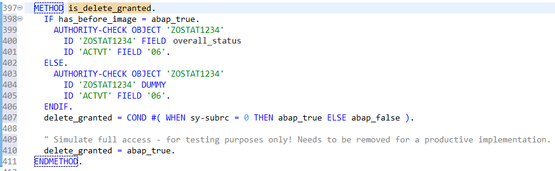
    
7. You can now implement the **`get_authorizations`** method.  
    It simulates the use case of using an editable field - **`TravelStatus`** in the present case – for controlling the authorization.     Therefore, the implementation reads the before image from the active persistence and uses this value when calling the helper methods.  
        
    For this, insert the code snippet provided below into the method **`get_authorizations`**.  
    Do not forget to replace the placeholder **`####`** with your chosen suffix.  
    
    <pre>
       DATA: has_before_image    TYPE abap_bool,
              is_update_requested TYPE abap_bool,
              is_delete_requested TYPE abap_bool,
              update_granted      TYPE abap_bool,
              delete_granted      TYPE abap_bool.

      DATA: failed_travel LIKE LINE OF failed-travel.

      " Read the existing travels
        READ ENTITIES OF zi_rap_travel_#### IN LOCAL MODE
          ENTITY Travel
            FIELDS ( TravelStatus ) WITH CORRESPONDING #( keys )
          RESULT DATA(travels)
          FAILED failed.

        CHECK travels IS NOT INITIAL.

    *   In this example the authorization is defined based on the Activity + Travel Status
    *   For the Travel Status we need the before-image from the database. We perform this for active (is_draft=00) as well as for drafts (is_draft=01) as we can't distinguish between edit or new drafts
        SELECT FROM zrap_atrav_####
          FIELDS travel_uuid,overall_status
          FOR ALL ENTRIES IN @travels
          WHERE travel_uuid EQ @travels-TravelUUID
          ORDER BY PRIMARY KEY
          INTO TABLE @DATA(travels_before_image).

        is_update_requested = COND #( WHEN requested_authorizations-%update              = if_abap_behv=>mk-on OR
                                           requested_authorizations-%action-acceptTravel = if_abap_behv=>mk-on OR
                                           requested_authorizations-%action-rejectTravel = if_abap_behv=>mk-on OR
    *                                       requested_authorizations-%action-Prepare      = if_abap_behv=>mk-on OR
    *                                       requested_authorizations-%action-Edit         = if_abap_behv=>mk-on OR
                                           requested_authorizations-%assoc-_Booking      = if_abap_behv=>mk-on
                                      THEN abap_true ELSE abap_false ).

      is_delete_requested = COND #( WHEN requested_authorizations-%delete = if_abap_behv=>mk-on
                                      THEN abap_true ELSE abap_false ).

      LOOP AT travels INTO DATA(travel).
          update_granted = delete_granted = abap_false.

      READ TABLE travels_before_image INTO DATA(travel_before_image)
           WITH KEY travel_uuid = travel-TravelUUID BINARY SEARCH.
          has_before_image = COND #( WHEN sy-subrc = 0 THEN abap_true ELSE abap_false ).

      IF is_update_requested = abap_true.
            " Edit of an existing record -> check update authorization
            IF has_before_image = abap_true.
              update_granted = is_update_granted( has_before_image = has_before_image  overall_status = travel_before_image-overall_status ).
              IF update_granted = abap_false.
                APPEND VALUE #( %tky        = travel-%tky
                                %msg        = NEW zcm_rap_####( severity = if_abap_behv_message=>severity-error
                                                                textid   = zcm_rap_####=>unauthorized )
                              ) TO reported-travel.
              ENDIF.
              " Creation of a new record -> check create authorization
            ELSE.
              update_granted = is_create_granted( ).
              IF update_granted = abap_false.
                APPEND VALUE #( %tky        = travel-%tky
                                %msg        = NEW zcm_rap_####( severity = if_abap_behv_message=>severity-error
                                                                textid   = zcm_rap_####=>unauthorized )
                              ) TO reported-travel.
              ENDIF.
            ENDIF.
          ENDIF.

          IF is_delete_requested = abap_true.
            delete_granted = is_delete_granted( has_before_image = has_before_image  overall_status = travel_before_image-overall_status ).
            IF delete_granted = abap_false.
              APPEND VALUE #( %tky        = travel-%tky
                              %msg        = NEW zcm_rap_####( severity = if_abap_behv_message=>severity-error
                                                              textid   = zcm_rap_####=>unauthorized )
                            ) TO reported-travel.
            ENDIF.
          ENDIF.

          APPEND VALUE #( %tky = travel-%tky

                          %update              = COND #( WHEN update_granted = abap_true THEN if_abap_behv=>auth-allowed ELSE if_abap_behv=>auth-unauthorized )
                          %action-acceptTravel = COND #( WHEN update_granted = abap_true THEN if_abap_behv=>auth-allowed ELSE if_abap_behv=>auth-unauthorized )
                          %action-rejectTravel = COND #( WHEN update_granted = abap_true THEN if_abap_behv=>auth-allowed ELSE if_abap_behv=>auth-unauthorized )
    *                      %action-Prepare      = COND #( WHEN update_granted = abap_true THEN if_abap_behv=>auth-allowed ELSE if_abap_behv=>auth-unauthorized )
    *                      %action-Edit         = COND #( WHEN update_granted = abap_true THEN if_abap_behv=>auth-allowed ELSE if_abap_behv=>auth-unauthorized )
                          %assoc-_Booking      = COND #( WHEN update_granted = abap_true THEN if_abap_behv=>auth-allowed ELSE if_abap_behv=>auth-unauthorized )

                          %delete              = COND #( WHEN delete_granted = abap_true THEN if_abap_behv=>auth-allowed ELSE if_abap_behv=>auth-unauthorized )
                        )
            TO result.
        ENDLOOP.¬
    </pre> 
    
    The various options via the **`requested_authorizations`** structure are mapped to the activity values (_create_, _update_ and _delete_) defined in the authorization object. These are then checked for each _travel_ instance.  
    
    The result table is put together based on the outcome of the respective authorization checks.  
    
    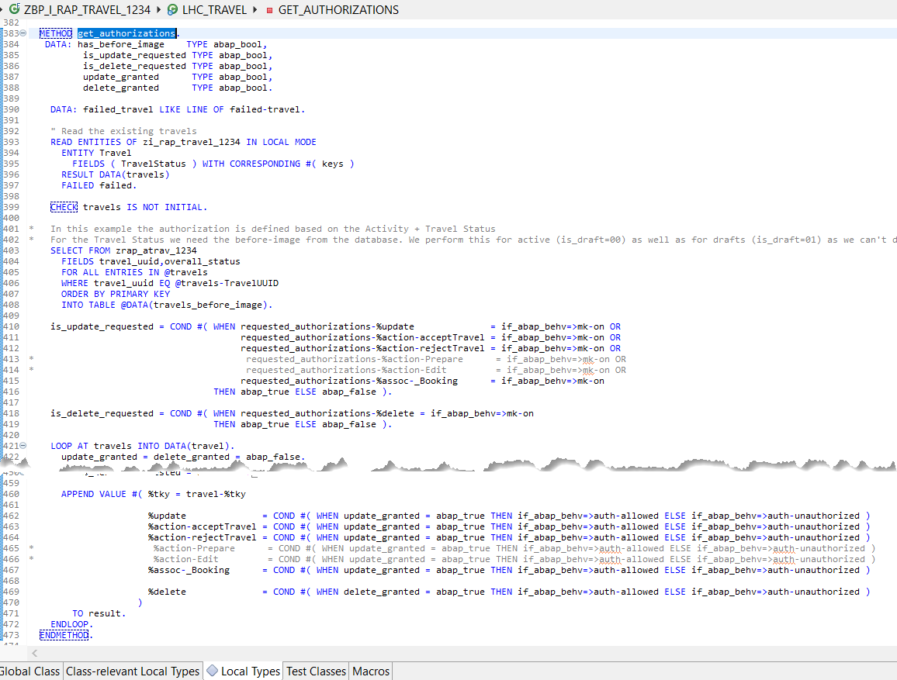
    
8.	Save  and activate  the behavior implementation.
    
## Step 7. Preview the enhanced Travel app & Play around
You are now done with the behavior implementations and can run and check the enhanced SAP Fiori elements Travel App.    
    
1.	Start the _Travel app_ in your service binding **`ZUI_RAP_TRAVEL_O2_####`** – where **`####`** is your chosen suffix – or refresh (**`F5`**) it in the browser.   
    Provide your ABAP user credentials if requested.   
    
    First you see the two new actions _Accept Travel_ and _Reject Travel_ beside the create, update and delete operations. Both actions are toggled based on the _status_ of the selected travel instance.  
    
    Press **Go** on the UI to load the back-end data.  
      
    
    
    
    
2.	Feel free to play around with your app.  
    For example:
    -  Create a new Travel record.  
    Provide some inconsistent values for the _Agency ID_, the _Customer ID_ and the _Begin date_ and/or the _End date_.  
    When you click on _save_, the corresponding error messages are shown.  
    -	Correct the values and click on _save_.  
    Now the validations are passed successful. You also see that the determinations were executed. The _Travel ID_ was calculated and the _Booking status_ was defaulted.  
    -	Use the actions _Accept_ and _Reject_ to verify the instance specific feature control.  
    -	On the Travel Object Page:  
    In the _Booking_ table on the _Travel_ object page, click on _create_ to create a new _booking_ instance for this travel. 
    Provide some valid entries and click _save_.   
    Navigating back shows that the header instance was not reloaded and therefore the old _Total price_ is shown. This would require the definition of a side-effect which we are not covering in this session. A manual refresh of the UI shows the updated Total Price.  
    -	You can click on _delete_ to delete the Travel instance.  
        
## Summary
You have completed the exercise!   
In this unit, you have learned  
-	How to create the BO behavior pool class and how to implement the business object-specific logic for your app in ABAP using determination, validations and actions.  
-	How the dynamic feature control enhances the user experience and how to implement it.  
- How to implement the authorization master.  
    
## Solution
Find the source code of the created message class, exception class, behavior implementation classes (aka _behavior pools_)  and the enhanced CDS behavior definition in the **[/week3/sources](/week3/sources)** folder:  
- [W3U6_MSAG_ZRAP_MSG_####](/week3/sources/W3U6_MSAG_ZRAP_MSG.txt)
- [W3U6_CLAS_ZCM_RAP_####](/week3/sources/W3U6_CLAS_ZCM_RAP.txt)
- [W3U6_CLAS_ZBP_I_RAP_TRAVEL_####](/week3/sources/W3U6_CLAS_ZBP_I_RAP_TRAVEL.txt)    
- [W3U6_CLAS_ZBP_I_RAP_BOOKING_####](/week3/sources/W3U6_CLAS_ZBP_I_RAP_BOOKING.txt)    
- [W3U6_BDEF_ZI_RAP_TRAVEL_####](/week3/sources/W3U6_BDEF_ZI_RAP_TRAVEL.txt) 

Do not forget to replace all the occurrences of `####` in the copied source code with your chosen suffix.  

## Next exercise
[Week 3 Unit 7: Enabling the Draft Handling](unit7.md)

