# HANDS-ON EXERCISE FOR WEEK 3 UNIT 7: ENABLING THE DRAFT HANDLING

## Previous exercise:
[Week 3 Unit 6: Implementing the Business Object Behavior)](/week3/unit6.md)

## Introduction
In the present hands-on exercise, you will now enable the draft handling in your business object and test the result in your SAP Fiori elements-based Travel App.
  
You can watch [week 3 unit 7: Enabling the Draft Handling]( https://open.sap.com/courses/cp13/items/1a7WATRk9w6qt7UUW6IW0g) on the openSAP platform.
    
> **Hints and Tips**    
> Speed up the typing by making use of the Code Completion feature (shortcut *Ctrl+Space*) and the prepared code snippets provided. 
> You can easily open an object with the shortcut *Ctrl+Shift+A*, format your source code using the Pretty Printer feature *Shift+F1* and toggle the fullscreen of the editor using the shortcut *Ctrl+M*.   
>
> A great overview of ADT shortcuts can be found here: [Useful ADT Shortcuts](https://blogs.sap.com/2013/11/21/useful-keyboard-shortcuts-for-abap-in-eclipse/)
>
> Please note that the placeholder **`####`** used in object names in the exercise description must be replaced with the suffix of your choice during the exercises. The suffix can contain a maximum of 4 characters (numbers and letters).
> The screenshots in this document have been taken with the suffix `1234` and system `D20`. Your system id will be `TRL`.

> Please note that the ADT dialogs and views may change in the future due to software updates.

Follow the instructions below.

## Step 1. Enable the draft handling in the base business object
You will now enable the draft handling for the managed based business object (BO) with a few additions in the behavior definition.
    
1.	In the _Project Explorer_, go to your package and open the base behavior definition **`ZI_RAP_Travel_####`** - where **`####`** is your chosen suffix – of your business object.  
    You can also use the shortcut **Ctrl+Shift+A** to open ABAP development object.  
    
    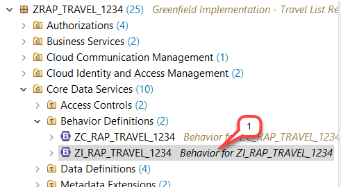
    
2.	Add the addition **`with draft;`** after the **`managed;`** keyword in the header section to enable draft handling for your business object.    
    <pre>with draft; </pre>
    
    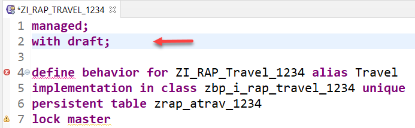
    
3.	Specify the draft table for the _travel_ entity, where the draft _travel_ data will be persisted as show on the screenshot.
    
    > Draft tables are fully managed by the RAP framework at runtime
    
    For this, insert the code snippet provided below as shown on the screenshot.  
    Do not forget to replace the placeholder **`####`** with your chosen suffix.  
    
    <pre>
    draft table zrap_dtrav_####
    </pre>
    
    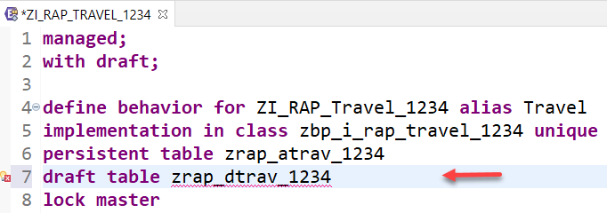
    
4. Do the same for the _booking_ entity – i.e. define the draft table where the draft _booking_ data will be persisted.
    
    For this, insert the code snippet provided below in the _booking_ behavior definition as shown on the screenshot.  
    Do not forget to replace the placeholder **`####`** with your chosen suffix.  
    
    <pre>draft table zrap_dbook_####</pre>  
    
    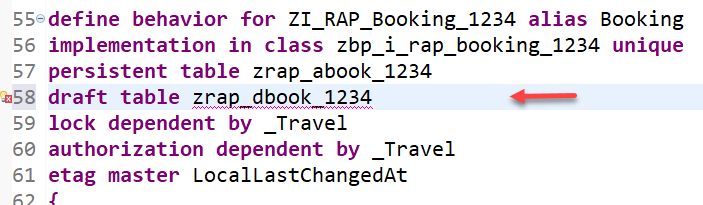
    
5.	Now, you will create the draft table **`zrap_dtrav_####`**, where **`####`** is your chosen suffix, to store the draft data for the _travel_ entity.    
    The ADT _Quick Fix_ feature can be used to generate the draft table.  
       
    For this, set the cursor on the table name, and press **Ctrl+1**  to star the _Quick Fix_ dialog.   
    
    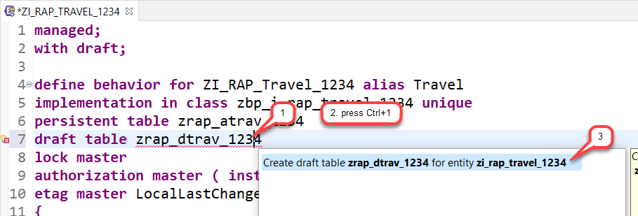
    
6.	Leave the defaulted values as they are in the appearing dialog and choose **Next**.  
    
    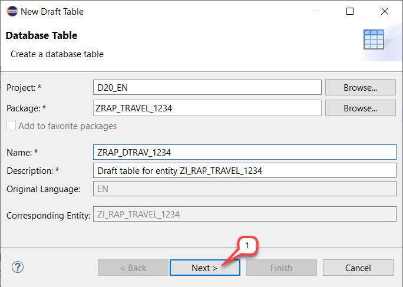
    
7.	Assign a transport request and choose **Finish** to generate the table.  
    
    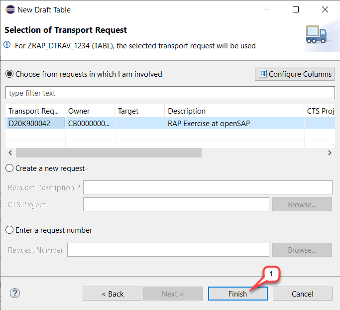
    
    The draft table is generated based on the defined model and shown in the appropriate editor.  
    
    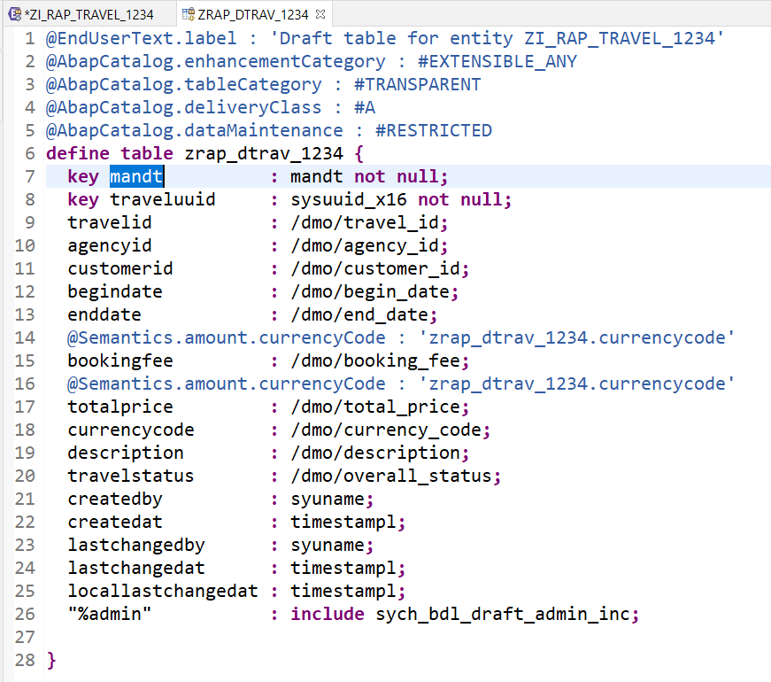
    
    >**Please note**   
    > Whenever you change the BO data model, you can again use the ADT _Quick Fix_ (*Ctrl+1*) to generate again the draft table definition. This will update the table definition.  
    
8.	Save , activate  and close the table.   
    
9.	Now also create the draft table for the _booking_ entity **`zrap_dbook_####`** using the ADT _Quick Fix_ (**Ctrl+1**).  
    
    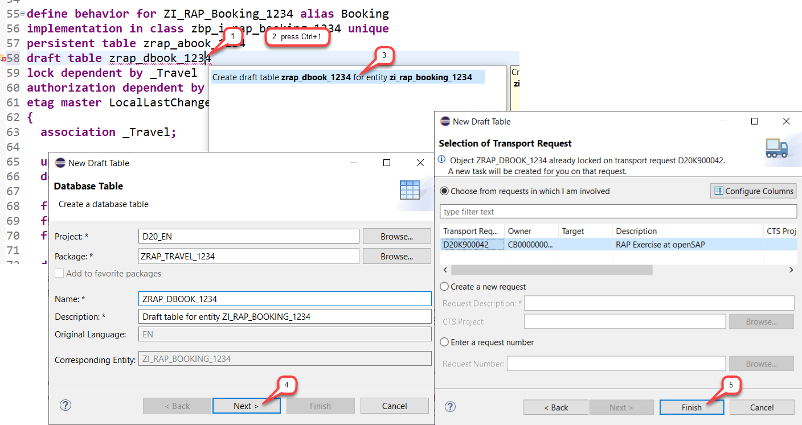
    
    The draft table is generated based on the defined model and shown in the appropriate editor.
    
    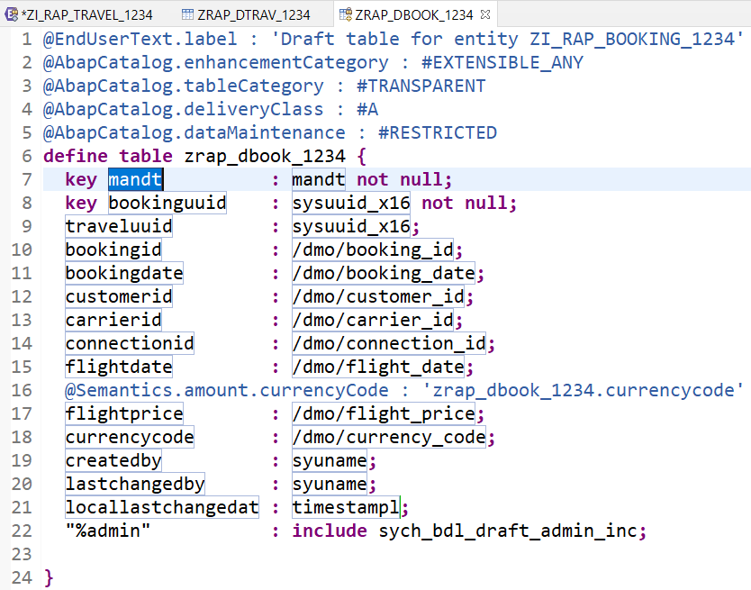
    
    > Note: As already mentioned, whenever you change the BO data model, you can again use the ADT _Quick Fix_ (*Ctrl+1*) to generate again the draft table definition. This will update the table definition.

10.	Save , activate  and close the table.  
    Some warnings are shown in the _Problem_ view. You will now work on removing them.
    
    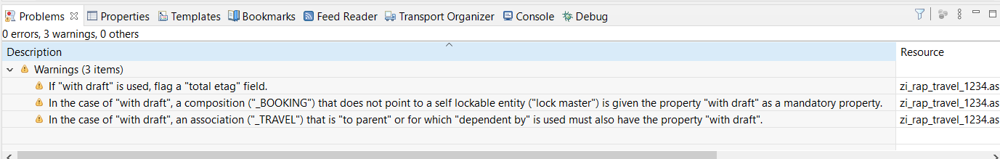  
    
11.	Replace the association definition in the base behavior definition to solve the warnings indicating that the associations are implicitly draft enabled as this is a draft enabled business object.  
    
    For this, use the code snippet provided below to replace the one currently defined in the  _travel_ behavior definition as shown on the screenshot.  
    
    <pre>
      association _Booking { create; with draft; }
    </pre>
    
    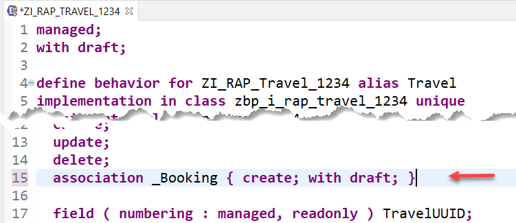
    
12.	Do the same for the **`_Travel`** association of the _booking_ entity.  
    
    For this, use the code snippet provided below to replace the one currently defined in the  _booking_ behavior definition as shown on the screenshot.  
    
    <pre>
      association _Travel { with draft; }
    </pre>
    
    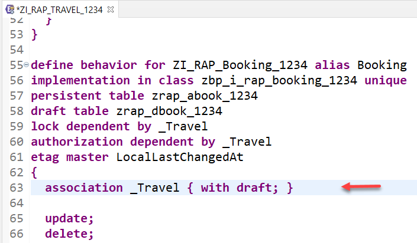
    
13.	Specify a _total etag field_ in the _root_ entity of your BO. This is required to identify changes to _active_ instances in cases where the durable lock has expired.
    The field **`LastChangedAt`** will be used for the purpose in the present scenario.  
      
    For this, use the code snippet provided below to replace the one currently defined in the  _travel_ behavior definition as shown on the screenshot.  
    
    <pre>
      lock master total etag LastChangedAt
    </pre>
    
    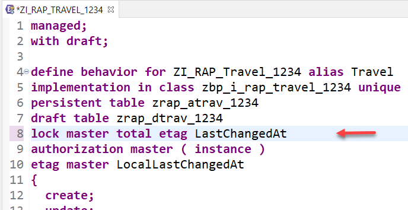

14.	When a draft instance is going to be activated, the SAP Fiori elements UI calls the _draft determine action_ **`prepare`** in the backend. This call takes place in a separate _OData changeset_ to allow for saving the state messages even in case the activation fails due to failing validations.  
    In order to execute the validations during prepare, you need to assign them to the **`draft determine action prepare`** trigger.  
        
    For this, insert the code snippet provided below into the  _travel_ behavior definition as shown on the screenshot.
    
    <pre>
      draft determine action Prepare  {
        validation validateAgency;
        validation validateCustomer;
        validation validateDates;
      }
    </pre>
    
    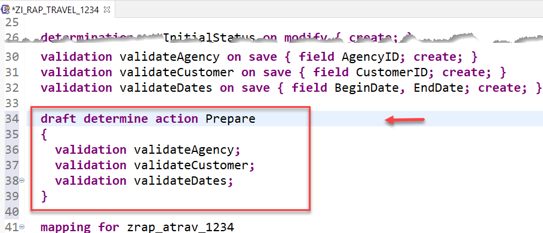  
    
15.	Save  and activate  the changes.  
    
## Step 2. Enable the draft handling in the projected business object
In order to enable the draft handling in your Travel app, you have to expose the functionality in the business object projection layer - i.e in the behavior definition projection.

1.	Open the _behavior definition projection_ **`ZC_RAP_Travel_####`** (where **`####`** is your chosen suffix) of your business object by either double-clicking on it in the _Project Explorer_ or using the shortcut **Ctrl+Shift+A** (_Open ABAP Development Object_). 
    
    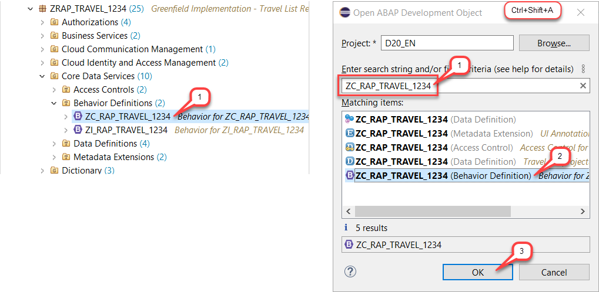
    
2.	Enable the draft handling in the projection, by adding the statement **`use draft;`** in the header section.  
    Otherwise the projection would behave like if no draft has been enabled for the business object. 
    
    <pre> use draft;</pre>
    
    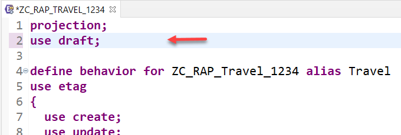  
    
3.	Enable the draft handling for the associations exposed in the projection. 
    For this, use the code snippets provided below to replace the respective statements in the behavior definition projection as shown on the screenshot.  
    
    Code snippet for the _travel_ entity:
    <pre>
      use association _Booking { create; with draft; }
    </pre>
    
    
    Code snippet for the _booking_ entity:
    <pre>
      use association _Travel { with draft; }
    </pre>
    
    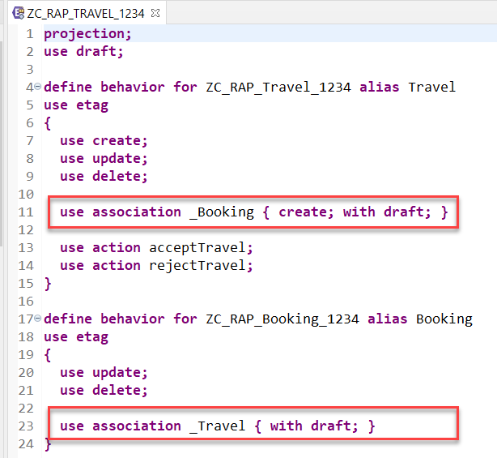
    
    
4.	**Restriction for OData V2:**   
    Because SAP Fiori elements-based UIs do not currently support the _Etag_ handling together with the draft handling for _OData V2_, you have to disable it in the projected behavior definition.    
    
    For this, just comment out (using **`//`**) the statement line **`use etag`** in the projection.  
    
    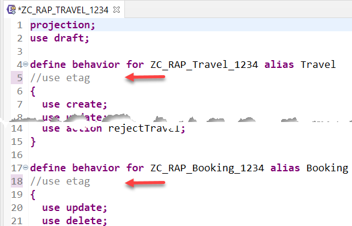  
    
5.	Save  and activate  the behavior definition projection.  
    
## Step 3. Adjust the business object behavior implementation
You will now perform some adjustment in the behavior implementation of you travel behavior to enable the consideration of the draft instances.

1.	Open the behavior implementation class **`ZBP_I_RAP_TRAVEL_####`** of the travel entity in the _Project Explorer_, where **`####`** is your chosen suffix.  
    
    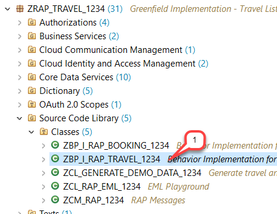  
    
2.	Navigate to the implementation of the method **`get_authorizations`**.  
    You can use the _Outline_ view or the ADT shortcut **Ctrl+O** for that.  
    
    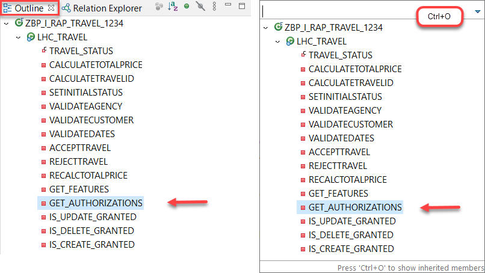  
     
3.	The introduction of _draft_ handling has added two predefined actions to the business object. The _draft determine action_ **`Prepare`** and the _draft action_ **`Edit`**.        
    Scroll down and uncomment the code lines for the actions **`Prepare`** and **`Edit`** in the **`COND`** constructor shown in the screenshots below.  
    
    This has to be done in two places in the source code. 
    Both methods are now also considered in the _authorization control_.

    First section:  
    
    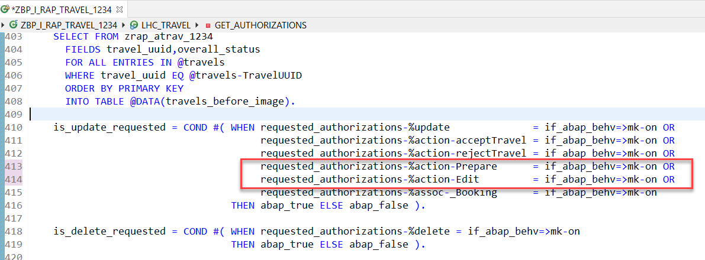
     
    Second section:  
    
    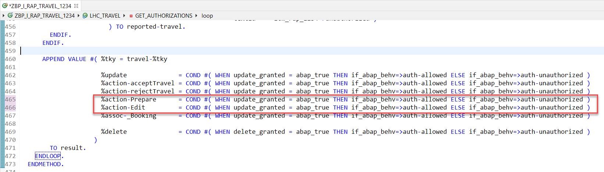 
     
4.	Save  and activate  the behavior implementation.  
    
## Step 4. Preview the enhanced Travel app & Play around
You are now done with the behavior implementations and can run and check the enhanced SAP Fiori elements Travel App.  

1.	Launch the _Travel app_ in your service binding **` ZUI_RAP_TRAVEL_O2_####`** – where **`####`** is your chosen suffix – or refresh (`F5`) it in the browser. Provide your ABAP user credentials if requested.  
    
    Press **Go** on the UI to load the back-end data.  
    
    First thing you will notice is a new filter field that allows for filtering on the _Editing Status_ is now displayed in the filter area.  
    
    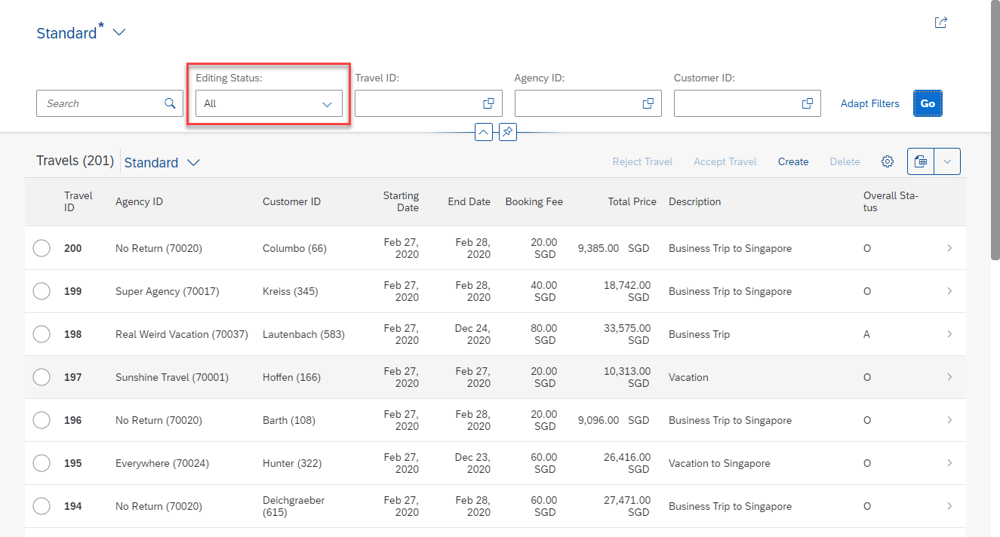        
     
2.	Feel free to play around with your app.  
    
    For example, create a new Travel.  
    
    In contrast to the non-draft use case, the _on-modify_ determination for defaulting the _status_ has already been executed.   
      
    While editing the fields on the object page, you immediately see the _draft saving_ indicator at the bottom.  
    
    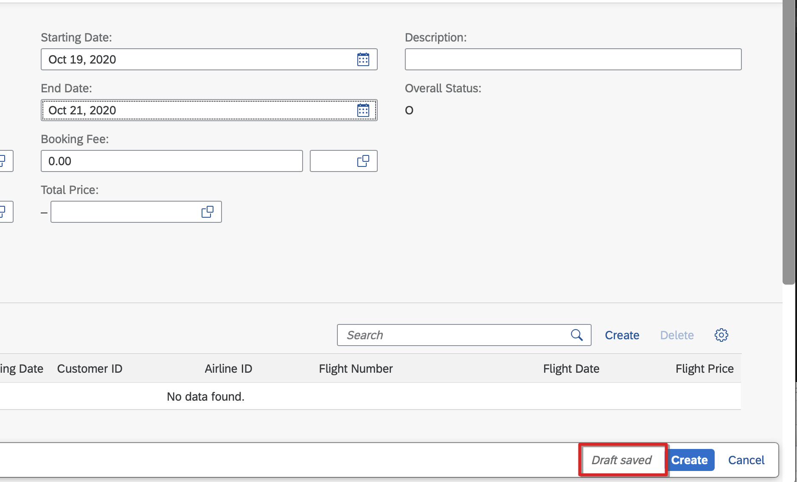 
    
    Checking the related _draft_ table in the backend shows you the entered values so far.
    
    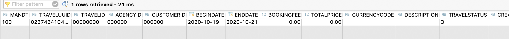 
    
    Provide an incorrect value for the agency ID (**`AgencyID`**) and correct values for the customer ID (**`CustomerID`**) as well as for the begin and (**`BeginDate`**) and end date (**`EndDate`**).    
    
    Choose **Save**.    
    
    You will get a corresponding message from the backend.  
    As this is a _state message_, it is stored on the database and belongs to the state of the business object instance.  
        
    You can leave the screen, filter for your new _travel_ record and you will see the messages directly when opening the object page, without re-validating the instance on the backend.   
    
    Correct the value and choose **Save**. 
    
    Now, the **`onSave`** determination is performed which calculates the **`TravelID`**. 
    
    Without the need to save, you can edit the _travel_ header along with the _booking_ entries.
        
## Summary
You have completed the exercise!   
In this unit, you have learned how to enable the draft handling in our travel business object.  
    
## Solution
Find the source code of the enhanced CDS behavior definitions (base and projection) and the adjusted behavior implementation class in  **[sources](/week3/sources)** folder:
- [W3U7_BDEF_ZI_RAP_TRAVEL_####](/week3/sources/W3U7_BDEF_ZI_RAP_TRAVEL.txt) 
- [W3U7_BDEF_ZC_RAP_TRAVEL_####](/week3/sources/W3U7_BDEF_ZC_RAP_TRAVEL.txt) 
- [W3U7_CLAS_ZBP_I_RAP_TRAVEL_####](/week3/sources/W3U7_CLAS_ZBP_I_RAP_TRAVEL.txt) 

Do not forget to replace all the occurrences of `####` in the copied source code with your chosen suffix.

## Next exercise
[Week 4: Dealing with Existing Code](/week4/README.md)
