# Creating the CDS Data Model

## Introduction  
In this hands-on exercise, you will define the travel and the booking interface views (aka BO views) of the CDS data model for your travel app. 
As datasources we will use the existing tables that have been delivered with the Flight Reference Scenario.
You can watch [unit 2 of week 4: Creating the Core Data Services (CDS) Data Model](https://open.sap.com/courses/cp13/items/5i3lzK55dAXkVr5U5pRgol) on the openSAP.com platform.
 
> > **Hints and Tips**    
> Speed up the typing by making use of the Code Completion feature (shortcut Ctrl+Space) and the prepared code snippets provided. 
> You can easily open an object with the shortcut *Ctrl+Shift+A*, format your source code using the Pretty Printer feature *Shift+F1* and toggle the fullscreen of the editor using the shortcut *Ctrl+M*.
>
> A great overview on ADT shortcuts can be found here: [Useful ADT Shortcuts](https://blogs.sap.com/2013/11/21/useful-keyboard-shortcuts-for-abap-in-eclipse/)
>
> Please note that the placeholder **`####`** used in object names in the exercise description must be replaced with the suffix of your choice during the exercises. The suffix can contain a maximum of 4 characters (numbers and letters).
> The screenshots in this document have been taken with the suffix `1234` and system `D20`. Your system id will be `TRL`.

> Please note that the ADT dialogs and views may change in the future due to software updates - i.e. new and/or optimized feature

Follow the instructions below.

## Step 1. Create the package
First create a new package to group the various development artefacts that you’re going to create during the brownfield implementation of our Travel App. It will be a sub-package of package **`ZRAP_####`** (where `####` is your chosen suffix) created in week 1 unit 6.  
  
1. Go to the Project explorer, right-click on your package **`ZRAP_####`** (where `####` is your chosen suffix) you created in week 1 unit 6 and choose the context menu entry **_New > ABAP Package_**.  
   
    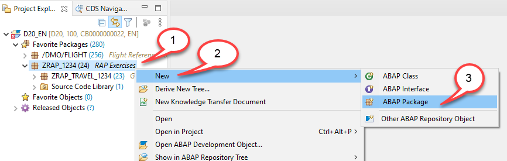
  
2. Maintain **`ZRAP_TRAVEL_U_####`** as name (where `####` is your chosen suffix and where `_U` indicates that this is an unmanged scenario) and a meaningful description (e.g. Brownfield Implementation - Travel List Report App) and choose **Next** to continue.  
The Project and the Superpackage fields are automatically assigned.

>Note: In some instances the Superpackage field is not automatically assigned. You then have to browse and search for the package or enter the name of the superpackage manually. It is the package ZRAP_#### (where #### is your chosen suffix) created in week 1 unit 6.
   

   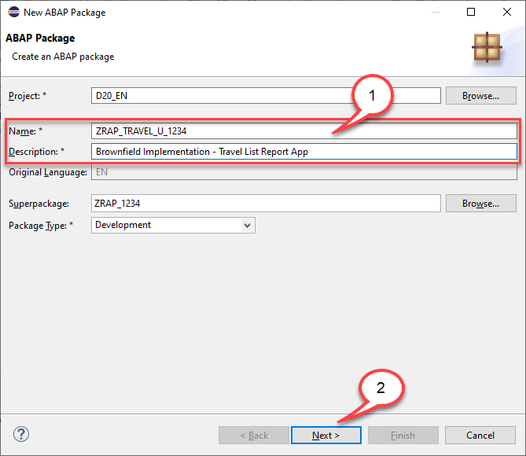
    
  
4. Select an existing transport request or create a new one and then choose **Finish** to create the new package.  
   

    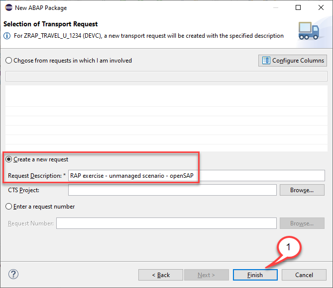
  

    The package is now created.  
   

    
  
5. Right-click on the new created package and choose  **Add to Favorites Packages** to add it to your favorites.  
   

    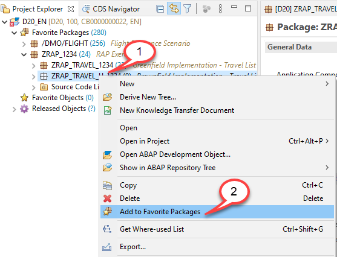
    

## Step 2. Add the package /DMO/FLIGHT to your Favorite Packages

1. Right-click on the folder **`Favorites Packages`** and choose **Add Package ...** from the context menu.

 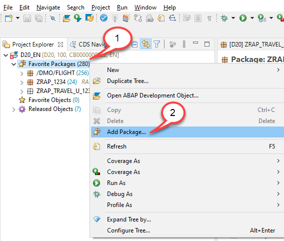
 
2. In the **Select an ABAP Package** dialogue start to type **/DMO/FLIGHT** and select **/DMO/FLIGHT** from the list of matching items and press **OK**.  
 
  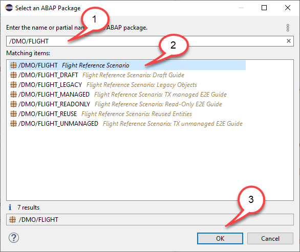

## Step 3: Create root view entity – Travel

Let’s start with the creation of our root interface view for the travel data. We will use the package **`ZRAP_TRAVEL_U_####`** that you have created beforehand.

For creating a data definition of a CDS view there is a new wizard available that allows you to create a new data definition from within the context menu of a table or a CDS view. In order to leverage this new wizard, do the following:

1. In the **`Favorites Packages`** folder expand the package **/DMO/FLIGHT** and then the sub-package **`/DMO/FLIGHT_LEGACY`**. Expand the folder Dictionary and then the folder Database Tables. 

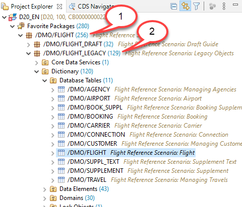

2. Right click on the table **`/DMO/Travel`** and select **`New Data Definition`**

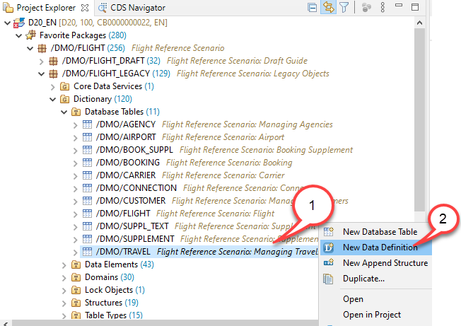

3. This will launch the new wizard in ADT that lets you conveniently create a CDS view based on a table or another CDS view. Here you should enter the following values

* Package Name: 	**`ZRAP_TRAVEL_U_####`**
* Name: 			**`ZI_RAP_TRAVEL_U_####`**
* Description:	    **`Travel data`**

The name of the referenced object will be **`/DMO/Travel`**. Press **Next**.

> **Hint:**

> When you are editing the name of the CDS view you will get the error message **Package and object must have the same namespace.** . This error message will vanish once you have replaced the package name **/DMO/FLIGHT_LEGACY** with the name of your package **ZRAP_TRAVEL_U_####**.

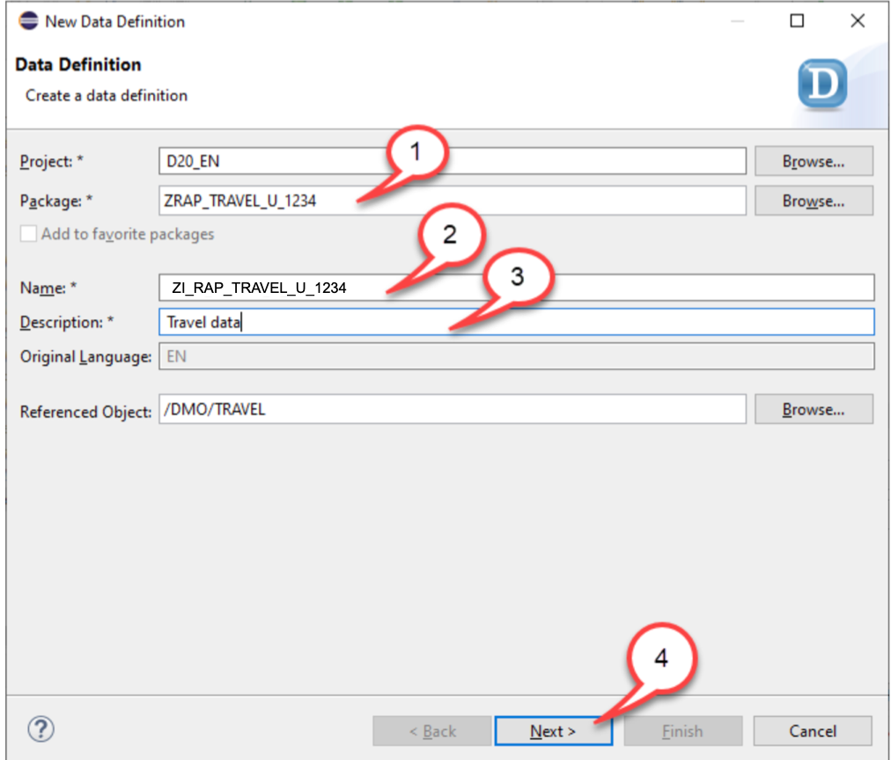

4. Select an existing transport request or create a new one and then choose **Next**.  

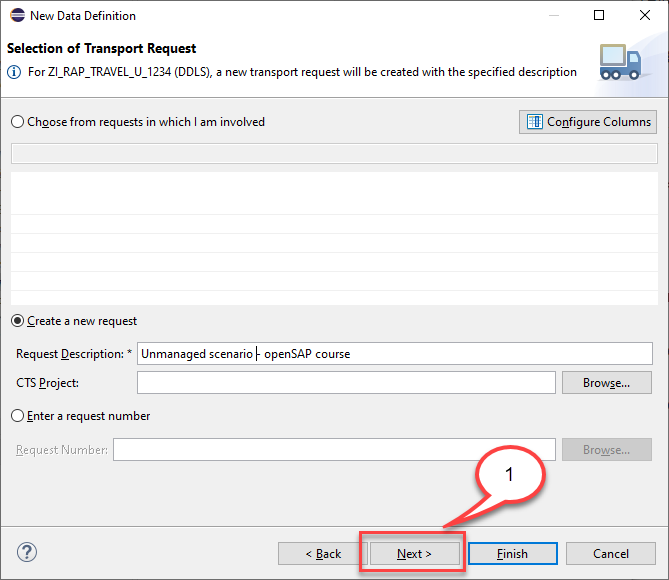

5. In the **New Data Definition** dialogue choose the template **Define View Entity** and press **Finish** to create the root view entity.

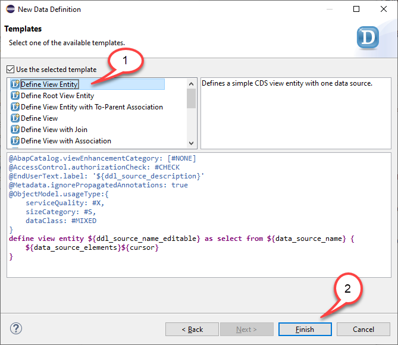

> **CDS View naming conventions**

> Since you have created a (public) interface view, it is prefixed with **`<namespace>I_`** in accordance with the VDM (virtual data  model) naming convention used in SAP S/4 HANA. 
> In addition, we add the suffix **`_U`** to the view name to indicate that it is specific for our unmanaged implementation type scenario. This way we also avoid name clashes with the repository objects that have been created for our managed scenario in week 2 and 3.
> Together with your four-digit group number **`####`** that is used as an additional suffix, your root entity will get the following name **`ZI_RAP_TRAVEL_U_####`**

> **Please note:**
> In SAP S/4 HANA 1909 you must choose the template **`Define View`** (instead of  **`Define View Entity`**) since view entities are only  supported in SAP S/4HANA as of the release 2020.

6. In the editor you will see the following template coding with the table name as the data source and all fields of the table filled in.

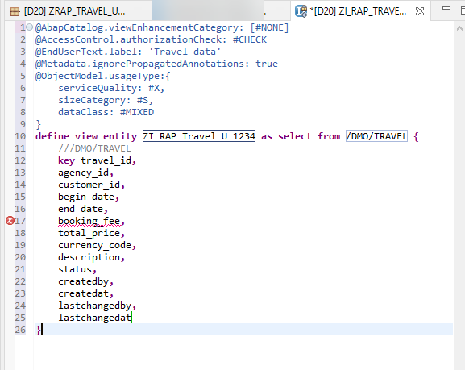

  We start editing the template by first adding the **`root`** key word.

<pre>
define <b>root</b> view entity ZI_RAP_Travel_U_#### as select from /DMO/TRAVEL {
    ///DMO/TRAVEL
    key travel_id,
....
</pre>

  and we add the following associations

<pre>
association [0..1] to /DMO/I_Agency   as _Agency   on $projection.AgencyID = _Agency.AgencyID
association [0..1] to /DMO/I_Customer as _Customer on $projection.CustomerID = _Customer.CustomerID
association [0..1] to I_Currency      as _Currency on $projection.CurrencyCode = _Currency.Currency
</pre>

  and in order to get nice field names, we will add aliases following a CamelCase notation for the database field names. This means that we add an alias as **`TravelID`** when the database field in name is **`travel_id`**.

  <pre>
  {
    key travel_id     as TravelID,
        agency_id     as AgencyID,     
      ....   
  }
  </pre>

7. To speed up the development we have prepared a code snippet for the DDL source code of the root and the child entity for you. This source code template also contains certain annotations. 
Replace the code of the travel data definition in the editor with the code snippet provided below and replace all occurrences of  `####` with your chosen suffix. 

   You can make use of the Replace All feature (**Ctrl+F**) in ADT for the purpose.  

   Save  the changes, but **DO NOT** activate the travel interface view yet.

<pre>
@EndUserText.label: 'Travel data'
@Metadata.ignorePropagatedAnnotations: true

define root view entity ZI_RAP_Travel_U_####
  as select from /dmo/travel as Travel

  association [0..1] to /DMO/I_Agency         as _Agency   on $projection.AgencyID = _Agency.AgencyID
  association [0..1] to /DMO/I_Customer       as _Customer on $projection.CustomerID = _Customer.CustomerID
  association [0..1] to I_Currency            as _Currency on $projection.CurrencyCode = _Currency.Currency

{
  key travel_id     as TravelID,
      agency_id     as AgencyID,
      customer_id   as CustomerID,
      begin_date    as BeginDate,
      end_date      as EndDate,
      @Semantics.amount.currencyCode: 'CurrencyCode'
      booking_fee   as BookingFee,
      @Semantics.amount.currencyCode: 'CurrencyCode'
      total_price   as TotalPrice,
      currency_code as CurrencyCode,
      description   as Description,
      status        as Status,
      @Semantics.user.createdBy: true
      createdby     as Createdby,
      @Semantics.systemDateTime.createdAt: true
      createdat     as Createdat,
      @Semantics.user.lastChangedBy: true
      lastchangedby as Lastchangedby,
      @Semantics.systemDateTime.lastChangedAt: true
      lastchangedat as Lastchangedat,
      
      /* associations */
     
      _Agency,
      _Customer,
      _Currency
}
</pre>

 **Short explanation: What has changed?**
    -	Following view annotations specified at the top of the data definition template have been removed, because they are not relevant for our scenario:
    <pre> 
    @AbapCatalog.viewEnhancementCategory: [#NONE]  
    @Metadata.ignorePropagatedAnnotations: true  
    @ObjectModel.usageType:{
        serviceQuality: #X,
        sizeCategory: #S,
        dataClass: #MIXED
    }
    </pre>  
    -	The alias **`Travel`**  is now specified for the data source using the keyword **`as`**.
    -	Associations are defined for the entities Agency (**`_Agency`**), Customer (**`_Customer`**) and Currency (**`_Currency`**) 
    – and exposed in the projection list.
    -	A CamelCase alias has been specified for each view element using the keyword **`as`**.   
    -	The annotation **`@semantics.amount.currencyCode`** is added for fields that contain amounts and it points to the field that contains the currency code.
    - In addition, we have added annotations to the administrative fields **`createdby`**, **`createdat`**, **`lastchangedby`** and **`lastchangedat`**. 
  
> **Hint:**
> If you are working on an SAP S/4HANA 1909 system you will have to add the annotation @Semantics.currencyCode to indicate that the field currencyCode is of type CUNIT since view entities are not available. If you try to use the annotation @Semantics.currencyCode in a view entity you will get the error message “Annotation Semantics.currencyCode is not allowed in view entities.” 

## Step 4 : Create a view entity for Booking data

As done before with the travel database table we will create a view entity for the booking data. 

1. Right click on the table **`/DMO/Booking`** and select **`New Data Definition`**

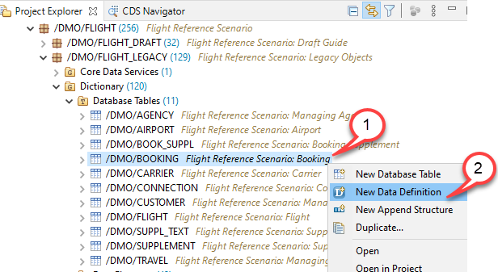

2. This will launch the new wizard in ADT that lets you conveniently create a CDS view based on a table or another CDS view. Here you should enter the following values

  - Package Name: 	**`ZRAP_TRAVEL_U_####`**
  - Name: 			**`ZI_RAP_BOOKING_U_####`**
  - Description:	    **`Booking data`**

  The name of the referenced object will be **`/DMO/Booking`**. Press **Next**.

  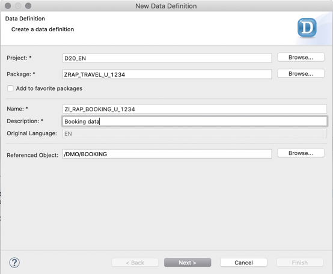

> Again we are following the naming convention of the VDM data model of SAP S/4HANA.
> - The namespace **`Z`**  
> - The prefix **`I_`** since it is an interface view  
> - The prefix **`RAP_`** we just use for this course  
> - **`Booking`** is the name of the entity 
> - The suffix **`_U`** indicates that we are using an unmanaged implementation 
> - The suffix **`_####`** we just use for this course to indicate your group number. 

4. Select an existing transport request or create a new one and then choose **Next**.  

5. In the **New Data Definition** dialogue choose the template **Define View Entity** and press **Finish** to create the root view entity.

6. The template will look as follows

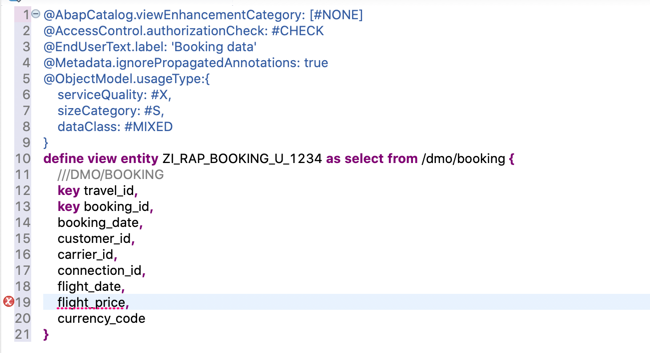

We start to edit the template by adding the following associations

<pre>
  association [1..1] to /DMO/I_Carrier              as _Carrier    on  $projection.CarrierID = _Carrier.AirlineID
  association [1..1] to /DMO/I_Customer             as _Customer   on  $projection.CustomerID = _Customer.CustomerID
  association [1..1] to /DMO/I_Connection           as _Connection on  $projection.CarrierID    = _Connection.AirlineID
                                                                   and $projection.ConnectionID = _Connection.ConnectionID
  association [1..1] to /DMO/I_Flight               as _Flight     on  $projection.CarrierID    = _Flight.AirlineID
                                                                   and $projection.ConnectionID = _Flight.ConnectionID
                                                                   and $projection.FlightDate   = _Flight.FlightDate
</pre>

  Then we edit the DDL source code between the curly brackets so that all fields get nice aliases and the field flight_price gets in addition  the annotation **`@Semantics.amount.currencyCode: 'CurrencyCode'`** that points to the field **`CurrencyCode`** that contains the currency code information.

7. To speed up the development we have prepared a code snippet for the DDL source code of the child entity for you. This source code template also contains certain annotations. 
Replace the code of the travel data definition in the editor with the code snippet provided below and replace all occurrences of  `####` with your chosen suffix. 

   You can make use of the Replace All feature (**Ctrl+F**) in ADT for the purpose.  

   Save  the changes, but **DO NOT** activate the travel interface view yet.

<pre>
@EndUserText.label: 'Booking data'
@Metadata.ignorePropagatedAnnotations: true

define view entity ZI_RAP_Booking_U_####
  as select from /dmo/booking
  
 

  association [1..1] to /DMO/I_Carrier    as _Carrier    on  $projection.CarrierID = _Carrier.AirlineID
  association [1..1] to /DMO/I_Customer   as _Customer   on  $projection.CustomerID = _Customer.CustomerID
  association [1..1] to /DMO/I_Connection as _Connection on  $projection.CarrierID    = _Connection.AirlineID
                                                         and $projection.ConnectionID = _Connection.ConnectionID
  association [1..1] to /DMO/I_Flight     as _Flight     on  $projection.CarrierID    = _Flight.AirlineID
                                                         and $projection.ConnectionID = _Flight.ConnectionID
                                                         and $projection.FlightDate   = _Flight.FlightDate

{
  key travel_id     as TravelID,
  key booking_id    as BookingID,
      booking_date  as BookingDate,
      customer_id   as CustomerID,
      carrier_id    as CarrierID,
      connection_id as ConnectionID,
      flight_date   as FlightDate,
      @Semantics.amount.currencyCode: 'CurrencyCode'
      flight_price  as FlightPrice,
      currency_code as CurrencyCode,

      /* associations */
      
      _Carrier,
      _Customer,
      _Connection,
      _Flight
  
}
</pre>

## Step 5. Activate your changes 

You can now activate your changes by pressing the “Activate inactive ABAP Development objects” button or by pressing “Ctrl+Shift+F3”

## Step 6. Check the data preview
You can now check that data is retrieved for both entities, the Travel data as well as the Booking Data.

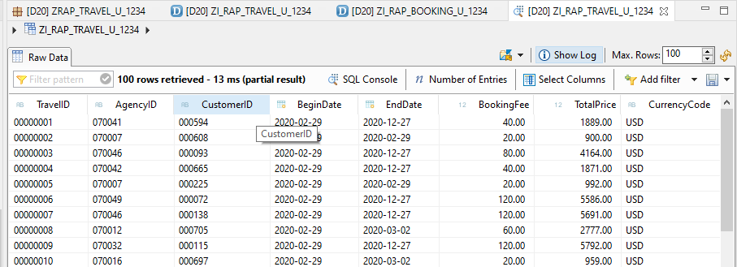

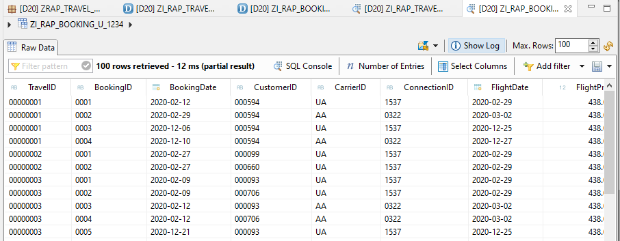

## Step 7. Add the composition associations 

After we have successfully activated both CDS interface views we will add the composition association that points from the Travel entity to the Booking entity and the association that points from the child entity Booking to the parent entity Travel, which is in this case also the root entity.

In the Travel CDS interface view we add a one-to-many [0..] cardinality since there can be many bookings for one travel entity.

<pre>
  <b>composition [0..*] of ZI_RAP_Booking_U_####  as _Booking</b>
  association [0..1] to /DMO/I_Agency         as _Agency   on $projection.AgencyID = _Agency.AgencyID
  association [0..1] to /DMO/I_Customer       as _Customer on $projection.CustomerID = _Customer.CustomerID
  association [0..1] to I_Currency            as _Currency on $projection.CurrencyCode = _Currency.Currency
</pre>

This new associations must also be published by adding them to the field list

<pre>
      /* associations */
      <b>_Booking,</b>
      _Agency,
      _Customer,
      _Currency
</pre>

**!!!** Do **NOT** activate your changes **!!!**

In the Booking CDS interface view we add an association that points back to the parent entity.

<pre>
  <b>association        to parent ZI_RAP_Travel_U_#### as _Travel     on  $projection.TravelID = _Travel.TravelID</b>
  association [1..1] to /DMO/I_Carrier    as _Carrier    on  $projection.CarrierID = _Carrier.AirlineID
  association [1..1] to /DMO/I_Customer   as _Customer   on  $projection.CustomerID = _Customer.CustomerID
  association [1..1] to /DMO/I_Connection as _Connection on  $projection.CarrierID    = _Connection.AirlineID
                                                         and $projection.ConnectionID = _Connection.ConnectionID
  association [1..1] to /DMO/I_Flight     as _Flight     on  $projection.CarrierID    = _Flight.AirlineID
                                                         and $projection.ConnectionID = _Flight.ConnectionID
                                                         and $projection.FlightDate   = _Flight.FlightDate
</pre>

It is here in the child entity where the cardinality and on condition is defined. 

Also this association has to be published by adding it to the field list of the Booking CDS interface view.

<pre>
      /* associations */
      <b>_Travel,</b>
      _Carrier,
      _Customer,
      _Connection,
      _Flight
  
</pre>

The DDL source code should now look like as follows:

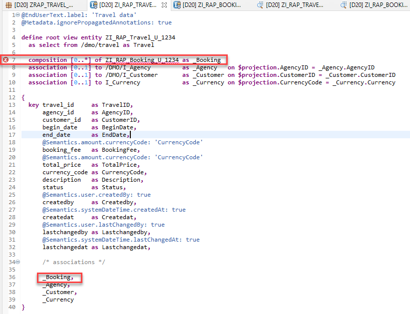

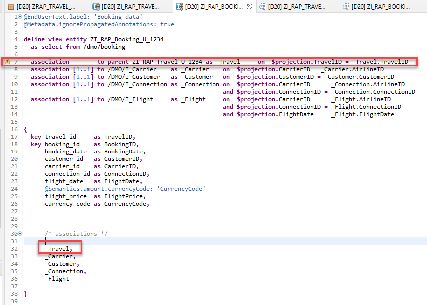

You will notice error messages such as Child entity *ZI_RAP_Booking_U_#### does not have a to-parent association with ZI_RAP_Travel_U_####* and *The passed entity ZI_RAP_Travel_U_#### does not have a composition definition for ZI_RAP_Booking_U_####*

You **must** now select **both CDS views** in the project Explorer and select **Activate**.

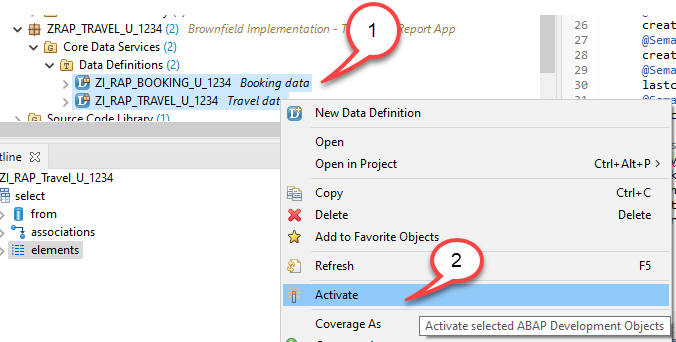

## Summary
You have completed the exercise!  
In this unit, you have learned 
-	About the Core Data Services (CDS) data model 
-	How to define the CDS data model and the business object 
   
## Solution
Find the source code of the created CDS data definitions in the **[/sources/](/week4/sources)** folder:

-	[W4U2_DDLS_ZI_RAP_Travel_U_####.txt](/week4/sources/W4U2_DDLS_ZI_RAP_Travel_U_%23%23%23%23.txt)
- [W4U2_DDLS_ZI_RAP_Booking_U_####.txt](/week4/sources/W4U2_DDLS_ZI_RAP_Booking_U_%23%23%23%23.txt)
      
Do not forget to replace all the occurrences of `####` with your chosen suffix in the copied source code.
       
## Next exercise
[Week 4 Unit 3: Defining and Implementing the Business Object Behavior](unit3.md)

