# Defining and Implementing the Business Object Behavior

## Introduction  
In this hands-on exercise, you will define and implement the behavior of our (unmanaged) business object. 

We will add a behavior to our business object **ZI_RAP_Travel_U_####** by creating a Behavior Definition (short BDEF) and a Behavior Implementation class (short BIL).

We will test the implementation of the `create` method by implementing an appropriate unit test that uses the Entity Manipulation Language (EML).

You can watch [unit 3 of week 4: Creating the Core Data Services (CDS) Data Model](https://open.sap.com/courses/cp13/items/2bf515bCLYhBPOAgZMzcJO) on the openSAP.com platform.
 
>> **Hints and Tips**    
> Speed up the typing by making use of the Code Completion feature (shortcut Ctrl+Space) and the prepared code snippets provided. 
> You can easily open an object with the shortcut *Ctrl+Shift+A*, format your source code using the Pretty Printer feature *Shift+F1* and toggle the fullscreen of the editor using the shortcut *Ctrl+M*.
>
> A great overview on ADT shortcuts can be found here: [Useful ADT Shortcuts](https://blogs.sap.com/2013/11/21/useful-keyboard-shortcuts-for-abap-in-eclipse/)
>
> Please note that the placeholder **`####`** used in object names in the exercise description must be replaced with the suffix of your choice during the exercises. The suffix can contain a maximum of 4 characters (numbers and letters).
> The screenshots in this document have been taken with the suffix `1234` and system `D20`. Your system id will be `TRL`.

> Please note that the ADT dialogs and views may change in the future due to software updates - i.e. new and/or optimized feature
Follow the instructions below.

## Step 1. Create Behavior Definition for Interface View ZI_RAP_TRAVEL_####

1. Right click on the root view **`ZI_RAP_Travel_U_####`** of your business object and choose **`New Behavior Definition`** from the context menu.

  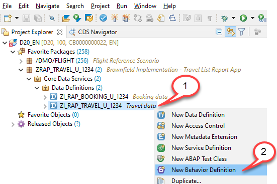

2. Here we must change the default setting **`Managed**`** for the **Implementation Type** to **`Unmanaged`**.
The name of the behavior definition cannot be changed. 
It must be the same as the name of the root view of your business object.
Leave the suggested values for Package **`ZRAP_TRAVEL_U_####**`** and Description **`Behavior for ZI_RAP_TRAVEL_U_1234`** unchanged and press **Next**.

  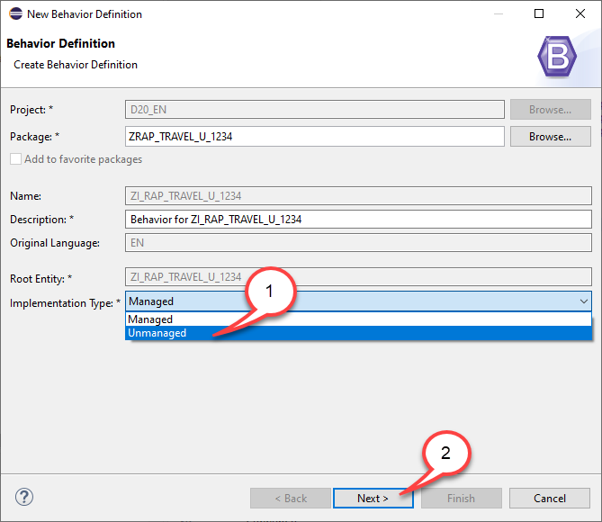

3. Select a transport request or create a new one.

  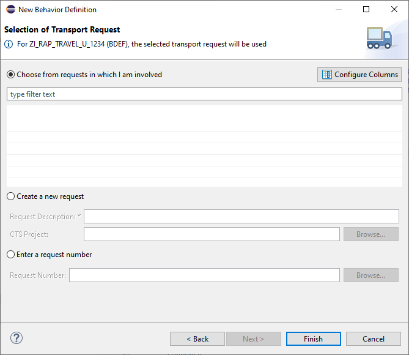

4. In the Project Explorer we can see a new sub-folder called **Behavior Definitions** in the folder **Core Data Services**.

   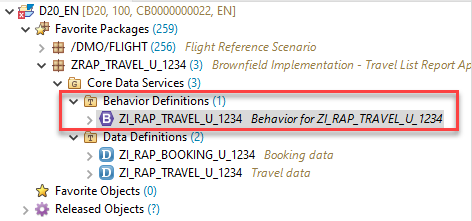

5. The wizard generates a BDEF file with default settings that we have to adjust.

   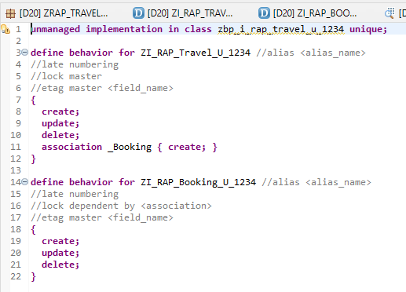

6. So we start with editing the behavior defintion for the Travel entity. 

  - Instead of using one behavior implementation class for the whole BDEF we will use separate behavior implementation classes for each entity of our business object. So, we move the statement **`implementation in class zbp_i_rap_travel_u_#### unique`** right behind the **`define behavior for`** statement of our Travel entity.
  
  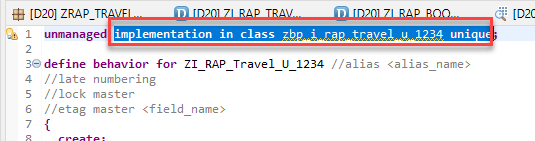

  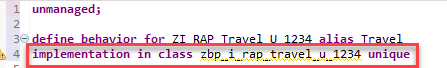
  
  -	We add an alias **`Travel`** in our behaviour definition for the interface view **`ZI_RAP_Travel_U_####`** <pre>  define behavior for ZI_RAP_Travel_U_9999 alias Travel </pre>
  
  -	We delete the whole code line that contains the following statement <pre>//late numbering</pre> since we do not want to use late numbering
  -	We uncomment the statement <pre>lock master</pre>
  -	And we uncomment the statement <pre>etag master</pre>. Using code completion after typing **`L`**, we can select the field **`LastChangeAt`**.

  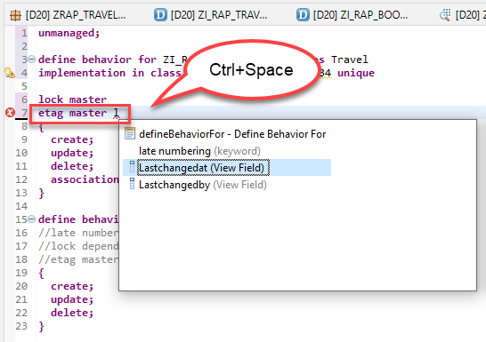

  - We leave the settings for the standard operations **`Create`**, **`Update`** and **`Delete`** and we also leave the setting that the association **`_Booking`** has been marked as create enabled.

6. Now we start editing the code in our behaviour definition for the Booking entity **`ZI_RAP_Booking_U_####`** 

  - Here we also add an alias **`Booking`** 
  - and we add the statement **`implementation in class zbp_i_rap_booking_u_#### unique`** right after the **`define behavior for`** statement for our Booking entity.

  - We again remove the statement for late numbering
  - We activate the **`lock dependent by`** statement and select the association **`_Travel`** via code-completion
  
  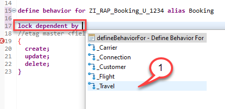
  
  - Since we do not use an etag master statement but choose the option that the etag depends on the root entity, we have to define **`etag dependent by _Travel`**

> At this point we will get an error message in the editor that states: "No behavior is defined for the association "_Travel" of entity "ZI_RAP_Booking_U_####".

 - So, we now must add the statement **`association _Travel`** in the curly brackets

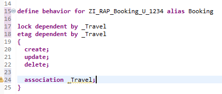

11. We remove the behavior **`create`** for the booking entity since booking data shall only be created using a **`create by association`** from an existing parent travel entity.

12. We now add a behavior for those fields, that should become read-only or mandatory

  - In Behavior definition code for the Travel Entity we add (in the curly braces)

  <pre>
    field ( read only ) TravelID;
    field ( mandatory ) AgencyID, CustomerID, BeginDate, EndDate;
  </pre>
  
  - In Behavior definition code for the Booking entity we add (in the curly braces)
<pre>
    field ( read only ) TravelID, BookingID;
    field ( mandatory ) BookingDate, CustomerID, CarrierId, ConnectionID, FlightDate;
</pre>

> This will also remove the warning that the field TRAVELID should be flagged as readonly or readonly:update

The coding of our behavior defintion should now look like follows

<pre>
unmanaged;

define behavior for ZI_RAP_Travel_U_#### alias Travel
implementation in class zbp_i_rap_travel_u_#### unique
lock master
etag master Lastchangedat
{
  create;
  update;
  delete;
  association _Booking { create; }

  field ( read only ) TravelID;
  field ( mandatory ) AgencyID, CustomerID, BeginDate, EndDate;

}

define behavior for ZI_RAP_Booking_U_#### alias Booking
implementation in class zbp_i_rap_booking_u_#### unique
lock dependent by _Travel
etag dependent by _Travel
{
  update;
  delete;
  association _Travel;

  field ( read only ) TravelID, BookingID;
  field ( mandatory ) BookingDate, CustomerID, CarrierId, ConnectionID, FlightDate;

}
</pre>

## Step 2. Create control structures and mappings

### Create mappings 

As a final step we can specify the mapping between the CDS view field names and the field names that are used by our legacy business logic, that means by our function modules that we use to create, update and delete travel data.

> [Further reading: Using Type and Control Mapping](https://help.sap.com/viewer/923180ddb98240829d935862025004d6/Cloud/en-US/0b143178489a4397a0eb5013d4c8b03d.html).

1. For this we have to add the following code for the mapping into behavior definition of the Travel entity.

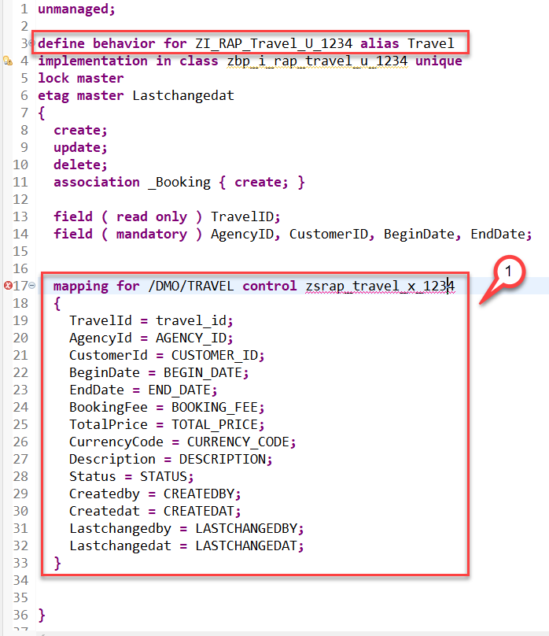

<pre>

  mapping for /DMO/TRAVEL control zsrap_travel_x_####
  {
    TravelId = travel_id;
    AgencyId = AGENCY_ID;
    CustomerId = CUSTOMER_ID;
    BeginDate = BEGIN_DATE;
    EndDate = END_DATE;
    BookingFee = BOOKING_FEE;
    TotalPrice = TOTAL_PRICE;
    CurrencyCode = CURRENCY_CODE;
    Description = DESCRIPTION;
    Status = STATUS;
    Createdby = CREATEDBY;
    Createdat = CREATEDAT;
    Lastchangedby = LASTCHANGEDBY;
    Lastchangedat = LASTCHANGEDAT;
  }

</pre>

2. And we add the following coding for the mapping into the behavior definition of the Booking entity.

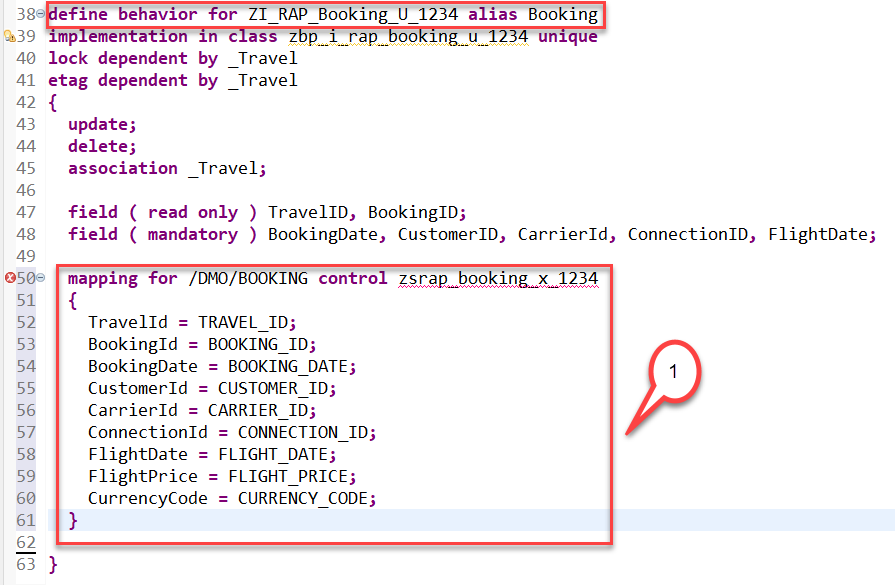

<pre>
 mapping for /DMO/BOOKING control zsrap_booking_x_####
  {
    TravelId = TRAVEL_ID;
    BookingId = BOOKING_ID;
    BookingDate = BOOKING_DATE;
    CustomerId = CUSTOMER_ID;
    CarrierId = CARRIER_ID;
    ConnectionId = CONNECTION_ID;
    FlightDate = FLIGHT_DATE;
    FlightPrice = FLIGHT_PRICE;
    CurrencyCode = CURRENCY_CODE;
  }
</pre>

> **Explanation:**

> When accessing the legacy code, the developer would normally have to use "move corresponding with mapping" in many places to map input derived types such as *type table for create*,  *type table for action import* to legacy types and vice versa to map legacy results to output derived types such as *type table for action result*, *type table for read result* or *failed*.
> In legacy scenarios that are based on BAPIs so called control structures or “x-structures” are used. 
> These structures have the same field name, but all beside the key fields have the same type char1 to tell the BAPI with the transferred value (TRUE or FALSE) whether data has been provided for the corresponding field.
> This type has the same function as the %CONTROL structure in input derived types, which indicates which of the fields in the main structure are accessed by an operation (update, read, and so on).
> But since the fieldnames in the %CONTROL structure differs from the one being used by BAPI’s we must perform a mapping here as well.
> The solution is now to introduce a central, declarative mapping within the behavior definition instead of many individual corresponding statements. 
> This improves maintainability of the application's source code.

### Create control structures

What is now left is to create two control structures **`zsrap_travel_x_####`**  and **`zsrap_booking_x_####`** needed for the mappings in the Behavior Definition.

1. Right click on the package and select **New > Other ABAP Repository Object**

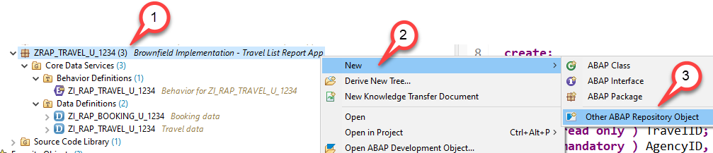

2. In the New ABAP Repository Object wizard 

   - Start to type `Structure`
   - From the list select `Structure`
   - and press **Next**
   
   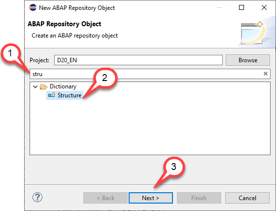
   
3. Enter the following values

   - Name: `zsrap_travel_x_####`
   - Description: `Control structure travel`
   - and press **Next**
   
   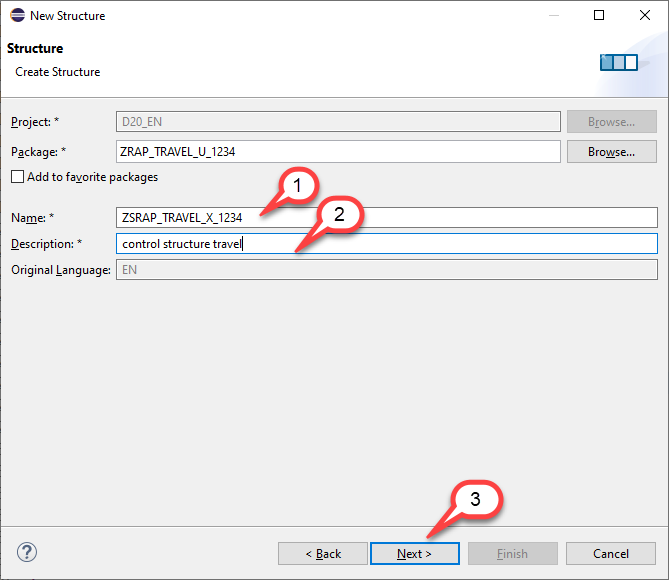
   
4. Selection of transport request
   - Select a transport request
   - Press **Finish**
   
   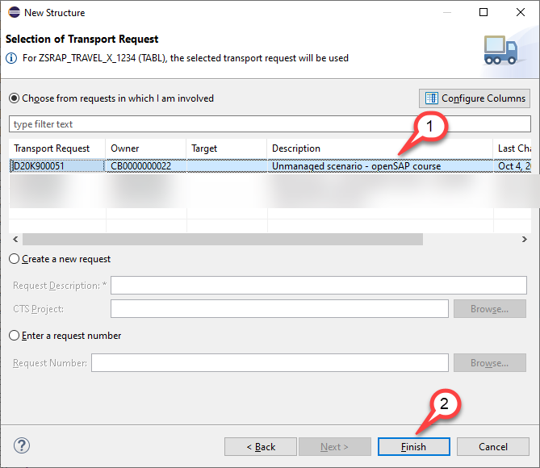

5. In the source code editor replace the coding of the template with the following coding

   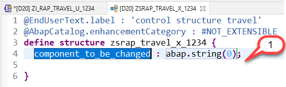

<pre>
@EndUserText.label : 'Control structure for Travel data'
@AbapCatalog.enhancementCategory : #NOT_EXTENSIBLE
define structure zsrap_travel_x_#### {
  agency_id     : xsdboolean;
  customer_id   : xsdboolean;
  begin_date    : xsdboolean;
  end_date      : xsdboolean;
  booking_fee   : xsdboolean;
  total_price   : xsdboolean;
  currency_code : xsdboolean;
  description   : xsdboolean;
  status        : xsdboolean;

}
</pre>

> Please note: The field names of the structure are the same as the field names of your table. But the datatype is `xsdboolean` for all of them.

6. Save  and Activate  your changes 

7. Now we create a second control structure for the Booking entity
   
   - Right click on the folder `Structures`
   - Select `New Structure`
   
   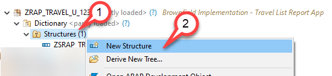
   
8. Enter the following values

   - Name: `zsrap_booking_x_####`
   - Description: `control structure booking`
   - and press **Next**
   
   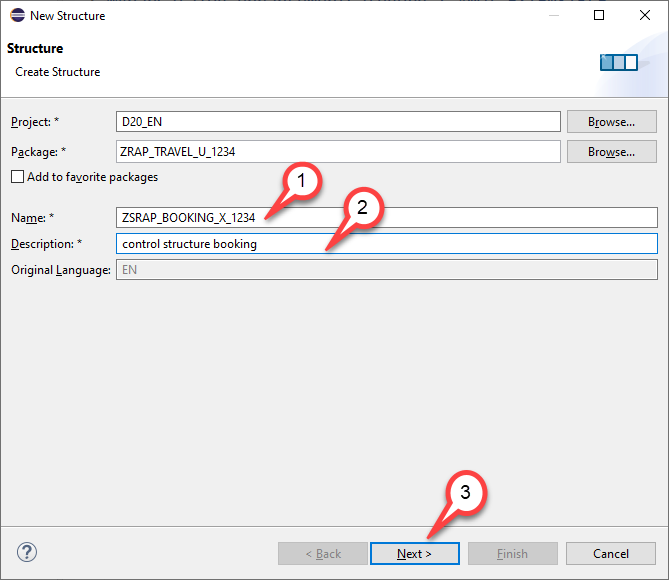

9. Selection of transport request
   - Select a transport request
   - Press **Finish**
   
   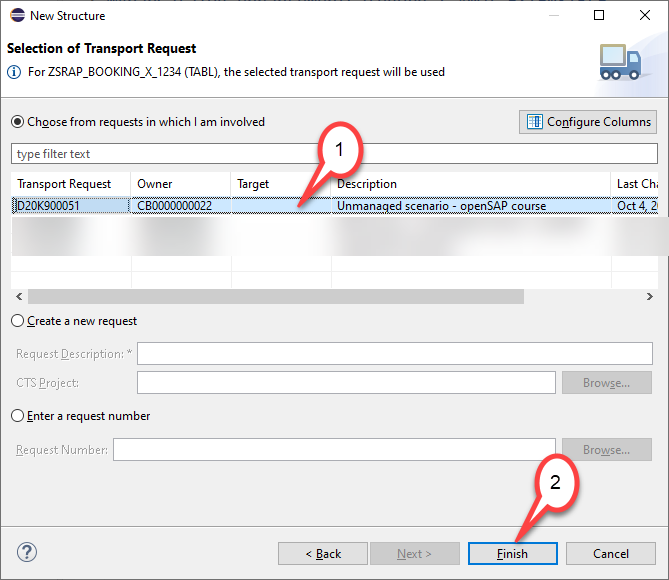

10. In the source code editor replace the coding of the template with the following coding

   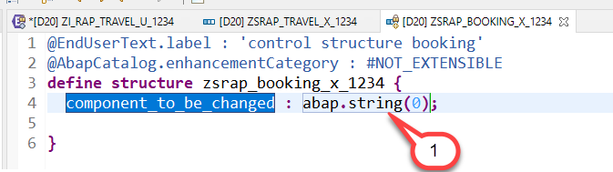

<pre>
@EndUserText.label : 'control structure for Booking'
@AbapCatalog.enhancementCategory : #NOT_EXTENSIBLE
define structure zsrap_booking_x_#### {
  booking_date  : xsdboolean;
  customer_id   : xsdboolean;
  carrier_id    : xsdboolean;
  connection_id : xsdboolean;
  flight_date   : xsdboolean;
  flight_price  : xsdboolean;
  currency_code : xsdboolean;

}
</pre>

> Please note: Also here the field names of the structure are the same as the field names of your table. But the datatype is `xsdboolean` for all of them.

11. Save and Activate  your changes 

> When we now check the coding of our behavior definition, we see that the errors indicating that the structures are missing are gone
because we have created those control structures and the only thing that is left is that we have to create the **behavior implementation classes**, which we'll do in a second in the next step.

 > Recap:
 
 > What have we achieved? So, we have created an unmanaged behavior definition. We have specified the names for the behavior implementation classes; separate ones for each entity. We have defined the standard operations, create, update and delete, that should be later on implemented in the behavior implementation class. The create enabled association that points from Travel to Booking. We have specified fields, which are mandatory and read only. This we will see later in the UI. And we have defined a central mapping for the legacy business logic, including control structures. The code of your behavior defintion should now look like follows.

<pre>
unmanaged;
define behavior for ZI_RAP_Travel_U_1234 alias Travel
implementation in class zbp_i_rap_travel_u_1234 unique

lock master
etag master Lastchangedat
{
  create;
  update;
  delete;
  association _Booking { create; }

  field ( read only ) TravelID;
  field ( mandatory ) AgencyID, CustomerID, BeginDate, EndDate;

  mapping for /DMO/TRAVEL control zsrap_travel_x_1234
  {
    TravelId = travel_id;
    AgencyId = AGENCY_ID;
    CustomerId = CUSTOMER_ID;
    BeginDate = BEGIN_DATE;
    EndDate = END_DATE;
    BookingFee = BOOKING_FEE;
    TotalPrice = TOTAL_PRICE;
    CurrencyCode = CURRENCY_CODE;
    Description = DESCRIPTION;
    Status = STATUS;
    Createdby = CREATEDBY;
    Createdat = CREATEDAT;
    Lastchangedby = LASTCHANGEDBY;
    Lastchangedat = LASTCHANGEDAT;
  }

}

define behavior for ZI_RAP_Booking_U_1234 alias Booking
implementation in class zbp_i_rap_booking_u_1234 unique
lock dependent by _Travel
etag dependent by _Travel
{
  update;
  delete;
  association _Travel;

  field ( read only ) TravelID, BookingID;
  field ( mandatory ) BookingDate, CustomerID, CarrierId, ConnectionID, FlightDate;

  mapping for /DMO/BOOKING control zsrap_booking_x_1234
  {
    TravelId = TRAVEL_ID;
    BookingId = BOOKING_ID;
    BookingDate = BOOKING_DATE;
    CustomerId = CUSTOMER_ID;
    CarrierId = CARRIER_ID;
    ConnectionId = CONNECTION_ID;
    FlightDate = FLIGHT_DATE;
    FlightPrice = FLIGHT_PRICE;
    CurrencyCode = CURRENCY_CODE;
  }

}

</pre>

## Step 3. Create and implement the behavior implementation (BIL) class for the Travel entity

Now we create the behavior implementation class, but since the coding for the BDEF is not yet active, we have first to activate it. And then we can press, again, CTRL+1 and create the behavior implementation class for the travel. 

1. Activate your behavior definition by pressing the **Activate** button  if you have not already done so. 

2. In order to create the behavior implementation class for the travel entity, we can use a quick fix. We can select the class name in the behavior definition and press CTRL + 1.
   - Select the name of the behavior implementation class `zbp_i_rap_travel_u_####`
   - Press **Ctrl+1**
   - Double click on the proposal `Create behavior implementation class`**`zbp_i_rap_travel_u_####`**

   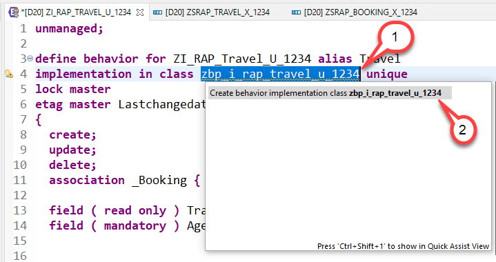

3. Create the behavior implementation class for the **Travel** entity.

   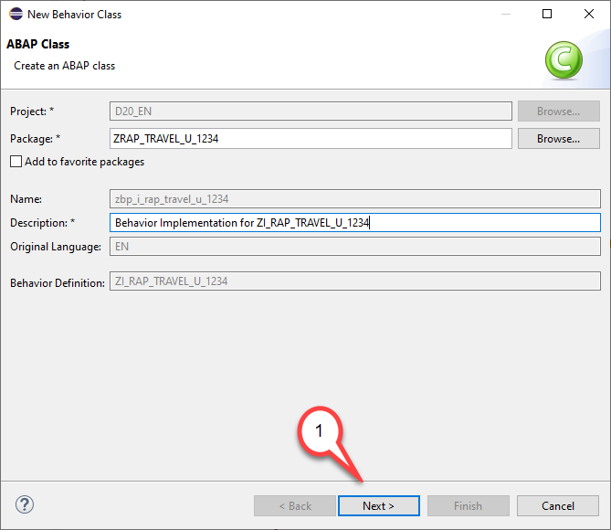
  
4. Selection of a transport request
   - Select a transport request
   - Press **Finish**
   
   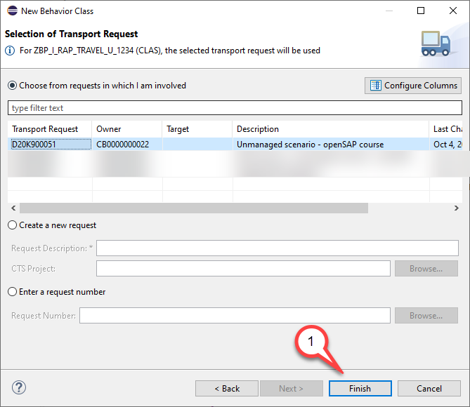

5. Check the generated code template of the Travel BIL:

   for example you see  
   - a create method that will be called when creating a travel entity and 
   - a delete method if a travel entity is going to be deleted,
   from the signature.
   
   > Please note that this is a **local class** `lhc_travel` which inherits from `cl_abap_behavior_handler`.
   
   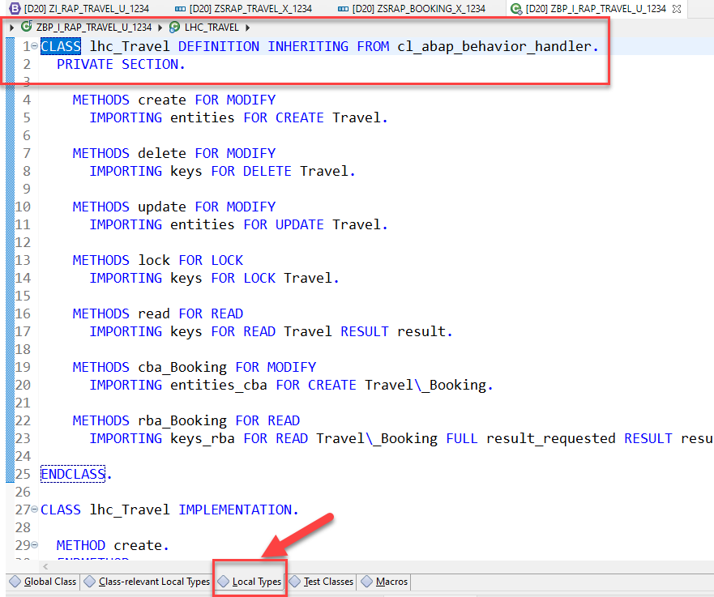
   
6.  We will start by implementing the **create** method and use the prepared coding. 
  
     - Navigate to the implemenation section of the class
     - Copy and paste the prepared coding for the create method into the source code template

    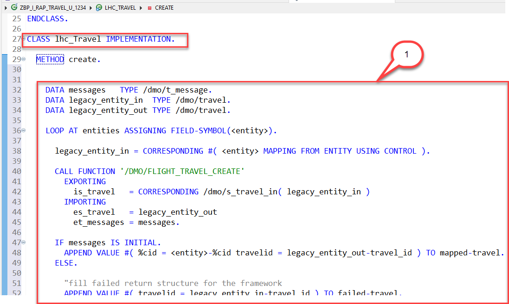

> Coding explained

> We get input data from the data in the payload via the internal table `entities`.
 > When looping over this data we are using the central mapping and the control structure to specify which fields shall be used to create new travel entities. The data is moved to the structure `legacy_entity_in structure`, which has the same type as the structure `/DMO/FLIGHT_TRAVEL_CREATE` which is accepted by our legacy API. 
> When the creation of new travel data was successful there is no message being returned by the legacy API. This is typical for BAPIs and we append then the content id **%cid**  and the **travel_ID** to the **mapped-travel** structure. 
> And if something goes wrong, the **failed** and the **reported** structure will be filled so that the error can be displayed on the UI.

<pre>
  METHOD create.

    DATA messages   TYPE /dmo/t_message.
    DATA legacy_entity_in  TYPE /dmo/travel.
    DATA legacy_entity_out TYPE /dmo/travel.
    LOOP AT entities ASSIGNING FIELD-SYMBOL(&ltentity&gt).

      legacy_entity_in = CORRESPONDING #( &ltentity&gt MAPPING FROM ENTITY USING CONTROL ).

      CALL FUNCTION '/DMO/FLIGHT_TRAVEL_CREATE'
        EXPORTING
          is_travel   = CORRESPONDING /dmo/s_travel_in( legacy_entity_in )
        IMPORTING
          es_travel   = legacy_entity_out
          et_messages = messages.

      IF messages IS INITIAL.
        APPEND VALUE #( %cid = &ltentity&gt-%cid travelid = legacy_entity_out-travel_id ) TO mapped-travel.
      ELSE.

        "fill failed return structure for the framework
        APPEND VALUE #( travelid = legacy_entity_in-travel_id ) TO failed-travel.
        "fill reported structure to be displayed on the UI
        APPEND VALUE #( travelid = legacy_entity_in-travel_id
                        %msg = new_message( id = messages[ 1 ]-msgid
                                            number = messages[ 1 ]-msgno
                                            v1 = messages[ 1 ]-msgv1
                                            v2 = messages[ 1 ]-msgv2
                                            v3 = messages[ 1 ]-msgv3
                                            v4 = messages[ 1 ]-msgv4
                                            severity = CONV #( messages[ 1 ]-msgty ) )
       ) TO reported-travel.

      ENDIF.

    ENDLOOP.
    
  ENDMETHOD.
</pre>

7. We then have to navigate from the local handler class `lhc_Travel`, which is responsible for maintaining the data in the buffer, to the local saver class `lsc_ZI_RAP_Travel_U_####`. Here we are implementing the **save** method where we will call the legacy API, the function module `/DMO/FLIGHT_TRAVEL_SAVE`, which is persisting the data from the buffer, which is shared by the legacy function modules, down to the database. 

  - Add the following code to implement that **save** method
  
<pre>
  METHOD save.
    CALL FUNCTION '/DMO/FLIGHT_TRAVEL_SAVE'.
  ENDMETHOD.
</pre>

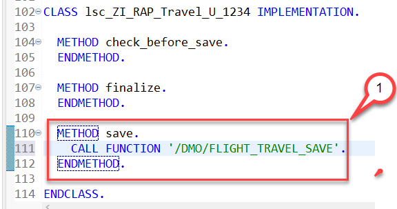

8. Save and Activate  your changes 

## Step 4. Testing the BO with EML

So, how are we now going to test whether our implementation works? We could either proceed as we did last time, that means we could publish the service and then use the preview functionality to test the service.
Here we will show a different way. We will first start to implement a unit test, which is always a good practice. 

We are hence navigating to the tab `test classes`.

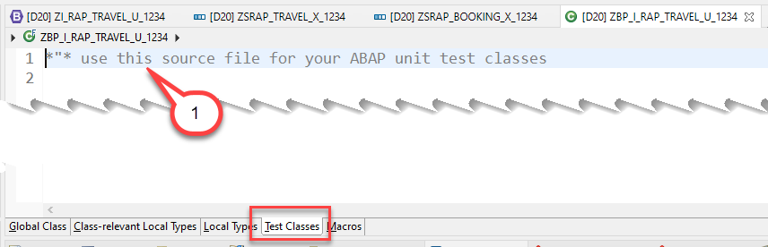

1. Implement the test class ltcl_integration_test

   - Copy and paste the prepared code  [source code unit tests](sources/W4U3_CLAS_TEST_ZBP_I_RAP_TRAVEL_U_%23%23%23%23.txt)
   
<pre>
    CLASS ltcl_integration_test DEFINITION FINAL FOR TESTING
     DURATION SHORT
     RISK LEVEL HARMLESS.

     PRIVATE SECTION.

        CLASS-DATA:
         cds_test_environment TYPE REF TO if_cds_test_environment.

        CLASS-METHODS:
         class_setup,
         class_teardown.
        METHODS:
         setup,
         teardown.
        METHODS:
         create_travel FOR TESTING RAISING cx_static_check.
    ENDCLASS.

    CLASS ltcl_integration_test IMPLEMENTATION.

     METHOD create_travel.

      DATA(today) = cl_abap_context_info=>get_system_date( ).
      DATA travels_in TYPE TABLE FOR CREATE zi_rap_travel_U_####\\travel.

      travels_in = VALUE #(     ( agencyid      = 070001   "Agency 070001 does exist, Agency 1 does not exist
                                customerid    = 1
                                begindate     = today
                                enddate       = today + 30
                                bookingfee    = 30
                                totalprice    = 330
                                currencycode  = 'EUR'
                                description   = |Test travel XYZ|
                               ) ).

      MODIFY ENTITIES OF zi_rap_travel_u_####
        ENTITY travel
           CREATE FIELDS (    agencyid
                              customerid
                              begindate
                              enddate
                              bookingfee
                              totalprice
                              currencycode
                              description
                              Status )
             WITH travels_in
        MAPPED   DATA(mapped)
        FAILED   DATA(failed)
        REPORTED DATA(reported).

      cl_abap_unit_assert=>assert_initial( failed-travel ).
      cl_abap_unit_assert=>assert_initial( reported-travel ).
      COMMIT ENTITIES.

      DATA(new_travel_id) = mapped-travel[ 1 ]-TravelId.

      SELECT * FROM zi_rap_travel_u_#### WHERE TravelId = @new_travel_id INTO TABLE @DATA(lt_travel)  .

      cl_abap_unit_assert=>assert_not_initial( lt_travel ).

      cl_abap_unit_assert=>assert_not_initial(
           VALUE #( lt_travel[  TravelID = new_travel_id ] OPTIONAL )
         ).
      cl_abap_unit_assert=>assert_equals(
          exp = 'N'
          act = lt_travel[ TravelID = new_travel_id ]-Status
        ).
    ENDMETHOD.

    METHOD class_setup.
      cds_test_environment = cl_cds_test_environment=>create_for_multiple_cds(
          i_for_entities = VALUE #( ( i_for_entity = 'zi_rap_travel_u_####' )
                                  ( i_for_entity = 'zi_rap_booking_u_####' ) )
                                ).
    ENDMETHOD.

    METHOD class_teardown.
      cds_test_environment->destroy( ).
    ENDMETHOD.

    METHOD setup.
    ENDMETHOD.

    METHOD teardown.
      ROLLBACK ENTITIES.
      cds_test_environment->clear_doubles( ).
    ENDMETHOD.

ENDCLASS.

</pre>

   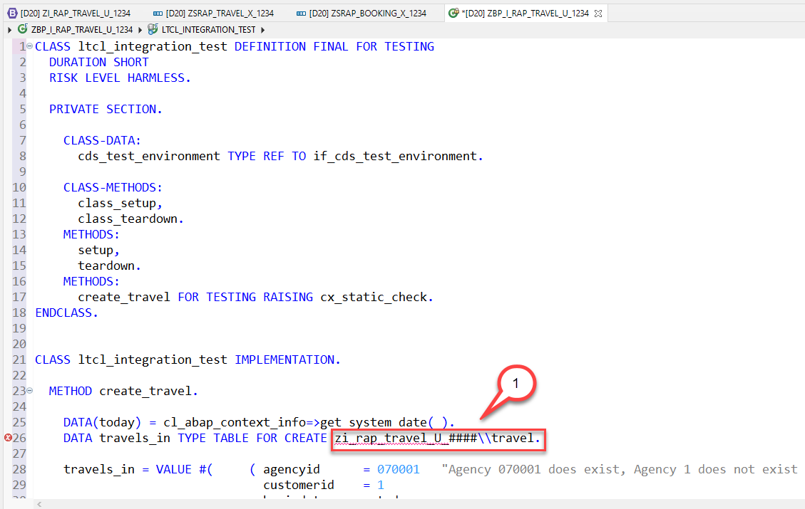

   - Replace the placeholder `####` with your group number using the **Find/Replace** dialog.

   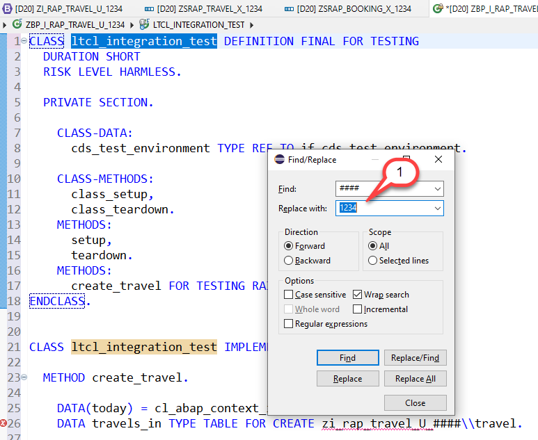

2. Save and Activate  your changes 

> What does this coding do? We are using the CDS test double framework and we are creating data for a single travel in `travels_in`. For this we are using **EML**, the *Entity Manipulation Language* and use the statement 
<pre>
MODIFY ENTITIES OF zi_rap_travel_u_####
      ENTITY travel 
      CREATE FIELDS (    agencyid
                              customerid
                              begindate
                              enddate
                              bookingfee
                              totalprice
                              currencycode
                              description
                              Status )
             WITH travels_in
         MAPPED   DATA(mapped)
         FAILED   DATA(failed)
         REPORTED DATA(reported).
</pre>

Using the assert statements

<pre>
    cl_abap_unit_assert=>assert_initial( failed-travel ).
    cl_abap_unit_assert=>assert_initial( reported-travel ).
</pre>

we are checking that the return structures `failed` and `reported`, that would indicate an error, are empty.
If this is true, we commit the data to the test double framework tables.
Then we select the data again from the CDS interface view of the test double framework. And we can check whether the data has been correctly created.

Further down we see the coding of the method `class_setup`, this method creates the double test framework for the two interface views for travel and booking.

<pre>
  METHOD class_setup.
    cds_test_environment = cl_cds_test_environment=>create_for_multiple_cds(
        i_for_entities = VALUE #( ( i_for_entity = 'zi_rap_travel_u_####' )
                                  ( i_for_entity = 'zi_rap_booking_u_####' ) )
                                ).
  ENDMETHOD.
</pre>

4. Now we select the class in the project explorer.

5. From the menu choose **Run > Run as > ABAP Unit Test** or use the shortcut  **CTRL+Shift+F10**

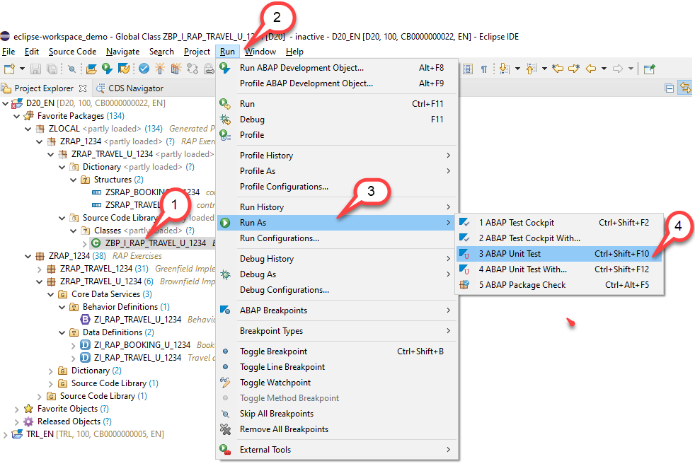

5. Check whether the test was successful. 

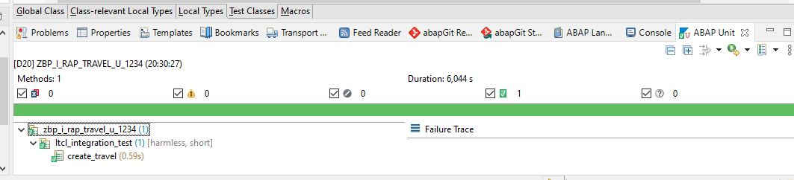

## Step5. Implement the remaining methods for the Travel entity

What is now left is the implementation of all the other methods. Please replace the methods in your class with copy and paste from the code sections below.

### Delete

The `delete` method, just gets the keys of the entities that shall be deleted. Within the loop we call the function module `/DMO/FLIGHT_TRAVEL_DELETE` that deletes a travel entity. When the deletion was successful the actual key value is appended to the internal table mapped-travel.

<pre>
METHOD delete.

    DATA messages TYPE /dmo/t_message.

    LOOP AT keys ASSIGNING FIELD-SYMBOL(&ltkey&gt).

      CALL FUNCTION '/DMO/FLIGHT_TRAVEL_DELETE'
        EXPORTING
          iv_travel_id = &ltkey&gt-travelid
        IMPORTING
          et_messages  = messages.

      IF messages IS INITIAL.

        APPEND VALUE #( travelid = &ltkey&gt-travelid ) TO mapped-travel.

      ELSE.

        "fill failed return structure for the framework
        APPEND VALUE #( travelid = &ltkey&gt-travelid ) TO failed-travel.
        "fill reported structure to be displayed on the UI
        APPEND VALUE #( travelid = &ltkey&gt-travelid
                        %msg = new_message( id = messages[ 1 ]-msgid
                                            number = messages[ 1 ]-msgno
                                            v1 = messages[ 1 ]-msgv1
                                            v2 = messages[ 1 ]-msgv2
                                            v3 = messages[ 1 ]-msgv3
                                            v4 = messages[ 1 ]-msgv4
                                            severity = CONV #( messages[ 1 ]-msgty ) )
       ) TO reported-travel.

      ENDIF.

    ENDLOOP.

  ENDMETHOD.
</pre>

Save  and Activate  your changes. 

### Update

Using the `update` method we can update the data. Here we are, again, getting the data as entities. 

The data is again mapped according to our central mapping, and we are using the control structure as well.

We are then able to call the travel update function module `/DMO/FLIGHT_TRAVEL_UPDATE`.

<pre>

 METHOD update.

    DATA legacy_entity_in   TYPE /dmo/travel.
    DATA legacy_entity_x  TYPE /dmo/s_travel_inx . "refers to x structure (> BAPIs)
    DATA messages TYPE /dmo/t_message.

    LOOP AT entities ASSIGNING FIELD-SYMBOL(&ltentity&gt).

      legacy_entity_in = CORRESPONDING #( &ltentity&gt MAPPING FROM ENTITY ).
      legacy_entity_x-travel_id = &ltentity&gt-TravelID.
      legacy_entity_x-_intx = CORRESPONDING zsrap_travel_x_####( &ltentity&gt MAPPING FROM ENTITY ).

      CALL FUNCTION '/DMO/FLIGHT_TRAVEL_UPDATE'
        EXPORTING
          is_travel   = CORRESPONDING /dmo/s_travel_in( legacy_entity_in )
          is_travelx  = legacy_entity_x
        IMPORTING
          et_messages = messages.

      IF messages IS INITIAL.

        APPEND VALUE #( travelid = legacy_entity_in-travel_id ) TO mapped-travel.

      ELSE.

        "fill failed return structure for the framework
        APPEND VALUE #( travelid = legacy_entity_in-travel_id ) TO failed-travel.
        "fill reported structure to be displayed on the UI
        APPEND VALUE #( travelid = legacy_entity_in-travel_id
                        %msg = new_message( id = messages[ 1 ]-msgid
                                            number = messages[ 1 ]-msgno
                                            v1 = messages[ 1 ]-msgv1
                                            v2 = messages[ 1 ]-msgv2
                                            v3 = messages[ 1 ]-msgv3
                                            v4 = messages[ 1 ]-msgv4
                                            severity = CONV #( messages[ 1 ]-msgty ) )
       ) TO reported-travel.

      ENDIF.

    ENDLOOP.

  ENDMETHOD.

</pre>

Save  and Activate  your changes 

### Lock

We also have implemented the lock method, which would perform a locking in order to avoid, when an update is performed, that there are two updates happening at the same time.

<pre>
  METHOD lock.

  "Instantiate lock object
    DATA(lock) = cl_abap_lock_object_factory=>get_instance( iv_name = '/DMO/ETRAVEL' ).

    LOOP AT keys ASSIGNING FIELD-SYMBOL(&ltkey&gt).
      TRY.
          "enqueue travel instance
          lock->enqueue(
              it_parameter  = VALUE #( (  name = 'TRAVEL_ID' value = REF #( &ltkey&gt-travelid ) ) )
          ).
          "if foreign lock exists
        CATCH cx_abap_foreign_lock INTO DATA(lx_foreign_lock).

          "fill failed return structure for the framework
          APPEND VALUE #( travelid = &ltkey&gt-travelid ) TO failed-travel.
          "fill reported structure to be displayed on the UI
          APPEND VALUE #( travelid = &ltkey&gt-travelid
                          %msg = new_message( id = '/DMO/CM_FLIGHT_LEGAC'
                                              number = '032'
                                              v1 = &ltkey&gt-travelid
                                              v2 = lx_foreign_lock->user_name
                                              severity = CONV #( 'E' ) )
         ) TO reported-travel.

      ENDTRY.
    ENDLOOP.

  ENDMETHOD.
</pre>

Save  and Activate  your changes 

### Read

The read method is used to read data from the buffer rather than from the database. This is for example needed, when doing updates, because we are using ETags. The function module `/DMO/FLIGHT_TRAVEL_READ` is used to read the data from the buffer of our legacy API.

<pre>

 METHOD read.

    DATA: legacy_entity_out TYPE /dmo/travel,
          messages          TYPE /dmo/t_message.

    LOOP AT keys INTO DATA(key) GROUP BY key-TravelId.

      CALL FUNCTION '/DMO/FLIGHT_TRAVEL_READ'
        EXPORTING
          iv_travel_id = key-travelid
        IMPORTING
          es_travel    = legacy_entity_out
          et_messages  = messages.

      IF messages IS INITIAL.
        "fill result parameter with flagged fields

        INSERT CORRESPONDING #( legacy_entity_out MAPPING TO ENTITY ) INTO TABLE result.

      ELSE.
      
        "fill failed return structure for the framework
        APPEND VALUE #( travelid = key-travelid ) TO failed-travel.
      
        LOOP AT messages INTO DATA(message).

          "fill reported structure to be displayed on the UI
          APPEND VALUE #( travelid = key-travelid
                          %msg = new_message( id = message-msgid
                                              number = message-msgno
                                              v1 = message-msgv1
                                              v2 = message-msgv2
                                              v3 = message-msgv3
                                              v4 = message-msgv4
                                              severity = CONV #( message-msgty ) )

         ) TO reported-travel.
        ENDLOOP.
      ENDIF.

    ENDLOOP.

  ENDMETHOD.

</pre>

Save  and Activate  your changes 

### create by association - cba_Booking

In our demo application, we assume that new bookings cannot be created separately but can only in conjunction with a given travel instance. The fact that new instances of the bookings can only be created for a specific travel instance is considered in
the behavior definition by the _Booking association:
<pre>association _Booking { create; }</pre>
This behavior is implemented in the create by association booking method. This method is executed when a booking is created via the Travel parent entity.

<pre>

METHOD cba_Booking.

    DATA messages        TYPE /dmo/t_message.
    DATA lt_booking_old     TYPE /dmo/t_booking.
    DATA entity         TYPE /dmo/booking.
    DATA last_booking_id TYPE /dmo/booking_id VALUE '0'.

    LOOP AT entities_cba ASSIGNING FIELD-SYMBOL(&ltentity_cba&gt).

      DATA(travelid) = &ltentity_cba&gt-travelid.

      CALL FUNCTION '/DMO/FLIGHT_TRAVEL_READ'
        EXPORTING
          iv_travel_id = travelid
        IMPORTING
          et_booking   = lt_booking_old
          et_messages  = messages.

      IF messages IS INITIAL.

        IF lt_booking_old IS NOT INITIAL.

          last_booking_id = lt_booking_old[ lines( lt_booking_old ) ]-booking_id.

        ENDIF.

        LOOP AT &ltentity_cba&gt-%target ASSIGNING FIELD-SYMBOL(&ltentity&gt).

          entity = CORRESPONDING #( &ltentity&gt MAPPING FROM ENTITY USING CONTROL ) .

          last_booking_id += 1.
          entity-booking_id = last_booking_id.

          CALL FUNCTION '/DMO/FLIGHT_TRAVEL_UPDATE'
            EXPORTING
              is_travel   = VALUE /dmo/s_travel_in( travel_id = travelid )
              is_travelx  = VALUE /dmo/s_travel_inx( travel_id = travelid )
              it_booking  = VALUE /dmo/t_booking_in( ( CORRESPONDING #( entity ) ) )
              it_bookingx = VALUE /dmo/t_booking_inx(
                (
                  booking_id  = entity-booking_id
                  action_code = /dmo/if_flight_legacy=>action_code-create
                )
              )
            IMPORTING
              et_messages = messages.

          IF messages IS INITIAL.

            INSERT
              VALUE #(
                %cid = &ltentity&gt-%cid
                travelid = travelid
                bookingid = entity-booking_id
              )
              INTO TABLE mapped-booking.

          ELSE.

            INSERT VALUE #( %cid = &ltentity&gt-%cid travelid = travelid ) INTO TABLE failed-booking.
 
            LOOP AT messages INTO DATA(message) WHERE msgty = 'E' OR msgty = 'A'.

             INSERT
                VALUE #(
                  %cid     = &ltentity&gt-%cid
                  travelid = &ltentity&gt-TravelID
                  %msg     = new_message(
                    id       = message-msgid
                    number   = message-msgno
                    severity = if_abap_behv_message=>severity-error
                    v1       = message-msgv1
                    v2       = message-msgv2
                    v3       = message-msgv3
                    v4       = message-msgv4
                  )
                )
                INTO TABLE reported-booking.

            ENDLOOP.

          ENDIF.

        ENDLOOP.

      ELSE.

        "fill failed return structure for the framework
        APPEND VALUE #( travelid = travelid ) TO failed-travel.
        "fill reported structure to be displayed on the UI
        APPEND VALUE #( travelid = travelid
                        %msg = new_message( id = messages[ 1 ]-msgid
                                            number = messages[ 1 ]-msgno
                                            v1 = messages[ 1 ]-msgv1
                                            v2 = messages[ 1 ]-msgv2
                                            v3 = messages[ 1 ]-msgv3
                                            v4 = messages[ 1 ]-msgv4
                                            severity = CONV #( messages[ 1 ]-msgty ) )
       ) TO reported-travel.

      ENDIF.

    ENDLOOP.

  ENDMETHOD.

</pre>

Save  and Activate  your changes 

### read by association - rba_Booking

And last but not least, there is coding for the read by association booking, similar to the read method for the Travel entity. This would read booking data from the buffer. 

<pre>

  METHOD rba_Booking.

    DATA: legacy_parent_entity_out  TYPE /dmo/travel,
          legacy_entities_out TYPE /dmo/t_booking,
          entity     LIKE LINE OF result,
          message     TYPE /dmo/t_message.

    LOOP AT keys_rba  ASSIGNING FIELD-SYMBOL(&ltkey_rba&gt) GROUP  BY &ltkey_rba&gt-TravelId.

      CALL FUNCTION '/DMO/FLIGHT_TRAVEL_READ'
        EXPORTING
          iv_travel_id = &ltkey_rba&gt-travelid
        IMPORTING
          es_travel    = legacy_parent_entity_out
          et_booking   = legacy_entities_out
          et_messages  = message.

      IF message IS INITIAL.

        LOOP AT legacy_entities_out ASSIGNING FIELD-SYMBOL(&ltfs_booking&gt).
          "fill link table with key fields

          INSERT
            VALUE #(
                source-%key = &ltkey_rba&gt-%key
                target-%key = VALUE #(
                  TravelID  = &ltfs_booking&gt-travel_id
                  BookingID = &ltfs_booking&gt-booking_id
              )
            )
            INTO TABLE  association_links .

          "fill result parameter with flagged fields
          IF result_requested = abap_true.

            entity = CORRESPONDING #( &ltfs_booking&gt MAPPING TO ENTITY ).
            INSERT entity INTO TABLE result.

          ENDIF.

        ENDLOOP.

      ELSE.
        "fill failed table in case of error

        failed-travel = VALUE #(
          BASE failed-travel
          FOR msg IN message (
            %key = &ltkey_rba&gt-TravelID
            %fail-cause = COND #(
              WHEN msg-msgty = 'E' AND  ( msg-msgno = '016' OR msg-msgno = '009' )
              THEN if_abap_behv=>cause-not_found
              ELSE if_abap_behv=>cause-unspecific
            )
          )
        ).

      ENDIF.

    ENDLOOP.

  ENDMETHOD.

</pre>

Save  and Activate  your changes 

## Step6. Implement the methods for the Booking entity

Now we create the behavior implementation class for the Booking entity.  

1. Activate your behavior definition by pressing the **Activate** button  if you have not already done so. 

2. In order to create the behavior implementation class for the booking entity, we can also use a quick fix. 

   - Select the name of the behavior implementation class `zbp_i_rap_booking_u_####`
   - Press **Ctrl+1**
   - Double click on the proposal `Create behavior implementation class`**`zbp_i_rap_booking_u_####`**

   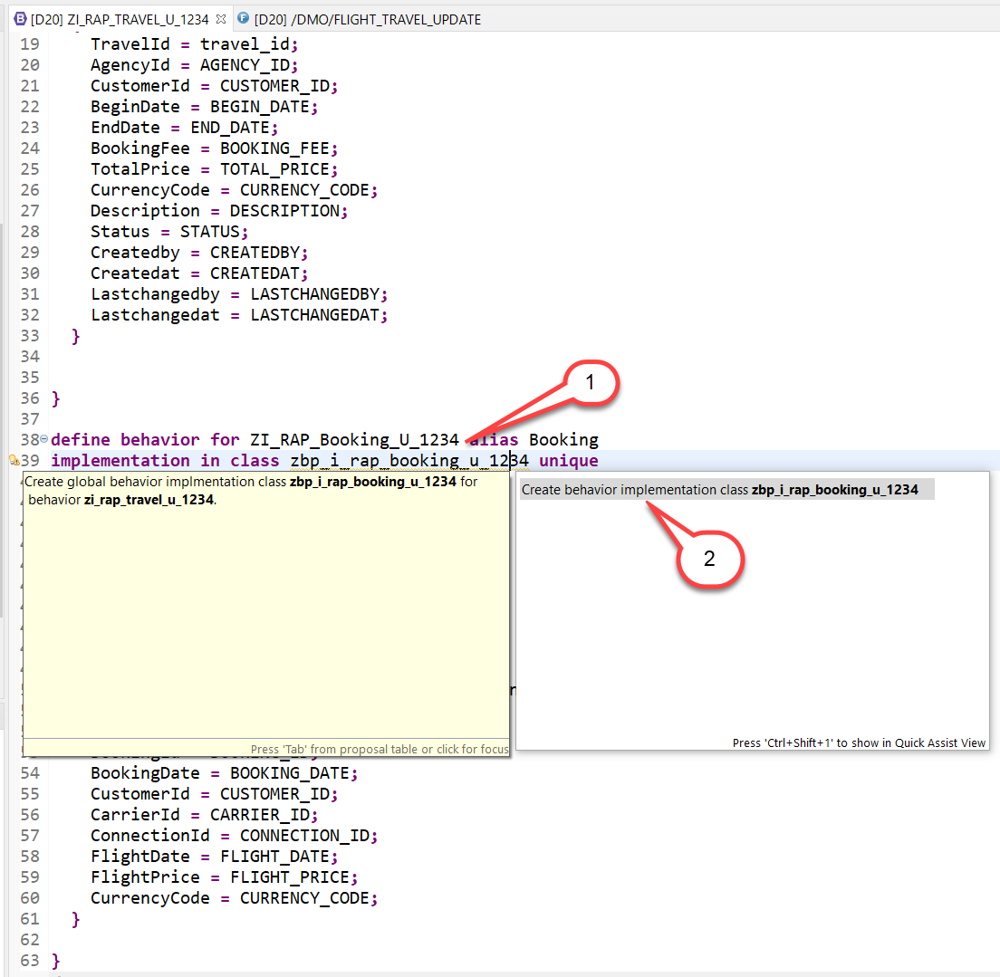

3. In the **New behavior class** dialogue create the behavior implementation class for the **Booking** entity and press **Next**.

   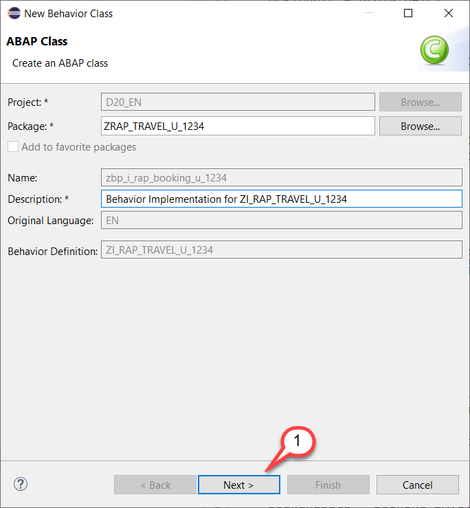
  
4. Selection of a transport request
   - Select a transport request
   - Press **Finish**
   
   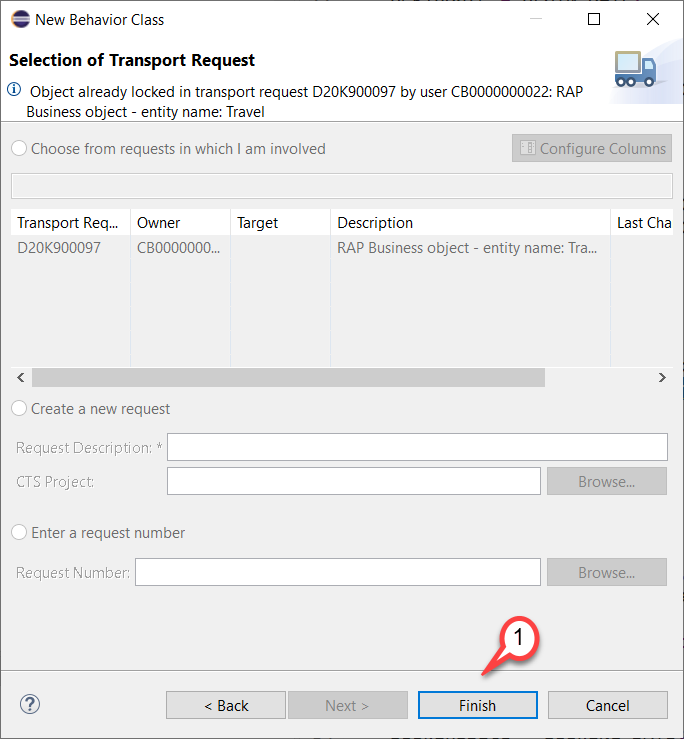

5. Check the generated code template of the Bookin BIL:

   for example you see  
   - a delete method that will be called when deleting a booking entity and 
   - a update method if a booking entity is going to be updated,
   from the signature.
   
   > Please note that this is a **local class** `lhc_Booking` which inherits from `cl_abap_behavior_handler`.
   
   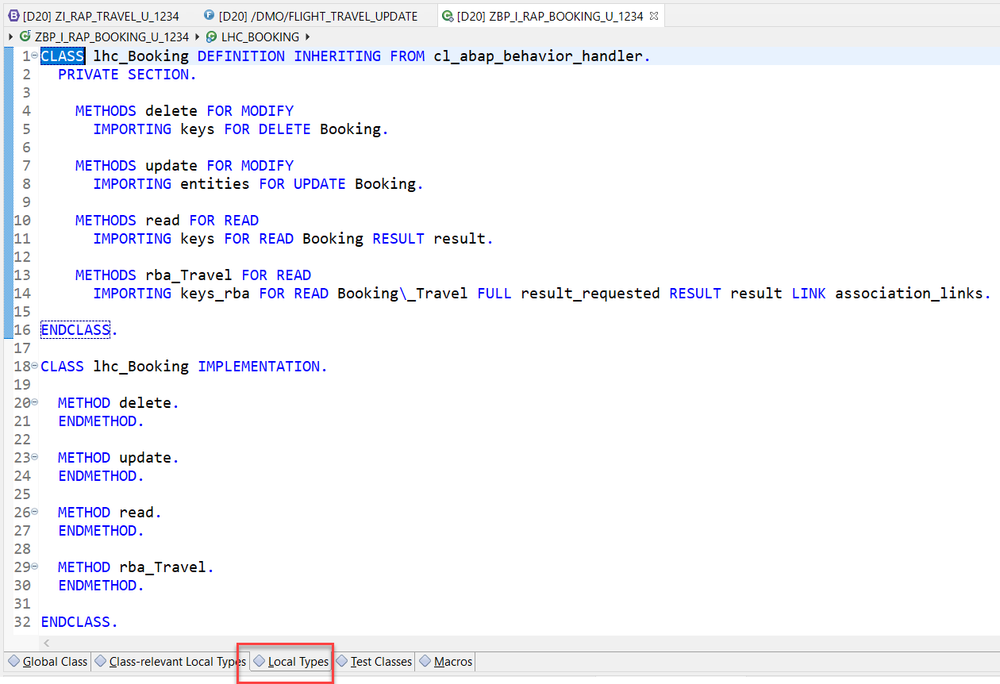
   
6.  We will start by implementing the **delete** method and use the prepared coding. 

### delete

The delete methods get a list of keys `travelid` and `bookingid` of the booking entities that shall be deleted. To delete booking entities using the legacy API we will use the function module `/DMO/FLIGHT_TRAVEL_UPDATE`. 

<pre>
  METHOD delete.

    DATA messages TYPE /dmo/t_message.

    LOOP AT keys ASSIGNING FIELD-SYMBOL(&ltkey&gt).

      CALL FUNCTION '/DMO/FLIGHT_TRAVEL_UPDATE'
        EXPORTING
          is_travel   = VALUE /dmo/s_travel_in( travel_id = &ltkey&gt-travelid )
          is_travelx  = VALUE /dmo/s_travel_inx( travel_id = &ltkey&gt-travelid )
          it_booking  = VALUE /dmo/t_booking_in( ( booking_id = &ltkey&gt-bookingid ) )
          it_bookingx = VALUE /dmo/t_booking_inx( ( booking_id  = &ltkey&gt-bookingid
                                                    action_code = /dmo/if_flight_legacy=&gtaction_code-delete ) )
        IMPORTING
          et_messages = messages.

      IF messages IS INITIAL.

        APPEND VALUE #( travelid = &ltkey&gt-travelid
                       bookingid = &ltkey&gt-bookingid ) TO mapped-booking.

      ELSE.

        "fill failed return structure for the framework
        APPEND VALUE #( travelid = &ltkey&gt-travelid
                        bookingid = &ltkey&gt-bookingid ) TO failed-booking.

        LOOP AT messages INTO DATA(message).
          "fill reported structure to be displayed on the UI
          APPEND VALUE #( travelid = &ltkey&gt-travelid
                          bookingid = &ltkey&gt-bookingid
                  %msg = new_message( id = message-msgid
                                                number = message-msgno
                                                v1 = message-msgv1
                                                v2 = message-msgv2
                                                v3 = message-msgv3
                                                v4 = message-msgv4
                                                severity = CONV #( message-msgty ) )
         ) TO reported-booking.
        ENDLOOP.

      ENDIF.

    ENDLOOP.

  ENDMETHOD.
</pre>

Save  and Activate  your changes 

### update

The update method gets a table of type FOR UPDATE Booking.

<pre>
 METHOD update.

    DATA messages TYPE /dmo/t_message.
    DATA legacy_entity_in  TYPE /dmo/booking.
    DATA legacy_entity_x TYPE /dmo/s_booking_inx.

    LOOP AT entities ASSIGNING FIELD-SYMBOL(&ltentity&gt).

      legacy_entity_in = CORRESPONDING #( &ltentity&gt MAPPING FROM ENTITY ).

      legacy_entity_x-booking_id = &ltentity&gt-BookingID.
      legacy_entity_x-_intx      = CORRESPONDING zsrap_booking_x_####( &ltentity&gt MAPPING FROM ENTITY ).
      legacy_entity_x-action_code = /dmo/if_flight_legacy=&gtaction_code-update.

      CALL FUNCTION '/DMO/FLIGHT_TRAVEL_UPDATE'
        EXPORTING
          is_travel   = VALUE /dmo/s_travel_in( travel_id = &ltentity&gt-travelid )
          is_travelx  = VALUE /dmo/s_travel_inx( travel_id = &ltentity&gt-travelid )
          it_booking  = VALUE /dmo/t_booking_in( ( CORRESPONDING #( legacy_entity_in ) ) )
          it_bookingx = VALUE /dmo/t_booking_inx( ( legacy_entity_x ) )
        IMPORTING
          et_messages = messages.

      IF messages IS INITIAL.

        APPEND VALUE #( travelid = &ltentity&gt-travelid
                       bookingid = legacy_entity_in-booking_id ) TO mapped-booking.

      ELSE.

        "fill failed return structure for the framework
        APPEND VALUE #( travelid = &ltentity&gt-travelid
                        bookingid = legacy_entity_in-booking_id ) TO failed-booking.
        "fill reported structure to be displayed on the UI

        LOOP AT messages INTO DATA(message).
          "fill reported structure to be displayed on the UI
          APPEND VALUE #( travelid = &ltentity&gt-travelid
                          bookingid = legacy_entity_in-booking_id
                  %msg = new_message( id = message-msgid
                                                number = message-msgno
                                                v1 = message-msgv1
                                                v2 = message-msgv2
                                                v3 = message-msgv3
                                                v4 = message-msgv4
                                                severity = CONV #( message-msgty ) )
         ) TO reported-booking.
        ENDLOOP.

      ENDIF.

    ENDLOOP.

  ENDMETHOD.
</pre>

Save  and Activate  your changes 

### read

The `read` method gets a list of keys of booking entities whose data should be read. The legacy API, the funcion module `/DMO/FLIGHT_TRAVEL_READ` always reads all bookings for a TravelID. In order to avoid to call the legacy API, several times we are grouping the incoming keys by TravelID.

<pre>

METHOD read.

    DATA: legacy_parent_entity_out TYPE /dmo/travel,
          legacy_entities_out      TYPE /dmo/t_booking,
          messages                 TYPE /dmo/t_message.

    "Only one function call for each requested travelid
    LOOP AT keys ASSIGNING FIELD-SYMBOL(&ltkey_parent&gt)
                            GROUP BY &ltkey_parent&gt-travelid .

      CALL FUNCTION '/DMO/FLIGHT_TRAVEL_READ'
        EXPORTING
          iv_travel_id = &ltkey_parent&gt-travelid
        IMPORTING
          es_travel    = legacy_parent_entity_out
          et_booking   = legacy_entities_out
          et_messages  = messages.

      IF messages IS INITIAL.
        "For each travelID find the requested bookings
        LOOP AT GROUP &ltkey_parent&gt ASSIGNING FIELD-SYMBOL(&ltkey&gt)
                                       GROUP BY &ltkey&gt-%key.

          READ TABLE legacy_entities_out INTO DATA(legacy_entity_out) WITH KEY travel_id  = &ltkey&gt-%key-TravelID
                                                                   booking_id = &ltkey&gt-%key-BookingID .
          "if read was successfull
          "fill result parameter with flagged fields
          IF sy-subrc = 0.

            INSERT CORRESPONDING #( legacy_entity_out MAPPING TO ENTITY ) INTO TABLE result.

          ELSE.
            "BookingID not found
            INSERT
              VALUE #( travelid    = &ltkey&gt-TravelID
                       bookingid   = &ltkey&gt-BookingID
                       %fail-cause = if_abap_behv=&gtcause-not_found )
              INTO TABLE failed-booking.
          ENDIF.
        ENDLOOP.
      ELSE.
        "TravelID not found or other fail cause
        LOOP AT GROUP &ltkey_parent&gt ASSIGNING &ltkey&gt.
          failed-booking = VALUE #(  BASE failed-booking
                                     FOR msg IN messages ( %key-TravelID    = &ltkey&gt-TravelID
                                                             %key-BookingID   = &ltkey&gt-BookingID
                                                             %fail-cause      = COND #( WHEN msg-msgty = 'E' AND ( msg-msgno = '016' OR msg-msgno = '009' )
                                                                                        THEN if_abap_behv=&gtcause-not_found
                                                                                        ELSE if_abap_behv=&gtcause-unspecific ) ) ).
        ENDLOOP.

      ENDIF.

    ENDLOOP.

  ENDMETHOD.

</pre>

Save  and Activate  your changes 

### rba_travel

This method reads the details of a parent travel entity when a booking entity is updated because we have defined in the behavior definition that the etag for the booking entity does depend on the etag of the parent entity Travel.

<pre>
define behavior for ZI_RAP_Booking_U_1234 alias Booking
implementation in class zbp_i_rap_booking_u_1234 unique
lock dependent by _Travel
<b>etag dependent by _Travel</b>
</pre>

Looking at the signature of the method rba_travel (read by association) 

<pre>
METHODS rba_Travel FOR READ
      IMPORTING
         keys_rba FOR READ Booking\_Travel FULL result_requested RESULT result LINK association_links.
</pre>

we see that the import parameter `keys_rba` is basically a table that contains the two key fields `travelid` and `bookingid`.

In addition there is a flag `result_requested` which controls whether only key pairs for the association have to be returned in a table `association_links` or if the target of the association with all fields shall be returned in the table `results`.

The legacy API `/dmo/flight_travel_read` to read details about a Travel entity and its associated Bookings has been implemented such that information about a Booking entity can only be retrieved by providing the TravelID of the parent entity. 

<pre>
/dmo/flight_travel_read 		
  importing	iv_travel_id 	type /dmo/travel_id 
   	iv_include_buffer 	type abap_boolean default abap_true 
  exporting	es_travel 	type /dmo/travel 
   	et_booking 	type /dmo/t_booking 
   	et_booking_supplement 	type /dmo/t_booking_supplement 
    et_messages 	type /dmo/t_message 

</pre>

Therefore we first have to group the results first by travelid so that we avoid calling the legacy API for the same TravelID several times.

<pre>
  LOOP AT keys_rba ASSIGNING FIELD-SYMBOL(&ltfs_travel&gt)
                                 GROUP BY &ltfs_travel&gt-TravelID.

      CALL FUNCTION '/DMO/FLIGHT_TRAVEL_READ'
        EXPORTING
          iv_travel_id = &ltfs_travel&gt-%key-TravelID
        IMPORTING
          es_travel    = ls_travel_out
          et_messages  = lt_message.

        ….
        
  ENDLOOP.

</pre>

The statement 
<pre>
LOOP AT GROUP &ltfs_travel&gt ASSIGNING FIELD-SYMBOL(&ltfs_booking&gt).
…
ENDLOOP.
</pre>
then delivers the booking entities for one TravelID.

<pre>

METHOD rba_Travel.

    DATA: ls_travel_out  TYPE /dmo/travel,
          lt_booking_out TYPE /dmo/t_booking,
          ls_travel      LIKE LINE OF result,
          lt_message     TYPE /dmo/t_message.

    "result  type table for read result /dmo/i_travel_u\\booking\_travel

    "Only one function call for each requested travelid
    LOOP AT keys_rba ASSIGNING FIELD-SYMBOL(&ltfs_travel&gt)
                                 GROUP BY &ltfs_travel&gt-TravelID.

      CALL FUNCTION '/DMO/FLIGHT_TRAVEL_READ'
        EXPORTING
          iv_travel_id = &ltfs_travel&gt-%key-TravelID
        IMPORTING
          es_travel    = ls_travel_out
          et_messages  = lt_message.

      IF lt_message IS INITIAL.

        LOOP AT GROUP &ltfs_travel&gt ASSIGNING FIELD-SYMBOL(&ltfs_booking&gt).
          "fill link table with key fields
          INSERT VALUE #( source-%key = &ltfs_booking&gt-%key
                          target-%key = ls_travel_out-travel_id )
           INTO TABLE association_links .

          IF  result_requested  = abap_true.
            "fill result parameter with flagged fields
            ls_travel = CORRESPONDING #(  ls_travel_out MAPPING TO ENTITY ).
            INSERT ls_travel INTO TABLE result.
          ENDIF.
        ENDLOOP.

      ELSE. "fill failed table in case of error
        failed-booking = VALUE #(  BASE failed-booking
                              FOR msg IN lt_message ( %key-TravelID    = &ltfs_travel&gt-%key-TravelID
                                                      %key-BookingID   = &ltfs_travel&gt-%key-BookingID
                                                      %fail-cause      = COND #( WHEN msg-msgty = 'E' AND ( msg-msgno = '016' OR msg-msgno = '009' )
                                                                                 THEN if_abap_behv=&gtcause-not_found
                                                                                ELSE if_abap_behv=&gtcause-unspecific ) ) ).
      ENDIF.

    ENDLOOP.

  ENDMETHOD.

</pre>

Save  and Activate  your changes 

## Summary

You have completed the exercise!  

In this unit have defined an **unmanaged** RAP business object and you have implemented operations, namely **Create**, **Update**, **Delete**, **Read**, **Lock**, **CBA** and **RBA** in both, the behavior implementation class for the Travel entity as well in the behavior implementation class for the Booking entity. 

That was quite a lot of coding …

   
## Solution

Find the source code of the created entities in the **[/sources/](/week4/sources)** folder:

- [W4U3_BDEF_ZI_RAP_TRAVEL_U_####.txt](/week4/sources/W4U3_BDEF_ZI_RAP_TRAVEL_U_%23%23%23%23.txt)
- [W4U3_TABL_zsrap_travel_x_####.txt](/week4/sources/W4U3_TABL_zsrap_travel_x_%23%23%23%23.txt)
- [W4U3_TABL_zsrap_booking_x_####.txt](/week4/sources/W4U3_TABL_zsrap_booking_x_%23%23%23%23.txt)
- [W4U3_CLAS_ZBP_I_RAP_TRAVEL_U_####.txt](/week4/sources/W4U3_CLAS_ZBP_I_RAP_TRAVEL_U_%23%23%23%23.txt)
- [W4U3_CLAS_TEST_ZBP_I_RAP_TRAVEL_U_####.txt](/week4/sources/W4U3_CLAS_TEST_ZBP_I_RAP_TRAVEL_U_%23%23%23%23.txt)
- [W4U3_CLAS_ZBP_I_RAP_BOOKING_U_####.txt](/week4/sources/W4U3_CLAS_ZBP_I_RAP_BOOKING_U_%23%23%23%23.txt)
      
Do not forget to replace all the occurrences of `####` with your chosen suffix in the copied source code.
       
## Next exercise
[Week 4 Unit 4: Creating the Business Object Projection](unit4.md)
