# Creating the Business Object Projection

## Introduction  
In this hands-on exercise, you will define the projection layer of our (unmanaged) business object. 

The projection layer is the first layer in the development flow of the ABAP RESTful Programming Model that is service specific. It contains service-specific fine-tuning which does not belong to the general data model layer, for example UI annotations, value helps, calculations or defaulting.
The projection layer also enables one business object to be exposed using different OData service types, e.g. for a SAP Fiori UI or a stable Web API. 

Since Web API’s do not need UI annotations they are not being implemented in the corresponding projection. We will have a look into Web APIs in week 5. 

Using projections, you can also manage a role-based access. Whereas one service would allow to create update and delete data, a different projection might only allow to approve or reject a request.

You can watch [unit 4 of week 4: Creating the Business Object Projection](https://open.sap.com/courses/cp13/items/fedqL5V7dDdpS8lG5wHFm) on the openSAP.com platform.
 
> > **Hints and Tips**    
> Speed up the typing by making use of the Code Completion feature (shortcut Ctrl+Space) and the prepared code snippets provided. 
> You can easily open an object with the shortcut *Ctrl+Shift+A*, format your source code using the Pretty Printer feature *Shift+F1* and toggle the fullscreen of the editor using the shortcut *Ctrl+M*.
>
> A great overview on ADT shortcuts can be found here: [Useful ADT Shortcuts](https://blogs.sap.com/2013/11/21/useful-keyboard-shortcuts-for-abap-in-eclipse/)
>
> Please note that the placeholder **`####`** used in object names in the exercise description must be replaced with the suffix of your choice during the exercises. The suffix can contain a maximum of 4 characters (numbers and letters).
> The screenshots in this document have been taken with the suffix `1234` and system `D20`. Your system id will be `TRL`.

> Please note that the ADT dialogs and views may change in the future due to software updates - i.e. new and/or optimized feature
Follow the instructions below.

## Step 1. Create root projection view for Travel

Let’s start with adding a projection layer on our CDS interface views. 

1. We can right-click on the CDS interface view for travel and use the new wizard to create projection views that have our interface CDS view for Travel as a data source.

   - Right click on the interface view `ZI_RAP_Travel_U_####` for Travel
   - Select **New Data Definition**

   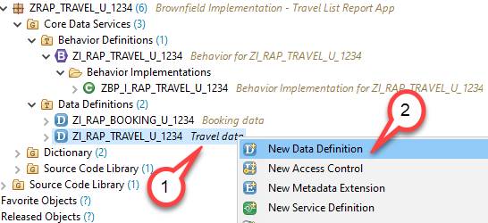
 
2. In the Data Definition wizard
   - Name: ZC_RAP_Travel_U_####
   - Description: Travel data

   and press **Next**
   
   The CDS interface view ZI_RAP_Travel_U_#### is automatically set as the **Referenced Object**.

   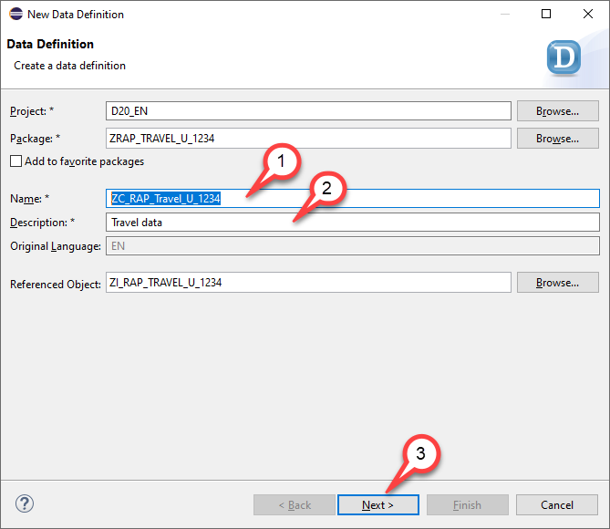

3. Selection of Transport Request

   - Select a transport request
   - Press **Next** but **DO NOT PRESS FINISH**

    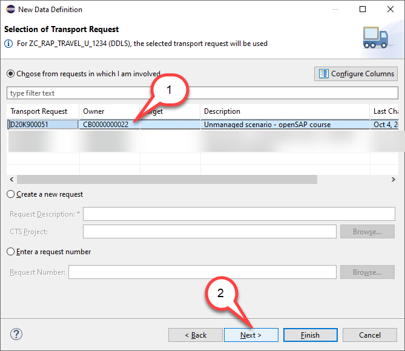

4. Choose the template 
   - Be sure to choose the template `Define Projection View`
   - Press **Finish**
   
> Hint: You can ignore the warning *Selected template uses features which are not yet supported by the backend system.*   
  
   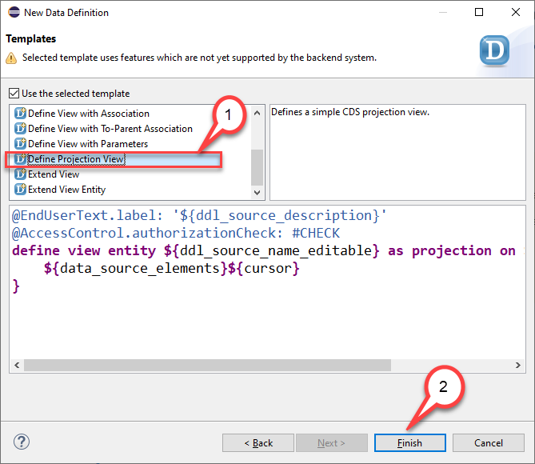
  
5. Check template coding
   
   - You will see the warning *ROOT keyword missing since ZI_RAP_TRAVEL_U_1234 has the root property*

   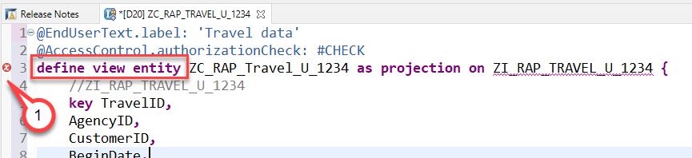

6. Add the keyword `root` to your coding so that the beginning of the data definition now reads
     <pre>define <b>root</b> view entity ZC_RAP_Travel_U_#### as projection on ZI_RAP_TRAVEL_U_####</pre>

   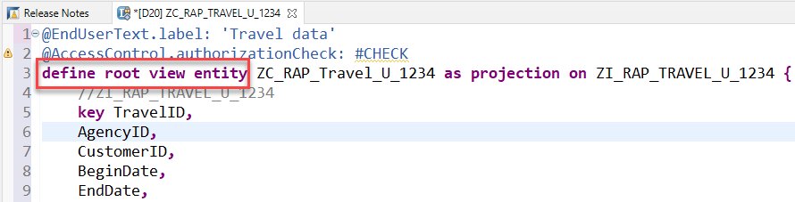

7. Make the projection view *searchable*

   -  Add the annotation `@Search.searchable: true` in the header section of the projection view
   -  Make the fields `AgencyID`and `CustomerID` default search elements by adding the annotation `@Search.defaultSearchElement: true` to these fields.
   
   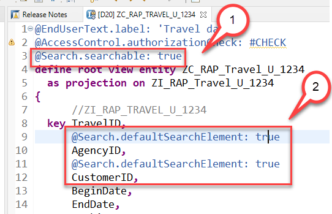
   
8. Add value helps 

   - Add the annoation `@Consumption.valueHelpDefinition: [ { entity: { name: '/DMO/I_Agency', element: 'AgencyID' } } ]` to the field  `AgencyID`
    - Add the annoation `@Consumption.valueHelpDefinition: [ { entity: { name: '/DMO/I_Customer', element: 'CustomerID' } } ]` to the field  `CustomerID`
    - Add the annoation `@Consumption.valueHelpDefinition: [ { entity: { name: 'I_Currency', element: 'Currency' } } ]` to the field  `CurrencyCode`

    
   
9. Add information to the association *_Booking*

   - add the informaton to the association \_Booking that this assocation is part of a composition tree
   
    `_Booking : redirected to composition child ZC_RAP_Booking_U_####`

   > Here you get a error *Could not parse DDL source for entity "ZC_RAP_Booking_U_####"* since the projection view for the child entity Booking does not yet exist.

   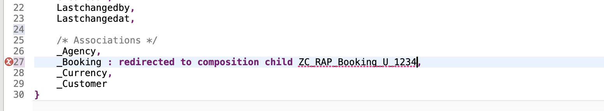
   

Your Travel prpjection view should now look as follows:

<pre>
    @EndUserText.label: 'Travel data'
    @AccessControl.authorizationCheck: #CHECK
    @Search.searchable: true

    define root view entity ZC_RAP_Travel_U_####
      as projection on ZI_RAP_Travel_U_####
    {
      //ZI_RAP_TRAVEL_U_####
      key TravelID,
          @Consumption.valueHelpDefinition: [ { entity: { name: '/DMO/I_Agency', element: 'AgencyID' } } ]
          @Search.defaultSearchElement: true
          AgencyID,
          @Consumption.valueHelpDefinition: [ { entity: { name: '/DMO/I_Customer', element: 'CustomerID' } } ]
          @Search.defaultSearchElement: true
          CustomerID,
          BeginDate,
          EndDate,
          @Semantics.amount.currencyCode: 'CurrencyCode'
          BookingFee,
          @Semantics.amount.currencyCode: 'CurrencyCode'
          TotalPrice,
          @Consumption.valueHelpDefinition: [ { entity: { name: 'I_Currency', element: 'Currency' } } ]
          CurrencyCode,
          Description,
          Status,
          Createdby,
          Createdat,
          Lastchangedby,
          Lastchangedat,

          /* Associations */
          //ZI_RAP_TRAVEL_U_####
          _Agency,
          _Booking : redirected to composition child ZC_RAP_Booking_U_####,
          _Currency,
          _Customer
    }
</pre>

10. Save  your Travel projection view.

## Step 2. Create projection view for Booking

We now create a projection view for our child entity Booking.

1. We can right-click on the CDS interface view for **Booking** and use the new wizard to create projection views that have our interface CDS view for Booking as a data source.

   - Right click on the CDS interface view `ZI_RAP_Booking_U_####`
   - Select **New Data Definition**

   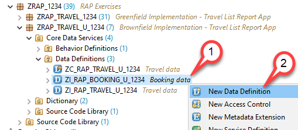
 
2. In the Data Definition wizard
   - Name: ZC_RAP_BOOKING_U_####
   - Description: Booking data

   and press **Next**
   
   The CDS interface view ZI_RAP_Booking_U_#### is automatically set as the **Referenced Object**.

   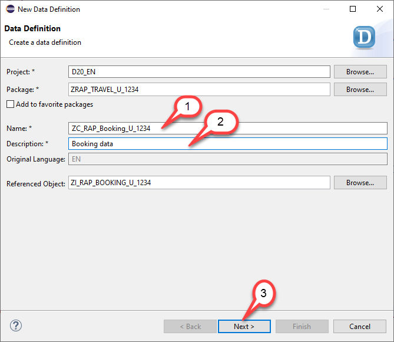

3. Selection of Transport Request

   - Select a transport request
   - Press **Next** but **DO NOT PRESS FINISH**

    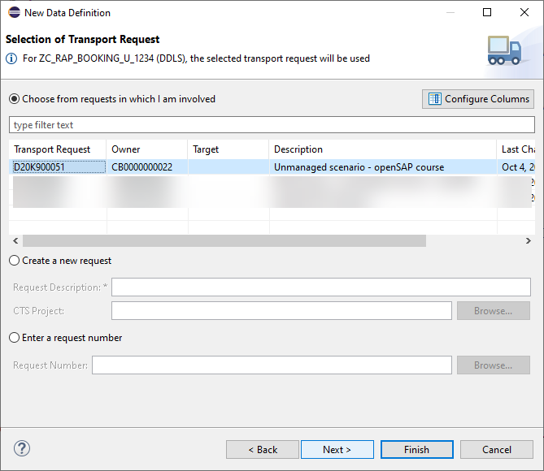

4. Choose the template 
   - Be sure to choose the template `Define Projection View`
   - Press **Finish**
   
> Hint: You can ignore the warning *Selected template uses features which are not yet supported by the backend system.*   
  
   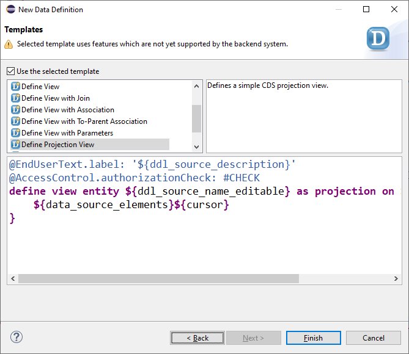
   
5. Make also the child projection view *searchable*

   -  Add the annotation `@Search.searchable: true` in the header section of the child projection view
   -  Make the fields `TravelID`and `BookingID` default search elements by adding the annotation `@Search.defaultSearchElement: true` to these fields.
  
   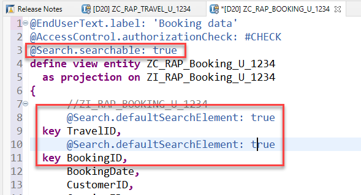

6. Now add value help annotations for the following fields in the Booking projection view
   - CustomerID
   
   <pre>
         @Consumption.valueHelpDefinition: [ { entity: { name:     '/DMO/I_Customer',
                                                         element:     'CustomerID' } } ]
   </pre>
   
   - CarrierID
   <pre>
    @Consumption.valueHelpDefinition: [ { entity: { name:     '/DMO/I_Carrier',
                                                    element:     'AirlineID' } } ]
   </pre>
   
   - ConnectionID
   <pre>
      @Consumption.valueHelpDefinition: [ { entity: { name:    '/DMO/I_Flight',
                                                      element: 'ConnectionID' },
                                            additionalBinding: [ { localElement: 'FlightDate',
                                                                   element:      'FlightDate',
                                                                   usage: #RESULT }, 
                                                                 { localElement: 'CarrierID',
                                                                        element: 'AirlineID',
                                                                          usage: #RESULT }, 
                                                                 { localElement: 'FlightPrice',
                                                                        element: 'Price',
                                                                          usage: #RESULT }, 
                                                                 { localElement: 'CurrencyCode',
                                                                        element: 'CurrencyCode',
                                                                          usage: #RESULT } ] 
                                            } ]
   </pre>
   
   - CurrencyCode
   <pre>
        @Consumption.valueHelpDefinition: [ {entity: { name:    'I_Currency',
                                                       element: 'Currency' } } ]
   </pre>

> Please note that 
> - the element name for the field `CarrierID` is `AirlineID` in the value help.
> - the value help for the connection id contains so called additional bindings. If we select a certain connection, the fields specified in th additional binding will be updated in the UI as well.

7. We finally have to add information to the association `_Travel` that it is part of a composition tree and that it point to the parent entity Travel.
   `_Travel : redirected to parent ZC_RAP_Travel_U_####`

   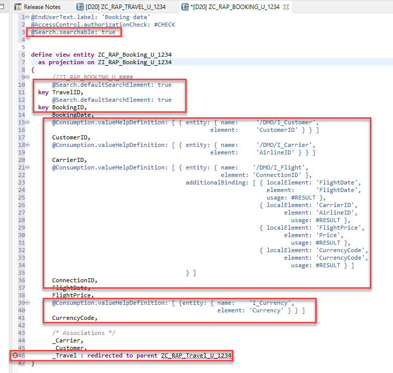

8. Check the code

   - So that the coding now looks as follows:

<pre>

    @EndUserText.label: 'Booking'
    @AccessControl.authorizationCheck: #CHECK
    @Search.searchable: true
   

    define view entity ZC_RAP_Booking_U_####
      as projection on ZI_RAP_Booking_U_####
    {
          //ZI_RAP_BOOKING_U_####
          <b>@Search.defaultSearchElement: true</b>
      key TravelID,
          <b>@Search.defaultSearchElement: true</b>
      key BookingID,
          BookingDate,
          <b>@Consumption.valueHelpDefinition: [ { entity: { name:     '/DMO/I_Customer',
                                                       element:     'CustomerID' } } ]</b>
          CustomerID,
          <b>@Consumption.valueHelpDefinition: [ { entity: { name:     '/DMO/I_Carrier',
                                                       element:     'AirlineID' } } ]</b>
          CarrierID,
          <b>@Consumption.valueHelpDefinition: [ { entity: { name:    '/DMO/I_Flight',
                                                          element: 'ConnectionID' },
                                                additionalBinding: [ { localElement: 'FlightDate',
                                                                       element:      'FlightDate',
                                                                       usage: #RESULT }, 
                                                                     { localElement: 'CarrierID',
                                                                            element: 'AirlineID',
                                                                              usage: #RESULT }, 
                                                                     { localElement: 'FlightPrice',
                                                                            element: 'Price',
                                                                              usage: #RESULT }, 
                                                                     { localElement: 'CurrencyCode',
                                                                            element: 'CurrencyCode',
                                                                              usage: #RESULT } ] </b>
                                                } ]
          ConnectionID,
          FlightDate,
          FlightPrice,
          <b>
          @Consumption.valueHelpDefinition: [ {entity: { name:    'I_Currency',
                                                         element: 'Currency' } } ]</b>
          CurrencyCode,

          /* Associations */   
          _Carrier,
          _Customer,
          <b>_Travel : redirected to parent ZC_RAP_Travel_U_####</b>
    }

</pre>

9. Now we can activate both, the projection view for the Travel data as well as the one for the Booking data.

   - From the menu choose the icon for **Mass Activation** or press **Ctrl+Shift+F3**
   - In third dialogue make sure that all objects are selected

      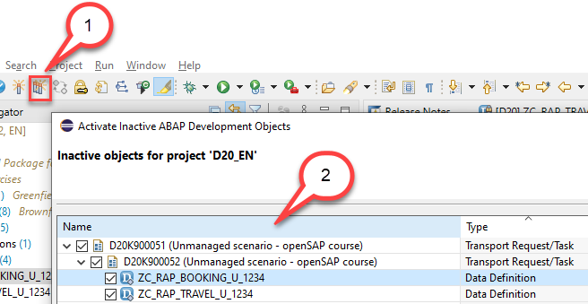 
      
## Step 3. Create metadata extension view for Travel projection

Part of the projection layer, in case you want to implement a service for UI-based consumption, are the metadata extensions. Metadata extensions contain UI specific annotations and they have been invented to separate UI- based annotations from the projection views. 
They allow in addition a layering, i.e. industries, partners or customers can put their annotations beside the existing annotations.

1. Right-click on our newly created projection view for travel `ZC_RAP_Travel_U_####`, and select **New Metadata Extension**. 

  
 
2. Specify the following values
   - Name: `ZC_RAP_Travel_U_####`
   - Description: `Travel data` 

   Press **Next**
   
   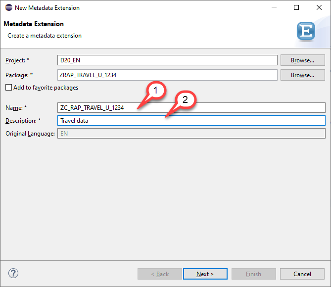 
   
3. Selection of Transport Request

   - Select a transport request
   - Press **Next** but **DO NOT PRESS FINISH**

    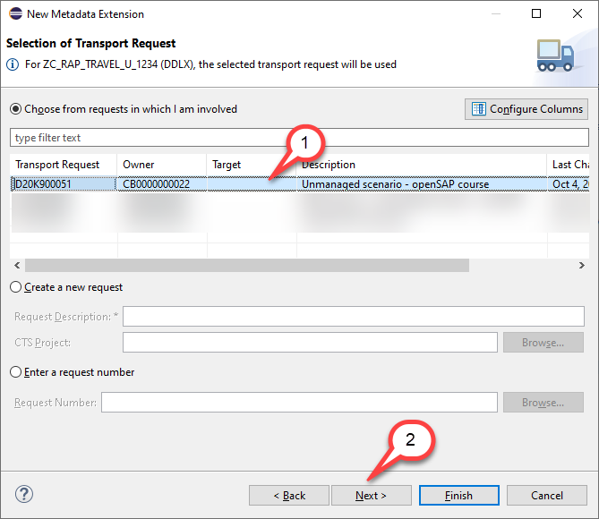 
    
4. Choose template
   - Choose `Annotate view`
   - Press **Finish**
   
     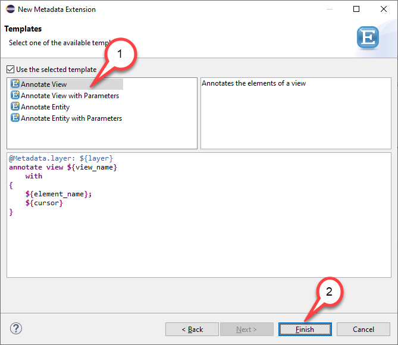 
   
5. Edit template
   -  As the metadata layer, we choose #CORE.
   -  We add annotations `@UI.headerInfo` for the header and `@UI.presentationVariant: [{ }]` for the presentationVariant , which defines the default sort order.  
   -  We add the annotation `@UI.hidden: true` to the administrative fields, so that the administrative fields will be hidden on the UI 
   -  And we add lineItem identification annotation so that the fields are shown in the list and object page. For example
      <pre>
      @UI: { lineItem:        [ { position: 50 } ],
             identification:  [ { position: 50 } ]  }
      </pre>   
   
   So your code shoul now look like follows

<pre>
   @Metadata.layer: #CORE
@UI: {
  headerInfo: {
    typeName: 'Travel',
    typeNamePlural: 'Travels',
    title: {
      type: #STANDARD,
      label: 'Travel',
      value: 'TravelID'
    }
  },
  presentationVariant: [ { sortOrder: [ { by:         'TravelID',
                                          direction:  #DESC }] }]
}
annotate view ZC_RAP_Travel_U_#### with
{
  @UI.facet: [ { id:            'Travel',
                 purpose:       #STANDARD,
                 type:          #IDENTIFICATION_REFERENCE,
                 label:         'Travel',
                 position:      10 },
               { id:            'Booking',
                 purpose:       #STANDARD,
                 type:          #LINEITEM_REFERENCE,
                 label:         'Booking',
                 position:      20,
                 targetElement: '_Booking'}]

  @UI: { lineItem:        [ { position: 10 } ],
         identification:  [ { position: 10 } ]  }
  TravelID;

  @UI: { lineItem:        [ { position: 20 } ],
         identification:  [ { position: 20 } ]  }
  AgencyID;

  @UI: { lineItem:        [ { position: 30 } ],
         identification:  [ { position: 30 } ]  }
  CustomerID;

  @UI: { lineItem:        [ { position: 40 } ],
         identification:  [ { position: 40 } ]  }
  BeginDate;

  @UI: { lineItem:        [ { position: 50 } ],
         identification:  [ { position: 50 } ]  }
  EndDate;

  @UI: { lineItem:        [ { position: 60 } ],
         identification:  [ { position: 60 } ]  }
  BookingFee;

  @UI: { lineItem:        [ { position: 70 } ],
         identification:  [ { position: 70 } ]  }
  TotalPrice;

  @UI: { identification:  [ { position: 80 } ]  }
  Description;

  @UI: { lineItem:        [ { position: 90 } ],
         identification:  [ { position: 90 } ]  }
  Status;

  @UI.hidden: true
  Createdby;

  @UI.hidden: true
  Createdat;

  @UI.hidden: true
  Lastchangedby;

  @UI.hidden: true
  Lastchangedat;

}
</pre>
   
6. However, we still see an error that the annoation `@Metadata.allowExtensions` is missing in the projection view which is to be annotated. 

  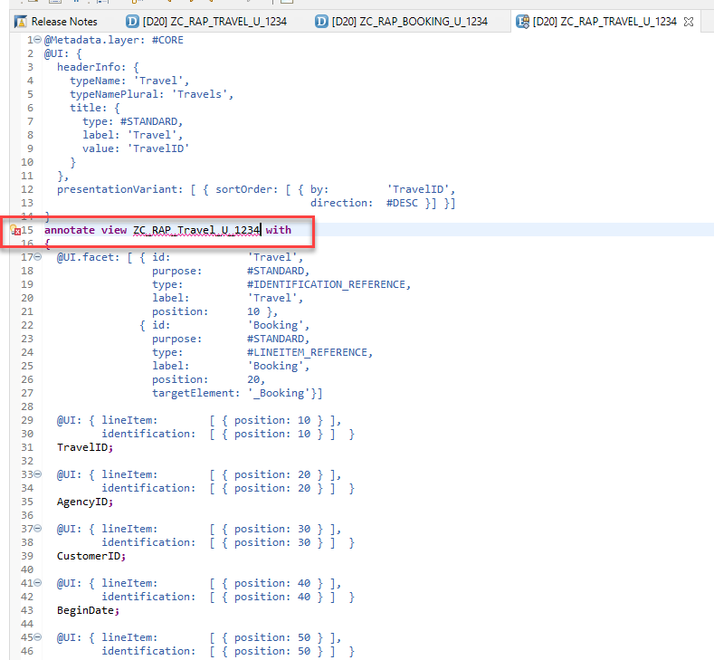 

7. Here we can simply press **Ctrl+1** and use the quick fix that will add this annotation to the base view. 
   - Select the name of the projection view `ZC_RAP_Travel_U_####`
   - Press **Ctrl+1**
   - Double click on the quick fix `Add annoation 'Metadata.allowextension' to base view`

   

8. We activate the changes in the projection view 

   

9. We can now go back to our metadata extension view, and can activate the same.
  
   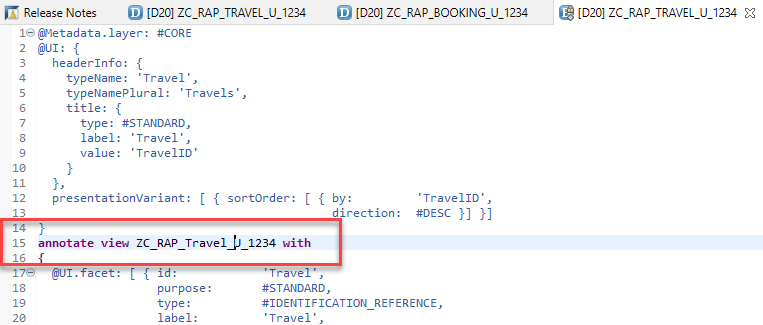 

## Step 4. Create metadata extension view for Booking

We can do now the same for the booking projection view and create a metadata extension view for it.

1. Right-click on our newly created projection view for *Booking* `ZC_RAP_Booking_U_####`, and select **New Metadata Extension**. 

 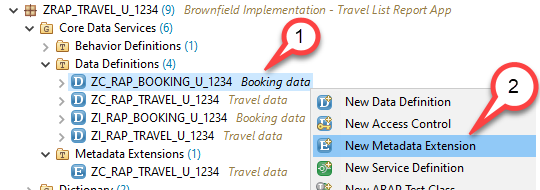 
 
2. Specify the following values
   - Name: `ZC_RAP_Booking_U_####`
   - Description: `Booking data` 

   Press **Next**
   
   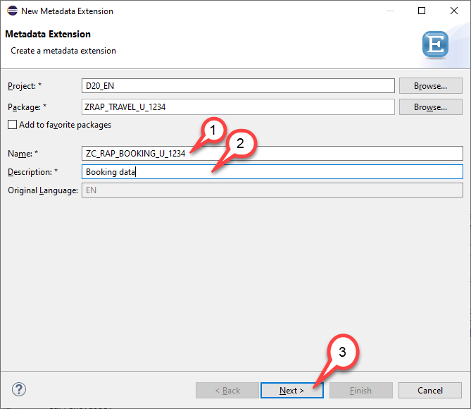 
   
3. Selection of Transport Request

   - Select a transport request
   - Press **Next** but **DO NOT PRESS FINISH**

    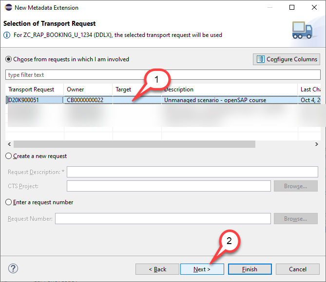 
    
4. Choose template
   - Choose `Annotate view`
   - Press **Finish**
   
     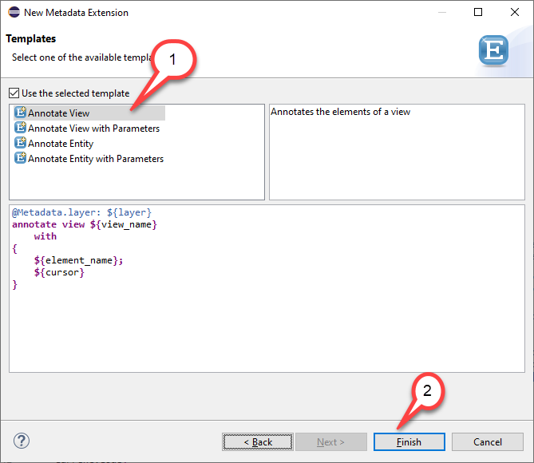 
   
5. Edit template
   -  Again we choose the metadata layer #CORE.
   -  We add annotations `@UI.headerInfo` for the header and we add the annotation `@UI.hidden: true` this time only for the key field `TravelID`
   -  And we add `@UI.lineItem` and `@UI.identification` annotations so that the fields are shown in the list and on the object page.         For example
      <pre>
      @UI: { lineItem:        [ { position: 50 } ],
             identification:  [ { position: 50 } ]  }
      </pre>    
   
   So your code should now look like follows

<pre>
    @Metadata.layer: #CORE
    @UI: {
      headerInfo: {
        typeName: 'Booking',
        typeNamePlural: 'Bookings',
        title: {
          type: #STANDARD,
          label: 'Booking',
          value: 'BookingID'
        }
      }
    }
    annotate view ZC_RAP_Booking_U_#### with
    {
      @UI.facet: [ { id:            'Booking',
                     purpose:       #STANDARD,
                     type:          #IDENTIFICATION_REFERENCE,
                     label:         'Booking',
                     position:      10 } ]

      @UI.hidden: true
      TravelID;

      @UI: { lineItem:        [ { position: 10 } ],
             identification:  [ { position: 10 } ]  }
      BookingID;

      @UI: { lineItem:        [ { position: 20 } ],
             identification:  [ { position: 20 } ]  }
      BookingDate;

      @UI: { lineItem:        [ { position: 30 } ],
             identification:  [ { position: 30 } ]  }
      CustomerID;

      @UI: { lineItem:        [ { position: 40 } ],
             identification:  [ { position: 40 } ]  }
      CarrierID;

      @UI: { lineItem:        [ { position: 50 } ],
             identification:  [ { position: 50 } ]  }
      ConnectionID;

      @UI: { lineItem:        [ { position: 60 } ],
             identification:  [ { position: 60 } ]  }
      FlightDate;

      @UI: { lineItem:        [ { position: 70 } ],
             identification:  [ { position: 70 } ]  }
      FlightPrice;
    }
</pre>
   
6. Again, we see an error that the annoation `@Metadata.allowExtensions` is missing in the projection view `ZC_RAP_Booking_U_####` which is to be annotated. 

  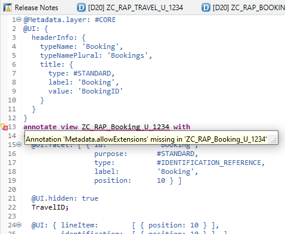 

7. Again we can simply press Ctrl+1 and use the quick fix that will add this annotation to the base view. 
   - Select the name of the projection view `ZC_RAP_Booking_U_####`
   - Press **Ctrl+1**
   - Double click on the quick fix `Add annoation 'Metadata.allowextension' to base view`

  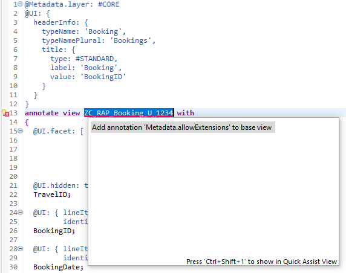 

8. We activate the changes in the projection view 

  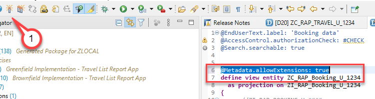 

9. We can now go back to our metadata extension view, and can activate the same.
  
   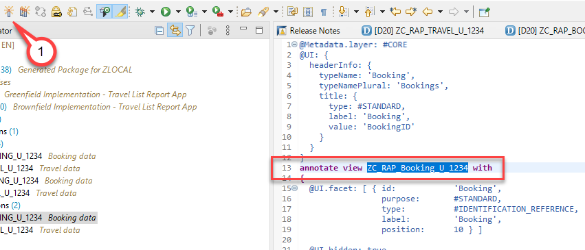 

## Step 5. Create a behavior definition for the projection view

The last object we have to create on the projection layer is a projection for our behavior
definition.
1. For this, we right-click on the data definition for travel from the projection layer and choose **New Behavior Definition**. 

   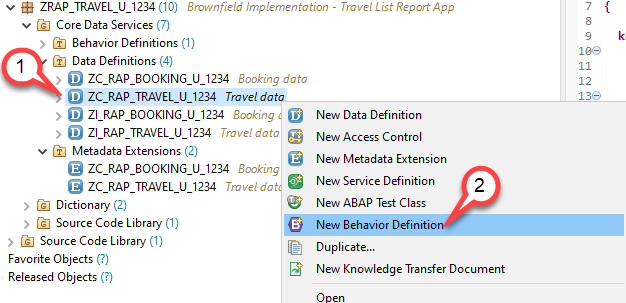 
   
2. In the **Create Behavior Defintion** dialogue everything is prefilled, we just have to press Next.

   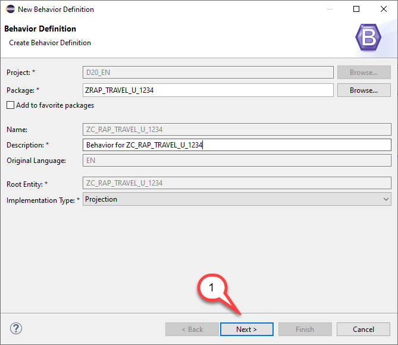 

3. Selection of Transport Request

   - Select a transport request
   - Press **Finish**

     
    
4. The editor for the behavior definition opens
   - The implementation type `projection` is preselected. 
   - All we have to do is adding an alias for both entities and define to use ETags for both entities.
   
    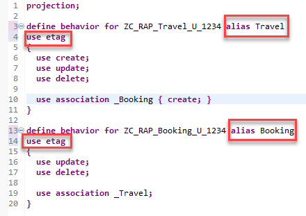 
    
    your code should look as follows:
    
    <pre>
    projection;

    define behavior for ZC_RAP_Travel_U_#### alias Travel
    use etag
    {
      use create;
      use update;
      use delete;

      use association _Booking { create; }
    }

    define behavior for ZC_RAP_Booking_U_#### alias Booking
    use etag
    {
      use update;
      use delete;

      use association _Travel;
    }
    </pre>

5. Save  and activate  your changes

## Summary

In this unit we have created the data model projection layer. We have added search annotations, we allowed the use of metadata extensions, we added value help annotations, and we specified that the booking association is a redirection to a composition child.
Then on the metadata extension side, we added annotations for headers, for the presentation variant, and for facets that are needed for the SAP Fiori elements UI to be displayed correctly.
And finally, we have created a projection for our behavior definition, and we specified that we want to use the ETag and the standard operations, create, update, and delete, and also the create-enabled association.

## Solution
Find the source code of the created entities in the **[sources](/week4/sources)** folder:  

- [W4U4_DDLS_ZC_RAP_Travel_U_####.txt](/week4/sources/W4U4_DDLS_ZC_RAP_Travel_U_%23%23%23%23.txt)
- [W4U4_DDLS_ZC_RAP_Booking_U_####.txt](/week4/sources/W4U4_DDLS_ZC_RAP_Booking_U_%23%23%23%23.txt)
- [W4U4_DDLX_ZC_RAP_Travel_U_####.txt](/week4/sources/W4U4_DDLX_ZC_RAP_Travel_U_%23%23%23%23.txt)
- [W4U4_DDLX_ZC_RAP_Booking_U_####.txt](/week4/sources/W4U4_DDLX_ZC_RAP_Booking_U_%23%23%23%23.txt)
- [W4U4_BDEF_ZC_RAP_Travel_U_####.txt](/week4/sources/W4U4_BDEF_ZC_RAP_Travel_U_%23%23%23%23.txt)
     
    
Do not forget to replace all the occurrences of `####` with your chosen suffix in the copied source code.  

## Next exercise
[Week 4 Unit 5: Building and Previewing the OData UI Service](unit5.md)

