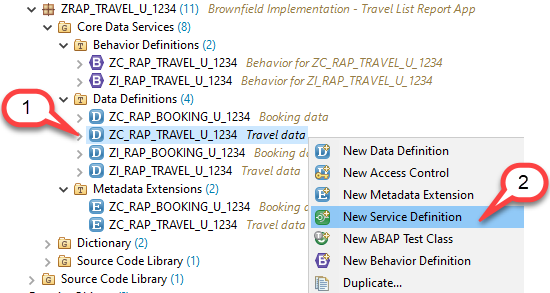
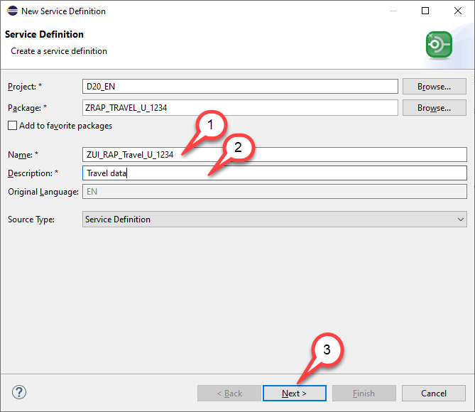
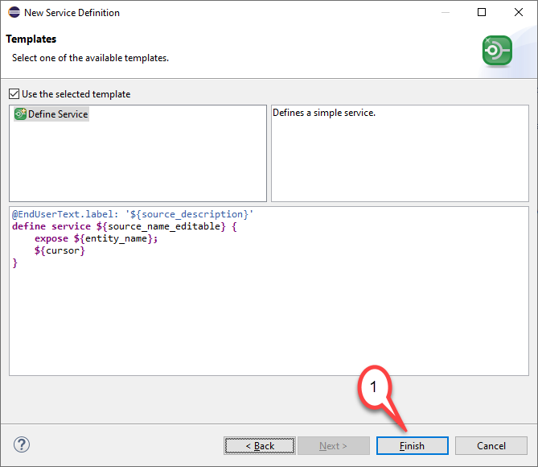
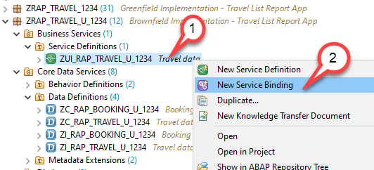
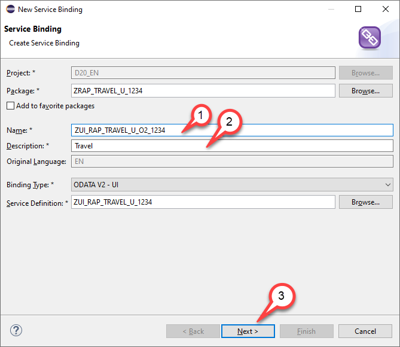
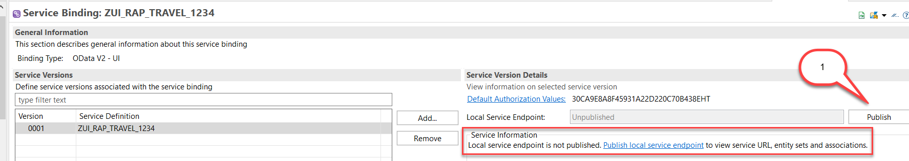
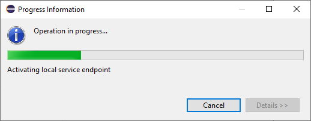
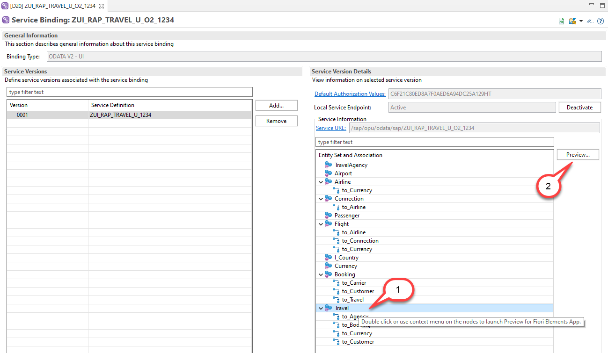
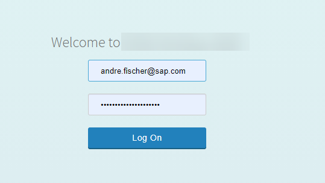
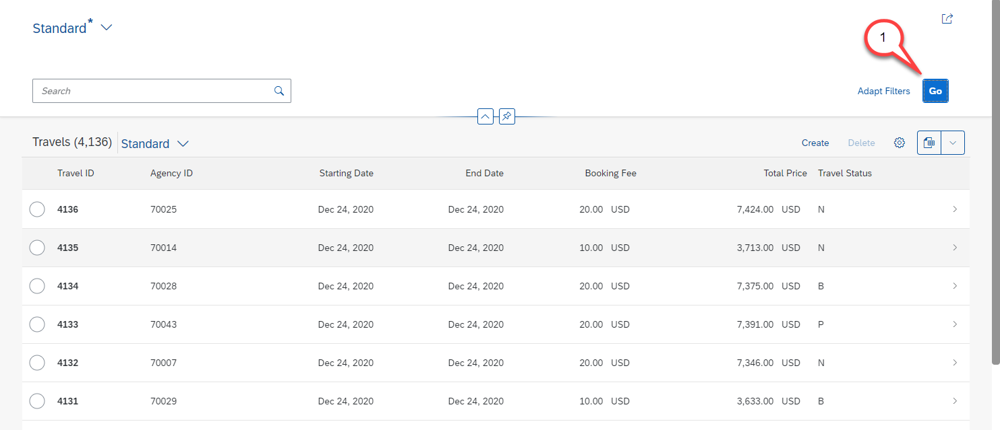

# Building and Previewing the OData UI Service

## Introduction  

In this unit we will create the service definition and the service binding for our unmanaged business object as an OData service and will test it using the SAP Fiori Elements preview.
For this we will first create a service definition which lists all CDS entities of the data model that are to be exposed.
In our example we will expose the projection views for travel and booking and we will publish all CDS views that are used as value helps.
Though this is not absolutely required since all entities that are used as a value help are accessible by default it is nevertheless a good practice, since otherwise the entities are published using their technical names.
Adding them to the service definition allows us to define meaningful aliases.
Based on the service definition a service binding will be created that binds our service to a specific protocol.

> **Hints and Tips**    
> Speed up the typing by making use of the Code Completion feature (shortcut Ctrl+Space) and the prepared code snippets provided. 
> You can easily open an object with the shortcut *Ctrl+Shift+A*, format your source code using the Pretty Printer feature *Shift+F1* and toggle the fullscreen of the editor using the shortcut *Ctrl+M*.
>
> A great overview on ADT shortcuts can be found here: [Useful ADT Shortcuts](https://blogs.sap.com/2013/11/21/useful-keyboard-shortcuts-for-abap-in-eclipse/)
>
> Please note that the placeholder **`####`** used in object names in the exercise description must be replaced with the suffix of your choice during the exercises. The suffix can contain a maximum of 4 characters (numbers and letters).
> The screenshots in this document have been taken with the suffix `1234` and system `D20`. Your system id will be `TRL`.

> Please note that the ADT dialogs and views may change in the future due to software updates - i.e. new and/or optimized feature

Follow the instructions below.

## Step 1. Create a service definition

1. Right click on the projection view for travel data `ZC_RAP_TRAVEL_U_####` and select **New Service Definition**

  
  

2. Enter the following data

   - Name: `ZUI_RAP_Travel_U_####`
   - Description: `Travel data`
   
   and press **Next**
   
> The abbreviation `UI` shall denote that this service definition is used for UI based consumption. For a Web API we would have used **API** instead of **UI**. 
> Please note that it is also possible to add the OData protocol version to the name of the service definition and the service binding. The name of the service definition 
> would than read `ZUI_RAP_Travel_U_####_O2`.

   

3. Selection of Transport Request

   - Select a transport request
   - Press **Next** but **DO NOT PRESS FINISH**

    

4. New Service Definition dialogue

   - As the Define Service template is already selected, we just press **Finish**
   
   
   
5. As discussed we add - in addition to the CDS views that are part of the composition tree - all CDS views that are used as value helps in our service.
   The code of your service definition `ZUI_RAP_Travel_U_####` should now look like follows:

<pre>
@EndUserText.label: 'Travel data'
define service ZUI_RAP_Travel_U_#### {
  expose ZC_RAP_Travel_U_#### as Travel;
  expose ZC_RAP_Booking_U_#### as Booking;
  expose /DMO/I_Customer as Passenger;
  expose /DMO/I_Agency as TravelAgency;
  expose /DMO/I_Carrier as Airline;
  expose /DMO/I_Flight as Flight;
  expose /DMO/I_Connection as Connection;
  expose /DMO/I_Airport as Airport;
  expose I_Currency as Currency;
}
</pre>

6. Save and Activate  your changes 

## Step 2. Create Service Binding

1. We right click on the service definition `ZUI_RAP_Travel_U_####` an choose **New Service Binding**.

   
   
2. In the *New Service Binding* dialogue we enter the following values
   
   - Name: `ZUI_RAP_TRAVEL_U_O2_####`
   - Description: `Travel`
   
   Leave the Binding Type `OData V2 - UI` unchanged.
   
   and we press **Next**
   
   
   
3. Selection of Transport Request

   - Select a transport request
   - Press **FINISH**

    
    
4. The Service Binding dialogue opens and we notice that the Service Binding must be activated so that we can test it.

   - Press **Activate**  (or in newer releases **Publish**)
   
   

5. The activation takes a while ...
 
   

> When the Service Binding has been activated we can see all the entity sets that are part of our service. 
> And we see the service URL, so if you would click this URL, a browser window will open and we could test the service document of the OData service or check the $metadata document.
   
6. Test the service using the Fiori Elements preview

   - Select the entity set `Travel`
   - Click on **Preview**
   
   
   

7. You have to authenticate 

  
  
8. Finally the Fiori Elements preview will open. When you press **Go** the app will read data from the legacy tables.
 
  

   
   
## Summary

In this unit we have the service binding and have published our service by creating a service binding.

## Solution
Find the source code of the created entities in the **[sources](/week4/sources)** folder.      
    
Do not forget to replace all the occurrences of `####` with your chosen suffix in the copied source code.  

## Next exercise
[Week 5: Service consumption and Web APIs](/week5/README.md)

