# Creating the Service Consumption Model

## Introduction  
On the SAP Gateway demo system ES5 we have created an OData service that provides a list of travel agencies. 
We will use this OData service to show how a side-by-side extension scenario based on the managed application, that has been built in week 2 and 3, can be developed.  

For this we will create a so called **Service Consumption Model**.  

The wizard that we will use to create a **Service Consumption Model** will generate additional repository objects, namely a   
- **Service Definition** and an 
- **Abstract Entity**   

in addition to the **Service Consumption Model**.

You can watch [unit 2 of week 5: Creating the Service Consumption Model](https://open.sap.com/courses/cp13/items/6iQF7ZB5Fhe6MBLun2fy99) on the openSAP.com platform.
 
> **Hints and Tips**    
> Speed up the typing by making use of the Code Completion feature (shortcut Ctrl+Space) and the prepared code snippets provided. 
> You can easily open an object with the shortcut *Ctrl+Shift+A*, format your source code using the Pretty Printer feature *Shift+F1* and toggle the fullscreen of the editor using the shortcut *Ctrl+M*.
>
> A great overview on ADT shortcuts can be found here: [Useful ADT Shortcuts](https://blogs.sap.com/2013/11/21/useful-keyboard-shortcuts-for-abap-in-eclipse/)
>
> Please note that the placeholder **`####`** used in object names in the exercise description must be replaced with the suffix of your choice during the exercises. The suffix can contain a maximum of 4 characters (numbers and letters).
> The screenshots in this document have been taken with the suffix `1234` and system `D20`. Your system id will be `TRL`.

> Please note that the ADT dialogs and views may change in the future due to software updates - i.e. new and/or optimized feature

Follow the instructions below.

## Step 1. Create the package
First create a new package to group the various development artefacts that you’re going to create to extend our managed Travel App. It will be a sub-package of package **`ZRAP_####`** (where `####` is your chosen suffix) created in week 1 unit 6.  
  
1. Go to the Project explorer, right-click on your package **`ZRAP_####`** (where `####` is your chosen suffix) you created in week 1 unit 6 and choose the context menu entry **_New > ABAP Package_**.  
   
    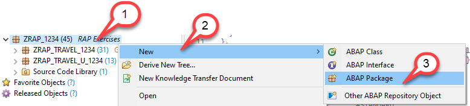
  
2. Maintain **`ZRAP_TRAVEL_E_####`** as name (where `####` is your chosen suffix and where `_E` indicates that this is an extension scenario) and a meaningful description (e.g. Extension scenario - Travel List Report App) and choose **Next** to continue.  
The Project and the Superpackage fields are automatically assigned.
   

    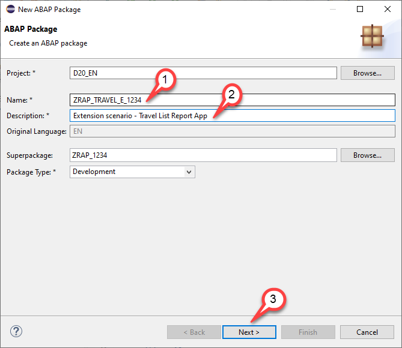
    
  
4. Select an existing transport request or create a new one and then choose **Finish** to create the new package.  
   

    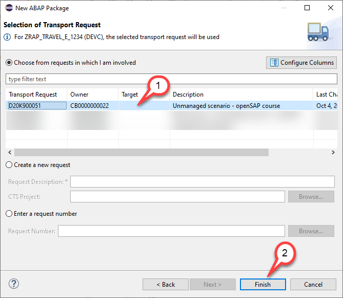
  

    The package is now created.  
   

    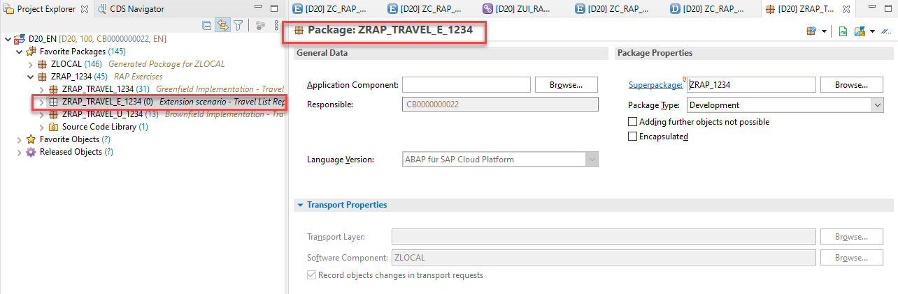
  
5. Right-click on the new created package and choose  **Add to Favorites Packages** to add it to your favorites.  
   

    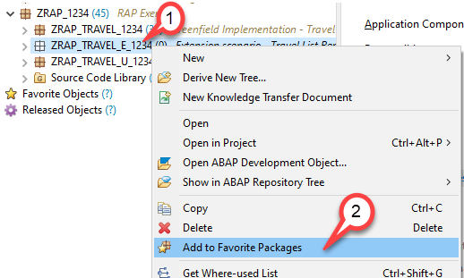
    
    
## Step 2. Download $metadata file

The *$metadata* file of the OData service that we want to consume must be uploaded in XML file format. You have hence to download it first.

 - Click on the following URL https://sapes5.sapdevcenter.com/sap/opu/odata/sap/ZAGENCYCDS_SRV/$metadata
 - Download the $metadata file to your computer, you will need it later in this exercise.
 
  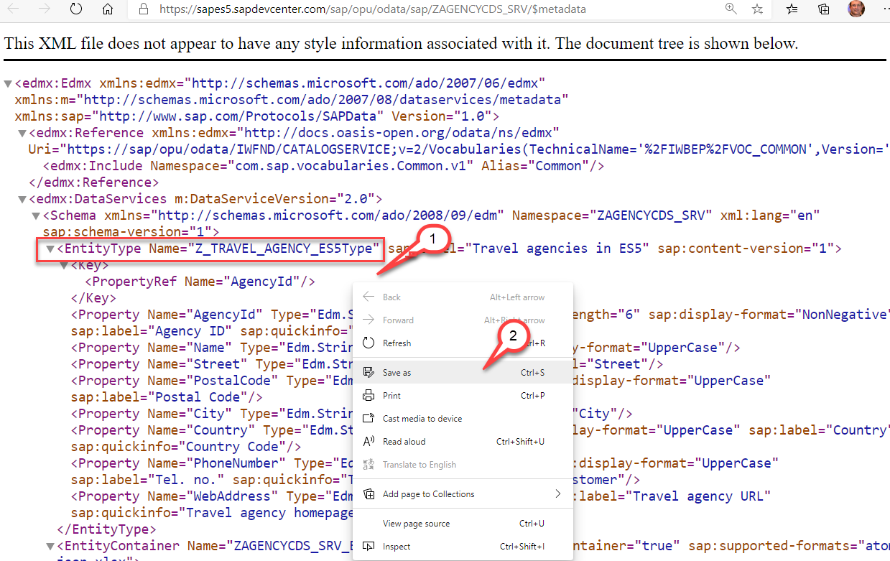
 
## Step 3. Create the Service Consumption Model

In this step we will generate a so called Service Consumption Model.
This type of object takes an external interface description as its input.   
Currently *OData* and *SOAP* are supported. With the upcoming release 2011 it is planned to support Service Consumption Models for RFC based communication  as well.  
Based on the information found in the $metadata file or the wsdl file appropriate repository objects are generated (OData Client proxy or SOAP proxy objects).
Using these objects you will be able to write ABAP code that lets you consume remote OData or SOAP services.
 
We start by creating a service consumption model for an OData service that provides a list of travel agencies. This service resides on the public SAP Gateway System ES5 and does not require any authentication.  

1. Switch to ADT and right click on your package **ZRAP_TRAVEL_E_####**.  Select **New > Other ABAP Repository Object**.

    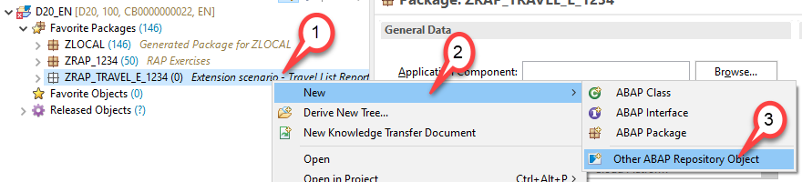

2. In the New ABAP Repository Object dialogue do the following

    -  Start to type **`Service`**
    -  In the list of objects select **Service Conumption Model**
    -  Click **Next**  
    
    
    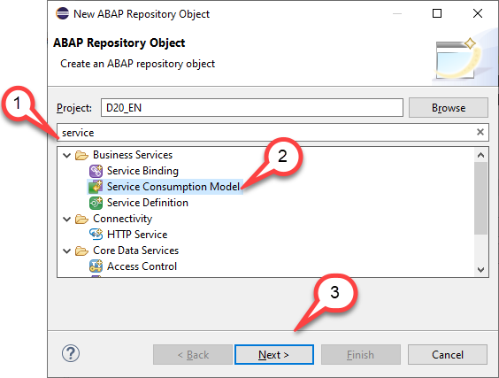
    
    
4. The **New Service Consumption Model** dialogue opens. Here enter the following data:

    - Name: **`ZSC_RAP_AGENCY_#### `**
    - Description: **`Agencies from ES5`**
    - Remote Consumption Model: **`OData`** (to be selected from the drop down box)
        
        
    > **Caution**  
    > Be sure that you have selected **`OData`** as the **Remote Consumption Mode** from the drop down box. There are other options such as Web Service and RFC (planned) available as well. 
    
    
    
    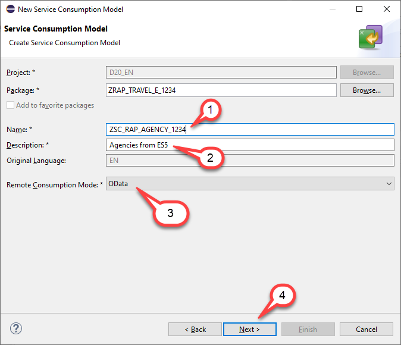
    

5. The $metadata file of the OData service that we want to consume must be uploaded in file format. If you have not yet downloaded the $metadata file you have to do this now.

    - Click **Browse** to select the $metadata file that you have downloaded earlier in this exercise
    - Prefix: Enter **`RAP_####`**
    - Click **Next**  
      
      
    > **Please note**  
    > If you enter a prefix this prefix will be added to the names of the abstract entities that are generated.
    > If you don't select a prefix and if the wizard finds out that there would be name clashes the wizard will propse unique names by adding arbritrary characters to the repository object names. In any case you will be able to change the values that will be proposed by this wizard.
      
                      
    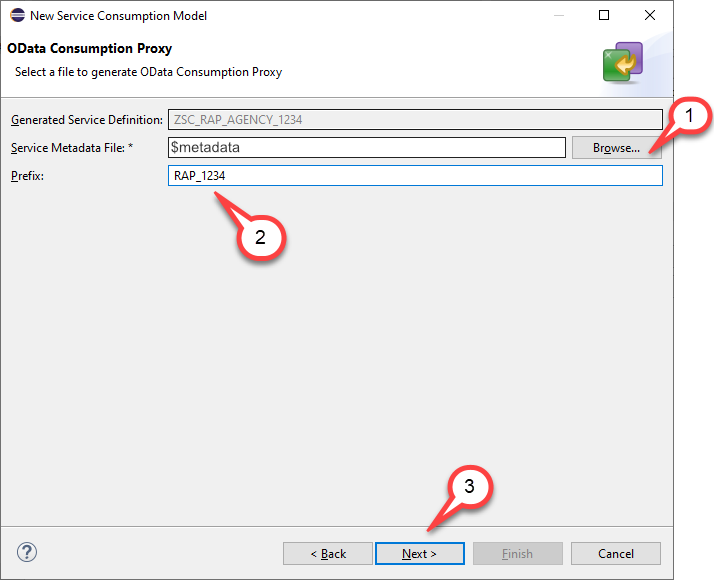
    

6. Check the **`ABAP Artifact Name`**.  

    You will notice that the name of the ABAP artifact has been set to **`ZRAP_####Z_TRAVEL_AGENCY_ES5`** since we have provided the prefix **`RAP_####`** and since the name of the entity itself is **`Z_TRAVEL_AGENCY_ES5`**.  

    Press **Next**.
        

    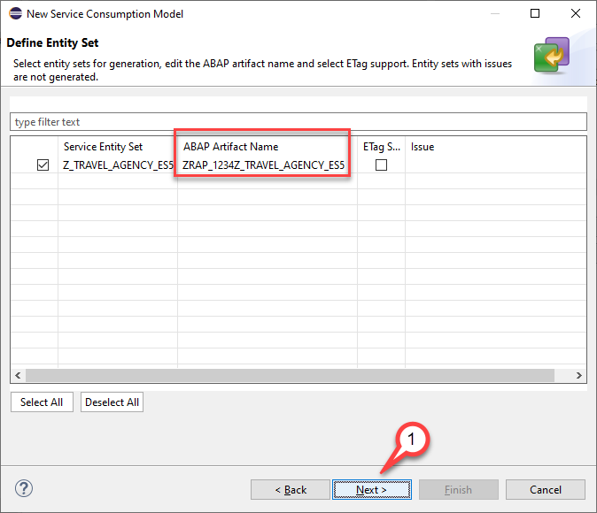

7. The wizard will now list the repository objects that will be generated, namely a service definition and an abstract entity in addition to the service consumption model.  

    - Service Definition: **ZSC_RAP_AGENCY_####**
    - Abstract Entity: **ZRAP_####Z_TRAVEL_AGENCY_ES5** 
       
    Click **Next**.
    

    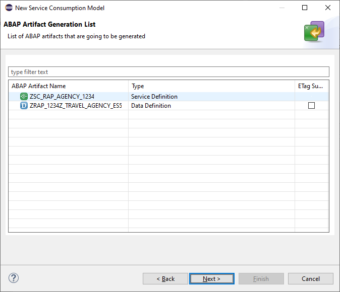

8. Selection of transport request  
    - Select or create a transport request
    - Press **Finish**

    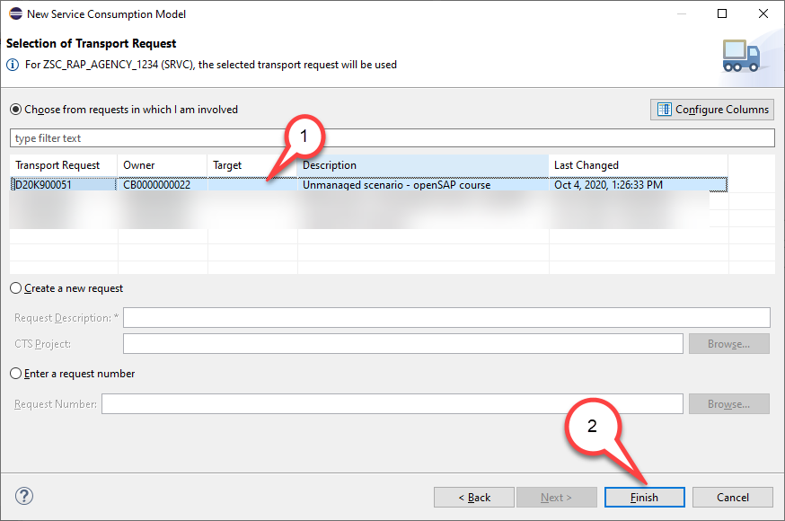

9. Let us shortly investigate the service consumption model. 

    For each operation (**Read List**, **Read**, **Create**, **Update** and **Delete**) some sample code has been created that you can use when you want to call the OData Service with one of these operations. Since we want to retrieve a list of Agencies, we will select the operation **Read List** and click on the button **Copy to Clipboard**. We will use this code in the following step where we create a console application to test the call to the remote OData service. 
  
    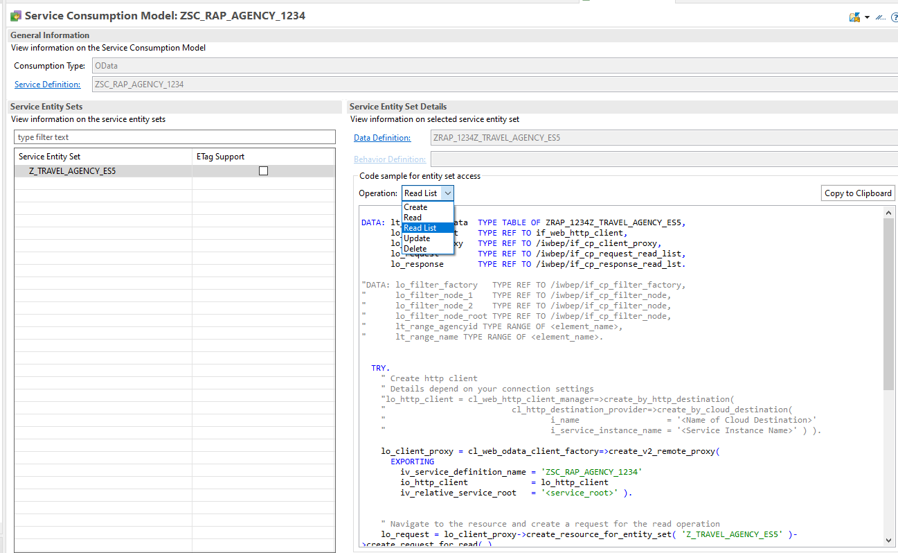 

## Step 4. Create a console application to test the OData service

We can now test the service consumption model by creating a small console application **ZCL_CE_RAP_AGENCY_####** that implements the interface **if_oo_adt_classrun**.  
This is a useful additional step since this way it is easier to check whether the OData consumption works and debugging a console application is much easier than trying out your coding in the full fledged RAP business object.  

> **Please note**  
> We will use this class at a later stage also as an implementation for our custom query and we hence choose a name **ZCL_CE_RAP_AGENCY_####** that already contains the name of the to be created custom entity. **CE** denotes that this class will act as a query implementation for a *Custom Entity*.  

1. Right click on the folder **Source Code Library** and select **New > ABAP Class**.
   
    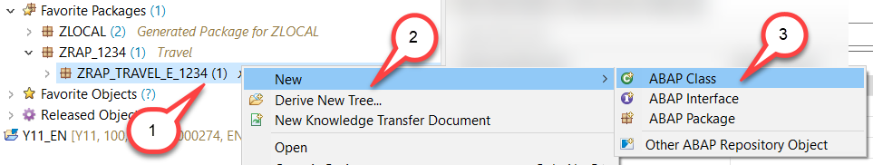 

2. The **New ABAP class** dialogue opens. Here you have to enter the following:

    - Name: **`ZCL_CE_RAP_AGENCY_####`**
    - Description: **`Query implementation custom entity`** 
    - Click **Add**
   
    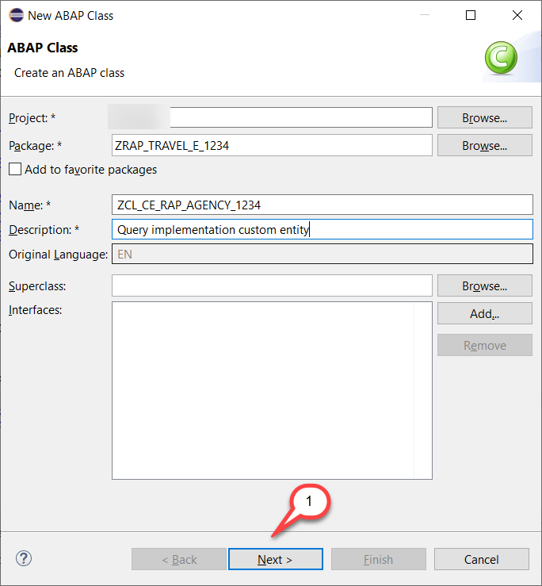   
     
   
3. Check the input and press **Next**    

4. Selection of transport request

    - Select or create a transport request
    - Click **Finish**

    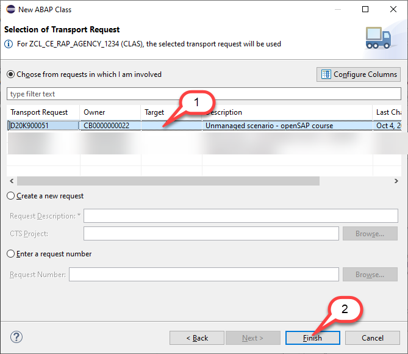

   
5. Replace the code with the code sample provided below
    
    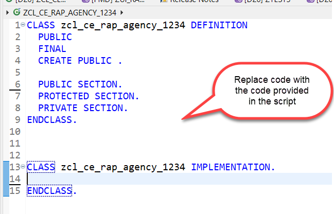

<pre>

CLASS zcl_ce_rap_agency_#### DEFINITION
  PUBLIC
  FINAL
  CREATE PUBLIC .

  PUBLIC SECTION.
    INTERFACES if_oo_adt_classrun.    

    TYPES t_agency_range TYPE RANGE OF zrap_####z_travel_agency_es5-agencyid.
    TYPES t_business_data TYPE TABLE OF zrap_####z_travel_agency_es5.

    METHODS get_agencies
      IMPORTING
        filter_cond        TYPE if_rap_query_filter=>tt_name_range_pairs   OPTIONAL
        top                TYPE i OPTIONAL
        skip               TYPE i OPTIONAL
        is_data_requested  TYPE abap_bool
        is_count_requested TYPE abap_bool
      EXPORTING
        business_data      TYPE t_business_data
        count              TYPE int8
      RAISING
        /iwbep/cx_cp_remote
        /iwbep/cx_gateway
        cx_web_http_client_error
        cx_http_dest_provider_error
      .

  PROTECTED SECTION.
  PRIVATE SECTION.
ENDCLASS.

CLASS zcl_ce_rap_agency_#### IMPLEMENTATION.

  METHOD if_oo_adt_classrun~main.    
    
    DATA business_data TYPE t_business_data.
    DATA count TYPE int8.
    DATA filter_conditions  TYPE if_rap_query_filter=>tt_name_range_pairs .
    DATA ranges_table TYPE if_rap_query_filter=>tt_range_option .
    ranges_table = VALUE #( (  sign = 'I' option = 'GE' low = '070015' ) ).
    filter_conditions = VALUE #( ( name = 'AGENCYID'  range = ranges_table ) ).

    TRY.
        get_agencies(
          EXPORTING
            filter_cond        = filter_conditions
            top                = 3
            skip               = 1
            is_count_requested = abap_true
            is_data_requested  = abap_true
          IMPORTING
            business_data  = business_data
            count          = count
          ) .
        out->write( |Total number of records = { count }| ) .
        out->write( business_data ).
      CATCH cx_root INTO DATA(exception).
        out->write( cl_message_helper=>get_latest_t100_exception( exception )->if_message~get_longtext( ) ).
    ENDTRY.

  ENDMETHOD.

  METHOD get_agencies.

    DATA: filter_factory   TYPE REF TO /iwbep/if_cp_filter_factory,
          filter_node      TYPE REF TO /iwbep/if_cp_filter_node,
          root_filter_node TYPE REF TO /iwbep/if_cp_filter_node.

    DATA: http_client        TYPE REF TO if_web_http_client,
          odata_client_proxy TYPE REF TO /iwbep/if_cp_client_proxy,
          read_list_request  TYPE REF TO /iwbep/if_cp_request_read_list,
          read_list_response TYPE REF TO /iwbep/if_cp_response_read_lst.

    DATA service_consumption_name TYPE cl_web_odata_client_factory=>ty_service_definition_name.

    DATA(http_destination) = cl_http_destination_provider=>create_by_url( i_url = 'https://sapes5.sapdevcenter.com' ).
    http_client = cl_web_http_client_manager=>create_by_http_destination( i_destination = http_destination ).

    service_consumption_name = to_upper( 'ZSC_RAP_AGENCY_####' ).

    <b>odata_client_proxy</b> = cl_web_odata_client_factory=>create_v2_remote_proxy(
      EXPORTING
        iv_service_definition_name = service_consumption_name
        io_http_client             = http_client
        iv_relative_service_root   = '/sap/opu/odata/sap/ZAGENCYCDS_SRV/' ).

    " Navigate to the resource and create a request for the read operation
    <b>read_list_request</b> = odata_client_proxy->create_resource_for_entity_set( 'Z_TRAVEL_AGENCY_ES5' )->create_request_for_read( ).

    " Create the filter tree
    filter_factory = read_list_request->create_filter_factory( ).
    LOOP AT  filter_cond  INTO DATA(filter_condition).
      filter_node  = filter_factory->create_by_range( iv_property_path     = filter_condition-name
                                                              it_range     = filter_condition-range ).
      IF root_filter_node IS INITIAL.
        root_filter_node = filter_node.
      ELSE.
        root_filter_node = root_filter_node->and( filter_node ).
      ENDIF.
    ENDLOOP.

    IF root_filter_node IS NOT INITIAL.
      read_list_request->set_filter( root_filter_node ).
    ENDIF.

    IF is_data_requested = abap_true.
      read_list_request->set_skip( skip ).
      IF top > 0 .
        read_list_request->set_top( top ).
      ENDIF.
    ENDIF.

    IF is_count_requested = abap_true.
      read_list_request->request_count(  ).
    ENDIF.

    IF is_data_requested = abap_false.
      read_list_request->request_no_business_data(  ).
    ENDIF.

    " Execute the request and retrieve the business data and count if requested
    read_list_response = read_list_request->execute( ).
    IF is_data_requested = abap_true.
      read_list_response->get_business_data( IMPORTING et_business_data = business_data ).
    ENDIF.
    IF is_count_requested = abap_true.
      count = read_list_response->get_count(  ).
    ENDIF.

  ENDMETHOD.

ENDCLASS.

</pre>

6. **Coding explained**     

    Let's have a look at the implementation of our test class.  

    In the public section we find two **TYPES** definitions.   

    **t_agency_range** is used to provide filter conditions for Agenciess in form of SELECT-OPTIONS to the method **get_agencies( )**. The second type **t_business_data** is used to retrieve the business data returned by our remote OData service.  

    Both types are based on the abstract entity **ZRAP_####Z_TRAVEL_AGENCY_ES5** that has been generated when you have generated the service consumption model.  

    > **Please note**   
    > When you have not used the prefix `RAP_####` the name of the abstract entity might be different. In this case you have to replace all occurences of **ZRAP_####Z_TRAVEL_AGENCY_ES5** with the name of the abstract entity that has been generated in your package ***ZRAP_TRAVEL_E_####**.  
    >
    > 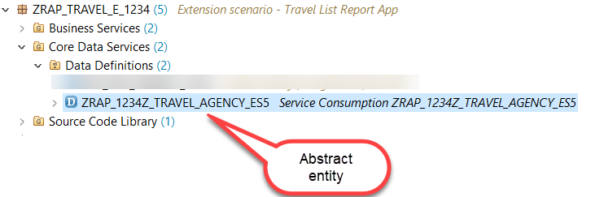

    The  **get_agencies( )** method takes filter conditions in form of SELECT-OPTIONS via the importing parameter **it_filter_cond**. In addition it is possible to provide values for **top** and **skip** to leverage client side paging.  

    Using the parameters **is_data_requested** and **is_count_requested** we tell the OData client proxy whether data shall be requested from the backend or not and we can specify whether in addition to the business data the total number of records of this entity shall be requested as well.  
    
    The public method **get_agencies( )** is used to retrieve the data from the remote OData service. Since it is not possible to leverage the destination service in the trial systems, we will use the method **cl_http_destination_provider=>create_by_url** which allows to create a http destination object based on the target URL. As the target URL we choose the root URL https://sapes5.sapdevcenter.com of the ES5 system since the relative URL that points to the OData service will be added when creating the OData client proxy.  
    
    Within the **get_agencies( )** method we are creating an OData client proxy object `odata_client_proxy` and this object creates an request object `read_list_request` for the read operation. The `read_list_request` object gets all the parameters such as the filter and the information whether business data and whether the total number of entries is requested from the client.
    The `read_list_request`object returns the total number of entries via the variable `count` and the business data via the internal table`business_data`.
    If the call was successful the total number of entries and the business data is written to the console. if an exception was raised the error message is retrieved and written to the console.

> **Please note**  
> In a non-Trial SAP Cloud Platform, ABAP Environment system one would leverage the destination service of the underlying Cloud Foundry Environment and one would use the statement **cl_http_destination_provider=>create_by_cloud_destination** to generate a http destination in the ABAP Environment system based on these settings.  
> Since it is not possible to leverage the destination service in the trial systems, we will use the method **create_by_http_destination** which allows to create a http client object based on the target URL.    
> Here we take the root URL https://sapes5.sapdevcenter.com of the ES5 system since the relative URL will be added when creating the OData client proxy. 

7. You can now run the console application by pressing **F9**.  

    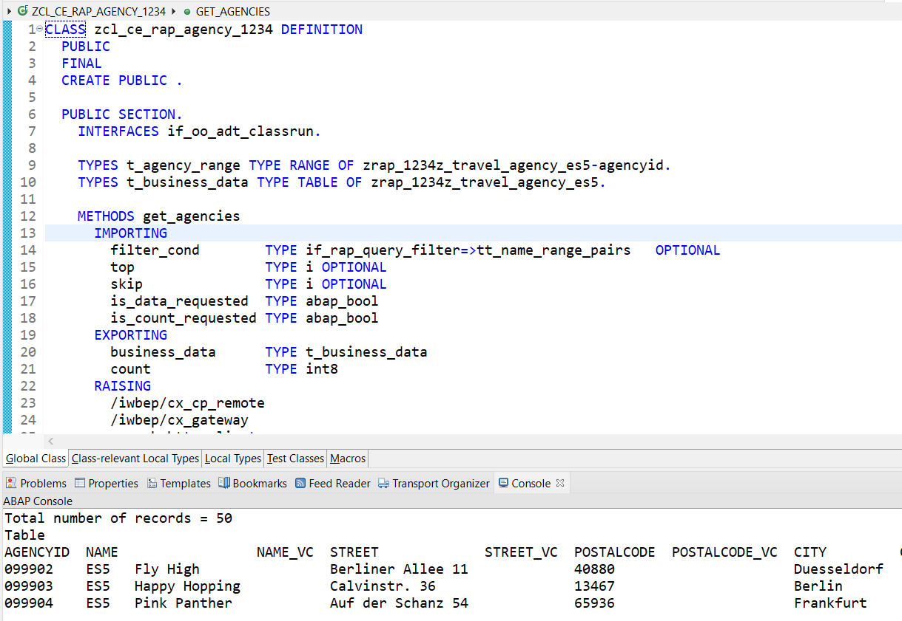

## Summary
You have completed the exercise!

In this unit, you have learned how to create the service consumption model to access data  from an extenal system via OData.

## Solution
Find the source code for the class that we have created in the week5/sources folder:
[Sources](sources) or use the link below.

- [W5U2_CLAS_zcl_ce_rap_agency_####.txt](/week5/sources/W5U2_CLAS_zcl_ce_rap_agency_%23%23%23%23.txt)

Do not forget to replace all the occurrences of #### with your chosen suffix in the copied source code.

## Next exercise
[Week 5 Unit 3: Defining the Custom CDS Entity](unit3.md)

