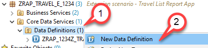
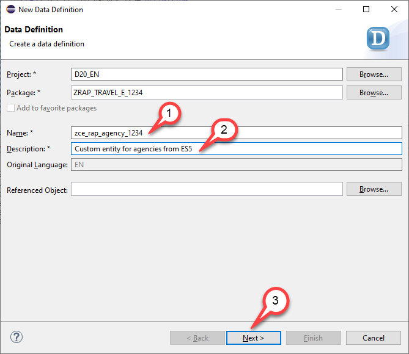
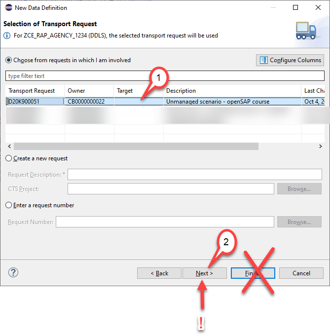
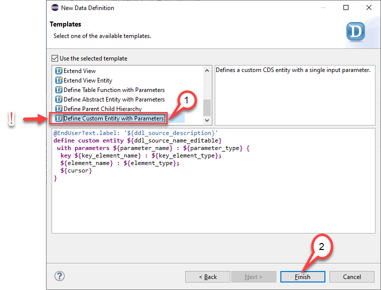
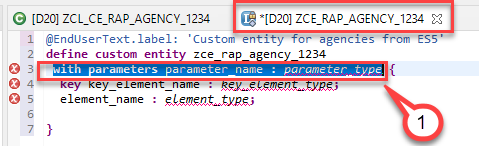
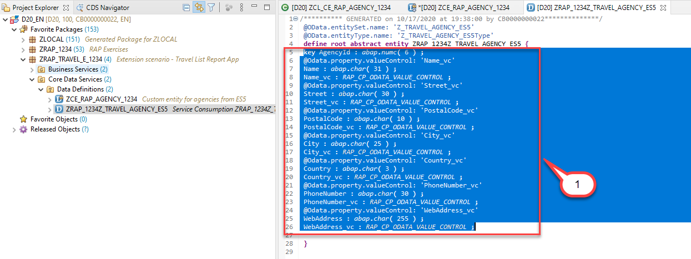
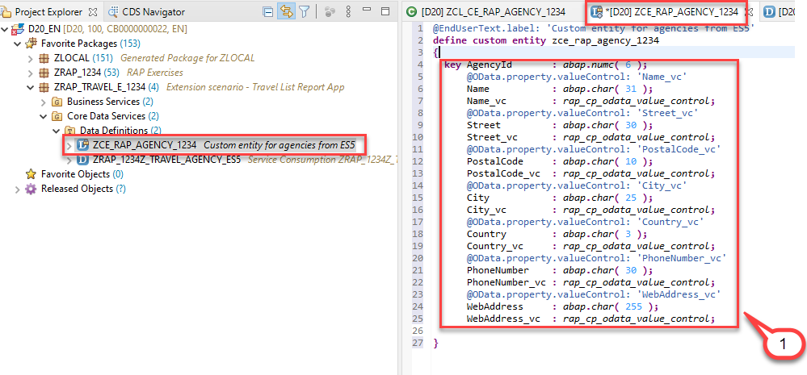
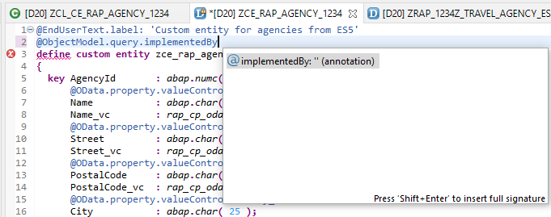
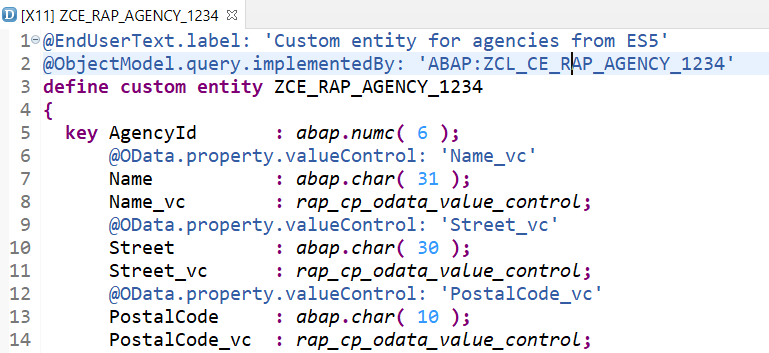

# Defining the Custom CDS Entity

## Introduction  
Since we want to use the results of the remote OData service that provides a list of travel agencies in our managed travel app that we created in week 2 and 3 we will create a custom entity. 

In constrast to "normal" CDS views that read data from the database from tables or other CDS views the so called custom entities act as a wrapper for a code based implementation that provides the data instead of a database table or a CDS view.   

The custom entity has to be created manually and it uses a similar syntax as the abstract entity that has been created when we have created our service consumption model.  

In order to be able to retrieve the data from the remote OData service we have to built a class that implements the interface **if_rap_query_provider**. We will reuse the class that we have created earlier and add this interface to it. The code based implementation will be the topic of the next unit 4.  

In order to leverage the remote OData service in our application we have thus to perform two steps.  

1.	Unit 3 - We have to create a custom entity. 
2.	Unit 4 - We have to create a class that implements the query for the custom entity. (Here we will reuse the class that we have created earlier and that we have used to test the remote OData service).

You can watch [unit 3 of week 5: Defining the Custom CDS Entity](https://open.sap.com/courses/cp13/items/7kjqDWBR0qGIGfevnF80HX) on the openSAP.com platform.
 
> **Hints and Tips**    
> Speed up the typing by making use of the Code Completion feature (shortcut Ctrl+Space) and the prepared code snippets provided. 
> You can easily open an object with the shortcut *Ctrl+Shift+A*, format your source code using the Pretty Printer feature *Shift+F1* and toggle the fullscreen of the editor using the shortcut *Ctrl+M*.
>
> A great overview on ADT shortcuts can be found here: [Useful ADT Shortcuts](https://blogs.sap.com/2013/11/21/useful-keyboard-shortcuts-for-abap-in-eclipse/)
>
> Please note that the placeholder **`####`** used in object names in the exercise description must be replaced with the suffix of your choice during the exercises. The suffix can contain a maximum of 4 characters (numbers and letters).
> The screenshots in this document have been taken with the suffix `1234` and system `D20`. Your system id will be `TRL`.

> Please note that the ADT dialogs and views may change in the future due to software updates - i.e. new and/or optimized feature

Follow the instructions below.  
    
## Create a custom entity

1. Right-click on the folder **Data Definition** and select **New Data Definition.**

1. Let’s start with creating a new data definition `ZCE_RAP_AGENCY_####` using the template for a **Custom Entity**. 

2. The **New Data Defintion** dialogue opens
   - Name: `ZCE_RAP_AGENCY_####`
   - Description: `Custom entity for agencies from ES5`
   
   Press **Next**
   
   
   
3. Selection of a transport request
   - Select or create a transport request
   - **!!! ONLY!!!** Press *Next*. Do **NOT** press *Finish*.  
       
        
   >**Caution**  
   > If you would press **Finish** instead of **Next** the wizard will use the template that was used the last time when this wizard was used by the developer.  
   > In order to be sure which template will be selected we **MUST** press **Next** and not **Finish** which would skip the step of template selection.  
   
       
   

4. Select Template

   - Use the scroll bar to navigate down the list
   - Select the template `Define Custom Entity with Parameters`
   - Press **Finish**  
       
         
   > **Please note**  
   > There is only a template for a custom entity with parameters. But this doesn’t matter. We use this template and remove the statement *with parameters parameter_name : parameter_type*.  
       
       
   

5. Edit the source code of the **custom entity** `ZCE_RAP_AGENCY_####`  

   - Remove the statement <pre>with parameters parameter_name : parameter_type</pre>

     

6. Now, open the **abstract entity** you created in unit 2 in the source code editor

   - Navigate to the **abstract entity** `ZRAP_####Z_TRAVEL_AGENCY_ES5`  in the *Project Explorer*
   - Double click on it to open the source code editor
   
     

7. Copy field list from abstract entity to custom entity

   - Copy the field list from the abstract entity
  
    
  
   - and paste it between the curly brackets as the new field list of the custom entity, thereby replacing the field list provided by the code template. You can make use of the Source Code Formatter (**SHIFT+F1**) to format the source code.
    
    

8. Add the annotation @ObjectModel.Query.ImplementedBy to the DDL source code

    <pre>@ObjectModel.query.implementedBy: 'ABAP:ZCL_CE_RAP_AGENCY_####'</pre>

    This way we will reuse the class that we have created in unit 2.  
    
        

9. Activate your changes
    
    

## Summary  

In this unit you have created a custom entity based on the abstract entity that has been generated when activating the service consumption model.

## Solution

Find the source code for the custom entity that we have created in the week5/sources folder:
[Sources](sources) or use the following link.

- [W5U3_DDLS_zce_rap_agency_####.txt](/week5/sources/W5U3_DDLS_zce_rap_agency_%23%23%23%23.txt)

Do not forget to replace all the occurrences of #### with your chosen suffix in the copied source code.

## Next exercise
[Week 5 Unit 4: Creating the Implementation Class](unit4.md)
