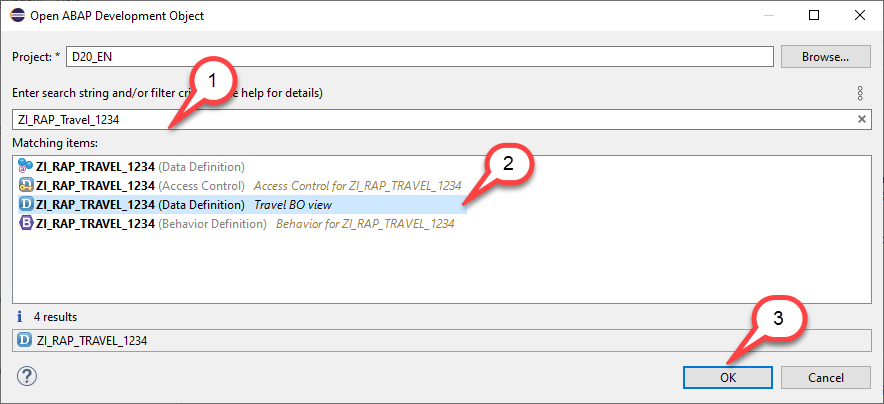
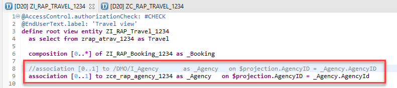
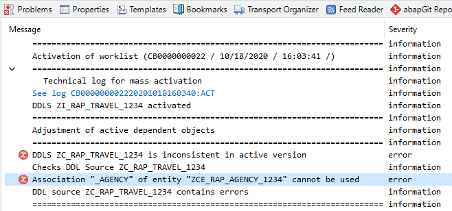
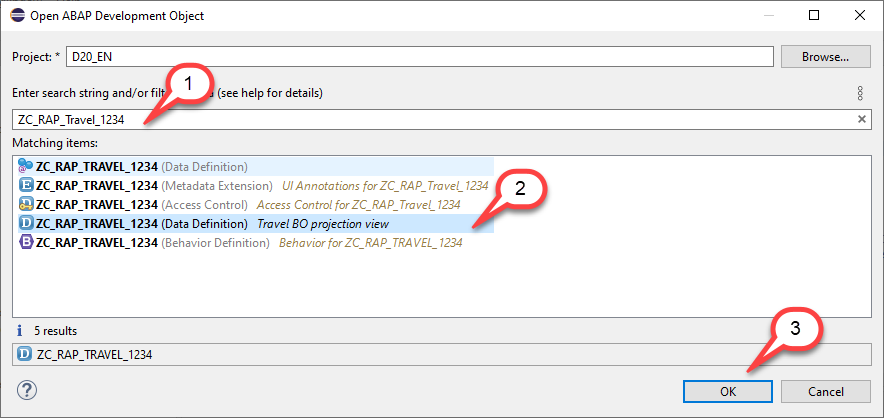
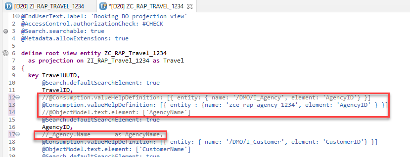
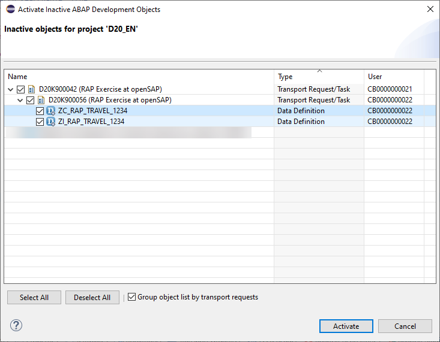
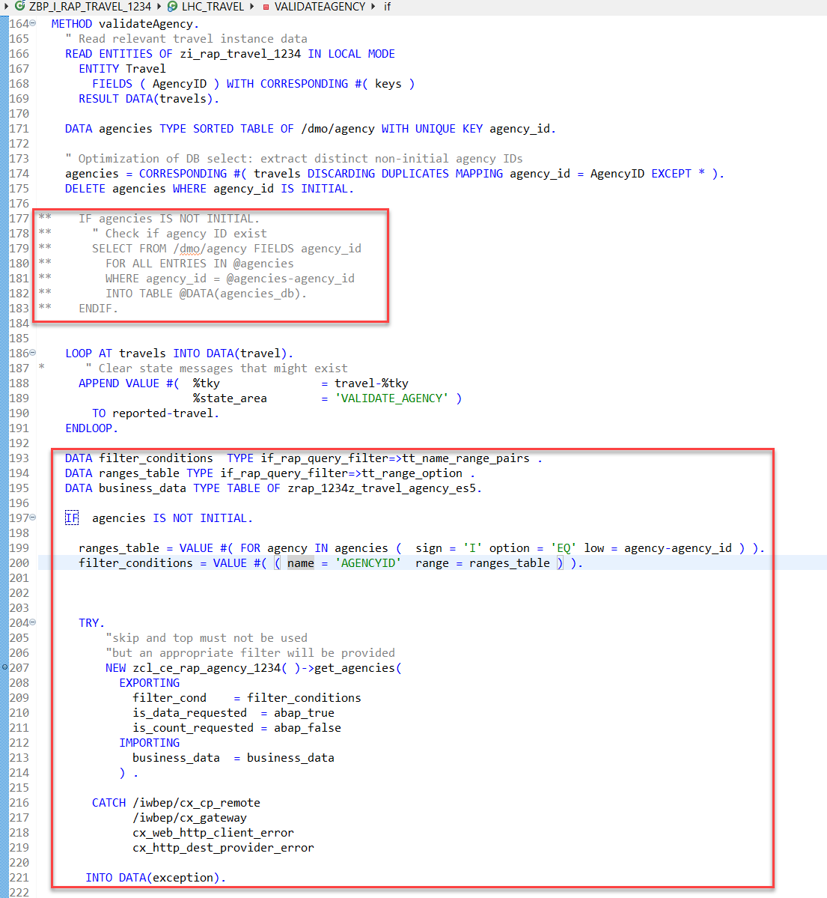
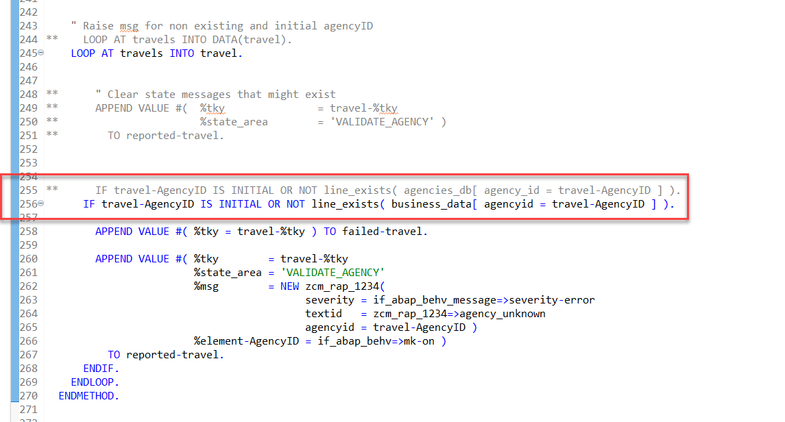

# Enhancing the Flight Model with External Data

## Introduction  

In this unit we will enhance the Flight Model of our Managed Application with External Data that is provided by our custom entity **zce_rap_agency_####** . 
For this we have to perform some changes in the following objects
-	Travel interface view
-	Travel projection view
-	Behavior implementation

You can watch [unit 5 of week 5: Enhancing the Flight Model with External Data](https://open.sap.com/courses/cp13/items/3RQhwrbA8FEbAnrwFKMjMe) on the openSAP.com platform.
 
> **Hints and Tips**    
> Speed up the typing by making use of the Code Completion feature (shortcut Ctrl+Space) and the prepared code snippets provided. 
> You can easily open an object with the shortcut *Ctrl+Shift+A*, format your source code using the Pretty Printer feature *Shift+F1* and toggle the fullscreen of the editor using the shortcut *Ctrl+M*.
>
> A great overview on ADT shortcuts can be found here: [Useful ADT Shortcuts](https://blogs.sap.com/2013/11/21/useful-keyboard-shortcuts-for-abap-in-eclipse/)
>
> Please note that the placeholder **`####`** used in object names in the exercise description must be replaced with the suffix of your choice during the exercises. The suffix can contain a maximum of 4 characters (numbers and letters).
> The screenshots in this document have been taken with the suffix `1234` and system `D20`. Your system id will be `TRL`.

> Please note that the ADT dialogs and views may change in the future due to software updates - i.e. new and/or optimized feature

Follow the instructions below.  
    
## Check custom entity code 

Let’s first have a look at the coding of our custom entity **zce_rap_agency_####** .

Please note that the key field is called **AgencyId** with a small **d**. 
Since we cannot create aliases for the field names we have to adapt the condition in the value help defined in the interface view and also the definition of the value help in the projection view.

<pre>
@EndUserText.label: 'agency data from ES5'
@ObjectModel.query.implementedBy: 'ABAP:ZCL_CE_RAP_AGENCY_####'
define custom entity zce_rap_agency_#### 
 {
 key <b>AgencyId</b> : abap.numc( 6 ) ; 
</pre>

## Change the coding of the interface view

1. Open the CDS interface view **`ZI_RAP_Travel_####`** of your managed RAP business objects 
    - Choose Ctrl+Shift+A
    - Enter the name of the CDS interface view **`ZI_RAP_Travel_####`**
    - Press **OK**
     
    
   
2. Change the coding of the assocation **`_Agency`**. 

   In this step we change the coding for the association **`_Agency`** so that it does not use anymore the CDS view **`/DMO/I_Agency`** but instead our newly created custom entity **`zrap_ce_agency_####`**.

<pre>
  //association [0..1] to /DMO/I_Agency       as _Agency   on $projection.AgencyID = _Agency.AgencyID
  association [0..1] to zce_rap_agency_#### as _Agency   on $projection.AgencyID = _Agency.AgencyId  
</pre>

   

   > **Do NOT** activate your coding yet.  
   > If you try to do so you will get an error message **Association "_AGENCY" of entity "ZCE_RAP_AGENCY_####" cannot be used**. 
   > This is because the association is still used in the projection view for the field **AgencyName** which is read via the association `_Agency.Name       as AgencyName`.   
   > Since custom entities must not be part of a projection we have to remove this field from the projection view which we will do in the following step.  
   >     
   > 

## Change the coding of the projection view

1.  Open the CDS interface view **`ZC_RAP_Travel_####`** of your managed RAP business objects 
    - Choose **Ctrl+Shift+A**
    - Enter the name of the CDS interface view **`ZC_RAP_Travel_####`**
    - Press **OK**
     
     

2. Change the coding 
   
   - Comment out the field **`AgencyName`** since it uses the association **`_Agency`** which is not allowed since custom entities must not be used in projection views
   - Comment out the annotation **`@ObjectModel.text.element: ['AgencyName']`** which uses the field **`AgencyName`**
   - Replace the annotation for the value help **`AgencyID`** so that the value help uses the newly created custom entity instead of the CDS view **`/DMO/I_Agency`**

    

<Pre>
define root view entity ZC_RAP_Travel_1234
  as projection on ZI_RAP_Travel_1234 as Travel
{
  key TravelUUID,
      @Search.defaultSearchElement: true
      TravelID,
      <b>//@Consumption.valueHelpDefinition: [{ entity: { name: '/DMO/I_Agency', element: 'AgencyID'} }]
      @Consumption.valueHelpDefinition: [{ entity : {name: 'zrap_ce_agency_####', element: 'AgencyId' } }]</b>
      <b>//@ObjectModel.text.element: ['AgencyName']</b>
      @Search.defaultSearchElement: true
      AgencyID,
      <b>//_Agency.Name       as AgencyName,</b>
</pre>

3. Use mass activation to activate your changes in both CDS views.
   
   - Press **Ctrl+Shift+F3** 
   - Select both CDS views
   
   

## Change the behavior implementation class

Open you implementation class **`ZBP_I_RAP_TRAVEL_####`** you created in week 3.

Instead of reading from the local table **`/dmo/agency`** we are using a remote call to the OData service in ES5 using the public method **`zcl_ce_rap_agency_####( )->get_agencies()`** in our custom query.

 

Also later in the implementation we replace the check for entries in table **`agency_db`** through a check for entries in the internal table **`business_data`** that is returned by calling the method **`zcl_ce_rap_agency_####( )->get_agencies( )`**.

 

So your code should look like follows

<pre>

  METHOD validateAgency.
    " Read relevant travel instance data
    READ ENTITIES OF zi_rap_travel_#### IN LOCAL MODE
      ENTITY Travel
        FIELDS ( AgencyID ) WITH CORRESPONDING #( keys )
      RESULT DATA(travels).

    DATA agencies TYPE SORTED TABLE OF /dmo/agency WITH UNIQUE KEY agency_id.

    " Optimization of DB select: extract distinct non-initial agency IDs
    agencies = CORRESPONDING #( travels DISCARDING DUPLICATES MAPPING agency_id = AgencyID EXCEPT * ).
    DELETE agencies WHERE agency_id IS INITIAL.

**    IF agencies IS NOT INITIAL.
**      " Check if agency ID exist
**      SELECT FROM /dmo/agency FIELDS agency_id
**        FOR ALL ENTRIES IN @agencies
**        WHERE agency_id = @agencies-agency_id
**        INTO TABLE @DATA(agencies_db).
**    ENDIF.

    LOOP AT travels INTO DATA(travel).
*      " Clear state messages that might exist
      APPEND VALUE #(  %tky               = travel-%tky
                       %state_area        = 'VALIDATE_AGENCY' )
        TO reported-travel.
    ENDLOOP.
    
    DATA filter_conditions  TYPE if_rap_query_filter=>tt_name_range_pairs .
    DATA ranges_table TYPE if_rap_query_filter=>tt_range_option .
    DATA business_data TYPE TABLE OF zrap_####z_travel_agency_es5.

    IF  agencies IS NOT INITIAL.

      ranges_table = VALUE #( FOR agency IN agencies (  sign = 'I' option = 'EQ' low = agency-agency_id ) ).
      filter_conditions = VALUE #( ( name = 'AGENCYID'  range = ranges_table ) ).

      TRY.
          "skip and top must not be used
          "but an appropriate filter will be provided
          NEW zcl_ce_rap_agency_1234( )->get_agencies(
            EXPORTING
              filter_cond    = filter_conditions
              is_data_requested  = abap_true
              is_count_requested = abap_false
            IMPORTING
              business_data  = business_data
            ) .

        CATCH /iwbep/cx_cp_remote
              /iwbep/cx_gateway
              cx_web_http_client_error
              cx_http_dest_provider_error

       INTO DATA(exception).

          DATA(exception_message) = cl_message_helper=>get_latest_t100_exception( exception )->if_message~get_text( ) .

          LOOP AT travels INTO travel.
            APPEND VALUE #( %tky = travel-%tky ) TO failed-travel.

            APPEND VALUE #( %tky        = travel-%tky
                            %state_area = 'VALIDATE_AGENCY'
                            %msg        =  new_message_with_text( severity = if_abap_behv_message=>severity-error text = exception_message )
                            %element-AgencyID = if_abap_behv=>mk-on )
              TO reported-travel.
          ENDLOOP.

          RETURN.

      ENDTRY.

    ENDIF.

    " Raise msg for non existing and initial agencyID
**    LOOP AT travels INTO DATA(travel).
    LOOP AT travels INTO travel.

**      " Clear state messages that might exist
**      APPEND VALUE #(  %tky               = travel-%tky
**                       %state_area        = 'VALIDATE_AGENCY' )
**        TO reported-travel.

**      IF travel-AgencyID IS INITIAL OR NOT line_exists( agencies_db[ agency_id = travel-AgencyID ] ).
      IF travel-AgencyID IS INITIAL OR NOT line_exists( business_data[ agencyid = travel-AgencyID ] ).

        APPEND VALUE #( %tky = travel-%tky ) TO failed-travel.

        APPEND VALUE #( %tky        = travel-%tky
                        %state_area = 'VALIDATE_AGENCY'
                        %msg        = NEW zcm_rap_####(
                                          severity = if_abap_behv_message=>severity-error
                                          textid   = zcm_rap_####=>agency_unknown
                                          agencyid = travel-AgencyID )
                        %element-AgencyID = if_abap_behv=>mk-on )
          TO reported-travel.
      ENDIF.
    ENDLOOP.
  ENDMETHOD.
 
</pre>

## Summary

You have enhanced the implementation of our managed business object that we have created in week 2 and 3, such that 

- the custom entity can be used as a value help and 
- the validation for the agencies also makes use of the same implementation as the custom entity to retrieve the travel agencies from the remote system.

As a result you have implemented a side-by-side extension scenario.

## Solution
Find the source code for the updated interface view, projection view and the behavior implementation in the week5/sources folder:
[Sources](sources) or use the following link.

- [W5U5_CLAS_ZBP_I_RAP_TRAVEL_####.txt](/week5/sources/W5U5_CLAS_ZBP_I_RAP_TRAVEL_%23%23%23%23.txt) 
- [W5U5_DDLS_ZC_RAP_Travel_####.txt](/week5/sources/W5U5_DDLS_ZC_RAP_Travel_%23%23%23%23.txt)
- [W5U5_DDLS_ZI_RAP_Travel_####.txt](/week5/sources/W5U5_DDLS_ZI_RAP_Travel_%23%23%23%23.txt)

Do not forget to replace all the occurrences of #### with your chosen suffix in the copied source code.

 
## Next exercise
[Week 5 Unit 6: Creating and Previewing the OData UI Service](unit6.md)
