# Creating and Previewing the OData UI Service

## Introduction  

In the previous unit, we enhanced the flight model with external data. In this unit, we will preview the OData UI service.

In our development flow, the preview of UI service is the last step. 
The value help that is used when creating new travel data will now return agencies that are
retrieved from the remote system `ES5`.

In order to be able to distinguish the data that was read from the local table, the remote OData
service changes the description of the agencies,so `ES5` is added, and the agencies will have different numbers. 

We now have to change the service definition and we will then use the preview to check the changes we have used to extend the app.

You can watch [unit 6 of week 5: Creating and Previewing the OData UI Service](https://open.sap.com/courses/cp13/items/4e9IquaydCRsSXS5idZqug) on the openSAP.com platform.
 
> **Hints and Tips**    
> Speed up the typing by making use of the Code Completion feature (shortcut **Ctrl+Space**) and the prepared code snippets provided. 
> You can easily open an object with the shortcut **Ctrl+Shift+A**, format your source code using the Pretty Printer feature Ctrl+1 and toggle the fullscreen of the editor using the shortcut **Ctrl+M**.   
>
> Please note that the placeholder **`####`** used in object names in the exercise description must be replaced with the suffix of your choice during the exercises. The suffix can contain a maximum of 4 characters (numbers and letters). Numbers and letters are allowed.  
> The screenshots in this document have been taken with the suffix 1234.
> Please note that the ADT dialogs and views may change in the future due to software updates - i.e. new and/or optimized features.

Follow the instructions below.  
    
## Check the service binding

1. Expand your package **ZRAP_TRAVEL_#### > Business Services > Service Bindings**
    - Open the service binding `ZUI_RAP_TRAVEL_O2_####`

   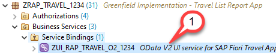

2. Search the custom entity **zce_rap_agency_####** in the list of entity sets and associations.

   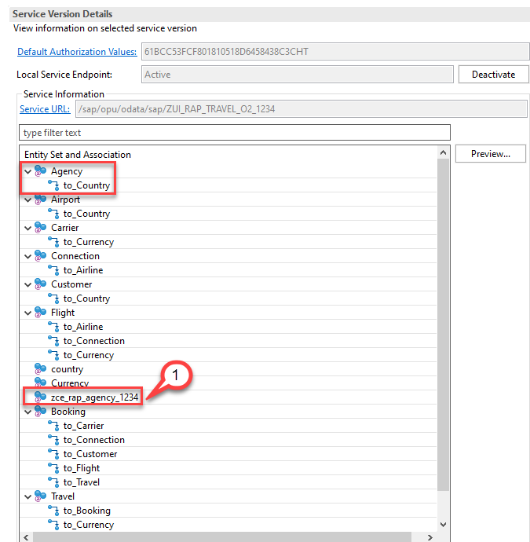

> When we take a closer look at the service binding, we see that the custom entity is listed in the
list of entity sets and associations. The custom entity has been automatically added to the list of entities since it is used as a value help in the projection view. However, it is listed with its technical name, so we are going to change this now by adding the
custom entity to the service definition.

## Change service definition

1. Open the service definition

   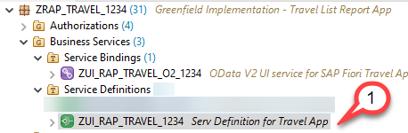

2. Change the expose statement so that no longer the cds view **/DMO/I_Agency** is exposed as Travel but the custom entity **zce_rap_agency_####**.
   - **Replace** the existing expose statement <pre> expose /DMO/I_Agency as Agency; </pre> with the following expose statement <pre>expose zce_rap_agency_#### as Agency;</pre>

   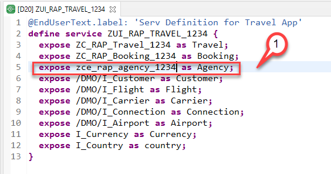

   > Please note that it is not possible to add comments to the source code of your service definition. It is hence not possible to comment out the existing statement <pre>expose /DMO/I_Agency as Agency</pre>. 
   > It has to be deleted instead and must then be replaced with the code snippet metioned above.  

3. Activate your changes

## Test access to entity Agency 

1. Navigate back to the service binding `ZUI_RAP_TRAVEL_O2_####`

   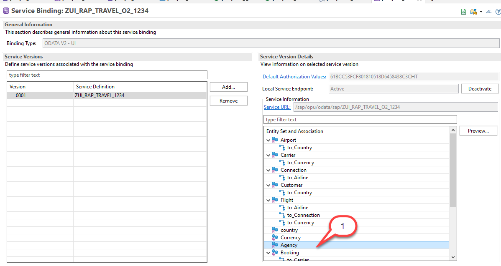

2. Use **Refresh** from the context menu to update the list of entity sets

3. Double-click on the entity `Agency`

   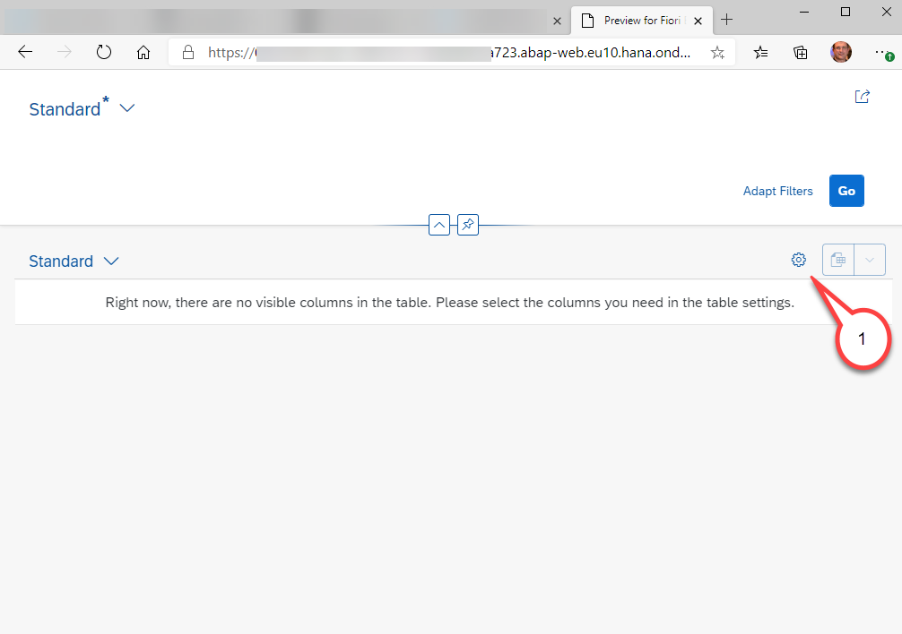

4. You will notice that no colums are shown because no UI annotations have been added to the custom entity. Use the *gear icon* to select all columns.

   - Click on the **gear icon**
   - Click on the check box **Select All**
   - Press **OK**
   
   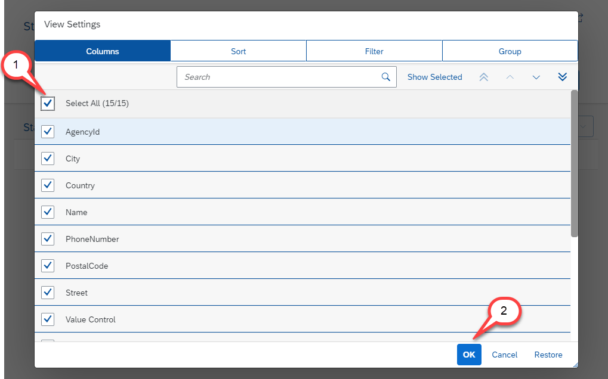
   
4. Press **Go**

   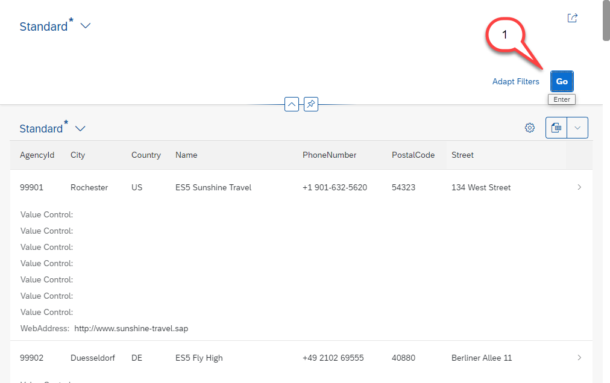
   
> This will retrieve a list of agencies from the remote system indicated by the different agency numbers and by having "ES5" added to their name   

### Test entity set Travel

1. Create a break-point in the method `validateAgency` in the class 

   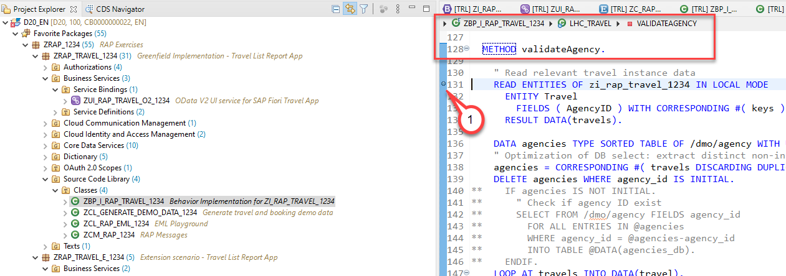

2. Navigate back to the service binding and double-click on the entity set **Travel** to start the Fiori Elements preview

   

3. Create a new travel entity

   - When you use the value help you will see that the agency data is retrieved via the custom entity
   
    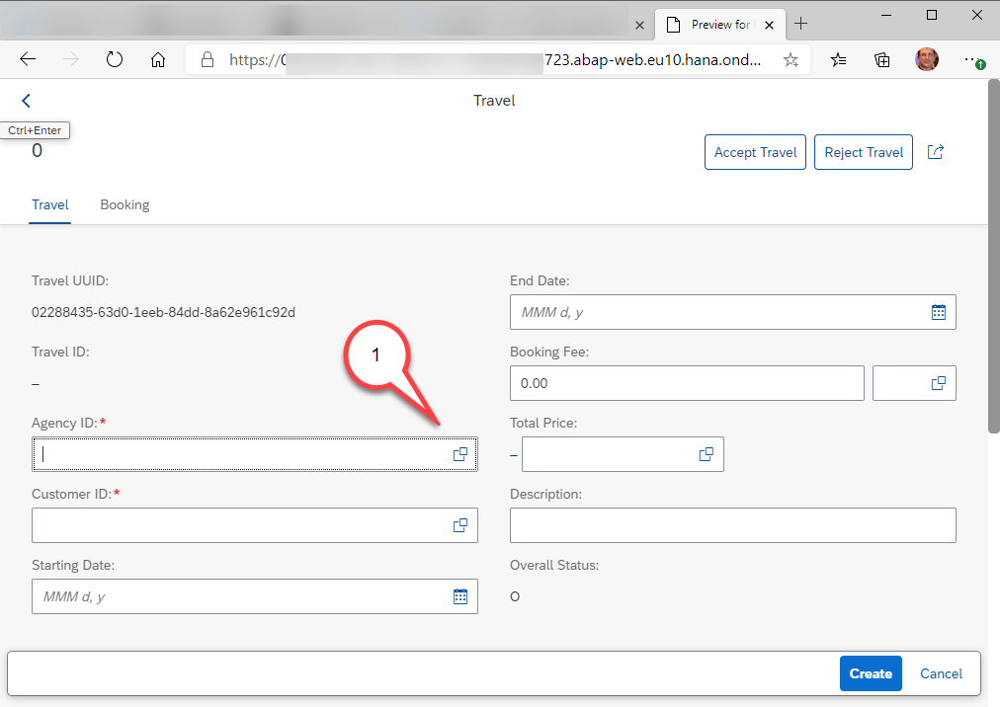   
   
    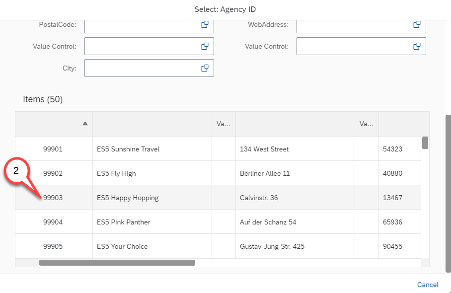 
   
   - When you add a break-point in the validation you will notice that the validation is called three times if draft is used and two times without draft.
   
   

## Summary

In this unit you have learned how to adapt the service definition and that these changes are becoming active immediately in the published service binding.

## Solution
Find the source code for the updated service definition in the week5/sources folder:
[Sources](sources) or use the following link.

- [W5U6_SRVD_ZUI_RAP_TRAVEL_####.txt](/week5/sources/W5U6_SRVD_ZUI_RAP_TRAVEL_%23%23%23%23.txt)

Do not forget to replace all the occurrences of #### with your chosen suffix in the copied source code.

 
## Next exercise
[Week 5 Unit 7: Creating and Previewing the OData Web API](unit7.md)

 
