# Creating and Previewing the OData Web API

This hands on script only shows the first part of the viedo for unit 7 since the second part that shows the creation of a 

## Introduction  

In this we will show you in a demo how to create a Web API with the ABAP RESTful Application Programming Model.
We will test the external access to this WebAPI using a RESTclient.

You can watch [unit 7 of week 5: Creating and Previewing the OData Web API](https://open.sap.com/courses/cp13/items/4BZVcodS1ChsBJFZCM427x) on the openSAP.com platform.
 
> **Hints and Tips**    
> Speed up the typing by making use of the Code Completion feature (shortcut **Ctrl+Space**) and the prepared code snippets provided. 
> You can easily open an object with the shortcut **Ctrl+Shift+A**, format your source code using the Pretty Printer feature Ctrl+1 and toggle the fullscreen of the editor using the shortcut **Ctrl+M**.   
>
> Please note that the placeholder **`####`** used in object names in the exercise description must be replaced with the suffix of your choice during the exercises. The suffix can contain a maximum of 4 characters (numbers and letters). Numbers and letters are allowed.  
> The screenshots in this document have been taken with the suffix 1234.
> Please note that the ADT dialogs and views may change in the future due to software updates - i.e. new and/or optimized features.

Follow the instructions below.  

## Create a new package

1. We go to the Project explorer, right-click on our package **`ZRAP_####`** (where `####` is your chosen suffix) you created in week 1 unit 6 and choose the context menu entry **_New > ABAP Package_**.  
   
    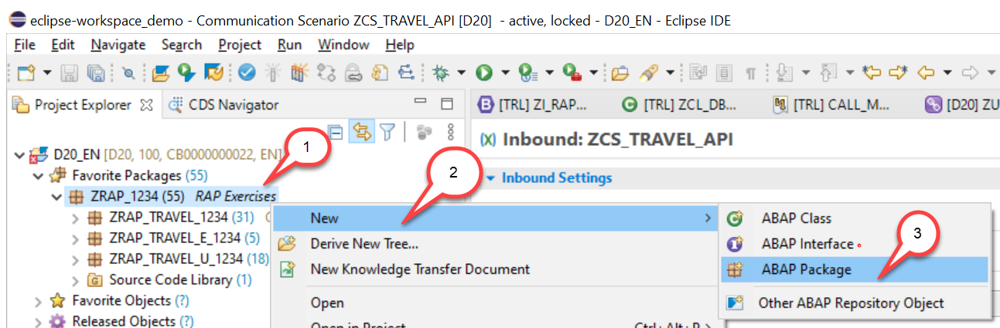
  
2. Maintain **`ZRAP_TRAVEL_API_####`** as name (where `####` is your chosen suffix and where `_API` indicates that this is a Web API scenario) and a meaningful description (e.g. **Travel API scenario**) and choose **Next** to continue.  
The Project and the Superpackage fields are automatically assigned.
   

    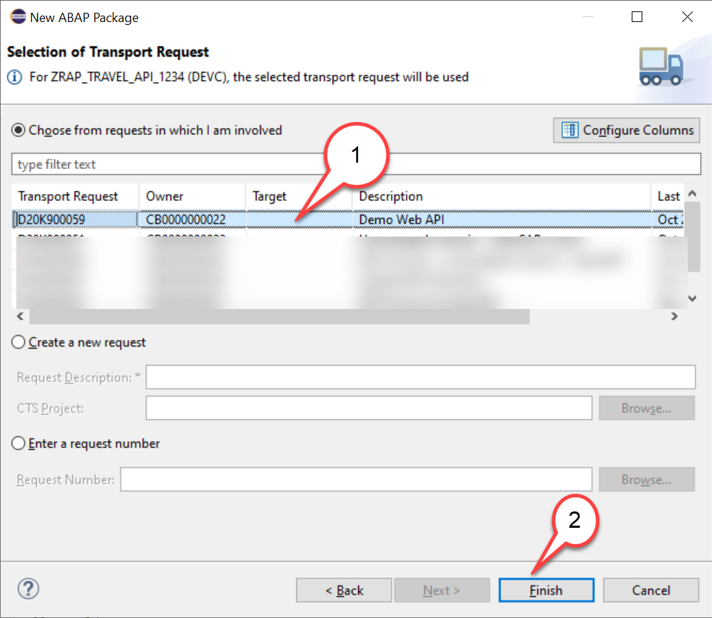
    
  
4. Select an existing transport request or create a new one and then choose **Finish** to create the new package.  
  
5. Right-click on the new created package and choose  **Add to Favorites Packages** to add it to your favorites.  
   

    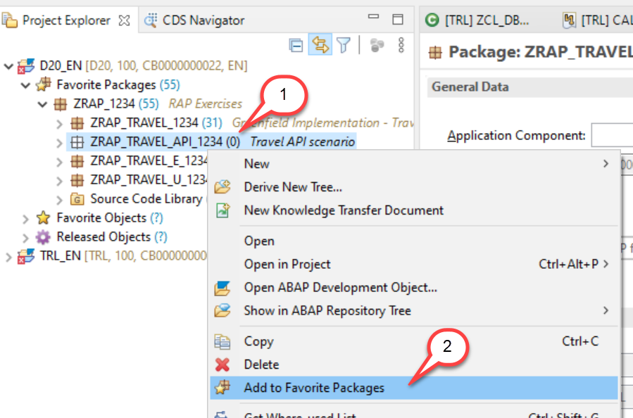

    

## Create service definition 

We start by creating a new service definition since the service for our Web API does not need to publish all entities of our OData service.
Depending on the requirements you might also create a separate projection layer for a Web API since it there where you would be able to specify more specifically which types of operations should be supported by your service.
To minimize the efforts for our scenario in this OpenSAP course we will only create a new service definition and a new service binding.
Let’s get started.

1. Right click on the package  and select **New > Other ABAP Repository Object**

   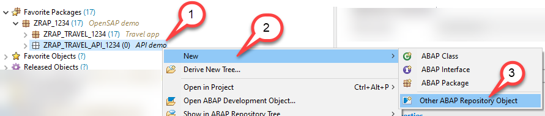

2. In the **New ABAP Repository Object** dialogue 
   - Start to type `Service`in the text box
   - Select `Service Defintion`from the list of found objects
   
   Press **Next**

   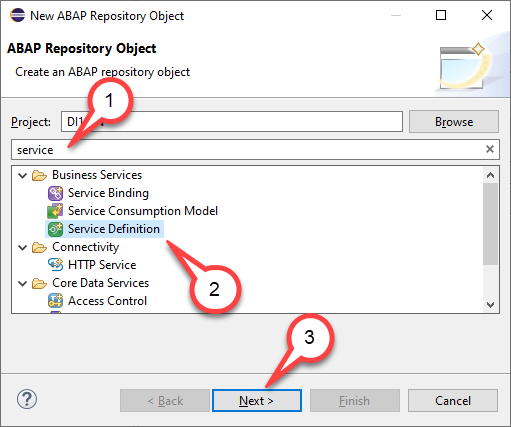

2. Enter the following values
   
   - Name: `ZAPI_RAP_Travel_####`
   - Description : `Travel API`
   
   Press **Next**
    
   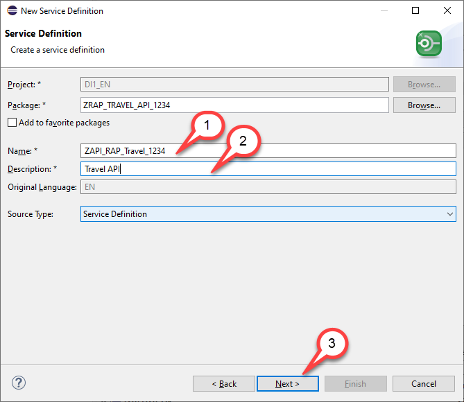
 
3. Selection of a transport request

   - Select a transport request
   - Press **Next**
   
   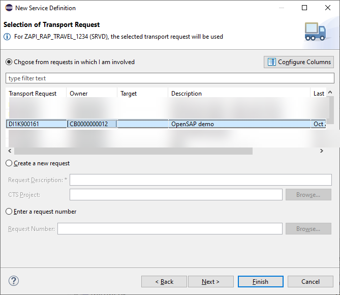

3. In the **New Service Definition** dialog just press **Finish**
   
   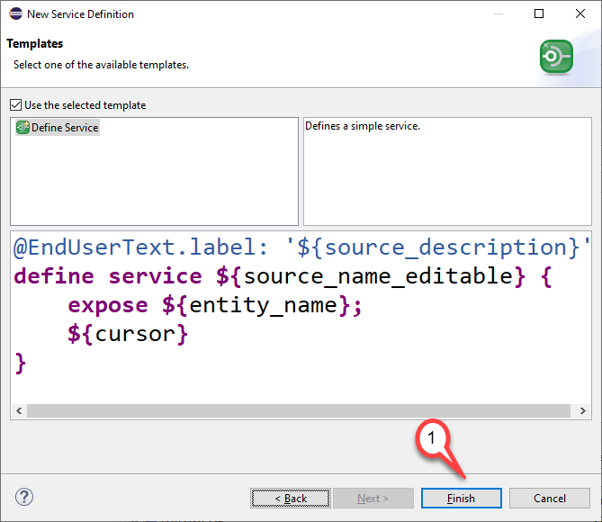

4. In the service definition editor we will not add any additional entities since for our demo it will be sufficient to only publish the entity that contains the travel data.

   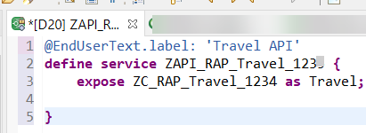

<pre>
@EndUserText.label: 'API scenario'
define service ZAPI_RAP_Travel_#### {
    expose ZC_RAP_Travel_####; 
    
}
</pre>

5. Activate your changes

## Create service binding

We will now create a service binding for our Web API which will be named ZAPI_RAP_TRAVEL_####.
Be sure to have “ODATA V2 – Web API” selected for the Binding Type.
The service definition that is used here is
ZAPI_RAP_TRAVEL_U_####

Please note that when we use the consumption view also the value helps are published.
What will not be published though is the additional metadata for value helps that you would need in case you want to consume the service using Fiori Elements.

If you want to suppress that value helps are published, you would have to specify this behavior in the projection layer by creating projection views that do not contain the annotation 
@Consumption.valueHelpDefinition

> The automatic publication of value helps in Web API's will be removed since it is a bug that was present at the time of writing of this tutorial

1. Right click on the package  and select **New > Other ABAP Repository Object**

   

2. In the **New ABAP Repository Object** dialogue 
   - Start to type `Service` in the text box
   - Select `Service Binding` from the list of found objects
   
   Press **Next**

   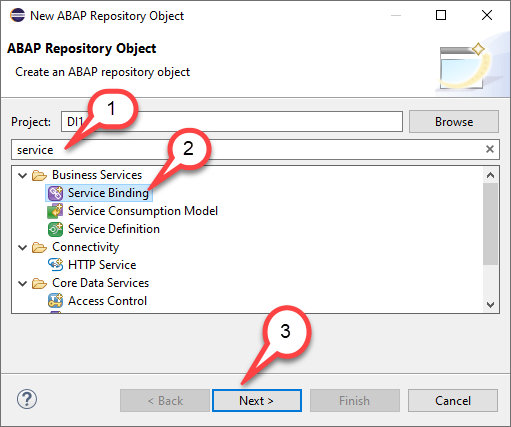

2. Enter the Following values
   - Name `ZAPI_RAP_TRAVEL_####`
   - Description: `API scenario`
   - Binding Type: `OData V2 - Web API`
   - Service Defintion: `ZAPI_RAP_TRAVEL_####`
   
   and press **Finish**    
   
   
    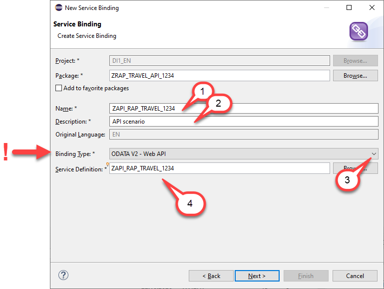

 3. Activate your changes  
 
 3. Select a transport request
 
    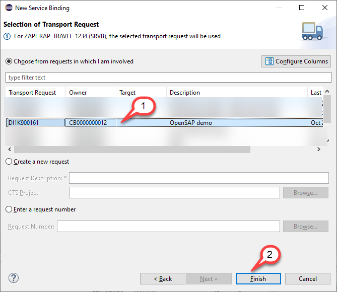

 
 4. Publish (Activate) the service binding
 
    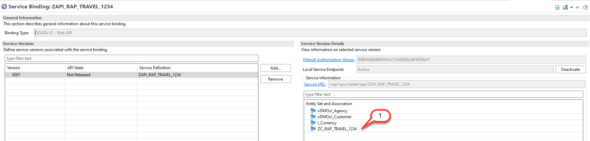

    Please note that at the time of writing of this tutorial also for Web API's search helps were published automatiscallly as well.

## Summary

In the first part of this unit you have learned what needs to be done to publish a service bindig for a Web API.

Since the second part of the demo, the creation of a communication arrangement cannot be performed on a trial system we have not provided these steps as a how to guide script.

You can watch the second part in the video [unit 7 of week 5: Creating and Previewing the OData Web API](https://open.sap.com/courses/cp13/items/4BZVcodS1ChsBJFZCM427x) on the openSAP.com platform.

